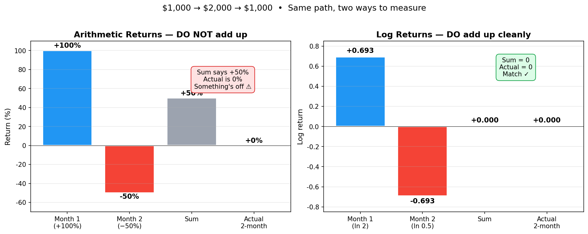
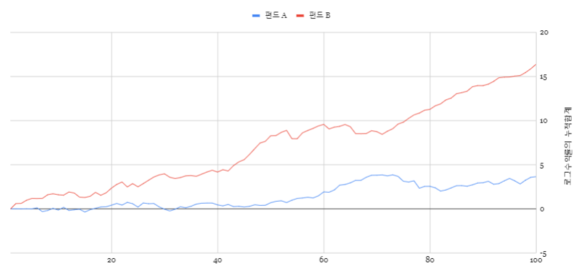
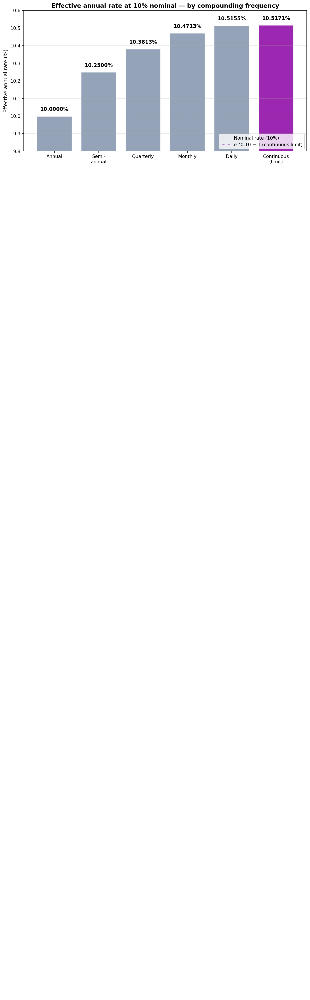
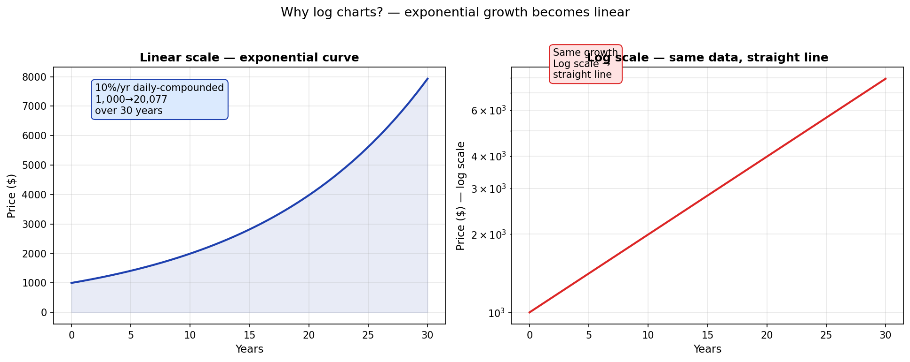

# 수익률, 복리, 그리고 로그차트

> "내 펀드 수익률이 +10%, 그다음에 −10%니까 결국 0%지?" — 아닙니다. **−1%가 됩니다.**
>
> 주식시장은 복리로 돌아갑니다. 우리가 평소에 쓰는 수익률은 *그냥 더해지지 않습니다*. 이 한 가지가 산술수익률·로그수익률·로그차트라는 세 단어의 정체입니다. 이 글은 셋이 왜 한 묶음인지 그림으로 풀어 봅니다.

---

## 30초 요약 — 왜 수익률은 그냥 더하면 안 되는가

$1,000을 투자해서 한 달 만에 $2,000이 됐다가, 다음 달에 다시 $1,000으로 돌아왔다고 합시다.

```
$1,000  →  $2,000  →  $1,000
         +100%        −50%
```

직관적으로는 `+100% + (−50%) = +50%` 같지만, 실제로는 **0%** 입니다. 산술수익률은 더하기로 합쳐지지 않아요.



왼쪽: **산술수익률**의 합 = +50%, 그런데 실제는 0%. 어긋납니다.
오른쪽: **로그수익률**의 합 = 0, 실제도 0. 정확히 맞습니다.

이게 이 글의 핵심입니다. **로그수익률은 곱하기로 일어나는 일들을 더하기로 바꿔주는 도구**고, **로그차트는 그 사실을 그림으로 보여주는 도구**입니다.

---

## 1. 두 종류의 수익률

### 산술수익률 (우리가 평소 쓰는 수익률)

```
산술수익률 = 현재가격 / 이전가격 − 1
```

직관적입니다. $1,000이 $2,000이 되면 +100%, $2,000이 $1,000이 되면 −50%.

### 로그수익률 (퀀트들이 쓰는 수익률)

```
로그수익률 = ln (현재가격 / 이전가격)
```

`ln`은 자연로그 — 구글시트나 엑셀에서 `=LN()`. 직관적이진 않지만, 다음 한 줄을 외우면 다 풀립니다:

> **로그수익률 = ln(1 + 산술수익률)**

산술수익률이 0에 가까울 때(짧은 기간, 작은 변동)는 두 값이 거의 같습니다.

### 둘은 언제 다른가

산술수익률이 0에서 멀어질수록 격차가 벌어집니다:

| 산술수익률 | 로그수익률 |
|----------:|----------:|
| +5% | +4.88% |
| +10% | +9.53% |
| +50% | +40.55% |
| +100% | +69.31% |
| −50% | −69.31% |
| −90% | −230.26% |

같은 +100%와 −50%인데 로그수익률은 서로 정확히 +0.693, −0.693 — **부호만 다른 같은 값**입니다. 이게 핵심입니다.

---

## 2. 그래서 로그수익률을 도대체 왜 쓰는가

같은 데이터, 같은 100년 — A 펀드와 B 펀드가 있다고 합시다. 어느 쪽에 돈을 넣을까요?


A 펀드는 수익률이 가운데에 몰려 있어 *안정적*으로 보이고, B 펀드는 수익률이 넓게 퍼져 변동성이 *심해* 보입니다. 직감적으로 A를 고르고 싶습니다.

각 연도 수익률을 로그로 변환해서 합산해 보면:

| | 100년 누적 로그수익률 | 100년 누적 산술수익률 |
|:--|:-------------------:|:-------------------:|
| A 펀드 | 3.77 | 4,271% (= 약 43배) |
| B 펀드 | (계산해 보면) 훨씬 큼 | 압도적 우위 |



**B 펀드가 압도적으로 높습니다.** 변동성이 크다고 해서 수익률이 낮은 게 아닙니다. 시각적 인상에 속을 수 있어요.

만약 산술수익률만 가지고 이 계산을 하려면 100개 숫자를 곱해야 합니다(`(1+r₁)·(1+r₂)·…·(1+r₁₀₀) − 1`). 로그수익률은 그냥 *더하기*로 끝납니다(`r₁+r₂+…+r₁₀₀`). **계산이 압도적으로 쉽고, 직관도 더 잘 통합니다.**

<details><summary>📐 두 수익률의 관계식 (수학)</summary>

중2 수학으로 충분히 풀립니다.

```
ln(a/b) = ln(a) − ln(b)        ← 로그의 성질
ln(1 + 산술수익률) = ln(현재가/이전가)
                  = 로그수익률
```

따라서:

> **로그수익률 = ln(1 + 산술수익률)**
> **산술수익률 = exp(로그수익률) − 1**

작은 수익률 근사 (테일러 1차):

> **ln(1 + x) ≈ x** (x가 0에 가까울 때)

그래서 단기 수익률에서는 두 값이 거의 같은 것입니다.

</details>

---

## 3. 복리(Compounding) — 왜 매일 매일이 중요한가

### 단리 vs 복리 — 30년 차이

같은 10% 금리로 30년 굴리면:


- **단리** (매년 원금에만 10%): $4,000
- **복리** (실질 연 10.5155%, 일복리): **$20,076** — 약 5배

**시간이 길어질수록 차이는 더 벌어집니다.** 이게 워런 버핏이 말하는 "시간의 마법"입니다.

### 복리는 단위기간이 짧을수록 더 강해진다 (단, 상한이 있음)

명목금리 10%일 때, 얼마나 자주 복리를 적용하느냐에 따라 실질금리가 달라집니다:



| 적용 | 실질 연금리 |
|:----|:----------:|
| 연복리 | 10.0000% |
| 반기 | 10.2500% |
| 분기 | 10.3813% |
| 월 | 10.4713% |
| 일 | 10.5155% |
| **연속** (단위기간 → 0) | **10.5171%** = e^0.10 − 1 |

상한이 `e^금리 − 1`로 정해진 게 신기합니다. **복리와 지수함수(`e`)는 한 식구**예요. 이 사실이 다음에 나오는 로그차트의 정체입니다.

### 주식시장은 일복리

주식시장은 매일 변하는 일별 수익률을 일복리로 적용합니다 — 매일의 수익률만큼 *곱해지는* 구조. 따라서 산술수익률을 *그대로 더할 수 없는* 이유입니다.

---

## 4. 로그차트(Log Chart) — 같은 그림, 다른 진실

대부분 차트 도구에 "로그 스케일" 옵션이 있습니다. 켜면 그래프 모양이 휙 바뀝니다. 왜?



같은 30년 복리 성장 곡선입니다.

- **선형 차트**: 폭발적으로 휘어 올라갑니다 → "어머! 후반에 엄청 올랐네"
- **로그 차트**: 깨끗한 직선 → "꾸준한 비율로 매년 같은 속도로 올랐구나"

**같은 사실의 두 가지 표현 방식**입니다.

### 로그차트가 알려주는 것

직선의 **기울기 = 복리 성장률**입니다. 직선이 가파르면 빠르게 성장, 평평하면 느리게 성장. 곡선이 직선에서 *벗어나면* 성장 속도가 변한 것 — 이게 추세 변곡점입니다.

장기 차트(10년+)를 볼 때는 **로그 스케일이 거의 항상 더 정확한 인상**을 줍니다. 선형 차트로 보면 후반부에 모든 게 폭발하는 것처럼 보이지만, 로그로 보면 매년 같은 비율로 꾸준히 올라온 것이 보입니다.

<details><summary>📐 로그차트가 직선이 되는 이유 (수학)</summary>

가격이 매기간 일정 비율 `r`로 늘어난다고 하면:

```
가격(t) = 시작가 × (1 + r)^t
```

양변에 로그를 씌우면:

```
ln(가격(t)) = ln(시작가) + t · ln(1 + r)
```

`ln(시작가)` 와 `ln(1+r)` 는 상수입니다. 따라서:

```
ln(가격(t)) = (상수1) + (상수2) · t   ← 직선!
```

Y축에 ln(가격), X축에 시간을 그리면 직선이 됩니다. 이게 로그차트의 정체입니다.

</details>

---

## 5. 정리

| 개념 | 핵심 |
|:----|:-----|
| **산술수익률** | 직관적이지만 더하기로 합쳐지지 않음 |
| **로그수익률** | 직관성↓ but 더하기로 자연스럽게 합쳐짐 — 복리 시장의 자연어 |
| **변환식** | 로그수익률 = ln(1 + 산술수익률) |
| **복리** | 주식시장은 일복리 — 시간이 길수록 단리와 격차 폭증 |
| **로그차트** | 복리 성장이 *직선*으로 펴짐 — 기울기 = 성장률 |

**왜 알아야 하는가**: 다음 글에서 다룰 [내 포트폴리오의 수익률](portfolio-return.md) — TWR(시간가중수익률), MWR(금액가중수익률), DCF — 모두 이 변환 위에 서 있습니다. 증권사 앱마다 수익률이 다르게 나오는 이유도 여기서 풀립니다.

또한 이 개념은 [상트페테르부르크의 역설과 기하 평균 (S1 시리즈)](../series/s1-shannons-demon.md)의 핵심이기도 합니다 — 산술 평균과 기하 평균의 차이, 그리고 변동성 손실(vol drag)의 수학적 정체입니다.

---

*다음 글: [내 포트폴리오의 수익률은? — TWR vs MWR](portfolio-return.md)*

*관련: [섀넌의 도깨비와 산술/기하 평균 (S1 시리즈)](../series/s1-shannons-demon.md) | [변동성 대시보드](volatility-dashboard.md)*
