# Model Anatomy — Unfolding Three Networks' Blueprints

*Robot vision · Deep dive, Part 2. If [Part 1](inside-the-models.md) was about "why they were designed that way," this piece is about "what's inside."*

> **How to read this**
>
> This goes a step deeper than Part 1. It stops right before you'd open the papers. Don't let that scare you off, though. Every equation and tensor notation is tucked inside a fold (▶), and the body reads through to the end on pictures and plain words alone.
>
> **A word about the numbers.** Concrete figures like parameter counts and dataset sizes are **approximations** drawn from public sources. The design **structure** is accurate, but if you're going to cite a number, check it against the tables in the original papers. Chapter 6 tells you where to look.

## 1. The skeleton all three models share

Start with one big-picture idea. The three models do completely different jobs, yet **their block layout is almost identical.** Fix that in your head and every one of these papers reads faster.



Stage ④ matters most. All three emit **a result and a confidence together.** In a system like a robot, where a wrong answer means damage, a model that can say "I'm not sure" is essential.

| | FoundationStereo | SAM 2 | FoundationPose |
|---|---|---|---|
| ① Borrowed prior knowledge | Single-image depth model (Depth Anything V2) | Hiera pretrained with MAE | Large-scale synthetic rendering |
| ② Data structure | Cost volume | Cross-attention between tokens | A set of pose hypotheses |
| ③ Iterative block | ConvGRU update | Memory attention (across time) | Re-applying the Refiner |
| ④ Confidence | Disparity uncertainty | IoU (overlap ratio) prediction + occlusion flag | Hypothesis ranking score |

## 2. FoundationStereo, dissected

### The path a tensor travels

From the moment a left and a right image go in to the moment a single depth map (a disparity map, to be exact) comes out, let's follow what shape the data takes at each waypoint.


The key is the **four-dimensional block** that shows up in the middle. Ordinary image processing handles three dimensions (channels, height, width); stereo tacks on one more — a **disparity-candidate axis**. That axis is what makes memory explode, which is why every technique that follows is really an answer to "how do we handle this four-dimensional thing cheaply?"

### Bolting a frozen model onto the side — STA

In Part 1 we only said the model "mixes in single-image cues." Let's open that up. The problem is this. A single-image depth model is already trained beautifully on an enormous amount of data — but **drag it straight into stereo training and it breaks.**

The fix is **side-tuning**. You keep the original model **frozen** (its weights fixed) and attach a small, trainable branch beside it, borrowing only its output.


The frozen body knows "what objects generally look like," and the side branch learns only "how to translate that knowledge into stereo matching." Because it trains few parameters, it stays stable on little data.

> **💡 Why this is the real secret behind zero-shot.** No matter that the synthetic stereo data runs to a million images, it can't contain **every object in the world.** But the single-image model bolted alongside it (**Depth Anything V2**) is trained on internet-scale real photographs. So FoundationStereo effectively fuses two sources — **"geometry from the simulator, object common sense from real photos."** A good part of why it runs well on a part it has never seen lives right here.

### Three ways to build a cost volume

"Contrast the left and right features" actually hides several choices. Each has a different character.


That's exactly what the "hybrid" in "hybrid cost volume" means. You build two kinds at once and take the strengths of each.

### Splitting the 3D convolution to widen the view — APC

Filtering a four-dimensional volume calls for a 3D convolution, and that is murderously expensive. You can't grow the kernel (the window it looks through at once) even when you want to. The solution is to **split it by axis.** Instead of taking in all three dimensions at once, you run it once along the spatial direction and once along the disparity direction.



Saving the compute isn't the point — you split **so you can grow the kernel.** A broad, featureless region like a chrome surface only fills in when the model looks at **distant context.**

<details>
<summary>How much compute it saves (skip if you like)</summary>

The compute of a 3D convolution with kernel size k scales as k³. At k=7 that's 343. Split by axis and it becomes k² + k, or 56. That's roughly a 6× saving, and the budget you free up goes into a larger kernel that sees wider context.

</details>

### Reading the disparity axis all at once — the Disparity Transformer

A convolution, however big, only sees its **neighbors.** But along the disparity axis you need **long-range comparisons** like "candidate #12 or candidate #180 — which one is right?" That's the job of attention (the operation that pits far-apart things directly against each other).


When **several candidates all fit equally well** — think of a screw thread or a grid pattern — a local filter can't tell them apart. You need a global comparison to judge "only one of these makes sense with its surroundings."

### A differentiable "pick the minimum" — soft-argmin

Snapping to the single best candidate on the scorecard can't be trained (it isn't differentiable). So you use a soft version. You give the high-scoring candidates large weights and take a **weighted average of the candidate numbers.** This has a decisive side effect. The answer comes out not as a whole number but as a **fraction.** The **sub-pixel precision** we mentioned in Part 1 is born right here.

<details>
<summary>In an equation (skip if you like)</summary>

`d̂ = Σ_d  d × softmax(−c_d)`

Give the candidate d with a good (small) score c a large weight and take a weighted average of the candidate numbers. Because it's a weighted average, the result lands on a fraction. There's a catch, though. **If there are two valleys,** you get a bogus value between them (the empty-space depth between the front and back faces at an object boundary). That's exactly why iterative refinement is needed afterward, and soft-argmin is never more than a **starting point.**

</details>

### Iterative refinement and the loss function

Holding the initial disparity, the model loops through the same block several times. On each pass it re-queries the volume, updates its memory, and predicts "how much to correct," fixing the estimate a little at a time.

The interesting part is **how training grades it.** It doesn't just look at the final result — it grades **every intermediate result across all iterations,** but weights them more heavily the later they come.


Because of that, **you can change the number of iterations at run time.** Since the intermediate results are properly trained too, cutting 22 passes down to 10 still yields a usable answer. You get a speed-versus-accuracy dial.

<details>
<summary>The iteration loop and loss (skip if you like)</summary>

```
for i in 1..N:
    lookup = query the volume around the current disparity
    h      = ConvGRU(h, lookup, context features)   # update memory
    Δd     = Head(h)                                 # how much to correct
    d      = d + Δd                                  # update
```

The loss measures the gap from ground truth at every iteration but weights later iterations more: `L = Σ_i γ^(N−i) · ‖dᵢ − d_gt‖₁` (γ ≈ 0.9). Because γ is less than 1, early iterations are graded lightly and the last iteration heavily.

</details>

### Domain randomization — what actually gets shaken

| What's shaken | Why |
|---|---|
| Light color, intensity, direction, count | Lighting changes between shifts, sunlight through an open door |
| Surface material (roughness, metallicity) | From matte plastic to mirror-finish chrome |
| Background and clutter | A messy workbench, overlap with other parts |
| Camera intrinsics | So it works across lenses and resolutions |
| Baseline | So it doesn't overfit to one particular rig |
| Sensor noise, motion blur | Shrinking the gap to real footage (sim-to-real) |

The **shake the baseline** item is the important one. Skip it and the model memorizes a **lookup table for one specific rig** — "30 pixels of disparity = 0.8 m." The moment you mount it on a different camera, it collapses.

### What it's graded on

| Metric | Meaning | Watch out |
|---|---|---|
| **EPE** (End-Point Error) | Mean disparity error (pixels) | Swayed by a few large errors |
| **bad-2.0** / D1 | Fraction of pixels off by more than 2 pixels (%) | Closer to what you feel on the floor |
| Occlusion excluded or not | Whether ground-truth-free regions were dropped | Conditions must match when comparing |

Zero-shot performance is usually measured on **datasets not used in training** (Middlebury, ETH3D, KITTI). The column labeled "zero-shot" in a paper's tables is that, and it's the closest thing to the number you can expect on the floor.

## 3. SAM 2, dissected

### The full block diagram

SAM 1 was three pieces — image encoder, prompt encoder, mask decoder. SAM 2 adds three more blocks that handle **time.**


Streaming is the key to real time. Because it never loads the whole video into memory, it runs at a constant cost **regardless of length** and hooks straight onto a live camera stream.

### Why it dropped plain ViT for Hiera

SAM 1's encoder was **single-resolution.** The trouble is that a mask demands **pixel-level precision.** Low-resolution features alone make it hard to hold an edge.


MAE (Masked Autoencoder) is **self-supervised** pretraining that masks part of an image and makes the model restore it. It buys visual representations from a large pile of photos with no labels, so the shared strategy of "borrowing frozen prior knowledge" repeats here too.

### How a prompt becomes numbers

| Prompt | Turned into a tensor |
|---|---|
| Point (include/exclude) | Positional encoding of the coordinate + a learned **"include"/"exclude" embedding** added on |
| Box | Treated as **two points** (top-left, bottom-right), each with its own embedding |
| Previous mask | Downsampled by convolution and **added directly** to the image features |
| (none) | A single learned default token — "just go ahead and segment the whole thing" |

Points and boxes become **sparse tokens** while a mask becomes a **dense signal,** so they take different paths. Tokens stay cheap as their count grows, but a dense signal costs as much as the image itself. That's why you can click as many times as you like without paying for it.

### The two-way attention decoder

The decoder's secret to being light yet accurate is a structure where **"the two look at each other."** The prompt looks at the image, and **the image looks at the prompt too.**


Without step ② (image → tokens), you'd know "where this part is" but not "down to which pixel." The final mask comes from sweeping a **dynamic filter** built from the tokens across the image features to get a per-pixel score.

### Learning ambiguity — punish only the best-fitting of three

Part 1 mentioned that it emits three masks. But **how do you train it** so the three split naturally into different levels (part / whole / assembly)? The answer is clever. You grade only **the one closest to ground truth** and leave the other two alone. Each output then begins to specialize in "the level I'm good at." Nobody asked for it, yet a division of labor emerges.



At the same time, an IoU head predicts "how well each mask will fit." The IoU head is the device that judges on your behalf **at run time, when the answer is unknown** (during training it learns separately to shrink the gap between "predicted IoU" and "actual IoU"). Think of IoU as the ratio by which two regions overlap.

### Inside the memory bank

Make "it remembers the past" concrete and it looks like this. The bank holds three kinds of thing, each with a different character.


Because it has ② (frames a human pointed to) and ③ (a summary of the object's identity), a part inside a bin can be fully hidden behind another part and reappear, and it's still carried through as the same object. With only ① (recent frames), it loses the object when the occlusion runs long.

> **💡 The occlusion head — saying "not visible right now."** SAM 2 has a separate output that predicts **whether the object is in this frame at all.** Force out a mask when it isn't there and the model insists some random pixels are the object. For a robot, a clear **"not visible" signal** is far safer. It's the same principle as "treat not-knowing as an obstacle" from the end of Part 1.

### How the losses are put together

| Output | Loss | Why that one |
|---|---|---|
| Mask | **Focal** + **Dice** | Focal handles the overwhelming imbalance of mostly-background; Dice directly optimizes the overlap ratio |
| IoU prediction | L1 (mean absolute error) | A regression problem — the gap between predicted and actual quality |
| Occlusion flag | Cross-entropy | Present/absent binary classification |

In pixel segmentation, a naive approach easily falls into the trap of **answering "it's all background."** If a part is 2% of the frame, "all background" alone scores 98% accuracy. The Focal-plus-Dice combination stops that.

### The data engine — human and model take turns accelerating


Stage 3's **sprinkling a grid of points** becomes a production feature as-is. That's "automatic mask generation," the mode you reach for when you want to segment every object on screen with no prompt. Video data was built the same way, and because what was learned on photos transfers to video, far less of it was enough.

### Evaluation metrics

| Metric | Where it's used | Meaning |
|---|---|---|
| **mIoU** | Image segmentation | Mean of overlap area ÷ union area |
| **J** (Jaccard) | Video tracking | How well the region matched (= IoU) |
| **F** (boundary F-score) | Video tracking | How well the **contour** matched |
| **J&F** | Overall video tracking | The average of the two — the standard for video segmentation |
| Performance vs. click count | Interactive segmentation | IoU at 1 / 3 / 5 clicks |

**Why J and F are read separately** ties directly to the floor. The area can match 99%, but if **the outermost 2 pixels bite into the neighboring part,** J barely drops while F drops sharply. And it's precisely that edge that harms pose estimation. **Read F on its own in the paper's tables.**

## 4. FoundationPose, dissected

### Two branches, one pipeline

This is why the paper's title carries the word **"Unified."** Whether or not there's a CAD model, it's designed so that **the back end is the same.** Only the front end forks.


Nail down the one ability to "render from an arbitrary pose" and the later stages never need to care what kind of object it is. It's a design that **hides the difference between CAD and photo-based representations behind a renderer interface.**

### When there's no CAD — a neural object field

This block is what makes "render from an arbitrary pose" possible from a handful of reference photos. It's in the NeRF family (networks that learn a 3D scene you can re-render from any angle), but it uses **signed distance (SDF) instead of density.** There's a reason for that choice.


Pose estimation has to pin down the **surface location** to the millimeter. "There's some material around here" isn't enough; you need "the surface is exactly here." Hence SDF. As a bonus, SDF makes depth rendering more accurate. Since the Refiner compares not just color but depth, a blurry rendered depth throws the entire refinement off.

For the spatial representation it uses a **multi-resolution hash grid.** Instead of memorizing everything in one large network, it spreads it across many small grids, so training finishes in **tens of seconds.** That's why registering a new part fits inside a realistic amount of time.

### How the hypotheses are sprinkled

Here's the concrete method behind "sprinkle hundreds of them." It's not haphazard — it **covers the sphere evenly.**


Divide evenly by latitude and longitude and the points pile up at the poles. Subdivide an icosphere (a geodesic sphere) and they spread uniformly across the whole sphere. Whichever direction a part happens to lie in, it gets a fair starting point.

> **💡 Why position isn't sprinkled.** Because position is **almost free to know.** The mask's center gives left-right and up-down position, and the median depth of that region gives fore-aft distance. So the hypotheses only need to sprinkle **rotation.** This is where it links back to the structure from Part 1. SAM's mask and Stereo's depth **shrink the search space from six dimensions to three.** If either one is bad, the initial position is off and refinement can't converge.

### The Refiner — what it looks at and what it emits

The Refiner sets the rendered appearance and the real photo side by side and predicts "a bit to the left, turn it a touch more" to nudge the pose. The core design choice is to **anchor translation and rotation in different coordinate frames.** The two are utterly different in nature.


Without this separation (disentanglement), the iterations oscillate. You get a vicious cycle where "a rotation correction creates a position error, and a position correction disturbs the rotation."

<details>
<summary>The Refiner's inputs and outputs (skip if you like)</summary>

```
input  : rendered RGB-D patch   (drawn per the hypothesis)
         observed RGB-D patch   (the real camera photo)
         ↓ encode the two side by side
output : Δtranslation (3)  — in the camera frame
         Δrotation (3)     — in the object frame
         ↓
update : pose ← pose ⊕ Δ      (repeated several times)
```

</details>

### Deciding the ranking — let the candidates look at each other

Part 1 mentioned that it "learns which of two is better." The actual implementation goes one step further. Rather than comparing candidates in pairs, it **runs attention over the whole candidate set.**


If a reflection docked every candidate's score by the same amount, that effect vanishes in a **comparison.** It's something absolute scoring can never do.

### How the synthetic data is made

The bottleneck wasn't the number of 3D models but the **textures.** Public 3D assets are plentiful, but most have poor textures or none. So they're made like this.

```
3D asset (public dataset)
   ↓
Ask a language model: "What surface suits this object?"
   ↓  "Scratched matte aluminum with fine hairlines..."
A diffusion model generates a texture from that description
   ↓
Render in Isaac Sim while randomizing lighting, background, clutter
   ↓
RGB + depth + ground-truth pose (all free)
```

That's how they built and ran on about 600,000 scenes (roughly 1.2 million images). Texture diversity matters because the Refiner judges alignment **by looking at color.** If the range of surfaces seen in training is thin, it collapses on a material it hasn't seen before.

### Evaluation — ADD and ADD-S

How do you measure that a pose "matched"? Measure rotation-in-degrees and position-in-millimeters separately and the meaning shifts with object size. So instead you directly measure **how far the object's surface points are off.**


But for a symmetric object, ADD comes out **unfairly.** A cylinder turned 180° is indistinguishable to the eye, yet ADD reports a large error. So for symmetric objects you use a variant, ADD-S, which measures against the nearest matching point.

<details>
<summary>The equations for the two metrics (skip if you like)</summary>

`ADD = mean_x ‖(R·x + t) − (R*·x + t*)‖` — the average distance between a point moved by the estimated pose and the same point moved by the ground-truth pose. Measured point-to-point (fixed correspondence).

`ADD-S = mean_x min_y ‖(R·x + t) − (R*·y + t*)‖` — for each point, it finds the **nearest** counterpart and measures against it. It doesn't penalize a rotation that symmetry makes indistinguishable. The usual pass rule is "within 10% of the object's diameter."

</details>

> **📝 A unified benchmark.** There's a shared leaderboard called **BOP** that bundles several datasets and metrics. To compare different papers **under the same conditions,** BOP is far fairer than any single paper's own tables.

## 5. Three design principles running through all three

If you've made it this far, you'll start to see the same pattern repeating across the three papers. Distilled, there are three.


Principle ③ is the deepest insight. Real-world sensor input is **too dirty to set an absolute standard against.** So all three models reframe the problem from "how good is it" to **"is it better than the others."**

## 6. Where to look in the papers

A guide for when you finally open the originals. Reading a paper straight through from the top is inefficient. There's a **reading order.**


The **ablation studies (item 2)** are the real treasure. The authors have measured for you "how much worse it gets if you remove this block." That is precisely the answer to "what should I care about in my situation."

| Model | Paper title / search term | Look especially at |
|---|---|---|
| FoundationStereo | FoundationStereo: Zero-Shot Stereo Matching (CVPR 2025) | STA and AHCF ablations, the makeup of the FSD data |
| SAM | Segment Anything (ICCV 2023) | The three data-engine stages, handling ambiguity |
| SAM 2 | SAM 2: Segment Anything in Images and Videos | The memory structure, the speed comparison |
| FoundationPose | FoundationPose: Unified 6D Pose Estimation and Tracking of Novel Objects (CVPR 2024 Highlight) | The ranking-network ablation, the model-free path |
| Foundational techniques | RAFT-Stereo / Instant-NGP / Hiera / DINOv2 | The skeletons each model borrowed |

## 7. Numbers at a glance · glossary

| | FoundationStereo | SAM 2 | FoundationPose |
|---|---|---|---|
| Encoder | CNN + frozen single-image model | Hiera (MAE-pretrained) | CNN + transformer |
| Intermediate structure | 4D cost volume | Sparse tokens + dense features | ~500 pose hypotheses |
| Core operation | APC + disparity attention | Two-way attention + memory attention | Render-and-compare + attention across hypotheses |
| Iterative structure | ConvGRU × N | Streaming, frame by frame | Refiner × a few times |
| Main loss | Decay-weighted L1 | Focal + Dice (+ L1, CE) | Pose regression + ranking loss |
| Training data | Synthetic ~1M pairs | 11M real photos / 1.1B masks | Synthetic ~600K scenes (~1.2M images) |
| Evaluation metrics | EPE · bad-2.0 | mIoU · J&F | ADD · ADD-S · BOP |
| Confidence output | Disparity uncertainty | IoU prediction · occlusion flag | Hypothesis ranking score |

> **In one sentence.** The three models solve different problems but play **the same three moves.** They borrow someone else's prior knowledge and keep it frozen, they fix the answer over several passes instead of nailing it in one, and they make candidates compete instead of scoring them in the absolute. These three are a shared answer that emerged from "the data is scarce and the observations are dirty," which is why you can take the same eye to the next robot-perception model that comes along.

### Related posts

- The previous piece, [Inside the Three Models](inside-the-models.md) — pin down the concepts and failure modes first and this one gets much easier.
- Same series: [From Stereo Vision to Grasping the Target](stereo-to-grasp.md) · [Frames and Transforms](frames-transforms.md)

### Extra terms

- **Side-tuning** — a technique that freezes a pretrained model and attaches a small trainable branch alongside it to adapt.
- **soft-argmin** — a differentiable version of picking the minimum. Being a weighted average, it yields a fractional result (sub-pixel).
- **ConvGRU** — a recurrent neural cell built with convolutions. In iterative refinement it remembers "the judgment so far."
- **MAE (Masked Autoencoder)** — self-supervised pretraining that masks part of an image and makes the model restore it.
- **Focal loss** — a loss that curbs the contribution of easy samples to handle imbalance.
- **Dice loss** — a segmentation loss that directly optimizes the overlap ratio.
- **SDF (signed distance function)** — the distance from each point to the surface (negative inside). The zero surface is the object's surface.
- **Hash-grid encoding** — a representation that spreads space across multi-resolution grids to speed up training dramatically.
- **ADD / ADD-S** — pose-accuracy metrics. The average displacement of surface points (nearest-match for symmetric objects).
- **BOP** — a shared benchmark for 6D pose estimation. Compares different methods under the same conditions.
- **Ablation** — an experiment that removes components one at a time to measure their contribution. The heart of a paper's tables.
- **EPE / bad-2.0** — stereo error metrics. Mean disparity error / the fraction of errors above 2 pixels.
- **J&F** — a video-segmentation metric. The average of region accuracy and boundary accuracy.

---

*The architectural structure follows what each paper made public; parameter counts, dataset sizes, and hyperparameters are approximations. If you're going to cite them, check the tables in the original papers. NVIDIA Isaac, FoundationStereo, and FoundationPose, and Meta's Segment Anything (SAM), are trademarks of their respective owners, used here for identification only. All diagrams were drawn by hand.*
