# 모델 해부 — 세 네트워크의 설계도를 펼치다

*로봇 비전(robot vision) · 심화 2부. [심화 1부](inside-the-models.md)가 "왜 그렇게 설계됐나"였다면, 이 글은 "안에 무엇이 들어 있나"입니다.*

> **이 글을 읽는 법**
>
> 1부보다 한 단계 깊습니다. 논문을 펼치기 직전 단계예요. 그래도 겁먹으실 것 없어요. 수식과 텐서 표기는 전부 접이식 블록(▶) 안에 넣었고, 본문은 그림과 말로만 끝까지 읽힙니다.
>
> **숫자에 대한 경고.** 파라미터 수·데이터셋 규모 같은 구체적 수치는 공개 자료 기준의 **근사치**예요. 설계 **구조**는 정확하지만, 숫자를 인용하실 거면 원 논문의 표에서 확인하세요. 어디를 봐야 하는지는 6장에 적어뒀습니다.

## 1. 세 모델이 공유하는 뼈대

먼저 큰 그림 하나. 세 모델은 하는 일이 전혀 다른데도 **블록 구성이 거의 똑같습니다.** 이걸 머리에 넣어두면 각 논문이 훨씬 빨리 읽혀요.



④가 특히 중요합니다. 셋 다 **결과와 신뢰도를 같이** 내요. 로봇처럼 틀리면 다치는 시스템에서는 "모르겠다"고 말할 줄 아는 모델이 필수거든요.

| | FoundationStereo | SAM 2 | FoundationPose |
|---|---|---|---|
| ① 빌려온 사전지식 | 단일영상 깊이 모델 (Depth Anything V2) | MAE로 사전학습한 Hiera | 대규모 합성 렌더링 |
| ② 자료구조 | 코스트 볼륨 | 토큰 간 상호 어텐션 | 자세 가설 집합 |
| ③ 반복 블록 | ConvGRU 업데이트 | 메모리 어텐션(시간축) | Refiner 재적용 |
| ④ 신뢰도 | 시차 불확실성 | IoU(겹침 비율) 예측 + 가림 여부 | 가설 순위 점수 |

## 2. FoundationStereo 해부

### 텐서가 흐르는 길

왼쪽·오른쪽 이미지가 들어가 깊이(정확히는 시차) 맵 하나가 나오기까지, 각 지점에서 데이터가 어떤 모양으로 바뀌는지 따라가 봅시다.


핵심은 중간에 등장하는 **4차원 덩어리**예요. 보통 이미지 처리는 3차원(채널·세로·가로)을 다루는데, 스테레오는 여기에 **시차 후보 축**이 하나 더 붙습니다. 이 축 때문에 메모리가 폭발하고, 그래서 뒤에 나오는 기법들이 전부 "이 4차원을 어떻게 싸게 다룰까"의 답이에요.

### 얼린 모델을 옆에 끼운다 — STA

1부에서 "단일 이미지 단서를 섞는다"고만 했던 부분을 열어봅시다. 문제는 이래요. 단일 영상 깊이 모델은 이미 엄청난 데이터로 잘 학습돼 있는데, **그걸 스테레오 학습에 그냥 끌어들이면 망가진다**는 겁니다.

그래서 쓰는 게 **사이드 튜닝(side-tuning)**이에요. 원본 모델은 **얼려두고**(가중치를 고정하고), 그 옆에 작고 학습 가능한 가지 하나를 붙여 출력만 빌려 씁니다.


얼린 본체는 "일반적인 물체가 어떻게 생겼는가"를 알고, 곁가지는 "그 지식을 스테레오 매칭에 어떻게 번역할까"만 배웁니다. 학습 파라미터가 적으니 적은 데이터로도 안정적이고요.

> **💡 왜 이게 제로샷의 진짜 비결인가.** 스테레오 합성 데이터가 아무리 100만 장이어도 **세상의 모든 물체**를 담진 못합니다. 그런데 곁에 끼운 단일영상 모델(**Depth Anything V2**)은 인터넷 규모의 실사진으로 학습돼 있어요. 즉 FoundationStereo는 **"기하는 시뮬에서, 물체 상식은 실사진에서"** 두 출처를 합친 셈입니다. 처음 보는 부품에서 잘 동작하는 이유의 상당 부분이 여기 있어요.

### 코스트 볼륨을 만드는 세 가지 방법

"좌·우 특징을 대조한다"는 말에는 사실 선택지가 여럿입니다. 각각 성격이 달라요.


"Hybrid Cost Volume"의 하이브리드가 바로 이 뜻이에요. 두 종류를 같이 만들어 각각의 장점을 취합니다.

### 3D 합성곱을 쪼개서 시야를 넓힌다 — APC

4차원 볼륨을 필터링하려면 3D 합성곱이 필요한데, 이게 살인적으로 비쌉니다. 커널(한 번에 보는 창)을 키우고 싶어도 못 키워요. 해법은 **축별로 쪼개는 것**입니다. 한 번에 3차원을 다 보는 대신, 공간 방향 한 번, 시차 방향 한 번으로 나눠 돌려요.



절약 자체가 목적이 아니라 **커널을 키우려고** 쪼갭니다. 크롬 표면처럼 넓게 민무늬인 영역은 **멀리 있는 문맥**을 봐야 메워지거든요.

<details>
<summary>연산량이 얼마나 줄까 (안 펼쳐도 됩니다)</summary>

커널 크기 k인 3D 합성곱의 연산량은 k³에 비례합니다. k=7이면 343이에요. 축별로 쪼개면 k² + k, 즉 56으로 줄어듭니다. 약 6배 절약이고, 그 아낀 예산으로 커널을 더 키워 넓은 문맥을 봅니다.

</details>

### 시차 축을 통째로 본다 — Disparity Transformer

합성곱은 아무리 커도 **이웃**만 봅니다. 그런데 시차 축에서는 "후보 12번과 후보 180번 중 누가 맞나" 같은 **먼 거리 비교**가 필요해요. 그게 어텐션(attention, 멀리 떨어진 것들끼리 직접 견주는 연산)의 일입니다.


나사산이나 격자무늬처럼 **여러 후보가 똑같이 잘 맞는** 경우, 지역적 필터로는 구분이 안 됩니다. 전역 비교가 있어야 "이 중 하나만 주변과 말이 된다"를 판단할 수 있어요.

### 미분 가능한 '최솟값 고르기' — soft-argmin

점수판에서 가장 좋은 후보를 딱 고르는 건 학습이 안 됩니다(미분이 안 돼서요). 그래서 부드러운 버전을 씁니다. 점수가 좋은 후보에 큰 가중치를 주고, **후보 번호들의 가중 평균**을 내요. 이게 결정적인 부수 효과를 낳습니다. 답이 정수가 아니라 **소수**로 나와요. 1부에서 말한 **서브픽셀 정밀도**가 바로 여기서 생깁니다.

<details>
<summary>식으로 보기 (안 펼쳐도 됩니다)</summary>

`d̂ = Σ_d  d × softmax(−c_d)`

점수 c가 좋은(작은) 후보 d에 큰 가중치를 줘서 후보 번호들의 가중 평균을 냅니다. 가중 평균이라 결과가 소수로 떨어져요. 단, 부작용이 있습니다. **골짜기가 두 개면** 그 사이 엉뚱한 값이 나와요(물체 경계에서 앞면과 뒷면 사이의 허공 깊이). 그래서 뒤이어 반복 정제가 따로 필요한 거고, soft-argmin은 어디까지나 **출발점**입니다.

</details>

### 반복 정제와 손실 함수

초기 시차를 들고 같은 블록을 여러 번 돕니다. 매 반복에서 볼륨을 다시 조회하고, 기억을 갱신하고, "얼마나 고칠까"를 예측해 조금씩 고쳐요.

재미있는 건 **학습 채점법**입니다. 마지막 결과만 보는 게 아니라 **모든 반복의 중간 결과**를 다 평가하되, 뒤로 갈수록 가중치를 키워요.


덕분에 **반복 횟수를 실행 시점에 바꿀 수 있습니다.** 중간 결과도 제대로 학습돼 있으니, 22번 대신 10번으로 줄여도 쓸 만한 답이 나와요. 속도·정확도 손잡이가 생기는 겁니다.

<details>
<summary>반복 루프와 손실식 (안 펼쳐도 됩니다)</summary>

```
for i in 1..N:
    lookup = 볼륨에서 현재 시차 주변을 조회
    h      = ConvGRU(h, lookup, 문맥특징)   # 기억 갱신
    Δd     = Head(h)                        # 얼마나 고칠까
    d      = d + Δd                         # 갱신
```

손실은 반복마다 정답과의 차이를 재되 뒤 반복에 더 큰 가중치를 줍니다: `L = Σ_i γ^(N−i) · ‖dᵢ − d정답‖₁` (γ ≈ 0.9). γ가 1보다 작아서 초반 반복은 가볍게, 마지막 반복은 무겁게 채점돼요.

</details>

### 도메인 랜덤화, 실제로 뭘 흔드나

| 흔드는 항목 | 왜 |
|---|---|
| 조명 색·세기·방향·개수 | 교대별 조명 변화, 열린 문의 햇빛 |
| 표면 재질 (거칠기·금속성) | 무광 플라스틱부터 경면 크롬까지 |
| 배경과 잡동사니 | 어수선한 작업대, 다른 부품과의 겹침 |
| 카메라 내부 파라미터 | 렌즈·해상도가 달라도 통하게 |
| 베이스라인 | 특정 리그에 과적합되지 않게 |
| 센서 잡음·모션 블러 | 실제 촬영과의 간극(sim-to-real) 축소 |

**베이스라인을 흔든다**는 항목이 중요해요. 이걸 안 하면 모델이 "시차 30픽셀 = 0.8m" 같은 **특정 리그의 대응표**를 외워버립니다. 다른 카메라에 붙이는 순간 무너져요.

### 무엇으로 평가하나

| 지표 | 뜻 | 주의 |
|---|---|---|
| **EPE** (End-Point Error) | 시차 오차의 평균 (픽셀) | 큰 오차 몇 개에 휘둘림 |
| **bad-2.0** / D1 | 2픽셀 넘게 틀린 픽셀의 비율 (%) | 현장 체감에 더 가까움 |
| 가림 제외 여부 | 정답 없는 영역을 뺐는지 | 비교 시 조건 통일 필수 |

제로샷 성능은 보통 **학습에 안 쓴 데이터셋**(Middlebury, ETH3D, KITTI)에서 잽니다. 논문 표에서 "zero-shot"이라 붙은 열이 그거고, 우리가 현장에서 기대할 수 있는 숫자에 가장 가까워요.

## 3. SAM 2 해부

### 전체 블록도

SAM 1은 인코더·프롬프트 인코더·마스크 디코더 셋이었습니다. SAM 2는 여기에 **시간**을 다루는 세 블록이 더 붙어요.


스트리밍이라는 점이 실시간의 열쇠예요. 영상 전체를 메모리에 올리지 않으니 **길이에 무관하게** 일정한 비용으로 돌아가고, 카메라 라이브 스트림에 그대로 물릴 수 있습니다.

### 왜 plain ViT를 버리고 Hiera로 갔나

SAM 1의 인코더는 **단일 해상도**였습니다. 문제는 마스크가 **픽셀 단위 정밀도**를 요구한다는 거예요. 낮은 해상도 특징만으로는 경계를 살리기가 어렵습니다.


MAE(Masked Autoencoder)는 이미지의 일부를 가리고 복원시키는 **자기지도** 사전학습이에요. 라벨 없이 대량의 사진만으로 시각 표현을 얻을 수 있어, 여기서도 "얼린 사전지식을 빌려온다"는 공통 전략이 반복됩니다.

### 프롬프트는 어떻게 숫자가 되나

| 프롬프트 | 텐서로의 변환 |
|---|---|
| 점 (포함/제외) | 좌표의 위치 인코딩 + **"포함"/"제외" 학습 임베딩**을 더함 |
| 박스 | 좌상단·우하단 **두 점**으로 취급 (각각 전용 임베딩) |
| 이전 마스크 | 합성곱으로 다운샘플해 이미지 특징에 **직접 더함** |
| (없음) | 학습된 기본 토큰 하나 — "알아서 전체를 잘라봐" |

점과 박스는 **희소 토큰**이 되고 마스크는 **조밀 신호**가 되어 경로가 다릅니다. 토큰은 개수가 늘어도 싸지만 조밀 신호는 이미지 크기만큼 비싸거든요. 그래서 클릭은 몇 번을 해도 부담이 없어요.

### 양방향 어텐션 디코더

디코더가 가벼우면서도 정확한 비결은 **"둘이 서로를 본다"**는 구조입니다. 프롬프트가 이미지를 보고, **이미지도 프롬프트를 봐요.**


②번(이미지→토큰)이 없으면 "이 부품이 어디 있는지"는 알아도 "어느 픽셀까지인지"를 못 정합니다. 최종 마스크는 토큰에서 만든 **동적 필터**를 이미지 특징에 훑어서 픽셀별 점수로 얻어요.

### 모호성 학습법 — 세 장 중 제일 잘 맞은 것만 벌한다

1부에서 "마스크 3장을 낸다"고 했죠. 그런데 **어떻게 학습시키면** 세 장이 서로 다른 층위(부분/전체/조립체)로 자연스럽게 갈릴까요? 답이 아주 영리해요. 세 장 중 **정답에 가장 가까운 한 장만** 채점하고 나머지는 그냥 둡니다. 그러면 각 출력이 "내가 잘하는 층위"에 특화되기 시작해요. 아무도 시키지 않았는데 역할 분담이 생깁니다.



동시에 IoU 헤드가 "각 장이 얼마나 맞을지"를 예측합니다. IoU 헤드는 **정답을 모르는 실행 시점**에 대신 판단해주는 장치예요(학습 때 "예측한 IoU"와 "실제 IoU"의 차이를 줄이도록 따로 배웁니다). IoU는 두 영역이 겹치는 비율이라고 보시면 됩니다.

### 메모리 뱅크의 구조

"과거를 기억한다"를 구체화하면 이래요. 뱅크에는 성격이 다른 세 종류가 들어갑니다.


②(사람이 지목한 프레임)와 ③(물체 정체성 요약)이 있어서, 통 안에서 부품이 다른 부품에 완전히 가려졌다 다시 나와도 같은 물체로 이어집니다. ①(최근 프레임)만 있으면 가림이 길어질 때 놓쳐요.

> **💡 가림 헤드 — "지금은 안 보입니다"라고 말하기.** SAM 2에는 **물체가 이 프레임에 있는지**를 따로 예측하는 출력이 있습니다. 없을 때 억지로 마스크를 짜내면 엉뚱한 픽셀을 물체라고 우기게 되거든요. 로봇 입장에서는 **"안 보임"이라는 명확한 신호**가 훨씬 안전합니다. 1부 마지막의 "모름을 장애물로 간주하라"와 같은 원리예요.

### 손실 함수 구성

| 출력 | 손실 | 왜 그것인가 |
|---|---|---|
| 마스크 | **Focal** + **Dice** | Focal은 배경이 압도적으로 많은 불균형을 잡고, Dice는 겹침 비율을 직접 최적화 |
| IoU 예측 | L1 (평균절대오차) | 회귀 문제 — 예측한 품질과 실제 품질의 차이 |
| 가림 여부 | 교차 엔트로피 | 있다/없다 이진 분류 |

픽셀 분할에서 단순한 방식만 쓰면 **전부 배경이라고 답하는** 함정에 빠지기 쉬워요. 부품이 화면의 2%라면 "전부 배경"만으로 98% 정확도가 나오니까요. Focal과 Dice의 조합이 그걸 막습니다.

### 데이터 엔진 — 사람과 모델이 번갈아 가속한다


3단계의 **격자 점 뿌리기**가 그대로 실무 기능이 됩니다. "자동 마스크 생성(automatic mask generation)", 프롬프트 없이 화면의 모든 물체를 잘라내고 싶을 때 쓰는 그 모드예요. 영상용 데이터도 같은 방식으로 만들었고, 사진에서 배운 게 영상으로 전이되기 때문에 훨씬 적은 양으로 충분했습니다.

### 평가 지표

| 지표 | 쓰이는 곳 | 뜻 |
|---|---|---|
| **mIoU** | 사진 분할 | 겹침 넓이 ÷ 합집합 넓이의 평균 |
| **J** (Jaccard) | 영상 추적 | 영역이 얼마나 맞았나 (= IoU) |
| **F** (경계 F점수) | 영상 추적 | **윤곽선**이 얼마나 맞았나 |
| **J&F** | 영상 추적 종합 | 둘의 평균 — 영상 분할의 표준 |
| 클릭 수 대비 성능 | 대화형 분할 | 1클릭 / 3클릭 / 5클릭에서의 IoU |

**J와 F를 나눠 보는 이유**가 현장에 직결됩니다. 넓이는 99% 맞는데 **가장자리 2픽셀이 옆 부품을 물고 있으면** J는 거의 안 떨어지지만 F는 크게 떨어져요. 그리고 자세 추정에 해를 끼치는 건 정확히 그 가장자리입니다. **논문 표에서 F를 따로 보세요.**

## 4. FoundationPose 해부

### 두 갈래, 하나의 파이프라인

이 모델의 논문 제목에 **"Unified"**가 붙은 이유가 여기 있어요. CAD가 있든 없든 **뒷단을 똑같이 쓰도록** 설계했습니다. 앞단만 갈라져요.


"임의 자세에서 그릴 수 있다"는 능력만 확보하면 뒤 단계들은 물체 종류를 신경 쓸 필요가 없습니다. CAD와 사진 기반 표현의 차이를 **렌더러 인터페이스 뒤로 숨긴** 설계예요.

### CAD가 없을 때 — 신경 물체장

참조 사진 몇 장으로 "임의 자세에서 그리기"를 가능하게 만드는 게 이 블록입니다. NeRF 계열인데, **밀도(density) 대신 부호거리(SDF)**를 써요. 그 선택에 이유가 있습니다.


자세 추정은 **표면 위치**를 밀리미터로 따져야 합니다. "이 지점에 물질이 좀 있다"로는 부족하고 "표면은 정확히 여기"가 필요해요. 그래서 SDF입니다. 덤으로 SDF는 깊이 렌더링이 정확해져요. Refiner가 색뿐 아니라 깊이도 비교하기 때문에, 렌더된 깊이가 흐릿하면 정제가 통째로 흔들리거든요.

공간 표현은 **다중 해상도 해시 격자**를 씁니다. 큰 신경망 하나로 전체를 외우는 대신 작은 격자 여러 개에 나눠 담아, 학습이 **수십 초 단위**로 끝나요. 새 부품 등록이 현실적인 시간 안에 되는 이유입니다.

### 가설은 어떻게 뿌리는가

"수백 개를 뿌린다"의 구체적 방법이에요. 마구잡이가 아니라 **구면을 고르게 덮는** 방식입니다.


위도·경도로 균등 분할하면 극점에 점이 몰려요. 정이십면체를 세분하면 구면 전체에 고르게 퍼집니다. 어느 방향으로 놓인 부품이든 공평한 출발점을 갖게 돼요.

> **💡 위치는 왜 안 뿌리나.** 위치는 **거의 공짜로 알 수 있기 때문**입니다. 마스크 중심이 좌우·상하 위치를 주고, 그 영역의 깊이 중앙값이 앞뒤 거리를 줘요. 그래서 가설은 **회전만** 뿌리면 됩니다. 여기가 1부의 구조와 이어지는 지점이에요. SAM의 마스크와 Stereo의 깊이가 **탐색 공간을 6차원에서 3차원으로 줄여줍니다.** 둘 중 하나라도 나쁘면 초기 위치가 어긋나 정제가 수렴하지 못해요.

### Refiner — 무엇을 보고 무엇을 뱉나

Refiner는 렌더된 모습과 실제 사진을 나란히 놓고, "조금 왼쪽, 조금 더 돌려"를 예측해 자세를 밀어줍니다. 이동과 회전의 **기준 좌표계를 다르게** 잡은 게 핵심 설계예요. 둘은 성격이 완전히 다르거든요.


이 분리(disentanglement)가 없으면 반복이 진동합니다. "회전 보정이 위치 오차를 만들고, 위치 보정이 회전을 흔드는" 악순환이 생겨요.

<details>
<summary>Refiner의 입출력 (안 펼쳐도 됩니다)</summary>

```
입력 : 렌더된 RGB-D 패치   (가설대로 그린 모습)
       관측된 RGB-D 패치   (실제 카메라 사진)
       ↓ 두 장을 나란히 붙여 인코딩
출력 : Δ이동 (3)  — 카메라 좌표계 기준
       Δ회전 (3)  — 물체 좌표계 기준
       ↓
갱신 : 자세 ← 자세 ⊕ Δ      (여러 번 반복)
```

</details>

### 순위 결정 — 후보끼리 서로를 보게 한다

1부에서 "둘 중 누가 나은가를 학습한다"고 했죠. 실제 구현은 한 걸음 더 나갑니다. 후보를 쌍으로 비교하는 게 아니라, **전체 후보 집합에 어텐션**을 걸어요.


반사 때문에 모든 후보의 점수가 똑같이 깎였다면, **비교**에서는 그 영향이 사라집니다. 절대 평가가 못 하는 일이에요.

### 합성 데이터를 만드는 방법

병목은 3D 모델 개수가 아니라 **텍스처**였습니다. 공개 3D 자산은 많은데 대부분 텍스처가 빈약하거나 없어요. 그래서 이렇게 만듭니다.

```
3D 자산 (공개 데이터셋)
   ↓
언어모델에게 묻는다 : "이 물체에 어울리는 표면은?"
   ↓  "긁힌 자국이 있는 무광 알루미늄, 미세한 헤어라인..."
확산모델이 그 설명대로 텍스처를 생성
   ↓
Isaac Sim에서 조명·배경·잡동사니 랜덤화하며 렌더
   ↓
RGB + 깊이 + 정답 자세 (전부 공짜)
```

이렇게 약 60만 장면(약 120만 장 이미지)을 만들어 돌렸습니다. 텍스처 다양성이 중요한 이유는 Refiner가 **색을 보고** 정합을 판단하기 때문이에요. 학습에서 본 표면 종류가 빈약하면 처음 보는 재질에서 무너집니다.

### 평가 — ADD와 ADD-S

자세가 "맞았다"를 어떻게 잴까요? 회전 몇 도, 위치 몇 mm로 따로 재면 물체 크기에 따라 의미가 달라집니다. 그래서 **물체 표면 점들이 얼마나 어긋났는지**를 직접 재요.


그런데 대칭 물체에서는 ADD가 **부당하게** 나옵니다. 180° 돌아간 원통은 눈으로 구분도 안 되는데 ADD는 크게 나오거든요. 그래서 대칭 물체에는 변형판(ADD-S)을 씁니다. 가장 가까운 짝을 찾아 재는 방식이에요.

<details>
<summary>두 지표의 식 (안 펼쳐도 됩니다)</summary>

`ADD = 평균_x ‖(R·x + t) − (R*·x + t*)‖` — 추정 자세로 옮긴 점과 정답 자세로 옮긴 점의 거리 평균. 같은 점끼리(고정 대응) 잽니다.

`ADD-S = 평균_x min_y ‖(R·x + t) − (R*·y + t*)‖` — 각 점에 대해 **가장 가까운** 상대 점을 찾아 잽니다. 대칭이라 구분 불가능한 회전에 벌을 주지 않아요. 보통 "물체 지름의 10% 이내면 성공"으로 판정합니다.

</details>

> **📝 통합 벤치마크.** 여러 데이터셋·지표를 묶은 **BOP**라는 공용 리더보드가 있습니다. 서로 다른 논문을 **같은 조건**에서 비교하려면 개별 논문의 자체 표보다 BOP 쪽이 훨씬 공정해요.

## 5. 셋을 관통하는 설계 원리 셋

여기까지 왔으면 세 논문에서 같은 패턴이 반복되는 게 보이실 거예요. 정리하면 셋입니다.


③이 특히 깊은 통찰이에요. 현실의 센서 입력은 **절대 기준을 세울 수 없을 만큼** 지저분합니다. 그래서 세 모델 모두 "얼마나 좋은가"가 아니라 **"무엇보다 나은가"**로 문제를 바꿔 풀어요.

## 6. 논문에서 어디를 볼 것인가

착륙 후 원문을 펼칠 때를 위한 안내예요. 논문 전체를 처음부터 읽는 건 비효율적입니다. **읽는 순서**가 있어요.


**2번 절제 실험(ablation)**이 진짜 보물입니다. 저자들이 "이 블록을 빼면 얼마나 나빠지나"를 직접 재놨어요. 그게 곧 "내 상황에서 뭘 신경 써야 하나"의 답입니다.

| 모델 | 논문 제목 / 검색어 | 특히 볼 것 |
|---|---|---|
| FoundationStereo | FoundationStereo: Zero-Shot Stereo Matching (CVPR 2025) | STA·AHCF 절제 실험, FSD 데이터 구성 |
| SAM | Segment Anything (ICCV 2023) | 데이터 엔진 3단계, 모호성 처리 |
| SAM 2 | SAM 2: Segment Anything in Images and Videos | 메모리 구조, 속도 비교 |
| FoundationPose | FoundationPose: Unified 6D Pose Estimation and Tracking of Novel Objects (CVPR 2024 Highlight) | 순위 네트워크 절제, 모델 없는 경로 |
| 기반 기법 | RAFT-Stereo / Instant-NGP / Hiera / DINOv2 | 각 모델이 빌려온 뼈대 |

## 7. 숫자 요약 · 용어

| | FoundationStereo | SAM 2 | FoundationPose |
|---|---|---|---|
| 인코더 | CNN + 얼린 단일영상 모델 | Hiera (MAE 사전학습) | CNN + 트랜스포머 |
| 중간 자료구조 | 4D 코스트 볼륨 | 희소 토큰 + 조밀 특징 | 자세 가설 ~500개 |
| 핵심 연산 | APC + 시차 어텐션 | 양방향 어텐션 + 메모리 어텐션 | 렌더-비교 + 가설 간 어텐션 |
| 반복 구조 | ConvGRU × N | 프레임마다 스트리밍 | Refiner × 수 회 |
| 주 손실 | 감쇠 가중 L1 | Focal + Dice (+L1, CE) | 자세 회귀 + 순위 손실 |
| 학습 데이터 | 합성 ~100만 쌍 | 실사진 1,100만 / 마스크 11억 | 합성 ~60만 장면(~120만 이미지) |
| 평가 지표 | EPE · bad-2.0 | mIoU · J&F | ADD · ADD-S · BOP |
| 신뢰도 출력 | 시차 불확실성 | IoU 예측 · 가림 여부 | 가설 순위 점수 |

> **한 문장으로.** 세 모델은 각기 다른 문제를 풀지만 **같은 세 가지 수를 씁니다.** 남의 사전지식을 얼린 채 빌려오고, 정답을 한 번에 내는 대신 여러 번 고치고, 절대 점수 대신 후보들끼리 겨루게 해요. 이 셋은 "데이터는 부족하고 관측은 지저분한" 상황에서 나온 공통의 답이고, 그래서 다음에 나올 로봇 인식 모델을 볼 때도 같은 눈으로 뜯어볼 수 있습니다.

### 관련 글

- 앞 글 [세 모델의 안쪽](inside-the-models.md) — 개념과 실패 모드부터 짚고 오면 이 글이 훨씬 쉽습니다.
- 같은 시리즈 [스테레오 비전에서 목표물 잡기까지](stereo-to-grasp.md) · [좌표계와 변환](frames-transforms.md)

### 추가 용어

- **사이드 튜닝** — 사전학습 모델을 얼리고 옆에 작은 학습 가능한 가지를 붙여 적응시키는 기법.
- **soft-argmin** — 최솟값 고르기를 미분 가능하게 바꾼 것. 가중 평균이라 소수 결과가 나온다(서브픽셀).
- **ConvGRU** — 합성곱을 쓰는 순환 신경망 셀. 반복 정제에서 "지금까지의 판단"을 기억한다.
- **MAE (Masked Autoencoder)** — 이미지 일부를 가리고 복원시키는 자기지도 사전학습.
- **Focal loss** — 쉬운 샘플의 기여를 줄여 불균형을 잡는 손실.
- **Dice loss** — 겹침 비율을 직접 최적화하는 분할용 손실.
- **SDF (부호거리함수)** — 각 지점에서 표면까지의 거리(안쪽은 음수). 0인 면이 표면.
- **해시 격자 인코딩** — 공간을 다중 해상도 격자로 나눠 담아 학습을 극적으로 빠르게 하는 표현.
- **ADD / ADD-S** — 자세 정확도 지표. 표면 점들의 평균 어긋남(대칭 물체는 최근접 짝으로).
- **BOP** — 6D 자세 추정의 공용 벤치마크. 서로 다른 방법을 같은 조건에서 비교.
- **절제 실험(ablation)** — 구성 요소를 하나씩 제거해 기여도를 재는 실험. 논문의 핵심 표.
- **EPE / bad-2.0** — 스테레오 오차 지표. 평균 시차 오차 / 2픽셀 초과 오류율.
- **J&F** — 영상 분할 지표. 영역 정확도와 경계 정확도의 평균.

---

*아키텍처 구조는 각 논문의 공개 내용을 따랐고, 파라미터 수·데이터셋 규모·하이퍼파라미터는 근사치입니다. 인용하실 거면 원 논문의 표에서 확인하세요. NVIDIA Isaac·FoundationStereo·FoundationPose, Meta Segment Anything(SAM)은 각 소유자의 상표이며 식별 목적으로만 사용했습니다. 도표는 전부 직접 그렸습니다.*
