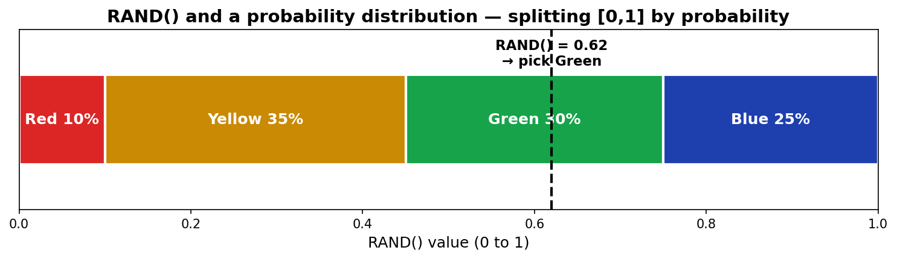
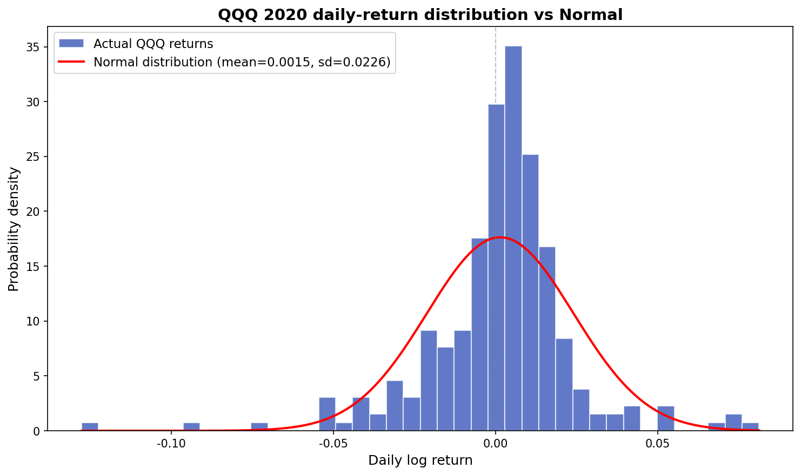
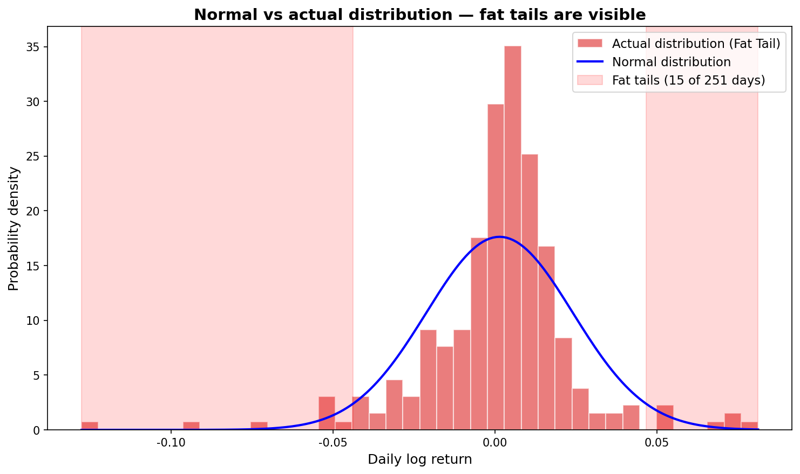
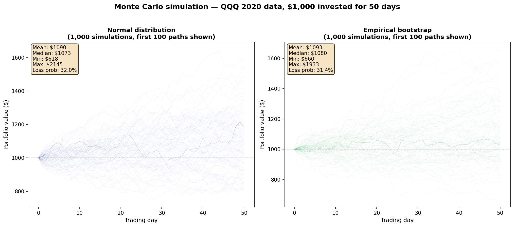
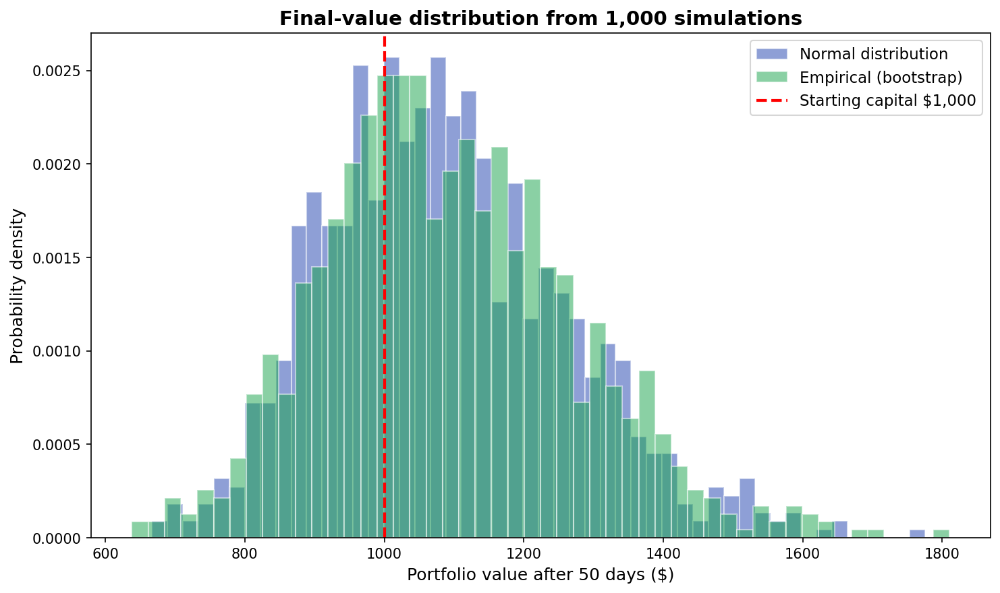

# Monte Carlo Simulation Backtesting

> Google Sheets template: [MonteCarlo](https://docs.google.com/spreadsheets/d/1zRjhKI5rt5RERUXul56Fu0ECCkDkookHDSpaRsxc-RQ/copy) (heavy file — it carries the simulation data)

---

## What a Monte Carlo simulation is

The Monte Carlo method is **an algorithm for computing the value of a function probabilistically, using random numbers**. Stanisław Ulam named it after Monte Carlo — the famous gambling town in Monaco. In the 1930s Enrico Fermi used the technique to study neutron behavior. It also played a central role in the Manhattan Project and the development of the hydrogen bomb.

You'll often hear that quants and brokerages use Monte Carlo simulations for backtesting (backtesting = validating a strategy against historical data) — the trading strategy. It looks intimidating, but the idea is simple. The clearest way to learn it is to build a "Hello World" version yourself.

> Using QQQ price data from 2020, simulate investing $1,000 over 50 days, and run that simulation 1,000 times to backtest the outcome.

---

## The basic primitive: the `RAND()` function

`RAND()` returns **a random real number between 0 and 1, uniformly distributed** — every value in the range has equal probability (a uniform distribution).

If you call `RAND()` ten times, the output won't *look* uniform. But by the **Law of Large Numbers**, results converge to the theoretical distribution as you increase the sample size. At 100 calls, 1,000, or 10,000, the histogram approaches a flat, even distribution.

---

## Building a probability distribution function

Suppose ten years of Christmas-card sales data shows:

| Units sold | Probability | Color |
|:-----------|:------------|:------|
| 10,000 | 10% | Red |
| 20,000 | 35% | Yellow |
| 40,000 | 30% | Green |
| 60,000 | 25% | Blue |

To generate sales numbers randomly *with these probabilities*, line up bars whose lengths match the probabilities.



Map the 0-to-1 number from `RAND()` onto these bars and each color (sales level) gets picked at exactly its probability. The boundaries are:

| Boundary | Value |
|:---------|:------|
| Red / Yellow | 0.10 |
| Yellow / Green | 0.45 (0.10 + 0.35) |
| Green / Blue | 0.75 (0.10 + 0.35 + 0.30) |

`RAND()` gives you a number in [0, 1), and which bar it lands in determines the sales number. This table is called the **inverse cumulative distribution** — a lookup table that maps probability back to value. In Sheets you implement it with `VLOOKUP()`:

```
=VLOOKUP(RAND(), 'inverse-CDF table', 2)
```

---

## Christmas-card Monte Carlo

Given a sale price, production cost, and disposal cost, here's the profit logic:

```
Produced     = 40,000
Demand       = VLOOKUP(RAND(), 'inverse-CDF table', 2)
Revenue      = unit_sale * MIN(Produced, Demand)
ProductionCost = unit_cost * Produced
DisposalCost = unit_disposal * IF(Produced > Demand, Produced - Demand, 0)
Profit       = Revenue - ProductionCost - DisposalCost
```

Each `RAND()` call generates a new demand number, and the profit recalculates automatically.

### A Google Sheets gotcha

If you call `RAND()` multiple times in a single formula, each call returns a *different* number. To work around that, write a custom function:

<details><summary>Google Sheets custom function (Apps Script)</summary>

```javascript
function GetProfit(produced, demandTable, unit_sale, unit_cost, unit_disposal) {
  var demand = getVLOOKUP(Math.random(), demandTable, 2);
  var revenue = unit_sale * Math.min(produced, demand);
  var production_cost = unit_cost * produced;
  var disposal_cost = unit_disposal * (produced > demand ? produced - demand : 0);
  return revenue - production_cost - disposal_cost;
}

function getVLOOKUP(search_key, range, index) {
  var found = 0;
  for (var i in range) {
    if (search_key < range[i][0]) break;
    found = i;
  }
  return range[found][index - 1];
}
```

</details>

Call it like: `=GetProfit(produced, inverseCDFTable, unit_sale, unit_cost, unit_disposal)`

If you simulate the four production levels (10k / 20k / 40k / 60k) at 500 simulations each, the result is clear: 60,000 has no advantage; if you want stable income, **20,000 is optimal**.

---

## Normal distribution and the inverse CDF

The most famous probability distribution is the **normal distribution** — the bell-shaped curve centered on the mean.

For IQ (mean = 100, standard deviation = 15 — standard deviation measures how spread out the data is around the mean):

| Question | Function | Answer |
|:---------|:---------|:-------|
| Probability of IQ ≥ 120? | `=1-NORM.DIST(120,100,15,true)` | 9.12% |
| What IQ marks the bottom 40%? | `=NORM.INV(0.4,100,15)` | 96.2 |
| Probability of IQ < 96.2? | `=NORM.DIST(96.2,100,15,true)` | 40% |

The key idea: when `RAND()` gives you a probability between 0 and 1, the **inverse CDF tells you the actual value that corresponds to that probability**. With that, you can generate random samples that follow whichever distribution you want:

```
Normal random variable     = NORMINV(RAND(), mean, stdev)
Lognormal random variable  = LOGINV(RAND(), mean_of_ln, stdev_of_ln)
```

<details><summary>A note on LOGINV() parameters</summary>

`LOGINV()`'s parameters are *not* the mean and standard deviation of the lognormal distribution itself (lognormal is the right distribution for prices, since prices can't go negative). They're the mean and standard deviation of the **underlying normal distribution of ln(X)**.

</details>

---

## QQQ 2020 return analysis

Use QQQ daily closing prices for 2020 (252 trading days, 251 daily returns from close-to-close changes).



If you compare random returns generated from a normal distribution (`NORMINV`) against the actual returns, the **fat tails** in the real distribution disappear in the normal model. (A "fat tail" means extreme events occur far more often than the normal distribution would predict.) Something like the 2020 COVID crash should happen "once every few thousand years" under a normal-distribution assumption — in reality, it happens roughly once a decade.



### Use the empirical distribution to preserve fat tails

If you sample directly from the 251 actual returns, the fat tails come along for the ride:

```
=INDEX(ROR_QQQ2020, RANDBETWEEN(1, 251))
```

Generate a random integer between 1 and 251, look up the actual return at that index, use it. This technique is called **bootstrapping** — resampling from the real data.

---

## The Monte Carlo result

Simulate $1,000 invested over 50 days, repeated 1,000 times.





### What the simulation tells you

Summary of 1,000 simulations (using the empirical distribution):

| Metric | Value | Meaning |
|:-------|:------|:--------|
| **Median (50th)** | $1,074 | Half the time, +7.4% after 50 days |
| **5th percentile (VaR 95%)** | $844 | The worst 5% of paths: **−15.6% loss** |
| **95th percentile** | $1,399 | The best 5% of paths: +39.9% gain |
| **Loss probability (< $1,000)** | 30.8% | 3 out of 10 simulations end below the starting balance |
| **Worst path drawdown** | −40.3% | The biggest *intra-path* drop — the moment when looking at your account would feel the worst |

*(Empirical-distribution bootstrap, seed=42, 1,000 simulations)*

> **The point:** the value of a Monte Carlo simulation isn't the "average return." It's seeing **how bad the bad cases can get**. If you put in $1,000 and you're really unlucky (bottom 5% of paths), how low does your balance go? That number is **VaR (Value at Risk)** — and it's the main reason financial institutions run Monte Carlos for risk management.

---

## Python version

If you want to skip the Google Sheets limits (the 99-series chart cap, slow recalculation), the same simulation in Python is short:

<details><summary>Full Python code</summary>

```python
import numpy as np
import yfinance as yf

# Pull QQQ 2020 data
qqq = yf.download("QQQ", start="2020-01-01", end="2020-12-31")
closes = qqq["Close"].values.flatten()
log_returns = np.diff(np.log(closes))  # 251 daily log returns

mu, sigma = log_returns.mean(), log_returns.std()

# Method 1: Normal distribution
random_returns = np.random.normal(mu, sigma, size=(1000, 50))

# Method 2: Empirical distribution (bootstrap) — preserves fat tails
random_returns = np.random.choice(log_returns, size=(1000, 50), replace=True)

# Compute simulated paths
paths = 1000 * np.exp(np.cumsum(random_returns, axis=1))
```

</details>

---

## Wrap-up

The five key ideas of Monte Carlo simulation:

1. **Generate uniform random numbers with `RAND()`** → map them through a probability distribution
2. **Inverse CDF + `RAND()`** = a random variable from any distribution you choose
3. **Normal-distribution method**: `NORMINV(RAND(), mean, stdev)` — clean, but kills the fat tails
4. **Empirical (bootstrap) method**: `INDEX(actual_data, RANDBETWEEN())` — keeps the fat tails
5. With enough repetitions, the Law of Large Numbers carries you to the true distribution

Production financial Monte Carlos add layers on top of this — volatility clustering, jump models, regime switches. But the core mechanism is exactly the "Hello World" we built here.

> **The natural application is backtesting actual investment strategies — covered in** [Execution series (S2) — VIX volatility targeting](../series/s2-preview.md)**.** A 2006–2025 SPY backtest moves Sharpe from 0.56 to 0.79 and max drawdown from −55% to −36%.

---

*Next: [The Almanac Trader — Seasonality analysis](almanac.md)*
