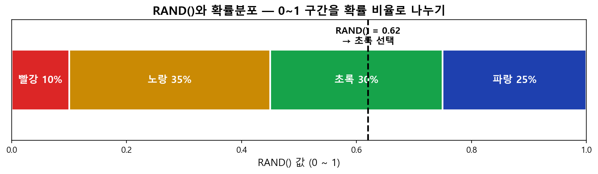
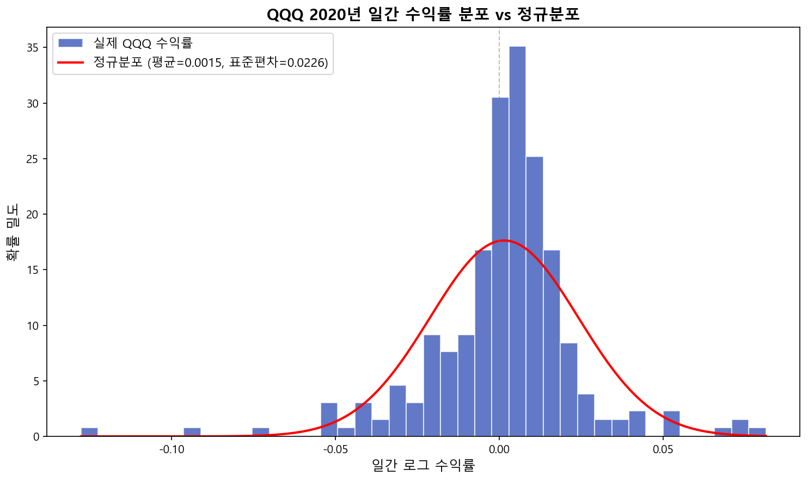
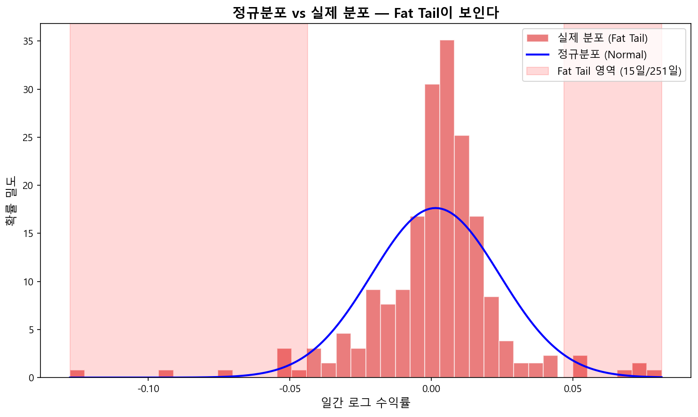
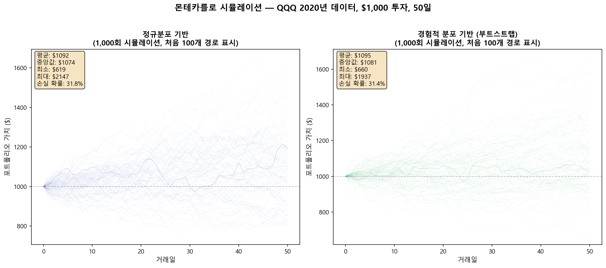
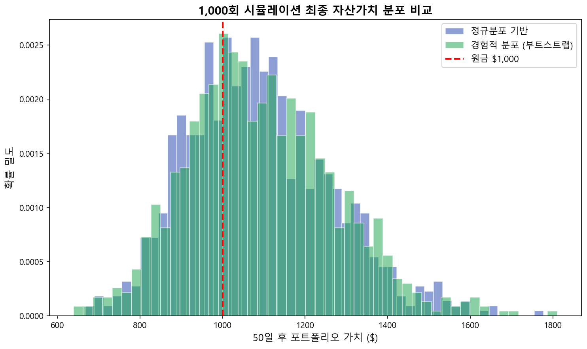

# 몬테카를로(Monte Carlo) 시뮬레이션 백테스팅

> 구글 시트 링크: [MonteCarlo](https://docs.google.com/spreadsheets/d/1zRjhKI5rt5RERUXul56Fu0ECCkDkookHDSpaRsxc-RQ/edit?usp=sharing) (시뮬레이션 데이터 때문에 무거운 파일입니다)

---

## 몬테카를로 시뮬레이션이란

몬테카를로 방법(Monte Carlo method)은 **난수를 이용하여 함수의 값을 확률적으로 계산하는 알고리즘**입니다. 스타니스와프 울람이 모나코의 유명한 도박의 도시 몬테카를로의 이름을 본따 명명하였으며, 1930년대 엔리코 페르미가 중성자의 특성을 연구하기 위해 이 방법을 사용한 것으로 유명합니다. 맨해튼 계획의 시뮬레이션이나 수소폭탄의 개발에서도 핵심적인 역할을 담당했습니다.

금융 공학이나 증권사에서도 몬테카를로 시뮬레이션으로 투자 모델을 백테스팅(backtesting)한다는 이야기를 자주 들을 수 있습니다. 어려워 보이지만 핵심은 단순합니다. "Hello World" 프로그램처럼 직접 만들어보면서 이해해봅시다.

> 2020년의 QQQ 주가 데이터를 사용하여, 투자 금액 $1,000을 50일 동안 투자하는 경우를 몬테카를로 시뮬레이션으로 1,000번 반복하여 백테스팅해보자.

---

## 기본 개념: `RAND()` 함수

`RAND()` 함수는 호출할 때마다 **0에서 1 사이의 임의의 실수**를 동등한 확률로 돌려주는 함수입니다. 즉, 균등분포(Uniform Distribution)를 따릅니다.

`RAND()`를 10번 실행하면 균등분포가 아닌 것처럼 보이지만, 대수의 법칙(Law of Large Numbers)에 따라 반복 횟수를 100회, 1,000회, 10,000회로 늘리면 점점 균등분포에 수렴합니다.

---

## 확률분포(Probability Distribution) 함수 만들기

크리스마스 카드 판매량의 지난 10년 기록에 따르면:

| 판매량 | 확률 | 색상 |
|:------|:-----|:-----|
| 10,000장 | 10% | 빨강 |
| 20,000장 | 35% | 노랑 |
| 40,000장 | 30% | 초록 |
| 60,000장 | 25% | 파랑 |

이 확률에 따라 판매 수량을 무작위로 생성하려면, 확률 길이에 해당하는 막대기를 나란히 나열합니다.



`RAND()`가 돌려주는 0~1 사이의 숫자를 막대기에 매핑하면, 각 색상(판매량)이 해당 확률대로 선택됩니다. 경계값은:

| 경계 | 값 |
|:----|:---|
| 빨강/노랑 | 0.10 |
| 노랑/초록 | 0.45 (0.10 + 0.35) |
| 초록/파랑 | 0.75 (0.10 + 0.35 + 0.30) |

이 표를 **누적분포 역함수(Inverse Cumulative Distribution) 표**라고 부르며, `VLOOKUP()`으로 매핑합니다:

```
=VLOOKUP(RAND(), '누적분포 역함수 표', 2)
```

---

## 크리스마스 카드 몬테카를로 시뮬레이션

판매 가격, 제작 비용, 처분 비용이 주어졌을 때 손익 계산:

```
공급(Produced) = 40,000
수요(Demand) = VLOOKUP(RAND(), '누적분포 역함수 표', 2)
매출(Revenue) = 판매가격 x MIN(공급, 수요)
총제작비용 = 제작비용 x 공급
총처분비용 = 처분비용 x IF(공급 > 수요, 공급 - 수요, 0)
손익(Profit) = 매출 - 총제작비용 - 총처분비용
```

매번 `RAND()`를 호출할 때마다 수요가 변하고 손익이 자동 계산됩니다.

### 구글 시트에서의 문제

한 줄 계산식에서 `RAND()`를 여러 번 호출하면 각각 다른 값을 반환합니다. 이 문제를 해결하기 위해 커스텀 함수를 작성합니다:

```javascript
function GetProfit(produced, demandTable, unit_sale, unit_cost, unit_disposal) {
  var demand = getVLOOKUP(Math.random(), demandTable, 2);
  var revenue = unit_sale * Math.min(produced, demand);
  var production_cost = unit_cost * produced;
  var disposal_cost = unit_disposal * (produced > demand ? produced - demand : 0);
  return revenue - production_cost - disposal_cost;
}

function getVLOOKUP(search_key, range, index) {
  var found = 0;
  for (var i in range) {
    if (search_key < range[i][0]) break;
    found = i;
  }
  return range[found][index - 1];
}
```

호출: `=GetProfit(공급, 누적분포역함수표, 판매가격, 제작비용, 처리비용)`

공급량을 10,000 / 20,000 / 40,000 / 60,000장으로 각각 500번 시뮬레이션한 결과, 60,000장은 유리한 점이 없고, 안정적인 수입을 원하면 20,000장이 최적이라는 결론을 얻습니다.

---

## 정규분포와 역누적분포함수

다양한 확률분포 함수 중 가장 유명한 것이 **정규분포(Normal Distribution)**입니다.

평균 IQ = 100, 표준편차 = 15인 경우:

| 질문 | 함수 | 답 |
|:----|:-----|:---|
| IQ 120 이상일 확률은? | `=1-NORM.DIST(120,100,15,true)` | 9.12% |
| 하위 40%의 IQ 기준은? | `=NORM.INV(0.4,100,15)` | 96.2 |
| IQ 96.2 미만일 확률은? | `=NORM.DIST(96.2,100,15,true)` | 40% |

핵심: **역누적분포함수의 입력으로 `RAND()`를 주면, 해당 확률분포를 따르는 임의의 변수를 생성할 수 있습니다.**

```
정규분포 임의 변수 = NORMINV(RAND(), mean, stdev)
로그정규분포 임의 변수 = LOGINV(RAND(), mean_of_ln, stdev_of_ln)
```

**주의:** `LOGINV()`의 파라미터는 로그정규분포 자체의 평균/표준편차가 아니라, **기저 정규분포(ln(X))의 평균과 표준편차**입니다.

---

## QQQ 2020년 수익률 분석

QQQ의 2020년 일간 종가 데이터(252 거래일, 251개 수익률)를 사용합니다.



정규분포(`NORMINV`)로 생성한 임의의 수익률과 실제 수익률을 비교하면, 실제 분포에서 보이는 **Fat Tail(팻 테일)**이 정규분포 모델에서는 사라집니다.



### 경험적 분포(Empirical Distribution)로 Fat Tail 보존

실제 수익률 251개를 직접 샘플링하면 Fat Tail을 보존할 수 있습니다:

```
=INDEX(ROR_QQQ2020, RANDBETWEEN(1, 251))
```

1~251 사이의 임의의 정수를 생성하여 해당 수익률을 사용하는 **부트스트랩(Bootstrap)** 방법입니다.

---

## 몬테카를로 시뮬레이션 결과

$1,000을 50일간 투자하는 시뮬레이션을 1,000번 반복합니다.





---

## 파이썬 버전

구글 시트의 제약(차트 99개 시리즈 한계, 느린 속도) 없이 파이썬으로 동일한 시뮬레이션을 실행할 수 있습니다:

```python
import numpy as np
import yfinance as yf

# QQQ 2020년 데이터 다운로드
qqq = yf.download("QQQ", start="2020-01-01", end="2020-12-31")
closes = qqq["Close"].values.flatten()
log_returns = np.diff(np.log(closes))  # 251개 일간 로그 수익률

mu, sigma = log_returns.mean(), log_returns.std()

# 방법 1: 정규분포 기반
random_returns = np.random.normal(mu, sigma, size=(1000, 50))

# 방법 2: 경험적 분포 (부트스트랩) — Fat Tail 보존
random_returns = np.random.choice(log_returns, size=(1000, 50), replace=True)

# 시뮬레이션 경로 계산
paths = 1000 * np.exp(np.cumsum(random_returns, axis=1))
```

---

## 마무리

몬테카를로 시뮬레이션의 핵심:

1. **`RAND()`로 균등분포 난수 생성** → 확률분포 함수에 매핑
2. **역누적분포함수(Inverse CDF) + `RAND()`** = 원하는 분포를 따르는 임의의 변수
3. **정규분포 기반**: `NORMINV(RAND(), mean, stdev)` — 깔끔하지만 Fat Tail이 사라짐
4. **경험적 분포(부트스트랩)**: `INDEX(실제데이터, RANDBETWEEN())` — Fat Tail 보존
5. 충분히 많이 반복하면 대수의 법칙에 의해 통계적 확률에 수렴

금융 실전에서는 경험적 분포에 추가 파라미터(변동성 클러스터링, 점프 모델 등)를 결합하여 더 정교한 시뮬레이션을 수행합니다. 하지만 원리는 여기서 다룬 "Hello World"와 정확히 같습니다.
