# The Bond Market's VIX — How to Read the MOVE Index

Equity people watch the VIX. It puts the market's fear into a single number. But the market that actually moves almost every price in the world has its own fear gauge — rates, specifically the **US Treasury market.**

That gauge is called the **MOVE Index.** Just as the equity VIX measures "how much will stocks swing," MOVE measures "how much will *yields* swing." It's commonly called the **bond market's VIX.**

And the bond market often gets scared earlier, and more honestly, than stocks. So if you can read MOVE, you can sense market stress a step ahead.

---

## The 30-second version

- **MOVE = the bond VIX.** It's the implied volatility of US Treasury options — the market's expected **swing in yields.** It's been around since 1988.
- **It's in bp, not %.** VIX states equity volatility in percent; MOVE states rate volatility in **basis points (bp).** That's the first trap.
- **It watches the whole curve.** It blends 2, 5, 10 and 30-year Treasury options, with a **40% weight on the 10-year** (the others 20% each). Long-end rates are the point.
- **A feel for the levels:** roughly **below 80 calm · 80–120 normal · 120–160 stressed · above 160 convulsion.** It's near 75 now — calm.
- Historic spikes: **2008 Lehman ~264, 2020 COVID ~164, 2023 SVB ~200.** Above 200 only a handful of times.
- **The divergence from VIX is the signal.** When stocks are calm but MOVE jumps, the bond market has likely smelled rate/Fed risk first.

---

## 1. What MOVE is — the bond VIX

In [Volatility Skew](skew.md) we covered the VIX — the **equity market's expected volatility** pulled out of S&P 500 option prices. When the market gets scared, options (insurance) get expensive, and that expensiveness is the VIX.

MOVE applies exactly the same idea to **bonds.**

> MOVE = the **expected volatility of yields**, pulled out of US Treasury option prices

When yields look like they'll swing hard, Treasury options get expensive — and that expensiveness is MOVE. So a high MOVE means the **bond market is tense: "we don't know where rates are headed."**

Its formal name is the ICE BofA MOVE Index — from the original "Merrill Option Volatility Estimate." As the VIX is the headline gauge of equity fear, MOVE is the **headline gauge of bond fear.**

---

## 2. The first trap — it's in bp, not %

The biggest difference between VIX and MOVE is the **unit.** Miss this and you'll misread the number.

- **VIX** states equity volatility in **%.** VIX 20 = the market prices ~20% annual volatility for the S&P 500.
- **MOVE** states rate volatility in **bp (basis points).** Stocks move in %, but yields move in bp ("4.2% → 4.3%").

The MOVE number is the market's expected **annualized swing in yields, in bp.** To make it concrete, convert to a monthly figure:

> MOVE 100 → the 10-year yield is expected to move **about 29bp in a month**
>
> MOVE 75 (now) → about **22bp a month**

So a low MOVE means "rates will be quiet," a high MOVE means "rates will swing hard." Like the VIX, it measures **magnitude, not direction** — up or down, if it's going to move a lot, MOVE rises.

Converting bp to a monthly move

<pre><code>MOVE = annualized rate volatility (bp)
1-month expected move ≈ MOVE ÷ √12

  MOVE 100 → 100 ÷ 3.46 ≈ 29bp / month
  MOVE 75  →  75 ÷ 3.46 ≈ 22bp / month</code></pre>

Dividing by √12 is the standard way to convert annual volatility to
monthly (volatility scales with the square root of time). It's the same
√12 you'd use to turn the VIX into an expected monthly move.

---

## 3. It watches the whole curve, not one thing

VIX watches one thing: the S&P 500. MOVE is different — Treasuries have different yields at different maturities (the yield curve), and MOVE blends the **volatility of the whole curve.**

Specifically, it weights the option volatility of **2, 5, 10 and 30-year** Treasuries. The weights are the point.

| Maturity | Weight |
|---|---|
| 2-year | 20% |
| 5-year | 20% |
| **10-year** | **40%** |
| 30-year | 20% |

**40% sits on the 10-year.** The 10-year Treasury yield is the world's reference rate — for mortgages, corporate bonds, even equity valuations. MOVE watches "the whole curve" but its **center of gravity is 10-year volatility.**

---

## 4. Reading the levels

The raw number means little on its own, so it helps to memorize the bands.

| MOVE | State |
|---|---|
| **< 80** | Calm — rates quiet |
| **80 – 120** | Normal |
| **120 – 160** | Stressed — the bond market is tense |
| **> 160** | Convulsion — crisis territory |

It's around **75** now (September 2026), in the calm band.

Historically, MOVE has cleared **200 only a handful of times** — and looking at *when* makes the gauge's meaning clear:

- **October 2008 — Lehman: ~264** (the all-time high)
- **March 2020 — COVID panic: ~164** (when the Treasury market briefly lost liquidity)
- **March 2023 — SVB / Credit Suisse: ~200** (the banking scare)

All three were **moments the financial system shook.** When MOVE clears 160, that's not a routine wobble — it's a sign that **some plumbing in the bond market is creaking.**

---

## 5. The real signal is when it diverges from VIX

MOVE and VIX usually move together — both rise in a crisis, both fall when things are calm. So **when they move together, there isn't much information.**

The information comes when they **split.**

> **Stocks (VIX) calm but bonds (MOVE) jump** → the market isn't worried about stocks yet, but the bond market may have caught rate / Fed / inflation risk first. The classic "bonds fear first" pattern.
>
> **Bonds (MOVE) calm but stocks (VIX) jump** → likely a pure equity issue (earnings, valuations). The rate system is steady.

Bonds are honest first because of who trades them. The Treasury market is where **banks, pensions, central banks and hedge funds put real money and leverage** to work on rates. When they get tense, MOVE moves first.

This also connects to the [credit spreads](credit-spreads.md) story. When rate volatility (MOVE) rises, funding gets harder for weak companies and credit spreads start to widen. Stress often travels **MOVE → credit spreads → equities.** That puts bond volatility at the **front** of the chain of warning signals.

You can see this in the data too. On the home [dashboard](../index.md), place the MOVE chart next to the credit-dispersion (CCC−B) chart and you'll notice that **spikes in bond volatility tend to line up with the bottom-rated spread widening.** Both refresh weekly, so check today's picture for yourself.

---

## 6. What to watch

To put it to work:

- **Direction and divergence over level.** That MOVE is 75 matters less than whether it's **rising** and whether it's **splitting from VIX.**
- **160 is the alarm line.** Above it, treat it as system stress, not a routine dip.
- **MOVE is magnitude, not direction.** It measures "rates will swing," not "rates will rise/fall." For direction, use other tools (FedWatch, the yield curve).
- **Read it alongside the VIX and credit spreads.** When all three agree, conviction is high; when they diverge, that itself is information — and the bond side (MOVE, credit) usually moves first.

---

## 7. Summary

| Concept | Core |
|---|---|
| **MOVE** | The bond VIX — implied volatility of US Treasury options |
| **Unit** | bp, not % (yield swing) — read it as a monthly move |
| **Composition** | 2/5/10/30-year weighted, **10-year at 40%** |
| **Levels** | <80 calm · 80–120 normal · 120–160 stressed · >160 convulsion |
| **History** | 2008 ~264 · 2020 ~164 · 2023 SVB ~200. Above 200 is rare |
| **Key use** | The **divergence** from VIX. Bonds fear first |
| **Nature** | Magnitude, not direction. Travels MOVE → credit → equities |

**The one thing to remember**: the world's reference rate is the US 10-year, and MOVE puts how much that rate might swing into a single number. People who watch only stocks find out when the storm hits; people who also watch bond volatility feel the **wind change** a little earlier.

---

*Related: [Volatility Skew](skew.md) | [Reading Credit Spreads as an Indicator](credit-spreads.md) | [VIX Term Structure](vix-term-structure.md)*

### Sources and notes

The MOVE definition, weights (2/5/10/30 = 20/20/40/20) and unit are from the
ICE BofA index methodology and public materials; the historical levels
(2008 ~264, 2020 ~164, 2023 SVB ~200) and the current value (~75, early
September 2026) are from market data. All figures are as of 2026-09-01.

The MOVE Index is a trademark of ICE Data Indices; this post references it only
to identify the indicator. VIX is a trademark of Cboe.

### Glossary

- *MOVE Index* — bond-market expected volatility from Treasury option prices; the bond VIX
- *VIX* — equity-market expected volatility from S&P 500 option prices
- *Implied volatility* — the future swing the market prices into an option
- *bp (basis point)* — 0.01 percentage point; the unit for rates (100bp = 1pp)
- *Yield curve* — Treasury yields plotted across maturities
- *Annualized* — a volatility scaled to a one-year basis; divide by √12 for monthly
