# 채권시장의 VIX — MOVE 지수 읽는 법

주식 하는 사람은 VIX를 봅니다. 시장이 얼마나 겁먹었는지를 한 숫자로 보여주니까요. 그런데 정작 **세상의 거의 모든 가격을 움직이는 시장**에는 따로 공포 게이지가 있습니다. 금리, 정확히는 **미 국채 시장**이에요.

그 게이지의 이름이 **MOVE 지수**입니다. 주식의 VIX가 "주가가 얼마나 출렁일까"를 재듯, MOVE는 "금리가 얼마나 출렁일까"를 잽니다. 흔히 **채권판 VIX**라고 부르죠.

그리고 채권시장은 종종 주식보다 먼저, 더 정직하게 겁을 먹습니다. 그래서 MOVE를 읽을 줄 알면 시장의 스트레스를 한 발 앞서 감지할 수 있어요.

---

## 30초 요약

- **MOVE = 채권판 VIX.** 미 국채 옵션의 내재변동성으로, 시장이 예상하는 **금리의 출렁임**을 잽니다. 1988년부터 존재.
- **단위가 %가 아니라 bp**입니다. VIX는 주가 변동성을 %로, MOVE는 금리 변동성을 **베이시스포인트(bp)**로 표현해요. 이게 첫 번째 함정.
- **곡선 전체를 봅니다.** 2·5·10·30년 국채 옵션을 섞되, **10년물에 40%** 비중(나머지 각 20%). 장기금리 흐름이 핵심이라는 뜻.
- **레벨 감:** 대략 **80 미만 평온 · 80~120 정상 · 120~160 스트레스 · 160 초과 발작.** 현재는 약 75로 평온한 편.
- 역사적 발작: **2008 리먼 ~264, 2020 코로나 ~164, 2023 SVB 사태 ~200.** 200을 넘긴 건 손에 꼽습니다.
- **VIX와 갈라질 때가 신호.** 주식은 잠잠한데 MOVE만 튀면, 채권시장이 금리·Fed 리스크를 먼저 냄새 맡은 것일 수 있습니다.

---

## 1. MOVE가 뭔가 — 채권판 VIX

[변동성 Skew](skew.md) 글에서 VIX를 다뤘습니다. VIX는 S&P500 옵션 가격에서 뽑아낸 **주식시장의 예상 변동성**이죠. 시장이 겁먹으면 옵션(보험)이 비싸지고, 그 비싸진 정도가 VIX로 나타납니다.

MOVE는 정확히 같은 아이디어를 **채권**에 적용한 겁니다.

> MOVE = 미 국채 옵션 가격에서 뽑아낸 **금리의 예상 변동성**

국채 금리가 앞으로 크게 출렁일 것 같으면, 국채 옵션이 비싸집니다. 그 비싸진 정도가 MOVE예요. 그래서 MOVE가 높다는 건 **채권시장이 "금리가 어디로 튈지 모르겠다"며 긴장하고 있다**는 뜻입니다.

정식 이름은 ICE BofA MOVE Index — 원래 메릴린치가 만든 "Merrill Option Volatility Estimate"의 약자에서 왔습니다. VIX가 주식 공포의 대표 지표이듯, MOVE는 **채권 공포의 대표 지표**입니다.

---

## 2. 첫 번째 함정 — 단위가 %가 아니라 bp다

VIX와 MOVE의 가장 큰 차이는 **단위**입니다. 이걸 모르면 숫자를 잘못 읽어요.

- **VIX**는 주가 변동성을 **%**로 표현합니다. VIX 20 = 시장이 S&P500의 연 변동성을 약 20%로 본다는 뜻.
- **MOVE**는 금리 변동성을 **bp(베이시스포인트)**로 표현합니다. 주가는 %로 움직이지만, 금리는 "4.2% → 4.3%"처럼 **bp로 움직이니까요.**

MOVE 숫자는 시장이 예상하는 **연율화된 금리 변동폭(bp)**입니다. 이걸 실제 체감으로 바꾸려면 한 달치로 환산하면 됩니다.

> MOVE 100 → 10년물 금리가 **한 달에 약 29bp** 정도 움직일 거라고 시장이 본다는 뜻
>
> MOVE 75 (현재) → 한 달에 약 **22bp**

즉 MOVE가 낮으면 "금리가 얌전할 것", 높으면 "금리가 크게 흔들릴 것"이라고 시장이 베팅하는 겁니다. 방향이 아니라 **폭**을 보는 지표라는 점도 VIX와 똑같아요 — 오르든 내리든 크게 움직일 것 같으면 올라갑니다.

bp를 월 움직임으로 바꾸는 계산

<pre><code>MOVE = 연율화된 금리 변동성 (bp)
1개월 예상 변동폭 ≈ MOVE ÷ √12

  MOVE 100 → 100 ÷ 3.46 ≈ 29bp / 월
  MOVE 75  →  75 ÷ 3.46 ≈ 22bp / 월</code></pre>

√12로 나누는 건 연간 변동성을 월간으로 환산하는 표준 방법입니다
(변동성은 시간의 제곱근에 비례). VIX를 월 움직임으로 바꿀 때
VIX ÷ √12 를 쓰는 것과 똑같은 원리예요.

---

## 3. 한 종목이 아니라 곡선 전체를 본다

VIX는 S&P500 하나를 봅니다. MOVE는 다릅니다 — 국채는 만기별로 금리가 다르고(수익률 곡선), MOVE는 그 **곡선 전체의 변동성**을 섞어서 봅니다.

구체적으로 **2년·5년·10년·30년** 국채 금리 옵션의 변동성을 가중평균합니다. 비중이 핵심이에요.

| 만기 | 비중 |
|---|---|
| 2년 | 20% |
| 5년 | 20% |
| **10년** | **40%** |
| 30년 | 20% |

**10년물에 40%**가 실려 있습니다. 10년 국채 금리가 주택담보대출·회사채·주식 밸류에이션까지 세상의 기준금리 역할을 하기 때문이에요. MOVE는 "곡선 전체"를 보되 사실상 **10년물 변동성에 무게중심**이 있는 지표입니다.

---

## 4. MOVE 레벨 읽는 법

절대 수치 자체는 감이 안 오니, 구간으로 외워두면 편합니다.

| MOVE | 상태 |
|---|---|
| **< 80** | 평온 — 금리가 얌전 |
| **80 ~ 120** | 정상 |
| **120 ~ 160** | 스트레스 — 채권시장 긴장 |
| **> 160** | 발작 — 위기 국면 |

현재(2026년 9월)는 약 **75**로 평온 구간입니다.

역사적으로 MOVE가 **200을 넘긴 건 손에 꼽습니다.** 그때가 어떤 시기였는지 보면 이 지표의 의미가 분명해져요.

- **2008년 10월 — 리먼 파산: 약 264** (역대 최고 수준)
- **2020년 3월 — 코로나 패닉: 약 164** (국채시장 유동성이 순간 마비된 시기)
- **2023년 3월 — SVB·크레디트스위스 사태: 약 200** (은행 위기)

세 번 다 **금융시스템이 흔들린 순간**입니다. MOVE가 160을 넘으면 그건 단순한 조정이 아니라 **채권시장 배관 어딘가가 삐걱대고 있다**는 신호예요.

---

## 5. VIX와 갈라질 때가 진짜 신호다

MOVE와 VIX는 보통 같이 움직입니다 — 위기가 오면 둘 다 오르고, 잠잠하면 둘 다 내려요. 그러니 **그냥 같이 움직일 때는 별 정보가 없습니다.**

정보는 **둘이 갈라질 때** 나옵니다.

> **주식(VIX)은 잠잠한데 채권(MOVE)만 튄다** → 시장이 아직 주가 걱정은 안 하는데, 채권시장은 금리·Fed·인플레 리스크를 먼저 감지한 것일 수 있습니다. 채권이 먼저 겁먹는 전형적 패턴이에요.
>
> **채권(MOVE)은 잠잠한데 주식(VIX)만 튄다** → 순수하게 주식 쪽 이슈(실적·밸류에이션)일 가능성. 금리 시스템은 안정적이라는 뜻.

채권시장이 먼저 정직한 이유는 참여자 구성에 있습니다. 국채 시장은 은행·연기금·중앙은행·헤지펀드 같은 **큰 손들이 실제 자금과 레버리지를 걸고** 금리를 거래하는 곳이에요. 이들이 긴장하면 MOVE가 먼저 움직입니다.

그리고 이건 [신용 스프레드](credit-spreads.md) 이야기와도 이어집니다. 금리 변동성(MOVE)이 커지면 위험한 회사의 자금 조달이 어려워지고, 신용 스프레드가 벌어지기 시작해요. **MOVE → 신용 스프레드 → 주식**의 순서로 스트레스가 전파되는 경우가 많습니다. 그래서 채권 변동성은 여러 위험 신호 중 **가장 앞단**에 있습니다.

이 전파는 데이터로도 눈에 보입니다. 홈 [대시보드](../index.md)에서 MOVE 차트와 신용 분산(CCC−B) 차트를 나란히 놓고 보면, **채권 변동성이 튀는 시점과 바닥 등급 스프레드가 벌어지는 시점이 대체로 겹치는** 걸 확인할 수 있어요. 두 지표 모두 매주 갱신되니 지금 상황을 직접 대조해 보세요.

---

## 6. 무엇을 볼 것인가

실전에서 챙길 것들.

- **레벨보다 방향과 갈라짐.** MOVE가 75라는 사실보다, **오르고 있는지** 그리고 **VIX와 벌어지고 있는지**가 더 많은 걸 말합니다.
- **160은 경보선.** 이 위로 올라가면 단순 조정이 아니라 시스템 스트레스 신호로 보세요.
- **MOVE는 방향이 아니라 폭입니다.** "금리가 오른다/내린다"가 아니라 "금리가 크게 흔들린다"를 재는 지표예요. 방향은 다른 도구(FedWatch·수익률 곡선)로 봅니다.
- **VIX·신용 스프레드와 함께.** 세 지표가 같은 얘기를 하면 신뢰도가 높고, 갈라지면 그 자체가 정보입니다. 보통 채권 쪽(MOVE·신용)이 먼저 움직여요.

---

## 7. 정리

| 개념 | 핵심 |
|---|---|
| **MOVE** | 채권판 VIX. 미 국채 옵션의 내재변동성 |
| **단위** | %가 아니라 **bp** (금리 변동폭) — 숫자를 월 움직임으로 환산해 읽음 |
| **구성** | 2·5·10·30년 가중, **10년물 40%** |
| **레벨** | <80 평온 · 80~120 정상 · 120~160 스트레스 · >160 발작 |
| **역사** | 2008 ~264 · 2020 ~164 · 2023 SVB ~200. 200 초과는 드묾 |
| **핵심 용법** | VIX와 **갈라질 때**. 채권이 먼저 겁먹는다 |
| **성격** | 방향이 아니라 **폭**. MOVE → 신용 → 주식 순으로 전파 |

**기억할 한 가지**: 세상의 기준금리는 미 국채 10년물이고, 그 금리가 얼마나 흔들릴지를 한 숫자로 보여주는 게 MOVE입니다. 주식만 보는 사람은 폭풍이 와서야 알지만, 채권 변동성을 같이 보는 사람은 **바람의 방향이 바뀌는 순간**을 조금 더 일찍 느낄 수 있어요.

---

*관련: [변동성 Skew](skew.md) | [신용 스프레드를 지표로 읽기](credit-spreads.md) | [VIX 기간구조](vix-term-structure.md)*

### 출처와 표기

MOVE 지수의 정의·가중(2/5/10/30 = 20/20/40/20)·단위는 ICE BofA 지수 방법론과
공개 자료를, 역사적 레벨(2008 ~264, 2020 ~164, 2023 SVB ~200)과 현재값(~75,
2026년 9월 초)은 다수 시장 자료를 근거로 했습니다.

MOVE Index는 ICE Data Indices의 상표이며, 본문은 지표를 지칭할 목적으로만
사용했습니다. VIX는 Cboe의 상표입니다.

### 용어 설명

- *MOVE 지수* — 미 국채 옵션의 내재변동성으로 본 채권시장 예상 변동성. 채권판 VIX
- *VIX* — S&P500 옵션의 내재변동성으로 본 주식시장 예상 변동성
- *내재변동성 (Implied Volatility)* — 옵션 가격에 반영된, 시장이 예상하는 미래 변동폭
- *bp (베이시스포인트)* — 0.01%포인트. 금리를 재는 단위 (100bp = 1%p)
- *수익률 곡선 (Yield Curve)* — 만기별 국채 금리를 이은 곡선
- *연율화 (Annualized)* — 변동성을 1년 기준으로 환산한 값. 월 환산은 √12로 나눔
