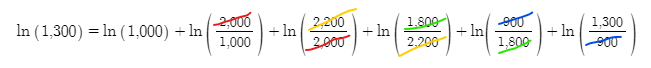

# How is my portfolio actually doing? — TWR vs MWR

> Have you ever calculated your own return and gotten a different number than your brokerage app? They're both correct — they're answering **different questions**.


This article unpacks that difference using pictures.

---

## The 30-second version — same trade, two answers

You bought $50 of a stock, received $2 in dividends each year, added $10 in year 2, and sold at $65 in year 3.

What was your annual return?


- **MWR (Money-Weighted Return)**: **6.70%**
- **TWR (Time-Weighted Return)**: **9.82%**

**Same trade, different answers.** Why?

- **TWR** measures "*how well did the asset run*?" → 9.82% (the asset's performance)
- **MWR** measures "*how much did I actually earn*?" → 6.70% (your real outcome)

The 3.12% gap is **because the timing of your $10 add-on in year 2 was unlucky**. The asset was fine, but your entry timing dragged your result down.

Different brokerage apps show different ones. Once you see the difference, you can read your own performance much more accurately.

---

## 1. Quick refresher — log returns are additive

The key idea from the [previous article](log-return.md):

> **log return = ln(1 + arithmetic return)** — converts multiplication into *addition*

If your portfolio went:

```
$1,000 → $2,000 → $2,200 → $1,800 → $900 → $1,300
```

The total log return is just the **sum of period log returns**:

```
ln(2000/1000) + ln(2200/2000) + ln(1800/2200) + ln(900/1800) + ln(1300/900)
= ln(1300/1000)   ← all middle terms cancel
≈ +26.2%
```



This simple fact is the foundation for both TWR and MWR.

---

## 2. When cash flows enter, the formula tweaks slightly

Suppose at $2,200 you **withdrew $500**.

```
$1,000 → $2,000 → $2,200 → [-$500 withdrawal] → $1,800 → $900 → $1,300
```

The log return for that next period subtracts the withdrawal:

```
new log return = ln (current / (previous − withdrawal))
```

If a dividend came in instead? Add it:

```
dividend received = ln ((current + dividend) / previous)
dividend reinvested = ln (current / (previous − reinvestment))
```

Same principle: **get the portfolio value right and compute the ratio**. Not hard.

<details><summary>📐 Formulas for cash flows + dividends</summary>

```
Plain log return       = ln (current / previous)
With withdrawal        = ln (current / (previous − withdrawal))
With deposit           = ln (current / (previous + deposit))
With dividend          = ln ((current + dividend) / previous)
With dividend reinvest = ln (current / (previous − reinvestment))
```

The point is just *getting the numerator and denominator right* when computing the ratio.

</details>

---

## 3. Time-Weighted Return (TWR) — measures the asset

What we just did — **summing period log returns** — is exactly **TWR**.

### What TWR measures

TWR looks at *the asset itself*. It **strips out the effect of cash flows**, telling you "did this fund actually run well?"

Two scenarios with the same fund:

| | Case A: Add-on | Case B: Withdraw |
|:--|:----------------|:----------------|
| Initial investment | $1,000,000 | $1,000,000 |
| 6-month balance | $1,162,484 | $1,162,484 |
| 6-month action | **+$100,000** add-on | **−$100,000** withdrawal |
| 12-month balance | $1,192,328 | $1,003,440 |
| **TWR** | **+9.34%** | **+9.34%** |

**A or B, TWR is the same +9.34%.** It's the same fund — its *return-generation* is the same.

### What question TWR answers

> "I want to compare this fund's performance. Did the manager do well?"

Used for fund comparison and manager evaluation. The returns you see on Morningstar or fund websites are typically TWR.

> 📚 [Investopedia — Time-Weighted Rate of Return](https://www.investopedia.com/terms/t/time-weightedror.asp)

---

## 4. Money-Weighted Return (MWR) — measures your outcome

### One-line summary: "money in = money out"

Translate the first law of thermodynamics (energy conservation) to dollars:

> **money flowing in = money flowing out + money remaining**

If you sell everything at the end of the period, "money remaining" goes to zero, and:

> **money in = money out** ⇔ **sum of cash flows = 0**

You discount each cash flow back to today using IRR (internal rate of return), and find the IRR that makes the sum equal zero. That's MWR.

### Inflows vs outflows (from the portfolio's perspective)

| Inflow (money entering) | Outflow (money leaving) |
|:------------------------|:-------------------------|
| Sale proceeds | Asset purchase cost |
| Dividends, interest | Reinvested dividends/interest |
| Contributions | Withdrawals |

> Don't get confused: contributions are **inflows**, withdrawals are **outflows** — *from the portfolio's perspective*.

### 30-second example

> Bought $50, received $2 dividend each year, sold at $65 with another $2 dividend in year 3. What's your return?

Cash flows:

```
t=0:  -$50  (purchase, outflow)
t=1:  +$2   (dividend, inflow)
t=2:  +$2   (dividend, inflow)
t=3:  +$67  ($2 dividend + $65 sale, inflow)
```

One line in Google Sheets:

```
=IRR(A1:A4)   →  12.82%
```

Done. **Equivalent to running an even 12.82%/year throughout.**

> 📚 [Investopedia — Money-Weighted Return](https://www.investopedia.com/terms/m/money-weighted-return.asp)

<details><summary>📐 Solving IRR by hand — Newton's method</summary>

How does `=IRR()` actually solve this? Newton's method.

Substitute `X = 1/(1+IRR)` and the equation becomes a cubic:

```
−50 + 2·X + 2·X² + 67·X³ = 0
```

Newton's method starts at an estimate X₀, draws a tangent to the curve at that point, takes where the tangent crosses zero as the new estimate, and repeats:


A few iterations converge on X = 0.8864 → IRR = 1/0.8864 − 1 = **12.82%**.

Implementing it in Google Sheets:

1. A1: estimate X₀ = 1.0
2. B1: `=−50 + 2*A1 + 2*A1^2 + 67*A1^3`  (f(X))
3. C1: `=2 + 4*A1 + 201*A1^2`  (derivative f'(X))
4. A2: `=A1 − B1/C1`  (Newton's iteration)
5. Copy B1, C1 formulas to row 2 → repeat

Stop when f(X) is close enough to zero.

</details>

---

## 5. TWR vs MWR — the core difference

### Same trade, two answers

Back to the example from the intro:

> Bought $50 → year 1 $2 dividend → **year 2 $10 add-on** + $2 dividend → year 3 sold at $65 + $2 dividend

**MWR calculation** — the $10 add-on is an outflow:

```
t=0:  -$50
t=1:  +$2
t=2:  -$8   ($2 dividend - $10 add-on)
t=3:  +$67

=IRR(...)  →  6.70%
```

**TWR calculation** — *requires balance at each cash-flow point*:

```
End-of-year-1 balance: $55 (just before dividend)
End-of-year-2 balance: $60 (just before dividend & add-on)
End-of-year-3 balance: $65 (sale price)

Year 1: ln((55 + 2)/50)            = ln(57/50)
Year 2: ln((60 + 2)/(55 + 10))     = ln(62/65)   ← denominator: prior balance + add-on
Year 3: ln((65 + 2)/60)            = ln(67/60)

Sum log returns over 3 years → annualize → 9.82%/year
```

> Numerator: *all value that came in during the period* (balance + dividend). Denominator: *invested capital at the start of the period* (prior balance + any add-on). That's the heart of the time-weighted formula.

### Why the gap

| | TWR | MWR |
|:--|:----|:----|
| **9.82% vs 6.70%** | Asset's run | Your timing-and-amount-included result |
| **The year-2 $10 add-on** | Effect stripped out | Effect included → drags result down |
| **Message** | "The fund ran well" | "But your entry timing was rough" |

The asset returned +9.82%. But the $10 you added in year 2 only got 1 year to run, ending around $11 (≈ +10%), and that dragged the overall result down. **That's the message MWR delivers** — *your real take-home was 6.70%*.

### Which one is "right"? — **Both. Different questions.**

| Question | Look at |
|:---------|:--------|
| "Is this fund run well?" | **TWR** (manager evaluation) |
| "How much did I actually earn?" | **MWR** (personal result) |
| "Comparing two ETFs" | **TWR** (cash-flow effect removed) |
| "What my brokerage app shows" | Usually **MWR** (only needs trade history) |

Brokerage apps tend to use MWR because they don't need the *daily balance* — just the trade log. TWR requires balance information at every cash-flow point, which is heavier to track.

### When TWR can't be computed

In the example above, **without the balances** TWR is impossible. You can't compute period ratios if you don't know what the balance was at each cash-flow point.

That's the practical difference:

- **MWR**: just needs the trade log
- **TWR**: needs trade log *plus* balance at each cash-flow point

---

## 6. Bonus — DCF is actually MWR

The **DCF (Discounted Cash Flow)** valuation method — the one that gets cited every time long-bond yields rise and growth stocks struggle — is the same idea.

```
DCF (firm value) = equity + Σ ( future cash flow / (1 + discount rate)^t )
MWR (return)     = find IRR such that Σ ( cash flow / (1 + IRR)^t ) = 0
```

**Same equation.** DCF discounts future cash flows by the *risk-free rate*, MWR discounts by *IRR* — the only difference is whether the rate is known or solved for.

So when long Treasury yields (= the risk-free rate) rise, every future earning gets discounted more heavily, and the present value drops. That's the mechanism behind growth stocks underperforming when the Fed hikes.

---

## 7. Summary

| Concept | TWR (Time-Weighted) | MWR (Money-Weighted) |
|:--------|:--------------------|:---------------------|
| **Measures** | Asset's run | Your actual outcome |
| **Cash-flow effect** | Stripped out | Included |
| **Needs** | Balance at every cash flow + trades | Just the trades |
| **Computation** | Sum of period log returns | IRR of cash flows (`=IRR()`) |
| **Used by** | Fund comparison, manager evaluation | Brokerage apps, DCF |
| **Answers** | Did the fund run well? | How much did I earn? |

**The one thing to remember**: the same trade can produce two different return numbers. Neither is wrong — *they answer different questions*.

Check which one your brokerage app shows you. Reading both gives you a much sharper picture of your own investing.

---

*Previous: [Returns, Compounding, and Log Charts](log-return.md)*

*Related: [Shannon's Demon — arithmetic vs geometric mean (S1 series)](../series/s1-shannons-demon.md)*
