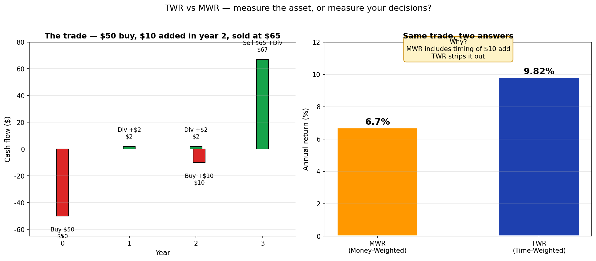
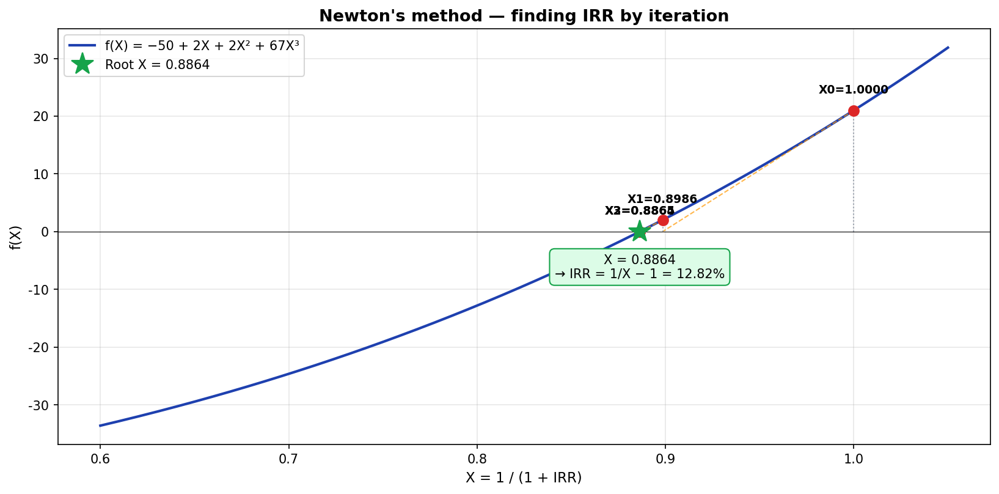

# 내 포트폴리오의 수익률은? — TWR vs MWR

> 같은 계좌, 같은 거래인데 증권사 앱과 직접 계산한 결과가 다르게 나온 적 있나요? 둘 다 정확합니다 — **다른 질문에 다른 답**을 주고 있을 뿐입니다.


이 글은 그 차이의 정체를 그림으로 풀어 봅니다.

---

## 30초 요약 — 같은 거래, 두 가지 답

$50을 투자해 주식을 샀고, 매년 $2 배당을 받았습니다. 2년 차에 $10을 추가로 투입했고, 3년 후 $65에 매도했어요.

연수익률이 얼마였을까요?



- **MWR (금액가중수익률)**: **6.70%**
- **TWR (시간가중수익률)**: **9.82%**

**같은 거래인데 결과가 다릅니다.** 왜?

- **TWR**은 "*자산이* 얼마나 잘 굴러갔는가"를 측정 → 9.82% (자산 운용 능력)
- **MWR**은 "*내가* 결과적으로 얼마를 벌었는가"를 측정 → 6.70% (실제 내 수익)

3.12%p 차이는 **2년 차에 $10 추가 매수 타이밍이 안 좋았기 때문**입니다. 자산은 잘 굴러갔지만, 내 진입 타이밍이 결과를 낮췄어요.

증권사 앱마다 어느 쪽을 보여주는지 다릅니다. 이제 그 차이가 보이실 거예요.

---

## 1. 잠깐 복습 — 로그수익률은 더하기

[지난 글](log-return.md)의 핵심:

> **로그수익률 = ln(1 + 산술수익률)** — 곱하기로 풀어야 할 일을 *더하기*로 바꿔주는 도구

가격 흐름이 다음과 같다면:

```
$1,000 → $2,000 → $2,200 → $1,800 → $900 → $1,300
```

전체 기간 로그수익률은 **각 기간 로그수익률을 그냥 더하면** 됩니다:

```
ln(2000/1000) + ln(2200/2000) + ln(1800/2200) + ln(900/1800) + ln(1300/900)
= ln(1300/1000)   ← 중간 항이 모두 상쇄
≈ +26.2%
```


이 단순한 사실이 TWR과 MWR 모두의 출발점입니다.

---

## 2. 현금흐름이 끼면 식이 약간 달라진다

위 예시에서 $2,200일 때 **$500을 인출**했다고 합시다.

```
$1,000 → $2,000 → $2,200 → [-$500 인출] → $1,800 → $900 → $1,300
```

이 시점의 로그수익률 계산은 인출액을 빼주면 됩니다:

```
새 로그수익률 = ln (현재가 / (이전가 − 인출))
```

배당이 들어왔다면? 더해주면 됩니다:

```
배당 받았을 때 = ln ((현재가 + 배당) / 이전가)
배당 재투자 = ln (현재가 / (이전가 − 재투자))
```

같은 원리: **포트폴리오 가치를 정확하게 잡고 비율을 구하는 것**. 어렵지 않아요.

<details><summary>📐 식 정리 (현금흐름 + 배당 종합)</summary>

```
일반 로그수익률   = ln (현재가 / 이전가)
+ 인출 시         = ln (현재가 / (이전가 − 인출))
+ 입금 시         = ln (현재가 / (이전가 + 입금))
+ 배당 시         = ln ((현재가 + 배당) / 이전가)
+ 배당 재투자 시  = ln (현재가 / (이전가 − 재투자))
```

요지는 *비율을 구할 때 분자·분모를 정확하게 잡는 것* 뿐입니다.

</details>

---

## 3. 시간가중수익률 (TWR) — 자산을 측정한다

위에서 한 방식 — **기간별 로그수익률을 모두 더하기** — 이 바로 **TWR(Time-Weighted Return)** 입니다.

### TWR이 측정하는 것

TWR은 *자산 자체*의 운용 성과를 봅니다. **현금흐름 효과를 제거**해서 "이 펀드가 정말 잘 굴러갔는지"를 알려줍니다.

같은 펀드의 두 시나리오:

| | 사례 A: 추가 매수 | 사례 B: 일부 매도 |
|:--|:----------------|:----------------|
| 초기 투자 | $1,000,000 | $1,000,000 |
| 6개월 후 잔고 | $1,162,484 | $1,162,484 |
| 6개월 차 행동 | **+$100,000** 추가 매수 | **−$100,000** 인출 |
| 12개월 후 잔고 | $1,192,328 | $1,003,440 |
| **TWR** | **+9.34%** | **+9.34%** |

**A든 B든 TWR은 똑같이 +9.34%.** 같은 펀드니까 — 펀드의 *수익 능력*은 같아요.

### TWR이 답하는 질문

> "이 펀드를 비교 평가하고 싶다. 매니저가 잘 굴렸는가?"

펀드 평가, 운용사 평가에 사용합니다. 모닝스타나 펀드 사이트에서 보는 수익률은 보통 TWR입니다.

> 📚 [Investopedia — Time-Weighted Rate of Return](https://www.investopedia.com/terms/t/time-weightedror.asp)

---

## 4. 금액가중수익률 (MWR) — 내 결과를 측정한다

### 한 줄 요약: "들어온 돈 = 나간 돈"

돼지저금통을 생각해 봅시다. 동전을 넣고 빼고 또 넣고 — 마지막에 깨서 다 꺼내면 *원래 들어간 만큼* 나옵니다 (이자가 없다면). 들어온 돈 = 나간 돈.

같은 원리를 투자 포트폴리오에 적용하면:

> **들어온 돈의 양 = 나간 돈의 양 + 남은 돈의 양**

투자 마지막에 다 팔아 버렸다고 가정하면 "남은 돈"은 0이 되어:

> **들어온 돈 = 나간 돈** ⇔ **현금흐름의 총합 = 0**

(물리에서는 이걸 *에너지 보존의 법칙*이라고 하지만, 외울 필요는 없어요. 핵심은 *총합이 0*이라는 거.)

각 시점의 현금흐름을 IRR(내부수익률)로 할인해서 합이 0이 되는 IRR을 찾는 것 — 이게 MWR입니다.

### 들어오는 돈 vs 나가는 돈 (포트폴리오 기준)

| 들어오는 돈 (Inflow) | 나가는 돈 (Outflow) |
|:---------------------|:--------------------|
| 자산 매도 수익 | 자산 매수 비용 |
| 받은 배당·이자 | 배당·이자 재투자 |
| 추가 입금(contribution) | 인출(withdrawal) |

> 헷갈리지 마세요: 추가 입금은 **들어오는 돈**, 인출은 **나가는 돈** — *포트폴리오 기준*입니다.

### 30초 예제

> $50 매수 → 1년 차 $2 배당 → 2년 차 $2 배당 → 3년 차 $65 매도 + $2 배당. 수익률은?

현금흐름:

```
t=0:  -$50  (매수, outflow)
t=1:  +$2   (배당, inflow)
t=2:  +$2   (배당, inflow)
t=3:  +$67  ($2 배당 + $65 매도, inflow)
```

구글시트에 한 줄:

```
=IRR(A1:A4)   →  12.82%
```

끝입니다. **연 12.82%로 균등하게 운용한 것과 같은 결과**라는 뜻이에요.

> 📚 [Investopedia — Money-Weighted Return](https://www.investopedia.com/terms/m/money-weighted-return.asp)

<details><summary>📐 IRR을 직접 풀어 보기 — 뉴턴법</summary>

`=IRR()` 함수가 내부적으로 어떻게 푸는지 궁금하면 — 뉴턴법(Newton's method)입니다.

`X = 1/(1+IRR)`로 치환하면 3차 방정식이 됩니다:

```
−50 + 2·X + 2·X² + 67·X³ = 0
```

뉴턴법은 추정치 X₀에서 시작해 접선이 X축과 만나는 곳을 새 추정치로 잡고, 이걸 반복합니다:



몇 번 반복하면 X = 0.8864로 수렴 → IRR = 1/0.8864 − 1 = **12.82%**.

구글시트로 직접 구현하면:

1. A1 셀: 추정치 X₀ = 1.0
2. B1 셀: `=−50 + 2*A1 + 2*A1^2 + 67*A1^3`  (f(X) 값)
3. C1 셀: `=2 + 4*A1 + 201*A1^2`  (도함수 f'(X) 값)
4. A2 셀: `=A1 − B1/C1`  (뉴턴법 새 추정치)
5. B1, C1 식을 A2 행으로 복사 → 반복

f(X)가 0에 충분히 가까워지면 끝.

</details>

---

## 5. TWR vs MWR — 결정적 차이

### 같은 거래, 두 가지 답

이 글 도입부의 예제로 돌아가 봅시다:

> $50 매수 → 1년 차 $2 배당 → **2년 차 $10 추가 매수** + $2 배당 → 3년 차 $65 매도 + $2 배당

**MWR 계산** — 추가 매수($10)는 outflow:

```
t=0:  -$50
t=1:  +$2
t=2:  -$8   ($2 배당 - $10 추가매수)
t=3:  +$67

=IRR(...)  →  6.70%
```

**TWR 계산** — *각 시점의 잔고를 알아야* 합니다:

```
1년 차 종료 시 잔고: $55 (배당받기 직전)
2년 차 종료 시 잔고: $60 (배당받기·추가매수 직전)
3년 차 종료 시 잔고: $65 (매도가)

1년 차: ln((55 + 2)/50)            = ln(57/50)
2년 차: ln((60 + 2)/(55 + 10))     = ln(62/65)   ← 분모는 직전 잔고 + 추가매수
3년 차: ln((65 + 2)/60)            = ln(67/60)

3년 합산 로그수익률을 연환산 → 연 9.82%
```

> 분자에는 *그 기간 동안 들어온 모든 가치*(잔고 + 배당), 분모에는 *그 기간 시작 시점의 투자 원본*(이전 잔고 + 추가매수). 이게 시간가중 계산의 핵심입니다.

### 왜 결과가 다른가

| | TWR | MWR |
|:--|:----|:----|
| **9.82% vs 6.70%** | 자산 자체의 운용 성과 | 내 진입·청산 타이밍까지 포함 |
| **2년 차 $10 추가** | 효과 제거됨 | 효과 반영됨 → 결과 끌어내림 |
| **메시지** | "이 펀드는 잘 굴렀다" | "근데 내가 들어간 시점이 안 좋았다" |

자산은 +9.82%로 잘 굴러갔습니다. 그러나 내가 2년 차에 추가 매수한 $10은 1년만 운용되어 약 $11 정도가 됐고(+10% 정도), 전체 수익률을 끌어내렸습니다. **이게 MWR이 보여주는 메시지** — *내가 결과적으로 6.70%만 벌었다*는 사실입니다.

### 둘 중 뭐가 맞는가? — **둘 다 맞다, 다른 질문이다**

| 질문 | 보세요 |
|:-----|:------|
| "이 펀드 운용 잘하나?" | **TWR** (펀드 평가) |
| "내가 실제로 얼마 벌었나?" | **MWR** (개인 결과) |
| "ETF끼리 비교하고 싶다" | **TWR** (현금흐름 차이 제거) |
| "증권사 앱에서 보이는 수익률" | 보통 **MWR** (거래 내역만으로 계산 가능) |

증권사 앱이 MWR을 자주 쓰는 이유는 *매일의 잔고를 추적하지 않아도* 거래 내역만으로 바로 계산 가능하기 때문입니다. TWR은 현금흐름 발생 시점의 잔고를 모두 알아야 해서 더 무거워요.

### TWR을 계산하지 못할 때

위 예제에서 **잔고를 모르면** TWR은 계산 불가능합니다. 1년 차, 2년 차 *현금흐름 시점의 잔고*를 모르면 비율을 못 구해요.

이게 두 방법의 가장 큰 실용적 차이입니다:

- **MWR**: 거래 내역(현금흐름)만 알면 OK
- **TWR**: 잔고 정보까지 필요

---

## 6. 보너스 — DCF는 사실 MWR이다

기업가치 평가에서 자주 듣는 **DCF(Discounted Cash Flow)** — 미국채 금리가 오르면 성장주가 힘 못 쓴다는 그 단골 등장하는 개념 — 도 본질이 같습니다.

```
DCF (기업가치) = 자기자본 + Σ ( 미래 현금흐름 / (1 + 할인율)^t )
MWR (수익률)   = NPV = 0 이 되는 IRR을 찾는 것
              = Σ ( 현금흐름 / (1 + IRR)^t ) = 0
```

**같은 식**입니다. DCF는 미래 현금흐름을 *무위험이율*로 할인하고, MWR은 미래 현금흐름을 *IRR*로 할인합니다 — 다만 IRR이 미지수일 뿐이에요.

따라서 미국채 금리(=무위험이율)가 오르면 모든 미래 수익이 더 많이 할인되어 *현재가치가 줄어듭니다*. 이게 성장주가 금리 인상기에 부진한 이유입니다.

---

## 7. 정리

| 개념 | TWR (시간가중) | MWR (금액가중) |
|:----|:---------------|:---------------|
| **무엇을 측정** | 자산 운용 성과 | 내 실제 투자 결과 |
| **현금흐름 효과** | 제거 | 포함 |
| **필요 정보** | 모든 시점의 잔고 + 거래 | 거래 내역만 |
| **계산법** | 기간별 로그수익률 합산 | NPV = 0이 되는 IRR (`=IRR()`) |
| **누가 쓰나** | 펀드 비교, 운용사 평가 | 증권사 앱, DCF |
| **이런 질문에 답** | 펀드가 잘 굴렀나? | 내가 얼마 벌었나? |

**기억할 한 가지**: 같은 거래에서 두 수익률이 다를 수 있습니다. 어느 한쪽이 정답이 아니에요 — *다른 질문에 다른 답*입니다.

증권사 앱마다 어느 쪽을 표시하는지 한 번 확인해 보시고, 둘 다 보실 줄 알면 자기 투자를 훨씬 정확하게 평가할 수 있습니다.

---

*이전 글: [수익률, 복리, 그리고 로그차트](log-return.md)*

*관련: [섀넌의 도깨비와 산술/기하 평균 (S1 시리즈)](../series/s1-shannons-demon.md)*
