# 로봇은 왜 '가짜 세계'에서 먼저 배우나

*로봇 비전(robot vision) 심화 곁가지. [세 모델의 안쪽](inside-the-models.md)과 [모델 해부](model-anatomy.md)가 계속 흘리던 한마디 — "이 모델들은 시뮬레이션으로 배웠다" — 를 정면으로 파고듭니다.*

앞선 글들에서 저는 이런 문장을 여러 번 슬쩍 지나갔습니다. "FoundationStereo와
FoundationPose는 시뮬레이션으로 학습했다." 그때마다 마음 한구석이 걸렸어요. 로봇이 현실에서
물체를 잡는 이야기를 하면서, 정작 그 능력은 **한 번도 실제 물체를 본 적 없는 상태로** 얻었다니.
어떻게 가짜 세계에서 배운 게 진짜 세계에서 통할까요? 그리고 안 통할 땐 왜 안 통할까요?
이번 글이 그 이야기입니다.

## 왜 굳이 가짜 세계인가

로봇에게 "처음 보는 부품을 집어라"를 가르치려면 예시가 필요합니다. 그것도 **엄청나게 많이**.
그런데 실제 팔로 수십만 번 집기를 반복해 데이터를 모으는 건 세 가지 벽에 부딪힙니다.

1. **안전** — 학습 초기의 로봇은 서툽니다. 실제 팔이 서툰 동작을 반복하면 물건도, 팔도,
   운 나쁘면 사람도 다칠 수 있어요.
2. **비용과 시간** — 실제 팔은 한 번 집는 데 몇 초가 걸립니다. 백만 번이면… 계산해 보면
   답이 안 나옵니다. 게다가 팔은 한 대뿐이죠.
3. **라벨** — AI가 배우려면 "이 물체의 정답 자세는 이거야"라는 **정답표(라벨)**가 필요합니다.
   실제 사진에 사람이 일일이 정답을 다는 건 느리고 비싸고, 6-DoF 자세 같은 건 사람 눈으로
   정확히 달기도 어렵습니다.

**시뮬레이션은 이 세 벽을 한꺼번에 넘습니다.** 가짜 세계에선 팔이 부서져도 리셋하면 그만이고,
컴퓨터 수백 대에서 **동시에** 돌릴 수 있어 시간이 압축되며, 무엇보다 **정답을 공짜로** 압니다.
물체를 프로그램이 직접 놓았으니 그 자세를 이미 알고 있거든요. 사람이 라벨을 달 필요가 없습니다.

> **핵심:** 시뮬레이션의 진짜 매력은 "그래픽이 예뻐서"가 아니라, **정답이 달린 데이터를 거의
> 무한히, 공짜로** 만들어 낸다는 점입니다.

> **예시 — 라벨이 왜 공짜인가.** 시뮬레이터에서 머스터드 병을 책상 위 `(x=0.32, y=−0.10, z=0.04)`
> 위치에, `35°` 돌려 프로그램이 직접 놓았다고 합시다. 그 순간 이 병의 6-DoF 정답 자세는
> **이미 우리가 압니다** — 우리가 놓았으니까요. 사람이 사진을 보고 각도를 잴 필요가 없습니다.
> 렌더 버튼을 누를 때마다 이미지 + 정답표가 한 쌍으로 쏟아집니다.

## 시뮬레이터 둘러보기 — 그리고 왜 다들 Franka인가

로봇 시뮬레이터는 여럿입니다. 성격이 조금씩 달라요.

| 시뮬레이터 | 만든 곳 | 성격 | 잘 쓰는 곳 |
|---|---|---|---|
| **Isaac Sim / Isaac Lab** | NVIDIA | 사진급 렌더 + GPU 대량 병렬 | 인식 데이터 생성, 강화학습 |
| **MuJoCo** | Google DeepMind (오픈소스) | 접촉·물리 계산이 빠르고 정확 | 제어·강화학습 연구 |
| **PyBullet** | 오픈소스 | 가볍고 설치 쉬움 | 빠른 프로토타이핑, 교육 |
| **Gazebo** | 오픈 로보틱스 | ROS와 밀착 | 로봇 시스템 통합 테스트 |

- **Isaac Sim**은 NVIDIA의 시뮬레이터로, **거의 사진 같은 렌더**를 GPU로 대량으로 뽑아냅니다.
  인식 모델 학습용 이미지를 찍어 내기에 좋아요. 그 위에서 동작하는 **Isaac Lab**은 강화학습처럼
  "수천 개 로봇을 동시에 굴려" 배우게 하는 학습 프레임워크입니다.
- **MuJoCo**는 원래 학계에서 쓰이다 지금은 DeepMind가 오픈소스로 관리합니다. **접촉 물리**
  (부딪히고 미끄러지는 계산)가 빠르고 정확해 제어·학습 연구의 사실상 표준이에요.
- **PyBullet**은 가볍고 설치가 쉬워 **처음 배우기에** 좋습니다.
- **Gazebo**는 ROS와 붙어 다니며 로봇 **시스템 전체를 통합 테스트**할 때 씁니다.

### 그런데 왜 예제마다 Franka가 나올까

이들 시뮬레이터를 열면 약속이나 한 듯 같은 팔이 등장합니다 — **Franka Panda**. 7축
연구용 로봇 팔이죠. 논문·튜토리얼·데모가 죄다 이 팔을 쓰다 보니, 시뮬레이터마다 **Franka
모델을 기본으로 무료 제공**하게 됐고, 그게 다시 "다들 Franka를 쓰는" 흐름을 굳혔습니다.

여기에 배우는 사람에게 반가운 함의가 있어요. **실물 Franka(FR3)는 수천만 원대의 연구 장비**라
쉽게 못 삽니다. 하지만 그 **디지털 쌍둥이(디지털 트윈)는 모든 시뮬레이터에 공짜로** 들어
있죠. 그래서 개념과 대부분의 연습은 **시뮬레이션의 Franka로** 익히고, 손을 대는 실습은 **저가
팔**로, 실전 통합은 현장의 **산업용 협동로봇**으로 — 돈을 거의 안 들이고 단계를 밟을 수 있습니다.

> **예시 — 목적에 따라 도구가 갈린다.** "인식 모델 학습용 이미지 10만 장이 필요하다" → 사진급
> 렌더가 강한 **Isaac Sim**. "그리퍼가 물체를 미끄러뜨리는 순간을 정확히 보고 싶다" → 접촉
> 물리가 정확한 **MuJoCo**. "일단 팔 하나 띄워 개념만 빨리 보고 싶다" → 가벼운 **PyBullet**.
> 같은 문제라도 **무엇을 보려느냐**가 도구를 정합니다.

## 가짜와 진짜의 틈 — sim-to-real

여기까지면 시뮬레이션은 만능처럼 들립니다. 그런데 함정이 있어요. **가짜 세계에서 완벽하던
로봇이 진짜 세계에 나오면 자주 헤맵니다.** 이 틈을 **sim-to-real 간극**이라 부릅니다.

왜 벌어질까요. 시뮬레이션은 현실의 **근사치**이기 때문입니다.

- 실제 카메라엔 **잡음·모션 블러**가 있는데, 가짜 렌더는 너무 깨끗합니다.
- 실제 물체는 **표면 질감·반사·조명**이 제각각인데, 시뮬레이션은 몇 가지로 단순화합니다.
- 실제 물리엔 **미세한 마찰·유격**이 있는데, 물리 엔진은 이상화합니다.

그래서 시뮬레이션에서만 배운 모델은 "본 적 있는 깨끗한 세계"에만 익숙해져, 지저분한 현실에서
무너집니다. 마치 **교과서 문제만 풀던 사람이 실전 응용문제에서 당황하는** 것과 같아요.

### 해법 — 일부러 어지럽히기 (도메인 랜덤화)

똑똑한 우회로가 있습니다. **도메인 랜덤화(domain randomization)** 입니다. 시뮬레이션을
현실과 똑같이 만들려 애쓰는 대신 — 어차피 완벽히는 못 하니까 — **반대로 시뮬레이션을
극단적으로 다양하게 흔들어 버립니다.** 조명을, 배경을, 물체 색과 질감을, 카메라 각도를,
심지어 물리 계수까지 매 장면마다 무작위로 바꿔 렌더하는 거죠.

그러면 모델은 "이 세상은 원래 뭐든 제멋대로구나"라고 배웁니다. 그 **온갖 변형 중 하나로**
실제 세계가 들어오면, 모델에겐 그저 **또 하나의 변형**일 뿐이라 자연스럽게 넘어갑니다.
현실을 흉내 내는 대신, 현실을 **포함할 만큼 넓게** 배우는 전략이에요.

> **한 줄 비유:** 한 가지 억양만 듣고 자란 사람보다, 세계 각지의 온갖 억양을 듣고 자란
> 사람이 처음 만난 억양도 잘 알아듣습니다. 도메인 랜덤화는 모델에게 **온갖 억양을 미리
> 들려주는** 일입니다.

> **예시 — 한 장면을 스무 번.** 책상 위 머스터드 병 하나를 두고, 렌더할 때마다 조명 색을
> (아침·형광등·노을), 배경을 (흰 벽·나뭇결·공장 바닥), 병 색을 (노랑·빛바랜 노랑·주황빛)으로
> 무작위로 바꿔 20장을 뽑습니다. 사람 눈엔 "다 다른 사진"이지만, 물체 자세라는 **정답은
> 스무 장 모두 그대로**죠. 모델은 "노란 병은 조명·배경이 뭐든 이 자세"라고 배웁니다.

### 앞 글과 이어지는 대목

[모델 해부](model-anatomy.md)에서 이런 표를 봤을 겁니다 — "센서 잡음·모션 블러를 넣어 실제
촬영과의 간극을 줄인다", "Isaac Sim에서 조명·배경·잡동사니를 랜덤화하며 렌더한다". 그게 바로
지금 이야기한 **도메인 랜덤화의 실제 적용**입니다. 그리고 [세 모델의 안쪽](inside-the-models.md)에서
"FoundationStereo·Pose는 시뮬레이션으로, SAM은 실제 사진으로 배웠다"고 갈렸던 이유도 여기서
만나요 — **깊이·자세는 정답 라벨을 시뮬레이션이 공짜로 주지만, "이게 무슨 물체다"라는 의미
라벨은 시뮬레이션이 못 주기에** SAM은 실제 사진 1,100만 장의 길로 간 겁니다.

## 그래서 현장에선

시뮬레이션은 **출발점**이지, 종착점이 아닙니다. 현실적인 흐름은 이렇습니다.

1. **시뮬레이션에서 대량으로 배운다** (도메인 랜덤화로 넓게).
2. **실제 소량 데이터로 미세 조정**하거나, 최소한 **실물에서 검증**한다.
3. 남는 간극은 **보정**으로 메운다(카메라 캘리브레이션, 좌표계 정합 — [좌표계와 변환](frames-transforms.md)
   이야기가 여기서 값을 합니다).

가짜 세계에서 배운 능력이 진짜 세계에서 통하는 건 마법이 아닙니다. **넓게 배우고, 실물로
검증하고, 남는 틈을 보정으로 메우는** 세 박자의 결과예요. sim-to-real 간극을 책으로만 읽지
말고, 언젠가 직접 겪어 보시길 — 그때 이 세 박자가 왜 이 순서인지 몸으로 알게 됩니다.

---

*NVIDIA Isaac Sim·Isaac Lab, MuJoCo(Google DeepMind), PyBullet, Gazebo(Open Robotics),
Franka·Franka Panda는 각 소유자의 상표이며 식별 목적으로만 사용했습니다. 도표는 전부 직접
그렸습니다.*
