# From Teach Pendant to ROS 2 (1) — One Robot Program Becomes a Conversation Between Programs

> **From Teach Pendant to ROS 2 · Part 1 of 4.** A series for people who have programmed robots but never used ROS. Part 1 covers ROS 2 itself, [Part 2](ros2-robot-description.md) how you describe a robot to ROS (URDF, TF2, ros2_control, RViz), [Part 3](moveit2-goals-not-points.md) motion planning with MoveIt 2, and [Part 4](isaac-ros-gpu.md) Isaac ROS and cuMotion (perception and planning on the GPU).

If you have typed `J P[1] 100% FINE` on a FANUC pendant or written `movej` on a UR, you already know the fundamentals of robot programming. You teach points, you sequence them, and you use I/O signals to keep in time with the rest of the cell.

Things change when you want a cell where a camera tells the robot where the part is and the robot works out its own path each time. Almost every resource you find says **ROS 2**, **MoveIt 2** and **Isaac ROS**, and the documentation tends to assume one of two readers: someone touching a robot for the first time, or someone who already knows ROS. There is very little for the person who knows robots well and just doesn't know ROS.

This series is written for that person. Each new idea starts from the pendant task it corresponds to, and says where that comparison stops working.

---

## The 30-second version

- In a traditional cell, **one program on the controller** holds the positions, the sequence and the I/O. In ROS 2, the same job is split across **several small programs (nodes)** that exchange messages.
- Nodes talk in three basic ways: a **topic** streams data continuously, a **service** answers one question, and an **action** takes on a long job and reports progress.
- Nodes on the same network **find each other with no configuration**, as long as they share the same `ROS_DOMAIN_ID`, a kind of room number.
- Code goes through **write → build → source → launch**. Forgetting to source in a new terminal (the window where you type commands) is the number-one beginner error.
- The robot controller **doesn't go away**. Servo control and safety functions stay on the controller. ROS 2 takes over seeing, choosing the next move and planning paths on top of it.
- In a cell whose pass/fail must come out the same every time, separate **motion** from the **verdict**. Motion adapts every cycle through perception and planning; the verdict stays with the sensors, gauges and PLC interlocks you already use.

---

## Start with a pick program you know

A job that picks a part off a conveyor looks roughly like this in FANUC TP. (Trimmed for illustration.)

```text
PICK.TP
  1:  UFRAME_NUM=1 ;
  2:  UTOOL_NUM=1 ;
  3:  J P[1:HOME] 100% FINE ;
  4:  WAIT DI[1:PART PRESENT]=ON ;
  5:  L P[2:ABOVE] 500mm/sec FINE ;
  6:  L P[3:PICK] 100mm/sec FINE ;
  7:  DO[1:GRIP CLOSE]=ON ;
  8:  WAIT 0.50(sec) ;
  9:  L P[2:ABOVE] 500mm/sec FINE ;
 10:  J P[1:HOME] 100% FINE ;
```

On a UR you would write nearly the same flow with `movej`, `movel` and `set_digital_out`. Either way, the program has the same traits.

- **Everything lives in one file.** Positions (P[1] to P[3]), sequence and signal handling are all here.
- **The part position is a taught point.** The program assumes the part arrives in the same place every time, and fixtures or guides keep that assumption true.
- **It runs inside one controller.** If there is a camera, it usually just sends an offset that the program reads from a register.

This approach still runs most factories, and it is thoroughly proven. Its limits show when the part arrives in a different place and orientation every time. Now a camera has to find the part and the robot has to compute a path that fits on every cycle, and doing that inside a single program file gets harder and harder.

## The same job in ROS 2

ROS 2 splits the job by role.


The camera driver, part finder, robot driver and gripper driver do what their names say. Two boxes deserve a closer look.

- The **task node** takes the place of your main TP program. The sequence lives here: "when you get a part position, go above it, go down and grip, then come back out."
- The **motion planner (MoveIt 2)** takes a goal pose and computes a path that doesn't hit anything. A pose is a position plus an orientation; in TP terms, the X, Y, Z, W, P, R of one P[] point. MoveIt 2 is the subject of Part 3.

Each of these small programs is a **node** in ROS terms, and a node does one job. The nodes and the message links between them together make up the **ROS graph**.

Why split it up? Picture having to swap the camera and it becomes obvious.


Camera companies write camera drivers, robot makers write robot drivers, and the open-source community maintains the planner, so the person building the cell often writes little more than the task node and the part finder. That's why ROS, despite the name "Robot Operating System", is less an operating system than shared wiring that connects programs from different companies.

## Three ways nodes talk

Nodes exchange messages in three basic ways.


A **topic** is a named broadcast channel. When the camera driver streams images under a name like `/camera/image`, the part finder, a display program and a recorder can all listen to the same channel at once. The sender doesn't care who is listening.

A **service** is a short exchange that answers quickly, like "is the gripper open?". Services are used for one-shot commands too, such as "turn this output on." Unlike a register, the side that answers can be a different program on a different computer.

An **action** is probably the most welcome idea for a robot programmer. A motion takes several seconds, you want to know how far along it is, and you want to stop it if something goes wrong. An action has goal, feedback and result built in, plus cancel. MoveIt 2 uses an action when it hands a trajectory (a path with speed and timing attached) to the robot driver. It differs from `CALL` in one way: with `CALL`, the main program stops and waits until the subprogram finishes, while a node that has sent an action can keep doing other work, receive progress, and send a cancel if it needs to.

Messages have fixed **types**. An image is `sensor_msgs/Image`; a pose is `geometry_msgs/Pose`. That standard format is why, in the camera-swap picture above, everything else stayed as it was.

The comparison breaks down in one place. A digital output is a single on/off bit, but a topic message is structured data, such as a full image or the angles of six joints. "A data broadcast with a fixed format" is more accurate than "a signal wire."

## A few commands instead of the pendant status screens

Where you would open the I/O screen or the current-position screen on a pendant, in ROS 2 you inspect the graph from a terminal. With the cell from the diagram running, you would see something like this. (Names are examples; the details vary by driver.)

```text
$ ros2 node list            # the nodes that are running
/camera_driver
/part_finder
/pick_task
/move_group
/robot_driver
/gripper_driver

$ ros2 topic list           # the channels in use
/camera/image
/joint_states
/part_pose
/tf
```

`/move_group` is MoveIt 2's central node, and `/tf` carries coordinate-frame information, which Part 2 covers. To look at what's flowing through one channel, use `ros2 topic echo`. Point it at `/joint_states` and you get a screen you already know from the pendant. (The right-hand side uses UR joint names.)



Other commands you'll use often are `ros2 topic hz` (how many messages per second), `ros2 service list` and `ros2 action list`.

To see the whole graph as a picture, run `rqt_graph`. It draws a diagram like the pick-cell picture above, automatically, from the nodes and topics that are running. It only displays, though; it isn't an editor where you draw lines to connect nodes. Connections are set in code and launch files by topic name: if the names match, the nodes connect on their own, so there are no lines to draw. Graphical editing does exist on the task-sequence side: write the sequence as a Behavior Tree and you can edit it by dragging blocks in an editor such as Groot2, the closest thing to a TP editor.

When something doesn't work, start with `ros2 topic list` to see whether the channels are visible. If none show up, the most common cause is the network setup in the next section.

## A network where nodes find each other

Connecting a PLC and a robot in a TP cell means matching IP addresses and signal assignments one by one. ROS 2 nodes on the same network segment find each other with none of that. A laptop plugged into the same switch can see the topics of a node running on the computer next to the robot. The discovery is done by a communication layer underneath ROS 2 called **DDS**, which you rarely need to think about.

There is one rule, though.


Only nodes with the same **`ROS_DOMAIN_ID`** can see each other. It's a room number that keeps several cells on the same network from mixing. The default is 0.

If it works on one computer but not on two, check these in order:

1. Is `ROS_DOMAIN_ID` the same on both computers?
2. Is a firewall blocking the traffic? (Discovery uses multicast, traffic sent to many machines at once.)
3. Are both computers on the same network segment (subnet)? Networks split by a router, such as an office network and a plant-floor network, can't find each other with the default settings.
4. On Windows with WSL2 (Linux running inside Windows), is WSL2's virtual network keeping multicast from getting out?

One more point: by default, ROS 2 doesn't check who is sending commands. Keep the robot cell's network separate from the office network.

## Four steps to get code running

TP is written on the pendant and runs right away. ROS 2 code goes through four steps.


1. **Write a package.** Related nodes and settings are bundled into a **package**. Packages go under `src/` in a working folder called a workspace.
2. **Build.** `colcon build` turns them into something runnable.
3. **Source.** Running `source install/setup.bash` lets this terminal window find what you just built. It loads those settings into the window.
4. **Launch.** One **launch file** starts the camera driver, part finder, robot driver and MoveIt 2 together, like a button that brings up the whole cell.

Step 3 is where beginners trip most.



If typing it every time gets tedious, it's common to put the base ROS 2 setup (`source /opt/ros/humble/setup.bash`) in `~/.bashrc`. For a workspace you've just built, the safe habit is to source it again in each new window.

ROS 2 has versions too. The commands and examples in this series use **ROS 2 Humble**, because that's the combination set up on a Jetson in the [Field Notes](jetson-ros2-setup.md) (Humble + Isaac ROS 3.2). Humble is supported until May 2027. Later ROS 2 versions (Jazzy and on) and current Isaac ROS releases work the same way conceptually, so everything here carries over; only some command and package names may differ. If you're starting fresh, pick the newest long-term support release available when you install.

## The controller is still there

If you've worked with robots, you're probably worried at this point: a program on an ordinary PC moves the robot? What about safety?


The jobs on the left run on ordinary Linux, with no guarantee that they finish within a fixed time (no real-time guarantee). That's why the jobs on the right, which can't be late, aren't handed over. There is one exception: the command loop in which the robot driver slices the trajectory into small steps and sends them to the controller. On a UR it sends a target position every 2 ms, which is why the UR documentation recommends a low-latency Linux kernel on the ROS computer. Late commands make the robot hesitate or stop rather than go somewhere dangerous, but timing still matters. Part 2 comes back to this.

If a ROS 2 program freezes or sends a strange trajectory, the limits and stop functions you configured keep working. The controller doesn't judge whether a path makes sense, though; a wrong path that stays within those limits still gets executed. Planning a path that doesn't hit anything is MoveIt 2's job, and safety for the whole cell still comes from risk assessment and safety configuration, just as it does today.

In a real cell, the controller also runs a small program that accepts commands coming from ROS. On a UR, that's External Control, one of the add-ons installed on the pendant (URCaps). FANUC now publishes an official ROS 2 driver too. Part 2 covers this together with ros2_control.

## If the result must be the same every time

In a cell where pass/fail has to come out the same every time, such as a test cell, design gets easier once you separate two things: the robot's **motion** and the **verdict**.


When tolerances (allowed dimensional errors) stack up, the part arrives in a slightly different place every cycle ([Part 3](moveit2-goals-not-points.md) covers this). So the motion may differ every time; in fact it should adapt to that variation. The verdict, on the other hand, stays with the deterministic (same input, always the same output) hardware you already use: the existing measurement hardware (sensors, gauges, PLC interlocks). Perception results adapt the motion only through a correction that has passed a gate ([Part 4](isaac-ros-gpu.md)), and path-planning variation is reduced by choosing the right approach in [Part 3](moveit2-goals-not-points.md). Neither feeds the verdict.

There are two things to watch on the ROS 2 side.

- **QoS (quality of service).** Each topic sets whether messages must be delivered (reliable) or may be dropped when late (best-effort). Camera images are usually best-effort, so the occasional frame goes missing. Make topics that must not lose anything, such as commands and results, reliable. If the subscriber requires reliable but the publisher is best-effort, no data arrives at all and ROS logs an "incompatible QoS" warning.
- **Timing.** On ordinary Linux, the order and timing in which nodes handle messages vary a little every time. Keep anything that must finish within a fixed time, like interlocks, on the PLC and the robot controller.

Keep every cycle's inputs and results with **rosbag2** (a tool that records and replays topics). [Part 2](ros2-robot-description.md) shows how to play them back to check results.

So think of it like this: the part of your TP program that decided **where to go and in what order** moves to ROS 2, and the parts that **make the robot move safely** and **decide pass or fail** stay where they were.

---

## Summary

| Concept | In one line | On the pendant, roughly |
|---|---|---|
| **Node** | A small program that does one job | One task running in parallel (FANUC `RUN` multitasking) |
| **ROS graph** | All nodes and the message links between them | The cell's signal wiring diagram |
| **Topic** | A continuous data broadcast | A status signal that's always on |
| **Service** | One question, one answer | Reading a register, turning an output on once |
| **Action** | A long job, with progress and cancel | A subprogram started with `CALL` (except the caller doesn't wait) |
| **QoS** | Per-topic delivery quality (reliable / best-effort) | (none) |
| **rosbag2** | Record topics and play them back exactly | Data logging + replay |
| **`ROS_DOMAIN_ID`** | Only nodes with the same number see each other | No direct equivalent; closest is giving each cell its own network |
| **Package, build, source, launch** | Bundle, build, register in the window, start together | Write → load → register in list → select & start |
| **Controller** | Servo and safety functions stay here | Unchanged |

In the end, ROS 2 doesn't replace the robot controller. It's wiring on top of the controller that lets programs from many companies talk in the same language.

[The next part](ros2-robot-description.md) looks at how ROS understands a robot: the blueprint file that describes its shape (URDF), TF2 for managing coordinate frames, ros2_control, which lets you swap in only the parts that differ between robot makers, and RViz for checking all of it by eye. That's also where you'll see what your pendant's UFRAME and UTOOL become in ROS. (If coordinate frames themselves are new to you, [Frames & Transforms](frames-transforms.md) is a good first read.)

---

**Series** · [Next: Part 2 — Describing the Robot to ROS →](ros2-robot-description.md)

*Related: [Choosing a Physical AI Approach — Track 0, A, B](choosing-physical-ai.md) · [Frames & Transforms — How a Robot Knows Where to Grab](frames-transforms.md) · [Putting the Robot's Brain on the Edge (1) — From JetPack to ROS 2](jetson-ros2-setup.md) · [UR vs FANUC — openness](cobot-ur-vs-fanuc.md)*

### Sources and notices

ROS 2 concepts (nodes, topics, services, actions, domain ID, discovery, colcon, launch) follow the official ROS 2 Humble documentation (docs.ros.org); support dates follow the ROS 2 distribution schedule (REP 2000); UR driver behavior (External Control, command rate, kernel recommendation) follows the Universal Robots ROS 2 driver documentation. The TP example is trimmed for illustration and is not a real cell program. ROS is a trademark of Open Source Robotics Foundation (Open Robotics); MoveIt of PickNik Inc.; FANUC of FANUC Corporation; Universal Robots, UR and URCaps of Universal Robots A/S (a Teradyne company); NVIDIA, Isaac ROS and Jetson of NVIDIA Corporation. They are used here only to refer to those products.

### Glossary

- *ROS 2 (Robot Operating System 2)*: libraries and tools that connect robot programs to each other. Despite the name, not an operating system
- *Node*: one ROS program that does one job
- *Topic*: a named data broadcast channel; any number of listeners
- *Service*: communication with one request and one response
- *Action*: communication for a long job, with progress updates and a result; can be cancelled
- *Pose*: a position plus an orientation; one P[] point in TP
- *Trajectory*: a path with speed and timing attached
- *Message type*: the standard format of the data a topic, service or action carries (e.g. `sensor_msgs/Image`)
- *DDS*: the communication layer beneath ROS 2 that lets nodes find each other and delivers the data
- *`ROS_DOMAIN_ID`*: a number; only nodes using the same one can see each other. Default 0
- *Package · workspace*: a bundle of related nodes and settings · the working folder that holds packages
- *colcon*: the tool that builds a ROS 2 workspace
- *Terminal · source*: the window where you type commands · the command that loads build results into that window; needed in every window
- *Launch file*: a file that starts several nodes, with their settings, at once
- *Deterministic*: always giving the same result for the same input
- *Verdict · gate*: deciding pass or fail · the step that checks a perception result's range and confidence before it is used for motion
- *QoS (Quality of Service)*: per-topic delivery quality; reliable must deliver, best-effort may drop late messages
- *rosbag2*: a tool that records topics and plays them back exactly
- *rqt_graph*: a tool that draws the running nodes and topics (view only)
- *Behavior Tree · Groot2*: a format for writing a task sequence as a tree of blocks · a graphical editor for it
- *Radian*: a unit of angle; 180° is about 3.14 radians
