# 티치 펜던트에서 ROS 2로 (1) — 로봇 프로그램 하나가 여러 프로그램의 대화가 된다

> **티치 펜던트에서 ROS 2로 · 4부작 중 1부.** 로봇 프로그램은 짜 봤지만 ROS는 처음인 사람을 위한 시리즈입니다. 1부는 ROS 2 자체, [2부](ros2-robot-description.md)는 로봇을 ROS에 설명하는 법(URDF·TF2·ros2_control·RViz), [3부](moveit2-goals-not-points.md)는 MoveIt 2로 경로를 계획하는 법, [4부](isaac-ros-gpu.md)는 Isaac ROS와 cuMotion(GPU로 하는 인식과 경로 계획)입니다.

화낙(FANUC) 펜던트로 `J P[1] 100% FINE`을 치거나 UR에서 `movej`를 써 본 사람이라면 로봇 프로그래밍의 기본은 이미 압니다. 점을 가르치고, 순서를 짜고, 입출력 신호로 주변 장비와 타이밍을 맞추는 일이죠.

그런데 카메라가 부품 위치를 알려 주고 로봇이 그때그때 경로를 계산하는 셀을 만들려고 하면 이야기가 달라집니다. 자료를 찾아보면 거의 다 **ROS 2**, **MoveIt 2**, **Isaac ROS**라는 이름이 나오는데, 문서는 로봇을 처음 만지는 사람이나 이미 ROS를 아는 사람 둘 중 하나를 기준으로 쓰여 있어요. 로봇은 잘 아는데 ROS만 모르는 사람을 위한 설명은 드뭅니다.

이 시리즈는 그런 사람을 위해 씁니다. 새 개념마다 펜던트에서 이미 하던 일 중 무엇에 해당하는지부터 짚고, 그 비유가 어디서 어긋나는지도 같이 적겠습니다.

---

## 30초 요약

- 전통적인 로봇 셀에서는 **컨트롤러 안의 프로그램 하나**가 위치, 순서, 입출력을 다 맡습니다. ROS 2에서는 같은 일을 **작은 프로그램 여러 개(노드)**가 나눠 맡고 서로 메시지를 주고받아요.
- 노드끼리 말하는 기본 방식은 세 가지입니다. 계속 흘려보내는 **토픽**, 한 번 묻고 답하는 **서비스**, 오래 걸리는 일을 맡기고 진행 상황을 받는 **액션**.
- 노드들은 같은 네트워크 안에서 **설정 없이 서로를 찾습니다**. 대신 `ROS_DOMAIN_ID`라는 "방 번호"가 같아야 보여요.
- 코드는 **작성 → 빌드 → source → launch** 순서로 실행합니다. 새 터미널(명령어를 입력하는 창)마다 source를 잊는 게 초보 에러 1순위입니다.
- 로봇 컨트롤러는 **사라지지 않습니다**. 서보 제어와 안전 기능은 계속 컨트롤러 몫이고, ROS 2는 그 위에서 보고, 판단하고, 경로를 짜는 일을 가져갑니다.

---

## 익숙한 집기 프로그램 하나에서 시작

컨베이어 위 부품을 집어 올리는 작업을 화낙 TP로 쓰면 대략 이런 모양이 됩니다. (설명용으로 줄인 예시입니다.)

```text
PICK.TP
  1:  UFRAME_NUM=1 ;
  2:  UTOOL_NUM=1 ;
  3:  J P[1:HOME] 100% FINE ;
  4:  WAIT DI[1:PART PRESENT]=ON ;
  5:  L P[2:ABOVE] 500mm/sec FINE ;
  6:  L P[3:PICK] 100mm/sec FINE ;
  7:  DO[1:GRIP CLOSE]=ON ;
  8:  WAIT 0.50(sec) ;
  9:  L P[2:ABOVE] 500mm/sec FINE ;
 10:  J P[1:HOME] 100% FINE ;
```

UR이라면 `movej`, `movel`, `set_digital_out`으로 거의 같은 흐름을 씁니다. 어느 쪽이든 특징은 같아요.

- **모든 것이 한 파일에 있습니다.** 위치(P[1]~P[3]), 순서, 신호 처리가 다 여기 들어 있죠.
- **부품 위치는 미리 가르친 점입니다.** 부품이 매번 같은 자리에 온다는 전제가 깔려 있고, 지그나 가이드가 그 전제를 지켜 줍니다.
- **컨트롤러 한 대 안에서 동작합니다.** 카메라가 있다면 보통 카메라가 계산한 보정값을 레지스터로 받아 오는 정도예요.

이 방식은 지금도 공장 대부분을 움직이고 있고, 충분히 검증됐습니다. 한계는 부품이 매번 다른 자리에, 다른 방향으로 올 때 드러나요. 카메라가 부품을 찾고, 로봇이 그 자리에 맞는 경로를 매번 계산해야 하는데, 이걸 프로그램 한 파일 안에서 해결하기는 점점 버거워집니다.

## 같은 일을 ROS 2로 하면

ROS 2에서는 이 작업을 역할별로 쪼갭니다.


카메라 드라이버, 부품 찾기, 로봇 드라이버, 그리퍼 드라이버는 이름 그대로의 일을 합니다. 눈여겨볼 건 두 개예요.

- **작업 순서 노드**가 TP의 메인 프로그램 자리에 옵니다. "부품 위치를 받으면 그 위로 가서, 내려가 잡고, 다시 빠져나와라" 같은 순서를 여기서 정해요.
- **모션 플래너(MoveIt 2)**가 목표 자세를 받아 부딪히지 않는 경로를 계산합니다. 여기서 자세는 위치와 방향을 함께 이르는 말로, TP로 치면 P[] 한 점의 X·Y·Z·W·P·R이에요. MoveIt 2는 3부의 주인공입니다.

이 작은 프로그램 하나하나를 ROS에서는 **노드(node)**라고 부릅니다. 노드 하나는 한 가지 일만 해요. 노드들과 그 사이 메시지 연결 전체는 **ROS 그래프**라고 합니다.

왜 굳이 쪼갤까요? 카메라를 바꿔야 하는 상황을 떠올려 보면 금방 드러납니다.


카메라 드라이버는 카메라 회사가, 로봇 드라이버는 로봇 회사가, 플래너는 오픈소스 커뮤니티가 만들어 두었으니, 셀을 만드는 사람이 직접 짜는 건 작업 순서와 부품 찾기 정도인 경우가 많아요. 그래서 ROS는 '로봇 운영체제'라는 이름과 달리 운영체제라기보다, 서로 다른 회사의 프로그램을 연결하는 공통 배선에 가깝습니다.

## 노드끼리 말하는 세 가지 방식

노드들이 메시지를 주고받는 기본 방식은 세 가지입니다.


**토픽(topic)**은 이름이 붙은 방송 채널이에요. 카메라 드라이버가 `/camera/image` 같은 이름으로 이미지를 흘려보내면, 부품 찾기도, 화면 표시 프로그램도, 녹화 프로그램도 같은 채널을 동시에 들을 수 있습니다. 보내는 쪽은 누가 듣는지 신경 쓰지 않아요.

**서비스(service)**는 "그리퍼 열려 있어?"처럼 답이 금방 오는 짧은 문답입니다. 값을 물어볼 때뿐 아니라 "출력 한 번 켜 줘" 같은 단발 명령에도 써요. 레지스터와 달리 답하는 쪽이 다른 컴퓨터의 다른 프로그램일 수 있다는 점이 다릅니다.

**액션(action)**은 로봇 프로그래머에게 가장 반가운 개념일 거예요. 로봇이 경로를 따라 움직이는 데는 몇 초가 걸리고, 그동안 지금 어디쯤인지 알고 싶고, 문제가 생기면 중간에 멈추고 싶죠. 액션에는 목표, 진행 상황, 결과의 흐름에 취소까지 기본으로 들어 있어요. MoveIt 2가 로봇 드라이버에 궤적(경로에 속도와 시간까지 붙인 것)을 넘길 때도 액션을 씁니다. `CALL`과 다른 점도 있습니다. `CALL`은 하위 프로그램이 끝날 때까지 메인이 멈춰 기다리지만, 액션을 맡긴 노드는 기다리는 동안에도 다른 일을 하면서 진행 상황을 받고, 필요하면 도중에 취소를 보냅니다.

메시지에는 정해진 **형식(타입)**이 있습니다. 이미지는 `sensor_msgs/Image`, 자세는 `geometry_msgs/Pose` 같은 식이에요. 앞의 카메라 교체 그림에서 B사 드라이버로 바꿔도 나머지가 그대로였던 게 이 표준 형식 덕분입니다.

비유가 어긋나는 곳도 있어요. 디지털 출력 신호는 켜짐/꺼짐 한 비트지만, 토픽 메시지는 이미지 한 장이나 관절 여섯 개의 각도처럼 구조를 가진 데이터입니다. 신호선보다는 형식이 정해진 데이터 방송으로 생각하는 편이 정확해요.

## 펜던트 상태 화면 대신 명령 몇 개

펜던트에서 I/O 화면이나 현재 위치 화면을 열어 보듯, ROS 2에서는 터미널 명령으로 그래프를 들여다봅니다. 앞 그림의 셀을 실행해 두면 이런 결과가 나옵니다. (이름은 예시이고, 실제로는 드라이버마다 조금씩 다릅니다.)

```text
$ ros2 node list            # 지금 살아 있는 노드들
/camera_driver
/part_finder
/pick_task
/move_group
/robot_driver
/gripper_driver

$ ros2 topic list           # 흘러 다니는 채널들
/camera/image
/joint_states
/part_pose
/tf
```

`/move_group`은 MoveIt 2의 중심 노드이고, `/tf`는 좌표계 정보가 흐르는 채널로 2부에서 자세히 다룹니다. 채널 하나를 골라 내용을 들여다보는 명령은 `ros2 topic echo`예요. `/joint_states`를 보면 펜던트에서 늘 보던 화면이 나옵니다. (그림 오른쪽은 UR의 관절 이름입니다.)



이 밖에 자주 쓰는 명령은 `ros2 topic hz`(초당 몇 번 오는지), `ros2 service list`, `ros2 action list` 정도입니다. 뭔가 안 될 때는 `ros2 topic list`로 채널이 보이는지부터 확인하세요. 채널이 하나도 안 보인다면 가장 흔한 원인은 다음 절의 네트워크 설정이에요.

## 설정 없이 서로 찾는 네트워크

TP 셀에서 PLC와 로봇을 연결하려면 IP 주소와 신호 할당을 하나하나 맞춰야 하죠. ROS 2 노드들은 그런 설정 없이 같은 네트워크 구간에 있으면 서로를 알아서 찾습니다. 로봇 옆 컴퓨터에서 동작하는 노드의 토픽을, 같은 스위치에 물린 노트북에서 그대로 볼 수 있어요. 이 "알아서 찾기"는 ROS 2 밑에 깔린 **DDS**라는 통신 계층이 해 주는데, 평소에는 신경 쓸 일이 거의 없습니다.

대신 규칙이 하나 있습니다.


**`ROS_DOMAIN_ID`**라는 번호가 같은 노드끼리만 서로 보입니다. 같은 네트워크에 셀이 여러 개 있을 때 섞이지 않게 나누는 방 번호예요. 기본값은 0입니다.

같은 컴퓨터에서는 잘 되는데 두 대로 나누니 안 된다면 이 순서로 확인하면 됩니다.

1. 두 컴퓨터의 `ROS_DOMAIN_ID`가 같은지
2. 방화벽이 통신을 막고 있지 않은지 (서로 찾을 때 여러 대에 한꺼번에 보내는 멀티캐스트 통신을 씁니다)
3. 두 컴퓨터가 같은 네트워크 구간(서브넷)에 있는지. 사무실망과 설비망처럼 라우터로 나뉜 곳은 기본 설정으로는 서로 못 찾습니다
4. 윈도우에서 WSL2(윈도우 안의 리눅스)를 쓴다면, WSL2의 가상 네트워크 때문에 멀티캐스트가 밖으로 나가지 못하는 건 아닌지

한 가지 덧붙이면, ROS 2는 기본 설정에서 누가 명령을 보내는지 확인하지 않습니다. 로봇 셀 네트워크는 사무실망과 분리해 두는 게 원칙이에요.

## 코드를 올리는 네 단계

TP는 펜던트에서 바로 쓰고 바로 실행하지만, ROS 2에서는 네 단계를 거칩니다.


1. **패키지 작성.** 관련된 노드와 설정 파일을 **패키지**라는 묶음으로 만듭니다. 작업 폴더(워크스페이스) 안의 `src/` 아래에 패키지들을 둡니다.
2. **빌드.** `colcon build`로 실행할 수 있는 형태로 만듭니다.
3. **source.** `source install/setup.bash`를 실행해서 지금 이 터미널 창이 방금 빌드한 것을 찾을 수 있게 합니다. 설정을 창에 불러온다는 뜻이에요.
4. **launch.** **launch 파일** 하나로 카메라 드라이버, 부품 찾기, 로봇 드라이버, MoveIt 2를 한꺼번에 시작합니다. 셀 전체를 기동하는 버튼 같은 거예요.

초보가 가장 많이 겪는 에러는 3번에서 나옵니다.



매번 치기 번거로우면 ROS 2 자체 설정(`source /opt/ros/humble/setup.bash`)은 `~/.bashrc`에 넣어 두는 게 보통이에요. 방금 빌드한 워크스페이스는 새 창에서 다시 source하는 습관이 안전합니다.

ROS 2에도 버전이 있습니다. 이 시리즈의 명령과 예시는 **ROS 2 Humble** 기준이에요. [현장 노트](jetson-ros2-setup.md)에서 Jetson에 올린 조합(Humble + Isaac ROS 3.2)이 이 버전이라서입니다. Humble은 2027년 5월까지 지원되고, 그 뒤 버전(Jazzy 등)과 최신 Isaac ROS도 개념은 그대로라 이 시리즈 내용이 그대로 통합니다. 명령이나 패키지 이름만 조금씩 다를 수 있어요. 새로 시작한다면 설치 시점의 최신 장기 지원판을 고르세요.

## 그래도 컨트롤러는 그대로 있다

로봇을 다뤄 본 사람이라면 여기서 걱정이 생길 겁니다. 일반 PC에서 동작하는 프로그램이 로봇을 움직인다고? 안전은?


그림 왼쪽 일들은 일반 리눅스에서 동작해서, 정해진 시간 안에 반드시 끝난다는 보장(실시간성)이 없어요. 그래서 늦으면 안 되는 오른쪽 일은 넘기지 않습니다. 예외가 하나 있는데, 로봇 드라이버가 궤적을 잘게 나눠 컨트롤러로 보내는 명령 루프예요. UR의 경우 2밀리초마다 목표 위치를 보내기 때문에, UR 문서는 ROS 컴퓨터에 지연이 적은 리눅스 커널을 권장합니다. 명령이 늦으면 로봇이 멈칫하거나 멈출 뿐 위험한 쪽으로 가지는 않지만, 타이밍이 아무래도 되는 건 아니에요. 2부에서 다시 다룹니다.

ROS 2 쪽 프로그램이 멈추거나 이상한 궤적을 보내도, 설정해 둔 제한과 정지 기능은 그대로 동작합니다. 다만 컨트롤러는 경로가 맞는지까지 판단하지는 않아요. 제한 안에 있는 잘못된 경로는 그대로 실행됩니다. 부딪히지 않는 경로를 짜는 건 MoveIt 2의 몫이고, 셀 전체의 안전은 지금처럼 위험성 평가와 안전 설정으로 지켜야 합니다.

실제 셀에서는 컨트롤러 쪽에도 ROS에서 오는 명령을 받는 작은 프로그램을 하나 실행해 둡니다. UR에서는 펜던트에 설치하는 확장 기능(URCap) 중 External Control이 그 역할을 해요. 화낙도 공식 ROS 2 드라이버를 공개했습니다. 이 부분은 2부에서 ros2_control과 함께 다룹니다.

그러니 이렇게 생각하면 됩니다. TP 프로그램이 하던 일 중 **어디로, 어떤 순서로 갈지 정하던 부분**이 ROS 2로 옮겨 가고, **안전하게 움직이게 하는 부분**은 원래 자리에 남습니다.

---

## 정리

| 개념 | 한 줄 설명 | 펜던트로 치면 |
|---|---|---|
| **노드** | 한 가지 일만 하는 작은 프로그램 | 동시에 실행되는 태스크 하나 (화낙 `RUN` 멀티태스킹) |
| **ROS 그래프** | 노드와 그 사이 메시지 연결 전체 | 셀의 신호 배선도 |
| **토픽** | 계속 흘러나오는 데이터 방송 | 늘 켜져 있는 상태 신호 |
| **서비스** | 한 번 묻고 한 번 답 | 레지스터 조회, 출력 한 번 켜기 |
| **액션** | 긴 작업 + 진행 상황 + 취소 | `CALL`로 부르는 하위 프로그램 (기다리지 않는다는 점만 다름) |
| **`ROS_DOMAIN_ID`** | 같은 번호끼리만 서로 보이는 방 번호 | 딱 맞는 건 없음. 굳이 치면 셀마다 네트워크를 나누는 것 |
| **패키지·빌드·source·launch** | 코드를 묶고, 만들고, 창에 등록하고, 한꺼번에 시작 | 작성 → 로드 → 목록에 등록 → 선택·기동 |
| **컨트롤러** | 서보와 안전 기능은 계속 여기 | 그대로 |

결국 ROS 2는 로봇 컨트롤러를 대체하지 않습니다. 컨트롤러 위에서 여러 회사의 프로그램이 같은 말로 대화하게 해 주는 배선이에요.

[다음 편](ros2-robot-description.md)에서는 ROS가 로봇을 이해하는 방법을 봅니다. 로봇의 생김새를 적은 설계도(URDF), 좌표계를 관리하는 TF2, 로봇 제조사별로 달라지는 부분만 갈아 끼우는 ros2_control, 그리고 이걸 눈으로 확인하는 RViz입니다. 펜던트의 UFRAME·UTOOL이 ROS에서 어떤 모습이 되는지도 거기서 나옵니다. (좌표계 자체가 낯설다면 [좌표계와 변환](frames-transforms.md)을 먼저 읽어도 좋아요.)

---

*관련: [좌표계와 변환 — 로봇은 어디를 잡을지 어떻게 아는가](frames-transforms.md) · [로봇의 뇌를 엣지에 올리기 (1) — JetPack부터 ROS 2까지](jetson-ros2-setup.md) · [UR vs 화낙 — 개방성](cobot-ur-vs-fanuc.md)*

### 출처와 표기

ROS 2의 개념(노드, 토픽, 서비스, 액션, 도메인 ID, 디스커버리, colcon, launch)은 ROS 2 Humble 공식 문서(docs.ros.org)를, 지원 기간은 ROS 2 배포판 일정(REP 2000)을, UR 드라이버의 동작(External Control, 명령 주기, 커널 권장)은 Universal Robots ROS 2 드라이버 문서를 근거로 했습니다. TP 예시는 설명용으로 줄인 것이며 실제 셀 프로그램이 아닙니다. ROS는 Open Source Robotics Foundation(Open Robotics)의, MoveIt은 PickNik Inc.의, FANUC은 FANUC Corporation의, Universal Robots·UR·URCaps는 Universal Robots A/S(Teradyne 계열)의, NVIDIA·Isaac ROS·Jetson은 NVIDIA Corporation의 상표이며, 지칭 목적으로만 사용했습니다.

### 용어 설명

- *ROS 2 (Robot Operating System 2)*: 로봇용 프로그램들을 서로 연결하는 라이브러리와 도구 모음. 이름과 달리 운영체제는 아니다
- *노드(node)*: 한 가지 일만 하는 ROS 프로그램 하나
- *토픽(topic)*: 이름이 붙은 데이터 방송 채널. 듣는 쪽은 몇이든 가능
- *서비스(service)*: 한 번 요청하고 한 번 응답받는 통신
- *액션(action)*: 오래 걸리는 작업을 맡기고 진행 상황과 결과를 받는 통신. 취소 가능
- *자세(pose)*: 위치와 방향을 합친 것. TP의 P[] 한 점에 해당
- *궤적(trajectory)*: 경로에 속도와 시간까지 붙인 것
- *메시지 타입*: 토픽·서비스·액션이 주고받는 데이터의 표준 형식 (예: `sensor_msgs/Image`)
- *DDS*: ROS 2 밑에서 노드끼리 서로 찾고 데이터를 전달하는 통신 계층
- *`ROS_DOMAIN_ID`*: 같은 번호를 쓰는 노드끼리만 서로 보이게 하는 번호. 기본값 0
- *패키지 · 워크스페이스*: 관련 노드와 설정을 묶은 단위 · 패키지들을 모아 두는 작업 폴더
- *colcon*: ROS 2 워크스페이스를 빌드하는 도구
- *터미널 · source*: 명령어를 입력하는 창 · 빌드 결과를 그 창에 불러오는 명령. 창마다 필요
- *launch 파일*: 여러 노드를 설정과 함께 한 번에 시작하는 파일
- *라디안(radian)*: 각도 단위. 180°가 약 3.14 라디안
