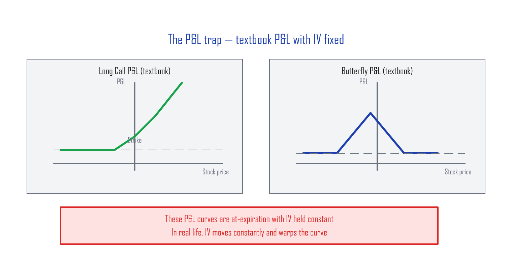
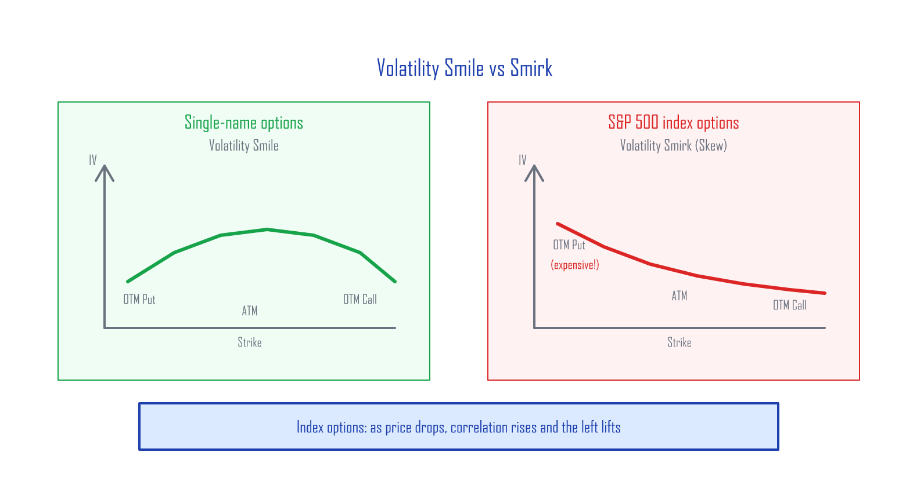
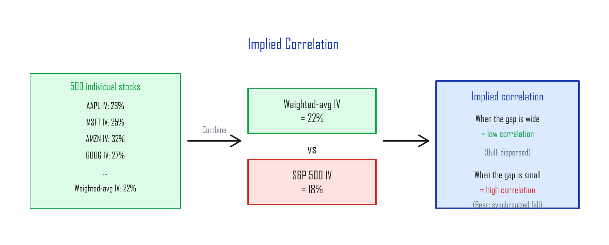
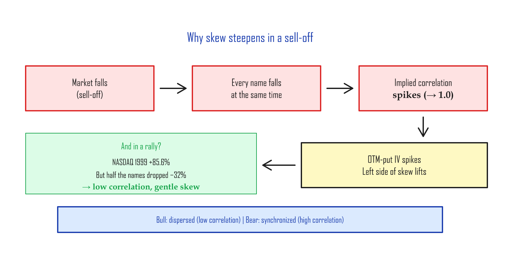

# Volatility Skew — The S&P 500's Smirk

---

## What sets an option's price

The Black–Scholes formula prices an option from six inputs:

1. Spot price
2. Strike price
3. Time to expiration
4. **Implied volatility (IV)**
5. Dividend yield
6. Risk-free rate

Once you've opened a position, (2) and (3) are locked in. (5) and (6) barely move. So in practice, an option's price is driven by **(1) the spot price** and **(4) implied volatility**.

(Strictly, time decay (3) keeps eating into the option as the days pass — but the *day-to-day* swings come from spot and IV.)

---

## The trap of the textbook P&L curve

When you open an options position, you stare at a profit-and-loss (P&L) curve and decide whether the trade is worth it.

Most options traders run the textbook analysis, march into the trade with confidence, and then get blindsided. There are many reasons, but the biggest one is this: those textbook P&L curves are drawn **with IV held constant**.

An option's price moves with both spot and IV. The textbook curve fixes IV at a single number because the human brain has a hard time reading a graph where two variables move at once. So the convention is: lock IV first, understand the P&L, then think about IV moves separately. (When IV rises, options get more expensive. When IV falls, they get cheaper. That second motion is what blows up real-world P&L.)

---

## Volatility Smile vs Volatility Smirk

If you plot implied volatility against strike for an **individual stock's options**, you usually get a "smile" — a U-shape. This is the **volatility smile**.

For **index options**, you get something different: one tail lifts up while the other stays flat. The shape looks like a smirk. This is the **volatility smirk**, also called **volatility skew**.

Two questions follow:

**(A)** The S&P 500 is made of 500 individual stocks, each with its own volatility smile. How does the *index* end up with a smirk instead of a smile?

**(B)** Why does the left side of the smirk steepen even more during sell-offs?

---

## Conditional correlation

Each of the 500 stocks in the S&P 500 has its own IV at a given strike — say, the 25-delta put (a put with strike well below spot, roughly 25% probability of finishing in the money). If you take the **weighted average of every stock's 25-delta-put IV** (weighted by index weight) and compare it to the **S&P 500 index's 25-delta-put IV**, you can see the relationship between single-name IV and index IV. That relationship is called **implied correlation**.

The index's volatility skew exists because the options market **prices in higher correlation as the market falls**. That higher correlation:

- **Amplifies** IV on out-of-the-money (OTM) puts (strikes far below spot)
- **Dampens** IV on out-of-the-money calls

CBOE built an index that tracks the average implied correlation across 50 large-cap S&P 500 names:

---

## Why correlation spikes in a sell-off

There's nothing new about correlation falling in a bull market. In 1999, the NASDAQ rose 85.6% — but nearly half the names in the index actually fell that year, averaging −32%. The index's gain was carried by a handful of mega-cap tech names. The rest of the index was scattered.

> **In bull markets, not everyone goes up together. In bear markets, everyone falls together — holding hands.**

That's why the OTM-put IV on S&P 500 options rises so much more than the OTM-call IV during a sell-off. The smirk's left tail steepens. Traders call this **"skew steepening."**

The harder the drop, the higher the implied correlation, and the steeper the left side of the skew. One-line summary:

> When a tail event hits the market, every name collapses in lockstep (correlation goes to one), IV spikes, and the price of insurance — OTM puts — becomes whatever sellers ask for.

This is exactly the dynamic that makes the cheap, high-efficiency hedge in the next article work.

---

## What skew means in practice

### Why OTM puts are expensive

Flood insurance costs more on a riverfront house than on a hilltop. Index downside insurance (OTM puts) is the same — it's *always* "already expensive," because institutions are constantly buying index puts to hedge their portfolios.

| What to know when buying an OTM put | What it means |
|:------------------------------------|:--------------|
| **Skew premium** | OTM put IV is higher than at-the-money (ATM) IV → puts trade richer than the textbook would say |
| **When skew steepens** | OTM-put IV spikes during a crash → great if you already own them, painful if you're trying to buy |
| **When skew flattens** | After the market settles, OTM-put IV decays fast → late buyers watch their puts lose value |

### The CBOE SKEW Index

CBOE publishes the **SKEW Index**, a single number that quantifies how much extreme downside (tail) risk is priced into S&P 500 options.

| SKEW value | Meaning |
|:-----------|:--------|
| ~100 | Close to a normal distribution, low tail risk |
| ~120 | Moderate tail risk |
| ~140+ | Market pricing in significant probability of an extreme drop |

> You can pull SKEW from Yahoo Finance with the ticker `^SKEW`.

---

## Summary

| Concept | The point |
|:--------|:----------|
| **Volatility Smile** | Single names: roughly symmetric U |
| **Volatility Smirk (Skew)** | Index options: left side (OTM puts) lifts up |
| **Cause** | Correlation jumps in sell-offs → OTM-put IV gets amplified |
| **In practice** | OTM puts are always expensive — and get even more expensive in a crash |
| **Why it matters** | This is the foundation for the 1:2 Put Ratio strategy in the next article |

---

*Next: [Hedging the Wings — Cheap Tail-Risk Insurance](hedging-wings.md)*
