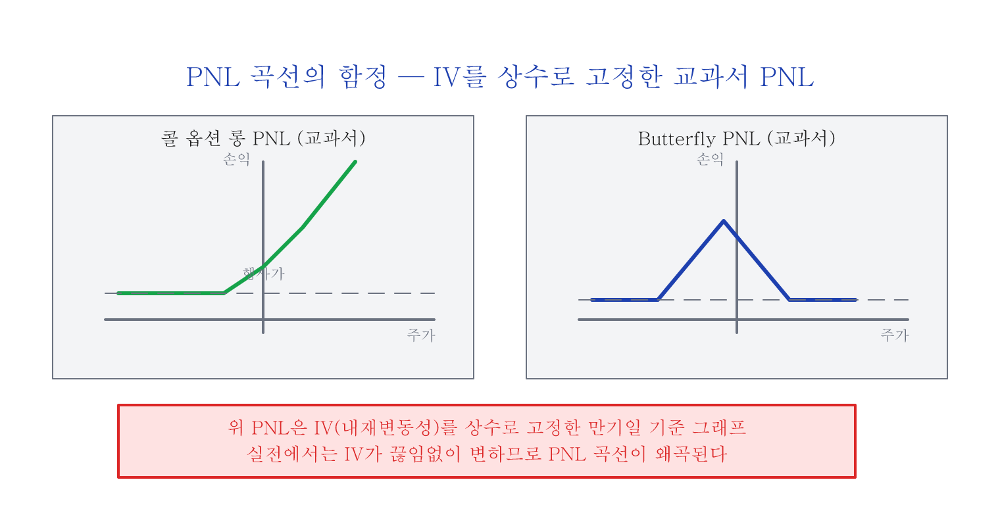
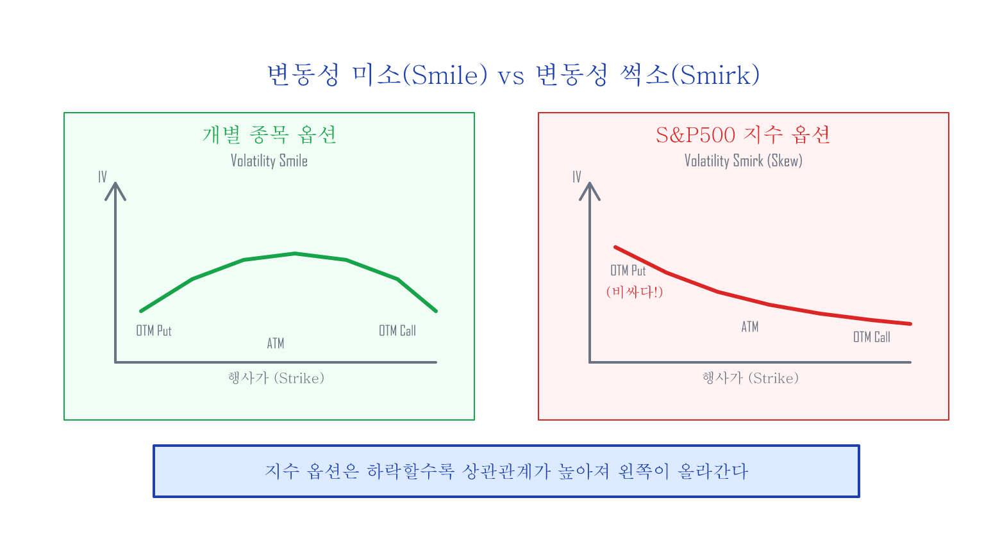
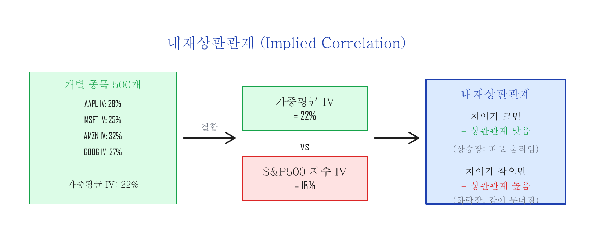
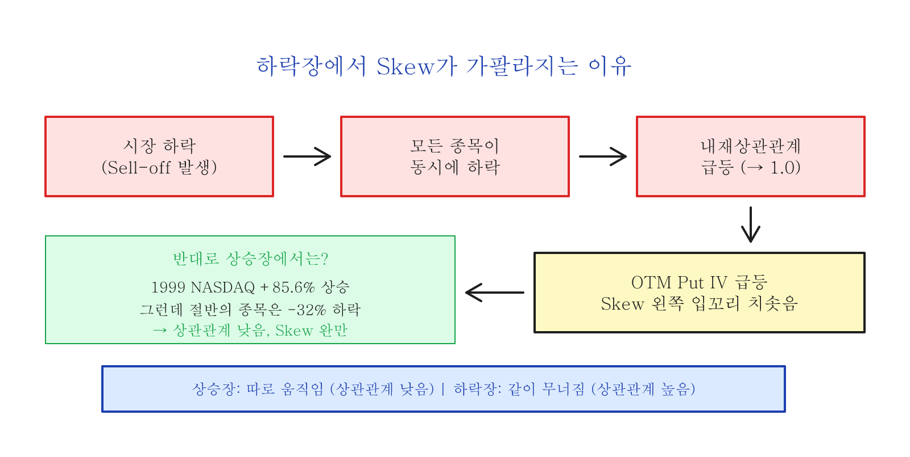

# 변동성 Skew — S&P500 지수 옵션의 썩소

---

## 옵션 가격을 결정하는 것

블랙-숄즈 공식에 따르면 옵션의 가격을 결정하는 6가지 요소는 다음과 같습니다:

1. 주가 (Spot Price)
2. 행사가 (Strike Price)
3. 만기일까지 남은 시간
4. **내재변동성 (Implied Volatility)**
5. 배당률 (Dividend Yield)
6. 무위험이자율 (Risk-Free Rate)

옵션 포지션을 새로 오픈하면, (2) 행사가와 (3) 만기일이 고정됩니다. (5) 배당률과 (6) 무위험이자율은 거의 변경되지 않기 때문에, 옵션의 가격은 실질적으로 **(1) 주가**와 **(4) 내재변동성**으로 결정된다고 생각할 수 있습니다.

(정확히는 시간이 지나면서 (3) 만기일까지 남은 시간이 줄어들기 때문에 이 역시 옵션 가격에 영향을 미칩니다.)

---

## PNL 곡선의 함정

새로운 옵션 포지션을 오픈할 때 우리는 수익/손실(PNL) 곡선을 분석하고 결정합니다.

대부분의 옵션 트레이더들은 처음에 교과서적으로 위와 같은 PNL을 분석하고 자신만만하게 실전에 돌입하지만 생각지도 못한 결과에 크게 좌절하게 됩니다. 여러 가지 이유가 있겠지만 그 중 가장 큰 이유는 위와 같은 PNL들이 모두 내재변동성이 **상수라고 고정**하고 그려졌기 때문입니다.

옵션의 가격은 (1) 주가와 (4) 내재변동성에 의해서 결정되는데, 위의 PNL들은 내재변동성을 상수로 고정한 것입니다. 사람의 두뇌는 두 개의 변수가 동시에 변하는 그래프를 쉽게 이해하기 힘들기 때문에, 먼저 IV를 고정하고 PNL을 이해한 후 IV가 변하는 경우를 따로 따지는 것입니다.

---

## 변동성 미소(Smile) vs 변동성 썩소(Smirk)

일반적으로 **개별 종목 옵션**의 내재변동성을 행사가별로 그래프로 나타내면 "smile" 모양을 형성합니다. 이를 **변동성 미소(Volatility Smile)**라고 부릅니다.

그런데 **지수 옵션**의 경우는 한쪽 꼬리가 위로 들려진 "썩소" 모양을 형성합니다. 이를 **변동성 썩소(Volatility Smirk)** 또는 **변동성 왜곡(Volatility Skew)**이라고 합니다.

두 가지 핵심 질문:

**(A)** S&P500 지수는 500개의 개별 종목으로 구성되어 있고 개별 종목들은 "변동성 미소" 현상을 가지는데, 500개 종목의 합인 지수 옵션은 어떻게 "변동성 미소"가 아닌 "변동성 썩소(왜곡)" 현상이 생기는 걸까?

**(B)** 하락장에서 투매(Sell-off)가 발생할 때 왜 "변동성 썩소"의 왼쪽 입꼬리가 더 가파르게 올라가는 걸까?

---

## 조건부 상관관계 (Conditional Correlation)

S&P500의 500개 개별 종목들은 각각 25 델타 put 옵션의 내재변동성이 다릅니다. **개별 종목 각각의 25 델타 put 옵션 IV를 해당 종목의 지수 가중치로 평균**한 값과 **S&P500 지수의 25 델타 put 옵션 IV**를 비교하면, 개별 종목 IV와 지수 IV 간의 상관관계를 비교할 수 있습니다. 이 관계를 **내재상관관계(Implied Correlation)**라고 합니다.

지수 옵션의 "변동성 왜곡"은 시장이 하락할수록 **더 큰 상관관계(Correlation)를 할당**하기 때문에 생깁니다. 이러한 상관관계의 영향은:
- 외가격(OTM) **put 옵션의 IV를 증폭**시키고
- 외가격(OTM) **call 옵션의 IV를 감소**시킵니다

CBOE는 S&P500을 대표하는 50개 종목의 평균 내재상관관계를 추종하는 지수를 만들었습니다:

---

## 하락장에서 상관관계가 치솟는 이유

상승장에서 내재상관관계가 하락하는 것은 새로운 것이 하나도 없습니다. 1999년 한 해 동안 NASDAQ이 +85.6% 상승할 때, NASDAQ에 속한 거의 절반의 주식들은 오히려 하락하여 평균 -32%를 기록했습니다. 지수 상승은 소수의 대형 기술주들이 이끈 것이었습니다.

> **상승장에서는 모두 다 같이 상승하지 않지만, 하락장에서는 다 같이 손잡고 하락한다.**

이러한 이유로 S&P500 지수 옵션의 외가격(OTM) put 옵션의 IV가 더 많이 상승하는 **"변동성 썩소(왜곡)"** 현상이 발생합니다.

하락의 강도가 세면 셀수록 S&P500의 내재상관관계는 더 높아지며, 변동성 Skew의 왼쪽 입꼬리는 더 가파르게 올라갑니다. 이를 **"Skew가 steepened 되었다"**라고 표현합니다.

한 줄 요약:

> 테일 이벤트로 시장이 폭락할 때는 네 종목 내 종목 할 것 없이 다 같이 한꺼번에 무너지고 (내재상관관계의 동기화), 내재변동성이 크게 증가하면서 보험료인 put 옵션의 가격은 부르는 게 값이 된다.

이 현상은 다음 글에서 소개할 저비용 고효율 헷지 포지션을 합성하는 데 대단히 중요한 역할을 하게 됩니다.

---

## 실전에서 Skew가 의미하는 것

### 왜 OTM Put이 비싼가?

홍수 보험이 평지보다 **강변 집에서 비싼 것**처럼, 지수 하락 보험(OTM put)은 항상 "이미 비싼" 상태입니다. 기관들이 포트폴리오 보호를 위해 끊임없이 지수 put을 사기 때문입니다.

| OTM Put 매수 시 알아야 할 것 | 설명 |
|:--------------------------|:-----|
| **Skew 프리미엄** | OTM put은 ATM 대비 IV가 높음 → 이론가보다 비싸게 거래 |
| **Skew 가팔라질 때** | 폭락 시 OTM put IV가 더 급등 → 기보유자에겐 이익, 신규 매수자에겐 비용 |
| **Skew 되돌림** | 시장 안정 시 OTM put IV가 빠르게 하락 → 뒤늦게 산 put의 가치 급감 |

### Skew를 나타내는 지표: CBOE SKEW Index

CBOE에서는 S&P500 옵션의 테일 리스크 기대치를 수치화한 **SKEW Index**를 발표합니다.

| SKEW 값 | 의미 |
|:--------|:-----|
| ~100 | 정규분포에 가까움, 테일 리스크 낮음 |
| ~120 | 보통 수준의 테일 리스크 |
| ~140+ | 시장이 극단적 하락 가능성을 높게 평가 |

> SKEW Index는 Yahoo Finance에서 `^SKEW`로 확인할 수 있습니다.

---

## 정리

| 개념 | 핵심 |
|:----|:-----|
| **Volatility Smile** | 개별 종목: 양쪽 대칭 |
| **Volatility Smirk (Skew)** | 지수 옵션: 왼쪽(OTM put) 치솟음 |
| **원인** | 하락 시 상관관계 급등 → OTM put IV 증폭 |
| **실전 의미** | OTM put은 항상 비싸고, 폭락 시 더 비싸짐 |
| **활용** | 다음 글(Hedging the Wings)의 1:2 Put Ratio 전략 기반 |

---

*다음 글: [Hedging the Wings — 저비용 테일 리스크 헷지](hedging-wings.md)*
