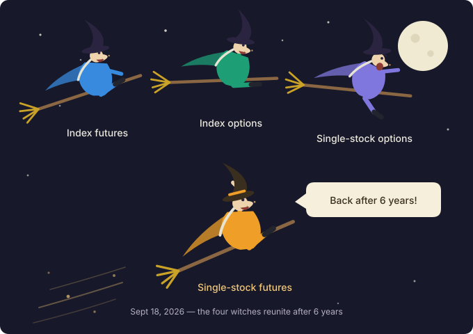

# Quadruple Witching Is Whole Again — Single Stock Futures and the Directional Earnings Play

Do you know what September 18 is? A U.S. expiration day. But this September expiration is a little special. It's the day a name we've been getting wrong for six years finally becomes correct again.

Quadruple witching. Four families of derivatives expiring on the same day. Except, honestly, that phrase has been a lie for the past six years. There was no fourth. The only U.S. venue where you could trade single stock futures quietly shut its doors in 2020.

Nobody much cared. The name stuck out of habit, and reference material would quietly footnote that it amounted to the same thing as triple witching. Then last July, CME brought the product back.



> **What you need to read this**
>
> If options are new to you, [Options Basics](options-basics.md) is a good starting point — but it isn't required. This post explains its terms as they come up.
>
> This is really a *sequel* to [Cost of Leverage in Derivatives](derivatives-leverage-cost.md). We compared five ways to buy the same exposure there. Now there's a **sixth**.

---

## 30-second summary

- U.S. single stock futures (SSFs) came back on July 27, 2026 — **after a six-year absence**. 55 names plus 22 Micro contracts.
- Which makes **September 18, 2026 the first real quadruple witching in six years**.
- Minimum margin is 15%, so **leverage runs about 6.67×**. As an annual rental fee that's roughly 27%.
- **Micro contracts have a 10-share multiplier — $300 of margin gets you started.** The design is aimed squarely at small retail accounts.
- Cheap leverage is not the reason to use these. Deep ITM calls remain far cheaper.
- **A futures price contains no view on "how big a move the market expects."** For an option, that expectation is the whole price.
- Which is why nothing replaces an SSF for a **directional earnings bet**.
- The price you pay is convexity. **A 15% adverse gap wipes out your entire margin.**

---

## 1. The six years when there were only three witches

The four expirations that pile up on witching day:

1. Stock index futures
2. Stock index options
3. Single stock options
4. **Single stock futures**

Number 4 is the one that disappeared. Its name was **OneChicago**, and its last trading day was **September 18, 2020.** The controlling owners decided to close after a strategic review, and every position was closed out that day. Every expiration for the six years that followed was, strictly speaking, **triple witching**.

The arithmetic, to be precise about it: U.S. single stock futures **first listed in November 2002**, traded for **about 18 years**, vanished in September 2020, were **absent for six years**, and returned in July 2026. That first listing was roughly 24 years ago.

| When | What happened |
|---|---|
| 1982 | Shad-Johnson Accord — an outright **listing ban**, out of an SEC/CFTC jurisdictional truce |
| Dec 2000 | Commodity Futures Modernization Act lifts the ban; joint SEC/CFTC oversight |
| Nov 8, 2002 | OneChicago and NQLX both open for trading on the same day |
| Dec 2004 | NQLX shuts down, transfers remaining contracts to OneChicago |
| Sep 18, 2020 | OneChicago ceases trading — **single stock futures vanish from the U.S.** |
| Jul 27, 2026 | **CME relists, solo this time** |
| Sep 18, 2026 | The first real quadruple witching in six years |



Here's the part I find genuinely funny. **Right after** OneChicago closed, the SEC and CFTC cut the minimum margin on unhedged security futures from 20% of notional to **15%**. Effective December 24, 2020.

And the party that petitioned for that change was **OneChicago itself** — back in 2008. CFTC Commissioner Dawn Stump said in her statement on the final rule that the only U.S. exchange to make a long-term effort at building a security futures market had asked for this step twelve years earlier, in 2008, and that she regretted the Commissions hadn't acted sooner.

So: **twelve years of waiting, the exchange closes, and approval arrives three months later.** By the time the rule loosened, there was no U.S. venue left to trade the product on.

The SEC's press release is the sharper detail. It stated the 15% level would apply "if an existing exchange were to resume operations or another exchange were to launch security futures contracts." That other exchange, six years later, is CME.

And 15% is the **exact** number CME's new contracts run on today.

One date coincidence as well. OneChicago's last trading day was September 18, 2020, and the first quadruple witching of the new era is September 18, 2026. Six years apart, same calendar date.

---

## 2. What a single stock future is — a 3-minute explainer

Before the spec tables, what kind of object is this.

### A contract that bets on a stock price without buying the stock

In [Options Basics](options-basics.md) we compared an option to **car insurance** — you pay a premium and you have the right to be compensated if something happens.

A future isn't insurance. It's a **promise**.

"On the third Friday of September, we settle at the value of 100 NVDA shares."

That's the whole contract. Not a right but an obligation, which is why there's no premium to pay. Instead you post **margin** as collateral for keeping the promise.

### No shares actually change hands

CME's new product is **cash settled**. At expiry you don't receive or deliver stock — you settle **the difference in cash** between your entry and the final settlement price.

```
NVDA standard contract = 100 shares
Long at $200 → final settlement $215
Settlement = ($215 − $200) × 100 shares = +$1,500 in cash
```

No brokerage position, no dividends, no voting rights. You're buying the price movement and nothing else.

### 15% margin, 100 shares of exposure

A $200 stock gives a standard contract $20,000 of notional. What you post is 15% of that — $3,000.

```
leverage = $20,000 / $3,000 = 6.67×
```

A $1 move in the stock is $100 per contract. Against $3,000 of margin that's 3.3%.

### Everything you worry about in an option is simply absent

This is the crux. The questions you have to answer before buying an option don't exist here.

| What you weigh with options | SSF |
|---|---|
| Which strike? | none |
| How much time is left (time value)? | none |
| Is IV expensive or cheap? | **none** |
| Is delta 0.3 or 0.7? | **always 1.0** |
| Gamma, vega | none |

"Delta" in that table means *how much your position moves when the stock moves a dollar*. With options it might be 0.3 or 0.7, so it takes calculating. With an SSF it is always 1.0 — the stock goes up a dollar, you make a dollar per share.

**There is exactly one thing to look at: the price.** Up and you make it, down and you lose it, one for one — identical P&L to owning 100 shares. You just funded 15% of it.

### Shorts are symmetric

Long and short are perfectly symmetric. There's nothing to borrow to sell short — you just enter on the sell side. More on that later.

---

## 3. Contract specs

CME announced the plan on February 10, 2026 and launched on July 27. Two sizes.

| Item | Standard SSF | Micro SSF |
|---|---|---|
| Names | 55 | 22 (a subset of the 55) |
| Multiplier | 100 shares × futures price | 10 shares × futures price |
| Minimum tick | 0.01 = **$1.00** | 0.01 = **$0.10** |
| Notional on a $200 stock | $20,000 | $2,000 |
| 15% margin | $3,000 | $300 |
| Block-eligible | Yes (50 contract minimum) | No |
| BTIC / EFP / EFR | Yes | No |

The underlyings are 55 names drawn from the S&P 500, Nasdaq-100 and Russell 1000, including the recently listed **SpaceX**. CME says they carry over $200B in average daily notional volume and, by index weight, cover roughly **55–65%** of the S&P 500 and Nasdaq-100.

Here is what the two sizes share. These are the items to check before you place an order.

| Item | Detail |
|---|---|
| Settlement | **Cash settled** — official **closing price** on the primary listing exchange |
| Trading terminates | **4:00 p.m. ET on the third Friday** of the contract month (3:00 p.m. CT) |
| Listed months | Mar/Jun/Sep/Dec — **only two consecutive quarters** (about six months maximum) |
| Hours | Sun 6:00 p.m. – Fri 5:00 p.m. ET, one hour daily maintenance — **~23 hours** |
| Regulation | **Joint** SEC and CFTC (index futures are CFTC only) |
| Account | **Futures accounts only** for now — FINRA Rule 4210 doesn't apply |
| Minimum margin | **15%** of notional (initial = maintenance), 5% on calendar spreads |
| Position limit | 200,000 contracts (last three trading days of the expiring month) |
| Halts | Halts with the underlying stock, and when ES is lock-limited |

The expiration structure lines up exactly with index futures and stock options. That's what automatically makes September 18 a quadruple witching.

> One subtle difference. Index futures settle to the **Special Opening Quotation (SOQ)** on expiration morning; SSFs settle to the **close**. Same day, different *hour* for the flow.

### Margin is a floor, not a rate

The 15% is only the regulatory minimum. In practice:

- CME computes it under **SPAN**, so a volatile name can require more than 15%.
- Your broker layers **house margin** on top. At 20% your leverage is exactly 5×.
- Initial and maintenance minimums are **both 15%**. There's no cushion between them the way there is on most futures.
- It's measured against current notional, so **as the position gains, the requirement grows with it.**

### Micro contracts are unmistakably aimed at retail

> The difference between standard and Micro isn't only size. **Micro deliberately omits the institutional plumbing.**

A 10-share multiplier isn't just "smaller." The design intent shows up in several places.

- **You can start with $300 of margin** — 15% of $2,000 of notional on a $200 stock.
- The minimum tick is **$0.10** versus $1.00 on the standard. The P&L increment itself is scaled for small accounts.
- **No blocks, and no BTIC/EFP/EFR.** Those are the mechanisms institutions use to move size off-book. Micro doesn't have them. The institutional plumbing was left out on purpose.
- Only **22 of the 55** names got a Micro version.

The circumstantial evidence agrees. As reported by CNBC, Morgan Stanley analyst Michael Cyprys said retail brokers see this listing as the largest growth driver for their retail business this year, with upwards of 35 retail partners aiming to have it live within the first week.

### The full list of 22 Micro names

This one is for reference. Look it up when you need it — skipping it now costs you nothing. Source: CME's Single Stock futures fact card.

| Company | Ticker | Globex code |
|---|---|---|
| Apple | AAPL | XAAPL |
| Advanced Micro Devices | AMD | XAMD0 |
| Amazon | AMZN | XAMZN |
| Broadcom | AVGO | XAVGO |
| Boeing | BA | XBA00 |
| Bank of America | BAC | XBAC0 |
| Cisco Systems | CSCO | XCSCO |
| Alphabet | GOOGL | XGOOG |
| Intel | INTC | XINTC |
| JPMorgan Chase | JPM | XJPM0 |
| Meta | META | XMETA |
| Microsoft | MSFT | XMSFT |
| Micron Technology | MU | XMU00 |
| Newmont | NEM | XNEM0 |
| Netflix | NFLX | XNFLX |
| NVIDIA | NVDA | XNVDA |
| Pfizer | PFE | XPFE0 |
| Palantir Technologies | PLTR | XPLTR |
| SpaceX | SPCX | XSPCX |
| Tesla | TSLA | XTSLA |
| Walmart | WMT | XWMT0 |
| Exxon Mobil | XOM | XXOM0 |

On the code convention: standard contracts take an `S` prefix, BTIC takes `T`, Micro takes `X`. NVDA is `SNVDA` standard and `XNVDA` Micro.

### Who got left out is the more interesting question

Common sense says the **expensive** stocks need Micro contracts most — those are the ones where a 100-share contract gets unwieldy.

The actual selection runs the other way. Look at what's missing:

- **Booking Holdings (BKNG)** — thousands of dollars per share, the single most unwieldy 100-share contract in the suite, and no Micro.
- **Eli Lilly (LLY), Costco (COST), Berkshire Hathaway B (BRKB)** — all high-priced, all absent.

Now look at what made it in. **NVDA, TSLA, PLTR, SPCX, MU, AMD, INTC, NEM.** Palantir and SpaceX appearing on the Micro list is the decisive tell. This isn't selection by share price — it's selection by **retail trading popularity**.

> The criterion for a Micro listing wasn't "this contract is too big to handle." It was **"retail actually trades this name."** Expensive institutional names got standard contracts only; the 10-share version went to the tickers where retail crowds in.

Which looks like a lesson learned from **OneChicago's failure**. The 2002 product had large contract units and narrow access, and retail never showed up. This one launches with 10-share contracts, 23-hour trading, and mass retail broker integration. None of that existed 24 years ago.

---

## 4. The rental fee on leverage — the same formula as ES futures

The formula from the [previous post](derivatives-leverage-cost.md) applies directly. Just add dividends.

```
futures price = spot × exp((risk-free rate − dividend yield) × months to expiry / 12)
```

Take NVDA at $200, r = 4%, dividend yield q ≈ 0, one year out:

```
$200 × exp((0.04 − 0) × 12/12) = $200 × 1.0408 = $208.16

carry per contract = $8.16 × 100 shares = $816
initial margin     = $20,000 × 15% = $3,000
annual rental fee  = $816 / $3,000 = 27.2%/yr
```

### Why ES costs 74% and SSFs cost 27%

ES futures came out at 74%/yr. SSFs come out at 27%. Not because the product is cheaper.

```
carry as % of notional = $816 / $20,000 = 4.08% ≈ the risk-free rate
```

**For any futures contract, carry as a share of notional is roughly the risk-free rate.** The fee against margin is that number times your leverage. ES at 18.87× produces 74%; SSFs are capped at 6.67× by the 15% margin floor, so they produce 27%.

| Method | Leverage | Carry / notional | Annual fee / margin |
|---|---|---|---|
| ES futures (full leverage) | 18.87× | ~3.9% | ~74% |
| **SSF (at margin floor)** | **6.67×** | **~4.1%** | **~27%** |
| Swaps (TQQQ) | 3× | ~3.3% | ~10% |
| Deep ITM call (1yr) | 1.87× | ~0.8% | ~0.8% |

> Same conclusion as last time. **Cut your leverage and the fee falls proportionally.** Post double the margin to run 3.3× and the fee is 13.6%/yr.

### Dividend payers flip the sign

`(r − q)` is what matters. If dividend yield exceeds the risk-free rate, **carry goes negative** — the future trades below spot and a long earns on convergence. Most of the 55 are low-yield tech so it's rare in practice, but it's a per-name number to check.

**Shorts receive the carry** rather than paying it.

### This does not replace a LEAP

Only two consecutive quarters are listed, so your horizon caps at about six months. SSFs can't take the slot where the previous post concluded "long-term holders should use deep ITM LEAPs." **You have to roll every quarter**, paying the spread and accepting a fresh basis each time.

Read this far and SSFs look like a mediocre product. Deep ITM calls are dramatically cheaper over a year, leverage is capped by regulation, and the horizon is six months.

**But there's exactly one place where this instrument is dominant.**

---

## 5. Time cost decays in fundamentally different ways

Before the earnings section, this has to be nailed down. Futures and options both charge you for time. **But the way it drains is completely different.**

To say it in one line up front: **a future's time cost is rent, and an option's time value is ice.**



### A future's time cost is rent

Rent is the same amount this month and next month. And the total is settled when you sign.

A future works exactly like that. Buy a one-year future on a $200 stock and hold it to expiry and $816 drains out — at a uniform rate.

```
with 60 days to expiry, daily cost = $0.02
with  3 days to expiry, daily cost = $0.02   ← identical
```

Sixty days out or three days out, **you pay the same amount per day.** So the total is fixed the moment you enter, and you know your breakeven in advance. It's a cost you can compute.

<details>
<summary>If you want to see the formula</summary>
<pre><code>basis ≈ spot price × (r − q) × T

  r = risk-free rate,  q = dividend yield,  T = time to expiry</code></pre>
<p>T appears to the first power — plain T, not squared or square-rooted —
so the cost is directly proportional to time. That is why the daily
amount is constant and the total is fixed at entry.
$200 × 4% = $8.16 per share per year → $816 on a 100-share contract.</p>
</details>

### An option's time value is ice

Ice melts slowly at first, then disappears all at once. And how big the block was in the first place depends on the weather.

An option's time value has both of those properties.

**First, it melts faster the closer you get.** Halve the remaining time and the time value doesn't halve — 71% of it is still there. Less drains early on. But as expiry approaches, the amount lost per day climbs sharply. Most of it goes in the final days.

**Second, IV sets the size of the block.** IV — implied volatility — is *how big a move the market expects from this stock*. Double it and the time value doubles.

```
IV 30% → time value $7
IV 60% → time value $14   ← same expiry, same stock price, twice the cost
```

So buying an option isn't just about expiry and price. **You have to judge whether IV is expensive right now.** Skipping that judgment doesn't remove it — it just means you overpay.

<details>
<summary>If you want to see the formula</summary>
<pre><code>time value ≈ 0.4 × σ × spot price × √T

  σ = implied volatility (IV),  T = time to expiry</code></pre>
<p>This is the Brenner–Subrahmanyam approximation. Two things fall out of it.</p>
<p>One, T carries a square root. Halve the remaining time and √0.5 = 0.71,
so 71% remains. The daily decay (theta) scales with 1/√T, which climbs
steeply as expiry approaches.</p>
<p>Two, σ multiplies the whole expression. Double the IV and you double the
time value. Volatility sets the size itself.</p>
</details>

### And a futures price has no IV in it

This is the crux of the post.

A futures price is `spot price + interest − dividends`. Nowhere in there is "how big a move the market expects." However the market views this stock, however much IV doubles ahead of an earnings print, the futures price doesn't budge.

An option is the opposite. IV is the variable that sets the price.

So buying a future requires no volatility forecast. Not "requires less" — there is **no exposure to forecast**. That's the premise for the next section.

<details>
<summary>If you want to see them side by side</summary>
<pre><code>futures price = S × exp((r − q)T)     ← no σ anywhere
option price  = f(S, K, T, r, σ)      ← σ is a central variable

  S = spot price,  K = strike,  σ = implied volatility</code></pre>
<p>That σ is absent from the futures formula is the basis for this entire post.</p>
</details>

---

## 6. The directional earnings play — this is where SSFs belong

### An option buyer doesn't get paid for direction alone

Watch how the IV we just covered behaves around an earnings print.

Divide the ATM straddle by the stock price and you get the market's **implied move**.

```
Stock $200, near-term ATM straddle $14
implied move = $14 / $200 = ±7%
```

That $14 comes out of IV. IV is inflated ahead of the print, so the premium is inflated with it — and what it means is **the market has already priced in ±7%.**

So an option buyer isn't betting on direction. They're betting on **whether direction and magnitude together clear the implied move.**

Say the stock reports and rises **+3%**. You called the direction.

```
[Long ATM call]
Entry: 200 call @ $7.00 → $700
After the print, stock at $206
  intrinsic  = $6.00
  time value = ~$0.20 after IV collapse
  option     ≈ $6.20 → $620
P&L = −$80 = about −11%   ← right on direction, still a loss
```

You paid for 7% of movement and got 3%.

### IV crush — the ice disappears in one step

Then the second hit lands.

Before the print, the uncertainty is **concentrated at a single point in time**. Nobody knows what the quarter looks like. So near-term IV runs well above normal. The ice block is large.

The moment the number is public, that uncertainty **resolves**. What was unknown is known. IV reverts to baseline.

```
Just before: IV 60% → time value $7
Just after:  IV 30% → time value $3.5 (same expiry, same stock price)
```

Time value doesn't melt gradually — **half of it is gone at the open.** That's the cliff in the chart above.

So an option buyer at an earnings print has to call **direction, magnitude and IV all at once**.



**Two out of three still loses money.** Right direction with insufficient magnitude is a loss; right direction and magnitude while overpaying on IV cuts the gain.

### A future asks you to get one thing right

Same setup, same +3%.

```
[Long SSF]
Entry $200, margin $3,000
After the print, stock at $206
P&L = $6 × 100 shares = +$600 = +20% on margin
```

One prints −11% and the other +20%. Both called the direction.

Over a few days the carry is a rounding error. **Your breakeven is essentially your entry price.**

| Item | Long ATM call | Long SSF |
|---|---|---|
| Hurdle to clear | **implied move ±7%** | none |
| IV crush exposure | large | **none** |
| Delta | 0.5 (moving) | **1.0 fixed** |
| P&L on +3% | −11% | **+20%** |
| Nature of time cost | driven by IV, accelerating toward expiry | **a constant rate, fixed at entry** |
| Variables you must call | direction + magnitude + IV | **direction** |

> **Futures don't eliminate the cost of time.** They convert it into something *linear, computable, and independent of your volatility forecast.* And around an event where IV inflates and then collapses, that difference flips the sign of your P&L.

### The short side gets one more layer of advantage

**SEC Regulation SHO's locate requirement and price test restrictions do not apply to SSFs.**

The practical headaches of a cash short disappear.

- No hunting for borrow
- No borrow fee that can spike on you
- No recall risk

The borrow cost doesn't vanish — it's **absorbed into the basis instead.** But it's **fixed and transparent at trade time.** Shorting into a print on a name where borrow is expensive or unstable is a materially different proposition.

### And prints come out after the close

SSFs trade roughly 23 hours. Options trade only in regular hours. For any name that reports after the bell, that's a real difference.

---

## 7. The price you pay is convexity

Now be cold about it. The conclusion above is **"optimal for a directional earnings bet"** — not **"safe."**

A long option's maximum loss is the premium, and the payoff curve bends in your favor. **Futures are linear, and a short is theoretically unbounded.** The place that difference surfaces is precisely an earnings gap.

Match the exposure at 100 shares of delta and take a −15% gap.

```
Stock $200 → $170 (−15% overnight gap)

[Long SSF, 1 contract]  margin $3,000
  P&L = −$30 × 100 shares = −$3,000 = entire margin gone

[Long ATM calls, 2 contracts]  premium $1,400 (0.5 delta × 2 = 100 shares equivalent)
  P&L ≈ −$1,400 (capped at the premium)
```

**A 15% adverse gap equals your whole margin.** And 10–15% earnings gaps on individual mega-caps are routine, not tail events. The inflated IV was the market telling you it expected exactly that.



How the two lines part is the whole of this section. The call falls and then stops at the premium; the SSF keeps going.

What to actually manage:

- **Stops don't work across a gap.** You get filled at the gap, not at your stop. Your only real risk control is **position size** — work backwards from the gap you can absorb.
- **Daily settlement.** Variation margin leaves your account in cash every day. You aren't sitting on an unrealized loss.
- **Halt linkage.** If the underlying is halted, the SSF halts. Twenty-three-hour access does *not* guarantee an exit during a genuinely disorderly print.
- **Liquidity.** This is early days. Outside the top few names, overnight books may be thin — watch actual spreads in the 2–6 a.m. window before committing size.
- **Start with Micro.** At $300 of margin, a bad gap is tuition.

### Be precise about which view you have

On the same stock, the right instrument turns on what exactly you think.


SSFs are clean for exactly one case: **"I have a directional view and I want zero exposure to volatility mispricing in either direction."** Everything else is a different bet.

Nothing gives you leverage, zero volatility exposure, and a loss floor **at the same time**. You can bolt a put onto an SSF to create the floor, but you'll be buying that put at the same inflated pre-print IV.

---

## 8. Two more things worth noting

### Taxes — it's futures, but not 60/40

**Single stock futures are specifically excluded from Section 1256** and are taxed under general securities rules. The 60/40 blended treatment on index futures does not carry over.

The statutory basis: IRC §1256(b)(2)(A) provides that a "section 1256 contract" does not include any securities futures contract, or option on one, unless it is a dealer securities futures contract. §1234B governs instead — character follows the underlying property, and gain or loss on a contract *to sell* is treated as short-term capital gain or loss.

The way CME's own FAQ handles this is telling: the question heading mentions 60/40, and the answer only addresses §871(m) withholding for international investors. That latter item is the one that matters in practice for non-residents, and CME handles it through the intermediary/QDD framework in Chapter 9 Rule 990 of its rulebook. The specifics depend on your account type and residency, so settle your own treatment with your accountant before filing.

### What to watch on September 18

It's the first quadruple witching and simultaneously the **first expiration** for this suite.

- **The December roll** — Sep→Dec is the only option. CME's equity convention puts the roll date on the Monday before the third Friday, **September 14**. Whether open interest rolls or simply expires tells you what this product is being used for.
- **Open interest going in** — CME publishes daily aggregate positions. Nvidia or Tesla building OI comparable to their own options would be the surprise.
- **Closing flow** — SSFs settle to the close, index futures to the morning SOQ. Different hours within the same day.

My honest expectation: **there isn't much reason for September 18 to shake the market.** Open interest in a product less than two months old is trivial against SPX options notional. The name becomes accurate before the liquidity becomes meaningful.

Broker availability is worth checking separately. The 35 retail partners in that CNBC report were a target, not a count, and **Micro coverage in particular** varies.

---

## 9. Wrapping up

| Concept | The key point |
|---|---|
| **Quadruple witching** | 2020–2026 was really triple. On 9/18 the name becomes true |
| **What an SSF is** | A cash-settled promise. No strike, no IV, no time value. Delta fixed at 1.0 |
| **The contracts** | 55 standard (100 shares) + 22 Micro (10 shares), six months maximum |
| **Micro** | 10-share multiplier, $300 margin, institutional plumbing removed. Selected by **retail popularity**, not share price |
| **Leverage** | 15% margin → 6.67×. ~27%/yr fee, falling proportionally with leverage |
| **Time cost** | Futures: a constant rate, IV-independent. Options: accelerating, proportional to IV |
| **Best use** | **Directional earnings plays** — no implied-move hurdle, no IV crush exposure |
| **Short advantage** | Reg SHO locate and price test don't apply; borrow cost becomes a fixed basis |
| **The price** | Convexity. A 15% gap is your whole margin. Size is the only control |
| **Wrong tool for** | LEAP replacement, volatility views, medium-term positions that must survive a print |

**The one thing to remember**: at an earnings print an option buyer has to call **direction, magnitude and IV all at once**, and getting two of three right still loses money. A futures price has no IV in it at all, so an SSF asks you to call **direction only**. Nothing else does that job. In exchange there's no floor when you're wrong, so the entire discipline is sizing backwards from the gap you can absorb. **That's what Micro contracts exist for.**

---

*Related: [Cost of Leverage in Derivatives](derivatives-leverage-cost.md) | [Options Basics](options-basics.md) | [Volatility Skew](skew.md)*

### Reference — witching day calendar

| Year | Mar | Jun | Sep | Dec |
|---|---|---|---|---|
| 2026 | 3/20 | 6/18 (Thu) | **9/18** | 12/18 |
| 2027 | 3/19 | 6/17 (Thu) | 9/17 | 12/17 |

When June 19 falls on a Friday or Saturday, the Juneteenth holiday moves expiration up to Thursday.

### Sources and attribution

Contract specifications, margin levels and the name list come from CME Group's
Single Stock futures fact card and FAQ. The OneChicago closure and the margin
rule change come from the Federal Register and public SEC and CFTC documents.
Broker readiness is from CNBC's reporting. The leverage cost comparison figures
are the February 2023 calculations from this blog's
[Cost of Leverage in Derivatives](derivatives-leverage-cost.md).

CME Group, Globex, BTIC, SPAN, CME Direct and ClearPort are trademarks of
CME Group. S&P 500, Nasdaq-100, Russell 1000, and the company names and tickers
in this post are trademarks of their respective owners, used here only to refer
to the products and indices in question.

All diagrams in this post are original work.

### Glossary

- *SSF (Single Stock Futures)* — a futures contract on an individual company's stock
- *Cash settlement* — no physical delivery at expiry; only the difference settles, in cash
- *Implied move* — ATM straddle price ÷ stock price. The move the market has priced into an event
- *IV (implied volatility)* — how big a move the market expects from this stock. The central variable in an option price
- *IV crush* — IV collapsing to baseline right after an event resolves
- *Theta* — the value an option loses per day. Grows as expiry approaches
- *Basis* — the futures price minus the spot price. Goes to zero at expiry, at a constant rate
- *Cost of carry* — the risk-free cost of holding an asset, net of dividends and interest
- *Delta* — how much your position moves when the stock moves a dollar. Always 1.0 for an SSF
- *Convexity* — curvature in the payoff. Long options bend favorably; futures are a straight line
- *SPAN* — CME's portfolio-based margin framework
- *SOQ (Special Opening Quotation)* — the expiration-morning reference price used to settle index futures
- *Regulation SHO* — U.S. short selling rules, including locate requirements and price tests
- *Section 1256* — the U.S. tax classification carrying 60/40 treatment. SSFs are excluded
