# 네마녀의 날이 돌아왔다 — 개별주식선물과 방향성 어닝 플레이

9월 18일이 무슨 날인지 아시나요. 미국 시장 만기일입니다. 그런데 이번 9월 만기는 좀 특별합니다. 6년 동안 우리가 틀리게 불러왔던 이름이 드디어 맞는 이름이 되는 날이거든요.

쿼드러플 위칭. 한국에서는 **네마녀의 날**이라고 부르죠. 네 가지 파생상품 만기가 한날에 겹친다는 뜻입니다. 그런데 솔직히 말하면 지난 6년간 이 표현은 거짓말이었습니다. 네 번째가 없었어요. 미국에서 개별주식선물을 거래할 수 있던 유일한 거래소가 2020년에 조용히 문을 닫았기 때문입니다.

아무도 크게 신경 쓰지 않았습니다. 이름만 관성으로 남았고, 자료들은 각주에 사실상 트리플 위칭과 같다는 취지를 슬쩍 적어두는 정도였죠. 그런데 지난 7월, CME가 이 상품을 다시 꺼냈습니다.


> **이 글을 읽는 데 필요한 것**
>
> 옵션이 처음이라면 [옵션의 기초](options-basics.md)를 먼저 보시면 좋지만, 필수는 아닙니다. 이 글은 나오는 용어를 그때그때 풀어서 씁니다.
>
> 사실 이 글은 [파생상품의 레버리지 사용료](derivatives-leverage-cost.md)의 *속편*입니다. 거기서 같은 노출을 사는 다섯 가지 방법을 비교했는데, 이제 **여섯 번째**가 생겼습니다.

---

## 30초 요약

- 미국 개별주식선물(SSF)이 2026년 7월 27일 **6년 만에 부활**했습니다. 55종목 + 마이크로 22종목.
- 그래서 **2026년 9월 18일이 6년 만의 진짜 네마녀의 날**입니다.
- 최소 증거금 15% → **레버리지 약 6.67배**. 연 사용료로 환산하면 약 27%.
- **마이크로 계약은 승수가 10주입니다. 증거금 $300으로 시작 가능** — 명백히 소액 개인 투자자를 겨냥한 설계입니다.
- 레버리지가 싸서 쓰는 게 아닙니다. Deep ITM 콜이 여전히 훨씬 저렴해요.
- **선물 가격에는 "시장이 얼마나 크게 움직일 거라 보는지"가 안 들어갑니다.** 옵션 가격에는 그게 핵심입니다.
- 그래서 **실적 발표 방향성 베팅**에서는 SSF를 대체할 도구가 없습니다.
- 대가는 컨벡시티입니다. **15% 역방향 갭 = 증거금 전액.**

---

## 1. 마녀가 셋이었던 6년

네마녀의 날에 만기가 겹치는 네 가지는 이렇습니다.

1. 주가지수선물
2. 주가지수옵션
3. 개별주식옵션
4. **개별주식선물**

사라진 4번의 이름은 **OneChicago**입니다. 마지막 거래일은 **2020년 9월 18일.** 지배주주가 전략 검토 끝에 폐쇄를 결정했고, 그날 모든 포지션이 청산됐어요. 그 뒤 6년간의 만기일은 엄밀히 말해 **세마녀의 날**이었습니다.

숫자로 정리하면 이렇습니다. 미국 개별주식선물은 **2002년 11월에 처음 상장**돼 **약 18년간 거래**되다가 2020년 9월에 사라졌고, **6년간 부재**했다가 2026년 7월에 돌아왔습니다. 첫 상장으로부터는 약 24년이 지났어요.

| 시점 | 사건 |
|---|---|
| 1982 | Shad-Johnson 협약 — SEC/CFTC 관할권 정리 과정에서 **상장 금지** |
| 2000.12 | 상품선물현대화법(CFMA)으로 금지 해제, SEC·CFTC 공동 규제 |
| 2002.11.08 | OneChicago와 NQLX가 같은 날 거래 개시 |
| 2004.12 | NQLX 폐쇄, 잔여 계약을 OneChicago로 이관 |
| 2020.09.18 | OneChicago 거래 종료 — **미국 내 개별주식선물 소멸** |
| 2026.07.27 | **CME 단독 재상장** |
| 2026.09.18 | 6년 만의 진짜 네마녀의 날 |



여기서 제일 아이러니한 대목. OneChicago가 문을 닫은 **직후**, SEC와 CFTC는 헤지되지 않은 증권선물의 최소 증거금을 명목가치의 20%에서 **15%로 인하**했습니다. 발효일 2020년 12월 24일.

그런데 이 규칙 변경을 **청원한 당사자가 OneChicago 본인**이었습니다. 그것도 2008년에요. CFTC 커미셔너 Dawn Stump는 최종규칙 성명에서 "미국에서 증권선물 시장을 장기적으로 개척하려 노력한 유일한 거래소가 12년 전인 2008년에 이 조치를 요청했다"며 진작 처리하지 않은 것을 후회한다고 밝혔습니다.

정리하면 이렇습니다. **12년을 기다렸고, 거래소가 문을 닫았고, 3개월 뒤에 승인됐습니다.** 규제가 풀린 시점에 이 상품을 거래할 미국 거래소는 하나도 없었어요.

더 결정적인 건 SEC 보도자료의 문구입니다. 이 규칙이 **"기존 거래소가 영업을 재개하거나 다른 거래소가 증권선물 계약을 상장할 경우"** 15% 수준을 적용하기 위한 것이라고 명시했어요. 6년 뒤에 나타난 그 "다른 거래소"가 CME입니다.

그리고 그 15%가 지금 CME 신상품이 쓰는 **바로 그 기준**입니다.

날짜 우연도 하나. OneChicago의 마지막 거래일이 2020년 9월 18일이고, 새 시대의 첫 네마녀의 날이 2026년 9월 18일입니다. 정확히 6년, 같은 날짜예요.

---

## 2. 개별주식선물이 뭔가 — 3분 설명

스펙표로 바로 들어가기 전에, 이게 무슨 물건인지부터.

### 주식을 사지 않고 주가에 베팅하는 계약

[옵션의 기초](options-basics.md)에서 옵션을 **자동차 보험**에 비유했었죠. 보험료를 내고 사고가 나면 보상을 받는 권리요.

선물은 보험이 아닙니다. **약속**이에요.

"9월 셋째 금요일에, NVDA 100주 값으로 정산합시다."

이게 계약의 전부입니다. 권리가 아니라 의무고, 그래서 프리미엄을 낼 필요가 없습니다. 대신 약속을 지킬 담보로 **증거금**을 걸어둡니다.

### 실제 주식은 오가지 않습니다

이번 CME 상품은 **현금결제**입니다. 만기에 주식을 받거나 넘기는 게 아니라, 진입가와 만기 종가의 **차액만 현금으로 정산**해요.

```
NVDA 표준 계약 = 100주
$200에 롱 진입 → 만기 종가 $215
정산 = ($215 − $200) × 100주 = +$1,500 (현금)
```

주식 계좌도, 배당도, 의결권도 없습니다. 주가 움직임만 사는 겁니다.

### 증거금 15%로 100주 노출

$200 종목의 표준 계약 명목가치는 $20,000입니다. 그런데 넣는 돈은 15%인 $3,000이에요.

```
레버리지 = $20,000 / $3,000 = 6.67배
```

주가가 $1 오르면 계약당 $100 이익. 증거금 $3,000 대비 3.3%입니다.

### 옵션에 있는 것들이 전부 없습니다

이게 핵심입니다. 옵션을 살 때 고민해야 하는 것들이 SSF에는 아예 존재하지 않아요.

| 옵션에서 고민할 것 | SSF |
|---|---|
| 행사가를 어디로? | 없음 |
| 만기까지 얼마나 남았나 (시간가치) | 없음 |
| IV가 비싼가 싼가 | **없음** |
| 델타가 0.3인가 0.7인가 | **항상 1.0** |
| 감마·베가 | 없음 |

표의 "델타"는 *주가가 1달러 오를 때 내 포지션이 얼마 버는지*를 말합니다. 옵션은 이게 0.3일 때도 0.7일 때도 있어서 계산이 필요하지만, SSF는 항상 1.0입니다. 주가가 1달러 오르면 1주당 정확히 1달러 법니다.

**볼 게 가격 하나뿐입니다.** 주가가 오르면 그대로 벌고, 내리면 그대로 잃습니다. 100주를 산 것과 손익이 똑같아요. 다만 돈은 15%만 넣었습니다.

### 숏도 대칭입니다

롱과 숏이 완전히 대칭입니다. 공매도하려고 주식을 빌릴 필요가 없어요. 그냥 매도 진입하면 끝입니다. 이 얘기는 뒤에서 다시 하겠습니다.

---

## 3. 계약 사양

CME는 2026년 2월 10일에 계획을 발표하고 7월 27일에 상장했습니다. 두 사이즈로 나옵니다.

| 항목 | 표준 SSF | 마이크로 SSF |
|---|---|---|
| 종목 수 | 55개 | 22개 (표준의 부분집합) |
| 승수 | 100주 × 선물가격 | 10주 × 선물가격 |
| 최소 호가단위 | 0.01 = **$1.00** | 0.01 = **$0.10** |
| $200 종목 명목가치 | $20,000 | $2,000 |
| 15% 증거금 | $3,000 | $300 |
| 블록거래 | 가능 (최소 50계약) | 불가 |
| BTIC·EFP·EFR | 가능 | 불가 |

기초자산은 S&P 500 · 나스닥100 · 러셀1000에서 뽑은 55종목입니다. 최근 상장한 **SpaceX**도 포함됐어요. CME는 이 55종목이 일평균 명목거래대금 2,000억 달러 이상, 지수 비중 기준으로 S&P 500과 나스닥100의 대략 **55~65%**를 커버한다고 밝혔습니다.

### 마이크로는 명백히 리테일 타겟입니다

> 표준 계약과 마이크로의 차이는 크기만이 아닙니다. **마이크로에서는 기관용 기능이 의도적으로 빠져 있습니다.**

10주 승수라는 게 그냥 "작은 사이즈"가 아니에요. 설계 의도가 여기저기 드러납니다.

- **증거금 $300으로 시작**할 수 있습니다. $200 종목 명목 $2,000의 15%죠.
- 최소 호가단위가 **$0.10**입니다. 표준은 $1.00. 손익 단위 자체가 소액에 맞춰져 있어요.
- **블록거래도, BTIC·EFP·EFR도 안 됩니다.** 이건 기관이 대량 물량을 장외에서 처리하는 기능입니다. 마이크로에는 그게 없어요. 기관용 배관을 일부러 빼놓은 겁니다.
- 55종목 중 **22종목만** 마이크로로 나왔습니다. 리테일이 실제로 이름을 아는 대형주만 골랐다는 뜻이죠.

정황도 맞습니다. CNBC 보도에 따르면 모건스탠리 애널리스트 Michael Cyprys는 리테일 증권사 쪽에서 이번 상장을 올해 리테일 부문 최대 성장 동력으로 보고 있으며, 35개를 넘는 리테일 파트너가 상장 첫 주 안에 취급을 시작하는 것을 목표로 삼았다고 전했습니다.

### 마이크로 22종목 전체 목록

여기는 참조용입니다. 필요할 때 찾아보시면 되고, 지금은 넘어가셔도 글을 읽는 데 지장 없습니다. 출처는 CME Single Stock futures 팩트카드입니다.

| 종목 | 티커 | Globex 코드 |
|---|---|---|
| Apple | AAPL | XAAPL |
| Advanced Micro Devices | AMD | XAMD0 |
| Amazon | AMZN | XAMZN |
| Broadcom | AVGO | XAVGO |
| Boeing | BA | XBA00 |
| Bank of America | BAC | XBAC0 |
| Cisco Systems | CSCO | XCSCO |
| Alphabet | GOOGL | XGOOG |
| Intel | INTC | XINTC |
| JPMorgan Chase | JPM | XJPM0 |
| Meta | META | XMETA |
| Microsoft | MSFT | XMSFT |
| Micron Technology | MU | XMU00 |
| Newmont | NEM | XNEM0 |
| Netflix | NFLX | XNFLX |
| NVIDIA | NVDA | XNVDA |
| Pfizer | PFE | XPFE0 |
| Palantir Technologies | PLTR | XPLTR |
| SpaceX | SPCX | XSPCX |
| Tesla | TSLA | XTSLA |
| Walmart | WMT | XWMT0 |
| Exxon Mobil | XOM | XXOM0 |

코드 체계도 정리하면 표준은 `S` 접두어, BTIC은 `T`, 마이크로는 `X`입니다. 예를 들어 NVDA는 표준 `SNVDA`, 마이크로 `XNVDA`.

### 누가 빠졌는지가 더 흥미롭습니다

마이크로는 55종목 중 22개만 뽑혔습니다. 상식적으로는 **주가가 비싼 종목**에 마이크로가 더 필요할 것 같죠. 100주 계약이 너무 커지니까요.

그런데 실제 선정은 그 반대입니다. 빠진 종목들을 보면:

- **Booking Holdings (BKNG)** — 주당 수천 달러대. 100주 계약이 가장 부담스러운 종목인데 마이크로가 없습니다.
- **Eli Lilly (LLY), Costco (COST), Berkshire Hathaway B (BRKB)** — 전부 고가주. 전부 없습니다.

반면 들어간 종목들을 보면 답이 나옵니다. **NVDA, TSLA, PLTR, SPCX, MU, AMD, INTC, NEM.** 팔란티어와 SpaceX가 마이크로 목록에 있다는 게 결정적인 힌트예요. 이건 주가 기준 선정이 아니라 **리테일 거래 인기도 기준 선정**입니다.

> 마이크로 종목 선정 기준은 "계약이 너무 커서 쪼개야 하는 종목"이 아니라 **"개인 투자자가 실제로 거래하는 종목"**입니다. 고가 기관주는 표준 계약만 두고, 리테일이 몰리는 이름에만 10주 계약을 붙였어요.

그리고 이게 **OneChicago 실패의 학습**처럼 보입니다. 2002년 상품은 계약 단위가 크고 접근 경로가 좁아서 리테일이 붙지 못했어요. 이번에는 10주 계약 + 23시간 거래 + 리테일 증권사 대량 연동으로 시작합니다. 24년 전에는 없던 조건들이죠.

두 사이즈가 공유하는 조건은 아래와 같습니다. 실제로 주문을 넣기 전에 확인해야 하는 항목들입니다.

| 항목 | 내용 |
|---|---|
| 결제 | **현금결제** — 만기일 주요 상장거래소 공식 **종가** |
| 거래 종료 | 만기월 **세 번째 금요일 오후 4시(ET)** = 오후 3시(CT) |
| 상장 월물 | Mar/Jun/Sep/Dec **연속 2개 월물만** (최장 약 6개월) |
| 거래시간 | 일 17:00(CT) ~ 금 16:00(CT), 매일 1시간 정비 — **약 23시간** |
| 규제 | SEC·CFTC **공동** (지수선물은 CFTC 단독) |
| 계좌 | 현재 **선물계좌만** — FINRA Rule 4210 미적용 |
| 최소 증거금 | 명목가치의 **15%** (개시 = 유지), 캘린더 스프레드 5% |
| 포지션 한도 | 20만 계약 (만기월 마지막 3거래일 적용) |
| 거래정지 | 기초주식 정지 시 연동 정지, ES 가격제한 시에도 정지 |

만기 구조가 지수선물·주식옵션과 정확히 겹칩니다. 그래서 9월 18일이 자동으로 네마녀의 날이 되는 거예요.

> 미묘한 차이 하나. 지수선물은 만기일 **아침 특별기준가(SOQ)**로 결제되는데, SSF는 **종가**로 결제됩니다. 같은 날이지만 물량이 몰리는 *시각*이 다릅니다.

### 증거금은 하한선입니다

15%는 규제 최소치일 뿐이에요. 실제로는:

- CME가 **SPAN**으로 산출하므로 변동성 큰 종목은 15%를 넘길 수 있습니다.
- 증권사가 그 위에 **하우스 증거금**을 얹습니다. 20%면 레버리지는 정확히 5배가 됩니다.
- 개시증거금과 유지증거금 최소치가 **모두 15%**입니다. 일반 선물처럼 여유 구간이 없어요.
- 명목가치 기준이라 **포지션이 이익이 나면 요구 증거금도 함께 커집니다.**

---

## 4. 레버리지 사용료 — ES 선물과 똑같은 공식

[지난 글](derivatives-leverage-cost.md#1-e-mini-sp-500-es)의 공식이 그대로 적용됩니다. 배당만 하나 붙어요.

```
선물가격 = 현물가격 × exp((무위험이자율 − 배당수익률) × 만기까지 개월수 / 12)
```

NVDA를 $200, r = 4%, 배당수익률 q ≈ 0으로 잡고 1년 기준:

```
$200 × exp((0.04 − 0) × 12/12) = $200 × 1.0408 = $208.16

계약당 캐리    = $8.16 × 100주 = $816
거래증거금     = $20,000 × 15% = $3,000
연 사용료      = $816 / $3,000 = 연 27.2%
```

### 왜 ES는 74%인데 SSF는 27%인가

ES 선물이 연 74%였던 걸 기억하실 겁니다. SSF는 27%. 상품이 저렴해서가 아니에요.

```
명목가치 대비 캐리 = $816 / $20,000 = 4.08% ≈ 무위험이자율
```

**모든 선물의 명목 대비 캐리는 대략 무위험이자율입니다.** 증거금 대비 사용료는 거기에 레버리지 배수를 곱한 값이에요. ES가 18.87배라 74%, SSF는 15% 증거금 규제 때문에 6.67배에 갇혀 있어서 27%가 나옵니다.

| 방법 | 레버리지 | 명목 대비 캐리 | 증거금 대비 연 사용료 |
|---|---|---|---|
| ES 선물 (풀 레버리지) | 18.87× | ~3.9% | ~74% |
| **SSF (증거금 하한)** | **6.67×** | **~4.1%** | **~27%** |
| 스왑 (TQQQ) | 3× | ~3.3% | ~10% |
| Deep ITM 콜 (1년) | 1.87× | ~0.8% | ~0.8% |

*표의 ES·TQQQ·Deep ITM 값은 전편의 2023년 2월 금리 환경 기준 계산값입니다. 금리가 바뀌면 절대 수치는 달라지지만, 레버리지에 비례하는 상대 구조는 그대로입니다.*

> 결론은 지난 글과 같습니다. **레버리지를 줄이면 사용료도 비례해서 줄어듭니다.** 증거금을 두 배 넣어 3.3배로 쓰면 연 13.6%예요.

### 배당주는 부호가 뒤집힙니다

`(r − q)`가 핵심입니다. 배당수익률이 무위험이자율보다 높으면 **캐리가 음수**가 되고, 선물이 현물보다 싸게 거래되면서 롱이 오히려 수렴 이익을 봅니다. 55종목 대부분이 저배당 기술주라 실전에서는 드물지만 종목별로 확인할 값이에요.

**숏은 캐리를 받습니다.** 지불하는 게 아니라요.

### LEAP 대체는 안 됩니다

연속 2개 월물만 상장되니 최장 약 6개월입니다. 지난 글에서 "장기 투자자는 Deep ITM LEAP"이라고 결론 냈던 자리를 SSF가 가져갈 수는 없어요. **분기마다 롤해야 하고**, 롤마다 스프레드를 내고 새 베이시스를 받아들여야 합니다.

여기까지 보면 SSF는 어중간한 상품처럼 보입니다. 장기로는 Deep ITM 콜이 압도적으로 싸고, 레버리지는 규제로 묶여 있고, 6개월밖에 못 가죠.

**그런데 딱 한 자리에서 이 상품이 압도적입니다.**

---

## 5. 시간비용이 녹는 방식이 근본적으로 다르다

실적 플레이 얘기로 들어가기 전에 이것부터 짚어야 합니다. 선물과 옵션 모두 시간이 지나면 돈이 빠집니다. **그런데 빠지는 방식이 완전히 달라요.**

한 문장으로 미리 말하면 이렇습니다. **선물의 시간비용은 월세고, 옵션의 시간가치는 얼음입니다.**



### 선물의 시간비용은 월세입니다

월세는 이번 달이나 다음 달이나 같은 금액이 나갑니다. 계약할 때 총액도 이미 정해져 있죠.

선물이 정확히 그렇습니다. $200 종목의 1년 만기 선물을 사서 만기까지 들고 있으면 총 $816이 빠지는데, 이게 균일한 속도로 나갑니다.

```
만기 60일 남았을 때 하루치 = $0.02
만기  3일 남았을 때 하루치 = $0.02   ← 똑같음
```

만기가 60일 남았든 3일 남았든 **하루에 내는 돈이 같습니다.** 그래서 계약하는 순간 "만기까지 총 얼마"가 확정되고, 손익분기점을 미리 알 수 있어요. 계산이 되는 비용입니다.

<details>
<summary>수식으로 확인하고 싶다면</summary>
<pre><code>베이시스 ≈ 현물가격 × (r − q) × T

  r = 무위험이자율,  q = 배당수익률,  T = 만기까지 남은 기간</code></pre>
<p>T가 1차항(제곱이나 제곱근이 아닌 그냥 T)이므로 시간에 정비례합니다.
그래서 하루치가 일정하고, 총액이 진입 시점에 확정됩니다.
$200 × 4% = 연 $8.16/주 → 100주 계약이면 $816.</p>
</details>

### 옵션의 시간가치는 얼음입니다

얼음은 처음엔 천천히 녹다가 마지막에 순식간에 사라집니다. 그리고 애초에 얼음 덩어리가 얼마나 큰지는 날씨가 정하죠.

옵션의 시간가치가 이 두 가지를 다 갖고 있습니다.

**첫째, 뒤로 갈수록 빨리 녹습니다.** 남은 기간이 절반으로 줄어도 시간가치는 절반이 아니라 71%가 남습니다. 앞쪽에서는 덜 녹는다는 뜻이에요. 대신 만기가 가까워지면 하루에 빠지는 금액이 급격히 커집니다. 마지막 며칠에 몰아서 녹습니다.

**둘째, 얼음 크기를 IV가 정합니다.** 여기서 IV(내재변동성)는 *시장이 이 종목이 앞으로 얼마나 크게 움직일 거라 보는지*입니다. 이게 두 배면 시간가치도 두 배예요.

```
IV 30% → 시간가치 $7
IV 60% → 시간가치 $14   ← 같은 만기, 같은 주가인데 두 배
```

그래서 옵션을 살 때는 만기와 주가만 봐서는 안 됩니다. **"지금 IV가 비싼가"를 판단해야 해요.** 판단을 안 하는 게 아니라, 못 하면 그냥 비싸게 사는 겁니다.

<details>
<summary>수식으로 확인하고 싶다면</summary>
<pre><code>시간가치 ≈ 0.4 × σ × 현물가격 × √T

  σ = 내재변동성(IV),  T = 만기까지 남은 기간</code></pre>
<p>Brenner–Subrahmanyam 근사입니다. 두 가지를 읽을 수 있습니다.</p>
<p>하나, T에 제곱근이 붙어 있습니다. 남은 기간이 절반이면 √0.5 = 0.71,
즉 71%가 남습니다. 하루치 소멸(세타)은 1/√T 에 비례하므로
만기에 가까워질수록 급격히 커집니다.</p>
<p>둘, σ가 곱해져 있습니다. IV가 두 배면 시간가치도 두 배입니다.
크기 자체를 변동성이 정합니다.</p>
</details>

### 그리고 선물 가격에는 IV가 안 들어갑니다

이게 이 글의 핵심입니다.

선물 가격은 `현물가격 + 이자 − 배당`으로 결정됩니다. 여기 어디에도 "시장이 얼마나 크게 움직일 거라 보는지"가 없어요. 시장이 이 종목을 어떻게 보든, 실적 발표를 앞두고 IV가 두 배가 되든, 선물 가격은 한 발도 움직이지 않습니다.

옵션은 반대입니다. IV가 가격을 결정하는 핵심 변수예요.

그래서 선물을 사면 변동성 예측이 필요 없습니다. 필요 없는 게 아니라 **애초에 노출이 없습니다.** 이게 다음 섹션의 전제입니다.

<details>
<summary>수식으로 나란히 보고 싶다면</summary>
<pre><code>선물가격 = S × exp((r − q)T)     ← σ가 등장하지 않음
옵션가격 = f(S, K, T, r, σ)       ← σ가 핵심 변수

  S = 현물가격,  K = 행사가,  σ = 내재변동성</code></pre>
<p>선물 가격 공식에 σ가 아예 없다는 것이 이 글 전체의 근거입니다.</p>
</details>

---

## 6. 방향성 어닝 플레이 — 여기가 SSF의 자리

### 옵션 프리미엄에는 "예상 가격"이 녹아 있습니다

앞에서 본 IV가 실적 발표에서 어떻게 작동하는지 봅시다.

ATM 스트래들 가격을 주가로 나누면 시장이 반영한 **예상 변동폭**이 나옵니다.

```
주가 $200, 근월 ATM 스트래들 $14
예상 변동폭 = $14 / $200 = ±7%
```

이 $14가 IV에서 나온 숫자입니다. 발표 전에 IV가 부풀어 있으니 프리미엄도 부풀어 있어요. 그리고 그게 의미하는 건 **"시장은 이미 ±7%를 가격에 넣어뒀다"**는 겁니다.

그래서 옵션 매수자는 방향에 베팅하는 게 아닙니다. **"방향과 폭이 예상 변동폭을 넘는지"**에 베팅하는 거예요.

발표 후 실제로 **+3%** 올랐다고 해보죠. 방향은 맞혔습니다.

```
[ATM 콜 매수]
진입: 200 콜 @ $7.00 → $700
발표 후 주가 $206
  내재가치 = $6.00
  시간가치 = IV 붕괴로 ~$0.20
  옵션가치 ≈ $6.20 → $620
손익 = −$80 = 약 −11%   ← 방향 맞혔는데 손실
```

7% 움직임 값을 내고 3%를 받았습니다.

### IV 붕괴 — 얼음이 한 번에 사라집니다

여기에 두 번째 타격이 겹칩니다.

발표 전에는 불확실성이 **한 시점에 집중**되어 있습니다. 이번 분기 실적이 어떻게 나올지 아무도 모르니까요. 그래서 근월 IV가 평상시보다 크게 올라갑니다. 얼음이 커지는 겁니다.

숫자가 공개되는 순간, 그 불확실성이 **해소**됩니다. 몰랐던 게 알려진 거죠. IV가 평상 수준으로 되돌아갑니다.

```
발표 직전: IV 60% → 시간가치 $7
발표 직후: IV 30% → 시간가치 $3.5 (같은 만기, 같은 주가인데)
```

시간가치가 서서히 녹는 게 아니라 **개장 직후 한 번에** 절반이 사라집니다. 앞의 그래프에서 절벽처럼 떨어지는 그 부분이 이거예요.

정리하면 옵션 매수자는 실적 발표에서 **방향과 폭과 IV, 셋을 동시에 맞혀야** 합니다.


**셋 중 둘만 맞혀도 손실이 납니다.** 방향을 맞히고 폭이 못 미치면 손실, 방향과 폭을 맞혀도 IV를 비싸게 샀으면 이익이 깎여요.

### 선물은 방향 하나만 맞히면 됩니다

같은 상황, 같은 +3%.

```
[SSF 롱]
진입 $200, 증거금 $3,000
발표 후 주가 $206
손익 = $6 × 100주 = +$600 = 증거금 대비 +20%
```

한쪽은 −11%, 한쪽은 **+20%**입니다. 방향은 둘 다 맞혔는데요.

며칠짜리 홀딩이라면 캐리는 반올림 오차입니다. **손익분기점이 진입가와 거의 같아요.**

| 항목 | ATM 콜 매수 | SSF 롱 |
|---|---|---|
| 넘어야 할 허들 | **예상 변동폭 ±7%** | 없음 |
| IV 붕괴 노출 | 큼 | **없음** |
| 델타 | 0.5 (변동) | **1.0 고정** |
| +3% 시 손익 | −11% | **+20%** |
| 시간비용 성격 | IV에 좌우되고, 뒤로 갈수록 가속 | **일정한 속도, 진입 시 확정** |
| 맞혀야 할 변수 | 방향 + 폭 + IV | **방향** |

> **선물이 시간비용을 없애는 게 아닙니다.** 시간비용을 *선형이고 계산 가능하며 변동성 예측과 독립적인 값*으로 바꿔줍니다. 그리고 IV가 부풀었다 붕괴하는 이벤트에서는 이 차이가 손익의 부호를 바꿉니다.

### 공매도 방향은 한 겹 더 유리합니다

**SEC Regulation SHO의 locate 요건과 가격 제한이 SSF에는 적용되지 않습니다.**

현물 공매도의 골칫거리들이 사라집니다.

- 대차 물량 확보 문제 없음
- 급등하는 대차 수수료 없음
- 리콜 리스크 없음

대차 비용이 사라지는 건 아니고 **베이시스에 반영되는 형태로 바뀝니다.** 대신 진입 시점에 **확정되고 투명해요.** 실적 발표에 숏으로 붙을 때, 대차가 비싸거나 불안정한 종목이라면 리스크 구조 자체가 달라지는 얘기입니다.

### 그리고 발표는 장 마감 후에 나옵니다

SSF는 약 23시간 거래됩니다. 옵션은 정규장에만 열립니다. 실적이 마감 후에 나오는 종목이라면 이 차이가 실질적입니다.

---

## 7. 대가는 컨벡시티입니다

여기서 냉정해야 합니다. 위 결론은 **"방향성 어닝 플레이에 최적"**이지 **"안전하다"**가 아닙니다.

옵션 매수의 최대 손실은 프리미엄이고 손익 곡선이 유리한 방향으로 휩니다. **선물은 선형이고, 숏은 이론상 무한입니다.** 그리고 이 차이가 드러나는 지점이 정확히 실적 갭이에요.

같은 100주 델타로 맞춰 −15% 갭을 맞아 봅시다.

```
주가 $200 → $170 (−15% 오버나이트 갭)

[SSF 롱 1계약]  증거금 $3,000
  손익 = −$30 × 100주 = −$3,000 = 증거금 100% 소멸

[ATM 콜 2계약]  프리미엄 $1,400 (델타 0.5 × 2 = 100주 상당)
  손익 ≈ −$1,400 (최대 손실이 프리미엄으로 제한)
```

**15% 역방향 갭이 증거금 전액입니다.** 개별 대형주의 10~15% 실적 갭은 예외적 사건이 아니라 일상이에요. 그리고 IV가 부풀어 있었다는 건 시장이 그런 갭을 예상했다는 뜻입니다.



두 선이 갈라지는 방식이 이 절의 전부입니다. 콜은 아래로 가다가 프리미엄에서 멈추고, SSF는 계속 내려갑니다.

실전에서 챙길 것들:

- **손절은 갭을 건너 작동하지 않습니다.** 지정가에 체결되는 게 아니라 갭 가격에 체결돼요. 실질적 리스크 관리 수단은 **포지션 사이즈**뿐입니다. 감당할 수 있는 갭 폭에서 역산해서 사이즈를 정하세요.
- **일일 정산.** 매일 변동증거금이 현금으로 나갑니다. 미실현 손실로 버티는 게 아니에요.
- **거래정지 연동.** 기초주식이 정지되면 SSF도 정지됩니다. 23시간 거래가 혼란스러운 발표 상황에서의 탈출을 *보장하지 않아요.*
- **유동성.** 상장 초기입니다. 상위 몇 종목 외에는 새벽 호가가 얇을 수 있어요. 규모를 넣기 전에 새벽 2~6시 실제 스프레드를 확인해 보세요.
- **마이크로로 시작하세요.** 증거금 $300이면 갭을 맞아도 학습비 수준입니다.

### 뷰를 정확히 구분해야 합니다

같은 종목을 놓고도 "내 생각이 정확히 무엇인가"에 따라 맞는 도구가 갈립니다.



SSF가 깔끔한 건 **"방향 뷰가 있고, 변동성 미스프라이싱 노출을 양방향 모두 0으로 만들고 싶다"** 한 가지 경우입니다. 나머지는 다른 베팅이에요.

레버리지와 무(無)변동성 노출과 손실 하한을 **동시에** 주는 상품은 없습니다. SSF에 풋을 붙여 하한을 만들 수는 있지만, 그 풋도 발표 전 부풀어 있는 IV로 사야 합니다.

---

## 8. 짚어둘 것 둘

### 세금 — 선물인데 60/40이 아닙니다

**개별주식선물은 Section 1256에서 명시적으로 제외**되고 일반 증권 규정에 따라 과세됩니다. 지수선물의 60/40 혼합세율 혜택이 넘어오지 않아요.

법조문 근거는 이렇습니다. IRC §1256(b)(2)(A)는 "증권선물계약 및 그에 대한 옵션은 딜러 증권선물계약이 아닌 한 Section 1256 계약에 포함되지 않는다"고 규정합니다. 대신 §1234B가 적용되어, 손익의 성격은 기초자산에 준하고 **매도 계약의 경우 단기 자본손익으로 취급**됩니다.

CME 자체 FAQ가 이 부분을 다루는 방식이 시사적입니다. 질문 제목에는 60/40을 언급하는데 답변은 국제투자자 §871(m) 원천징수 얘기만 합니다. 비거주자에게 실질적으로 중요한 항목이 후자고, CME는 규정집 Chapter 9 Rule 990의 중개기관·QDD 체계로 처리합니다. 구체적인 적용은 계좌 유형과 거주지에 따라 달라집니다. 신고 전에 회계사와 확인하세요.

### 9월 18일에 볼 것

첫 네마녀의 날이면서 동시에 이 상품군의 **첫 만기**입니다.

- **12월물 롤** — Sep→Dec가 유일한 선택지. CME 주식상품 롤 관행상 롤 기준일은 세 번째 금요일 직전 월요일인 **9월 14일**입니다. 미결제약정이 이월되는지 소멸하는지가 이 상품의 성격을 말해줍니다.
- **미결제약정 규모** — CME가 일별 총 포지션을 공개합니다. Nvidia나 Tesla에서 해당 종목 옵션과 견줄 OI가 쌓였다면 그게 놀라운 쪽이에요.
- **종가 물량** — SSF는 종가, 지수선물은 아침 SOQ. 같은 날 안에서 집중 시각이 다릅니다.

솔직한 전망은 이렇습니다. **9월 18일에 시장이 크게 흔들릴 이유는 별로 없습니다.** 상장 두 달도 안 된 상품의 미결제약정은 SPX 옵션 명목가치 앞에서 미미해요. 이름이 다시 정확해지는 시점이 유동성이 의미를 갖는 시점보다 앞섭니다.

증권사 보급률은 확인이 필요합니다. 위 CNBC 보도의 35개 리테일 파트너는 목표치였을 뿐이므로, **특히 마이크로 계약 취급 여부는 따로 확인**하셔야 합니다.

---

## 9. 정리

| 개념 | 핵심 |
|---|---|
| **네마녀의 날** | 2020~2026은 사실 세마녀. 9/18에 이름이 사실이 됨 |
| **SSF란** | 현금결제 약속. 행사가·IV·시간가치 없음. 델타 1.0 고정 |
| **계약** | 표준 55종목(100주) + 마이크로 22종목(10주), 최장 6개월 |
| **마이크로** | 승수 10주, 증거금 $300, 기관용 기능(블록·BTIC) 제외. 종목 선정도 고가주가 아니라 **리테일 인기주** 기준 |
| **레버리지** | 증거금 15% → 6.67배. 연 사용료 ~27%, 레버리지 줄이면 비례 감소 |
| **시간비용** | 선물은 일정한 속도·IV 무관, 옵션은 가속·IV에 비례 |
| **최적 용도** | **방향성 어닝 플레이** — 예상 변동폭 허들 0, IV 붕괴 노출 0 |
| **숏 이점** | Reg SHO locate·가격제한 미적용, 대차 비용이 확정 베이시스로 |
| **대가** | 컨벡시티. 15% 갭 = 증거금 전액. 사이즈가 유일한 통제 수단 |
| **부적합** | LEAP 대체, 변동성 뷰, 발표를 걸치고 버텨야 하는 중기 포지션 |

**기억할 한 가지**: 실적 발표에서 옵션 매수자는 **방향·폭·IV 세 가지를 동시에** 맞혀야 하고, 셋 중 둘만 맞히면 방향이 맞았는데도 손실을 봅니다. 선물 가격에는 IV가 아예 들어가지 않으니, SSF는 **방향 하나만** 맞히면 됩니다. 이걸 대체할 도구가 없어요. 대신 틀렸을 때 바닥이 없으니, 감당할 수 있는 갭 폭에서 사이즈를 역산하는 게 전부입니다. **마이크로 계약이 존재하는 이유가 그겁니다.**

---

*관련: [파생상품의 레버리지 사용료 — 같은 3배라도 비용은 천차만별](derivatives-leverage-cost.md) | [옵션의 기초](options-basics.md) | [변동성 Skew](skew.md)*

### 참고 — 네마녀의 날 일정

| 연도 | 3월 | 6월 | 9월 | 12월 |
|---|---|---|---|---|
| 2026 | 3.20 | 6.18 (목) | **9.18** | 12.18 |
| 2027 | 3.19 | 6.17 (목) | 9.17 | 12.17 |

6월 19일이 금요일이거나 토요일이면 준틴스(Juneteenth) 휴장으로 만기가 목요일로 당겨집니다.

### 출처와 표기

계약 사양·증거금·종목 명단은 CME Group의 Single Stock futures 팩트카드와 FAQ를,
OneChicago 종료와 증거금 규칙 변경은 Federal Register 및 SEC·CFTC 공개 문서를,
증권사 동향은 CNBC 보도를 근거로 했습니다. 레버리지 비용 비교 수치는 이 블로그의
[파생상품의 레버리지 사용료](derivatives-leverage-cost.md)
글에서 계산한 2023년 2월 기준값입니다.

CME Group, Globex, BTIC, SPAN, CME Direct, ClearPort는 CME Group의 상표이며,
S&P 500, Nasdaq-100, Russell 1000 및 본문에 등장하는 회사명·티커는 각 권리자의
상표입니다. 이 글은 해당 상품과 지수를 지칭할 목적으로만 사용했습니다.

본문 그림은 모두 직접 제작한 것입니다.

### 용어 설명

- *SSF (Single Stock Futures)* — 개별 종목 주식을 기초자산으로 하는 선물계약
- *현금결제* — 만기에 실물 인수도 없이 차액만 현금으로 정산
- *예상 변동폭 (Implied Move)* — ATM 스트래들 가격 ÷ 주가. 시장이 이벤트에 반영한 움직임 폭
- *IV (내재변동성)* — 시장이 이 종목이 앞으로 얼마나 크게 움직일 거라 보는지. 옵션 가격의 핵심 변수
- *IV 붕괴 (IV Crush)* — 이벤트 해소 직후 IV가 평상 수준으로 급락하는 현상
- *세타 (Theta)* — 시간이 하루 지날 때 옵션이 잃는 가치. 만기가 가까워질수록 커진다
- *베이시스 (Basis)* — 선물가격에서 현물가격을 뺀 값. 만기에 0이 되고, 줄어드는 속도가 일정하다
- *Cost of Carry* — 자산 보유의 무위험 비용 (배당·이자 차감 후)
- *델타 (Delta)* — 주가가 1달러 움직일 때 내 포지션이 움직이는 금액. SSF는 항상 1.0
- *컨벡시티 (Convexity)* — 손익 곡선의 휘어짐. 옵션 매수는 유리한 방향으로 휘고, 선물은 직선
- *SPAN* — CME의 포트폴리오 기반 증거금 산출 체계
- *SOQ (Special Opening Quotation)* — 지수선물 만기 결제용 만기일 아침 특별기준가
- *Regulation SHO* — 미국 공매도 규제. locate 요건과 가격 제한 포함
- *Section 1256* — 미국 세법상 60/40 혼합세율 적용 계약 분류. SSF는 제외
