# From Stereo to Grasp — How a Robot Learns to See a Part

> **Robot Vision · Part 1 of 2.** This one is about how the robot *sees*. Part 2, [Frames & Transforms](frames-transforms.md), is about how it turns that into *where to grab*.

I learned this the hard way. I started where most of us do — photographing a part by hand and drawing a box around it, image after image, in a labelling tool. Then I spent weeks fighting the results: depth maps full of holes on the shiny metal, a model that worked under one set of lights and fell apart under the next, and — once — a gripper that drove straight into the part because a single bad depth reading told it to.

Then I watched a webinar called [*Picking the Impossible Parts*](https://www.youtube.com/watch?v=Zl_KhE1_9SM), and it uncovered my eyes. The problem had never been my effort. It was that **you can't get this kind of training data from the real world at all** — so the whole approach has to change. This is the walkthrough I wish someone had handed me on day one.

Step back, and the timing makes sense. The first wave of AI *generated* — text and images, like ChatGPT. The second learned to *act* — reasoning and using tools, like Claude. The third is **physical AI**: that same intelligence moving into robots that see and move in the real world. This is a look at how that third wave actually runs on a factory floor.

The whole pipeline answers exactly one question:

> **Where is the part in 3D, and how is it turned?**

Answer that precisely enough and a robot can pick the part up. Let me show you how three pre-trained AI models, chained one after another, get there — and why simulation is the trick that makes it all possible.

---

## In 30 seconds

- A robot picks a part by answering one question: **where is it, and how is it rotated** — six numbers.
- The old way was to train a custom model **per part**, which took weeks each and needed hand-labelled photos.
- The new way chains **three "foundation models"** you *prompt* instead of train: **FoundationStereo** (how far?), **Segment Anything / SAM 2** (which pixels?), **FoundationPose** (where & how turned?). Then a planner moves the arm.
- They work on parts they've **never seen** (zero-shot) because they were trained on **enormous simulated datasets** with the lighting and clutter randomized.
- Simulation is the unlock: in a simulator the computer already knows the perfect answer for every pixel, so **labels are free** and no real robot has to move to collect them.
- The whole thing runs **locally, offline**, on a small on-cell computer — no cloud.

---

## First, the hard part — why this was impossible until recently

Almost every wall I hit traces back to one root cause: **you cannot get labelled training data from the real world** at the scale and safety a factory needs. Here are the four walls, and the one idea that knocks all of them down.

### 1. There's no training data on the web

A chatbot learned from the whole internet. But there is **no "internet of robots picking parts out of bins."** That data simply doesn't exist online — you can't download what nobody ever posted.

*→ Solved by simulation:* you generate the scenes yourself.

### 2. Hand-labelling is impractical — and unsafe

Even once you have images, the answer has to be labelled to a **fraction of a millimetre and a degree** — the exact depth of every pixel, the exact orientation of the part. Nobody produces that by clicking around photos. And gathering real examples means running a **live robot arm near people and parts**: physical risk, plus slow and costly trial and error.

*→ Solved by simulation:* the renderer already knows the perfect answer for every pixel, so the labels come for free and no real arm has to move.

### 3. Plant lighting is poor — and always changing

Factory light is dim, uneven, and inconsistent: glare off metal, dark corners, changes from shift to shift and day to night, sunlight through an open door. A model trained under one lighting **overfits** and collapses when the light changes.

*→ Solved by domain randomization:* training varies the lighting so wildly that the model stops caring — lights on, lights off, even sunlight.

### 4. The cell is often air-gapped

Factory floors frequently have limited or no internet, for security and reliability. Cloud AI isn't an option; everything has to run **on a local computer, offline.**

*→ Solved by running locally:* the models are small and optimized enough to run on an on-cell computer — no cloud.

The unlock is the same for all four — **generate the data in simulation** (labels free, everything randomizable), then run the trained models locally.

---

## The pipeline at a glance — four questions, four boxes

Each box takes the output of the one above it. Depth feeds the mask step; depth *and* mask feed the pose step. Miss one, and the robot is guessing.

---

## Step 1 · FoundationStereo — how far away is everything?

**The ask:** turn a left/right photo pair into a *depth map* — every pixel's value is how many metres away it is.

A single flat photo has no depth. **Two** photos from slightly different positions do — the same way a nearby finger seems to *jump* when you switch which eye you look through, while a far wall barely moves. That jump is called **disparity**, and it's the raw ingredient for depth.

Here's the catch that ruined weeks of my life. Classic stereo matching needs **visible texture** to line the two photos up. A shiny chrome part looks the same everywhere, so the matcher finds nothing to grab onto — and leaves **holes exactly where the part is.** The one place you needed depth is the one place you don't get it.

**FoundationStereo** is a *learned* model. On top of matching the two photos, it also reads single-image cues — shading, perspective, the way surfaces curve — so it fills in **clean geometry even on blank, shiny surfaces.** No infrared projector, no special rig. The chrome part that classic stereo left as a black hole now has clean depth, and the robot can finally see its 3D shape.

The technical version

Classic stereo builds a <strong>cost volume</strong> — a scorecard of how well each point in the left image matches each point in the right. On a textureless surface every match scores the same, so the result is garbage. The matching algorithm most systems use is called <strong>SGM (Semi-Global Matching)</strong>, and the failure is in the <em>algorithm</em>, not the camera — RealSense, OAK-D, any on-chip stereo hits the same holes. A better camera doesn't fix a bad-algorithm problem.

The old workaround was an <strong>infrared projector</strong> that paints fake texture onto the scene. It works in a lab, but the pattern scatters off shiny parts under factory light — holes again. FoundationStereo fuses in single-image (monocular) depth cues so a blank surface still gets sensible geometry, and needs no projector. (Its paper was a CVPR 2025 best-paper nomination.)

---

## Step 2 · Segment Anything (SAM 2) — which pixels are the part?

**The ask:** draw an exact outline around *just* the part, separating it from the holder, the bin, and everything else.

The next step has to be told **which object** to work on. A mask is how you say it: "the part is *these* pixels — ignore the rest."

**SAM** (Segment Anything) is two things at once. It's **promptable** — you give it a hint, like clicking a point on the part or dragging a box around it. And it's **zero-shot** — it works on objects it has never trained on. One click on the part gives you a crisp outline of it, and the holder and fixture are left out.

The practical facts

SAM 2 (from Meta) is Apache-2.0 licensed and tiny — 39–224 MB across four sizes — so it runs comfortably on an edge box, even an 8 GB one. Because it's zero-shot and takes a click or a box, it replaces per-part-trained detectors and kills the "label thousands of images per part" cost.

SAM has no text input on its own. If you want to prompt with the <em>word</em> "part," you chain a grounding model (GroundingDINO or Florence-2) that turns text into a box first, then let SAM turn the box into a mask. That combination is called <strong>Grounded-SAM</strong>.

---

## Step 3 · FoundationPose — where exactly is it, and how is it turned?

**The ask:** the full **6-DoF pose** — position (x, y, z) *and* orientation (roll, pitch, yaw). All six numbers.

Position alone tells the robot where to reach, not how to hold its gripper. A part lying flat needs a different grasp than the same part on its side. **"6-DoF"** — six degrees of freedom — is just the six numbers that fully pin down how a rigid object sits in space.

FoundationPose is given the part's **CAD model** — the exact 3D drawing. Then it does something wonderfully brute-force: it **guesses** hundreds of possible poses, **renders** what each one would look like through the camera, **compares** each render to the real photo (colour *and* depth), keeps the closest, and **refines** it. Out comes "the part is at (x, y, z), rotated like *this*" — exactly what the robot needs to line up.

Because it reads the shape from the CAD file at run time, it's **zero-shot too**: a brand-new part just needs its CAD file — no retraining. Adding a new part number is loading a file, not launching a training run.

How it actually works inside

FoundationPose is a <strong>render-and-compare</strong> method. It places the CAD model at hundreds of candidate poses and renders each one; a <strong>refine network</strong> nudges every candidate to line up better with the real RGB + depth; and a <strong>score network</strong> — trained to answer "which of these two is the better fit?" — ranks them and picks the winner.

There's a second, sneaky use. After the robot grasps the part, the part shifts a little in the gripper. The robot takes another photo <em>in-hand</em> and re-runs FoundationPose, so it knows exactly how it's holding the part — which is what lets it <em>place</em> the part precisely (say, into an insertion test), not just pick it up.

---

## Step 4 · The robot acts — how do I reach it, safely?

The pose from Step 3 is in the **camera's** point of view. To actually move, the robot:

1. **Transforms** the pose into its own base frame — a one-time setup called hand-eye calibration. (That's the whole subject of [Part 2](frames-transforms.md).)
2. Picks a **grasp** that was taught once against the CAD model.
3. **Plans a collision-free path** — using the depth from Step 1 as its map of what to avoid.
4. **Moves** and picks.

Notice what just happened: the **clean depth from Step 1** turns out to matter for *safety*, not only for finding the part. A path planner is only as safe as the obstacle map you give it — and that map is the point cloud from Step 1.

The numbers behind the motion

A common planner, <strong>RRT*</strong>, approximates the whole robot as a few hundred spheres and routes them around a collision map built from the Step-1 point cloud; NVIDIA's GPU planner <strong>cuMotion</strong> does the same job on the GPU. Perception runs in roughly <strong>2–6 seconds</strong> — but it happens <em>while the arm is placing the previous part</em>, so cycle time is limited by robot motion, not by vision. And all of it runs locally on the controller.

---

## Where this grows next — toward NVIDIA Isaac

The three models above are part of NVIDIA's **Isaac** robot platform. The easiest way to hold it in your head is four layers, each answering a different question.

- **Isaac Sim — *trains* the models.** A photoreal, physics-accurate simulator. It renders millions of scenes with randomized lighting, backgrounds, and clutter — and already knows the perfect depth and pose of every pixel, so the labels are free. This is where FoundationStereo and FoundationPose were trained, which is *why* they're zero-shot and lighting-robust.
- **Isaac ROS — *runs* the models.** A GPU-accelerated ROS 2 package suite that runs this exact pipeline on a small edge computer at the cell.
- **Isaac Lab — *teaches* new skills.** An open framework where robots learn *motions* in simulation (reinforcement and imitation learning). The step beyond perception: not just "see the part" but "learn how to manipulate it."
- **Isaac GR00T — the frontier.** Vision-language-action foundation models for generalist robots — the same "prompt, don't train" idea taken all the way to whole-robot behaviour.

Our Stereo → SAM → Pose pipeline lives in the first two boxes.

Why simulation was the real unlock

All four factory walls fall in one place — the simulator — because the renderer already knows the perfect answer for every pixel. The scale it took: FoundationPose was trained on about <strong>678,000 scenes</strong>, FoundationStereo on roughly <strong>1,000,000 synthetic stereo pairs</strong>, every image rendered with domain randomization (lighting, surface finish, and clutter varied on every single frame). That one trick buys <em>both</em> zero-shot generality <em>and</em> the lighting-robustness a factory floor needs.

---

## A realistic path, on the hardware most of us have

You don't start at the frontier. You crawl, then walk, then run.

- **Start here — offline, on saved frames.** Run SAM 2, then FoundationStereo, on captured images of the part, on a small edge computer. Prove the depth comes out clean where it used to be full of holes. No ROS needed yet.
- **Next — real-time on Isaac ROS.** Wrap the models as a live GPU graph on the edge computer, so the pipeline runs on the cell instead of in a notebook.
- **Later — learned control on Isaac Lab.** Train manipulation policies in simulation and deploy them. This is the phase that needs bigger hardware.

---

## The whole story, one line per step

| Step | Model | Question | In → Out |
|---|---|---|---|
| 1 | **FoundationStereo** | How far is everything? | left + right images → depth |
| 2 | **SAM 2** | Which pixels are the part? | image + one click → mask |
| 3 | **FoundationPose** | Where, and how turned? | depth + mask + CAD → 6-DoF pose |
| 4 | **RRT\* / cuMotion** | How do I reach it safely? | pose + point cloud → path |

**The one thing to remember:** foundation models swap *training* for *prompting* — a click, a CAD file — and still work on parts they've never seen, because they learned from enormous *simulated* datasets with the lighting and clutter randomized. That single shift is what turned "impossible parts" into a Tuesday.

Next: the part's pose comes out in the *camera's* point of view, but the robot lives in its *own*. [Part 2 — Frames & Transforms](frames-transforms.md) is how it translates one into the other.

---

*Related: [Frames & Transforms — How a Robot Knows Where to Grab](frames-transforms.md)*

### Sources & trademarks

Based on the Vention webinar [*Picking the Impossible Parts*](https://www.youtube.com/watch?v=Zl_KhE1_9SM). Model behaviour, training-set sizes, and package names follow NVIDIA's and Meta's public documentation and the respective model papers (FoundationStereo, FoundationPose, Segment Anything). Figures are approximate and current as of the sources at time of writing.

NVIDIA Isaac (Isaac Sim, Isaac ROS, Isaac Lab, Isaac GR00T, Omniverse, Jetson, cuMotion), FoundationStereo, FoundationPose, Meta Segment Anything (SAM), Vention, Intel RealSense, Luxonis, and Roboflow are trademarks of their respective owners, used here for identification only. All diagrams are original.

### Glossary

- *Foundation model* — a large model pre-trained on a huge dataset that generalizes to new inputs without task-specific retraining. Here: FoundationStereo, SAM 2, FoundationPose.
- *Zero-shot* — works on objects or scenes it never saw in training. You *prompt* it (a click, a CAD file) instead of training it.
- *Disparity* — how far a point shifts between the left and right photo. Larger shift = nearer.
- *Depth map* — an image where each pixel's value is its distance from the camera.
- *Mask / segmentation* — a cut-out marking which pixels belong to a chosen object.
- *6-DoF pose* — six degrees of freedom: position (x, y, z) plus orientation (roll, pitch, yaw).
- *CAD model* — the exact 3D drawing of the part, used as the "known shape" for pose.
- *Domain randomization* — varying lighting, finish, and clutter across training images so the model stops depending on any one look.
- *Point cloud* — a 3D scatter of points reconstructed from depth; used as the obstacle map for planning.
- *ROS 2* — the common robotics middleware; Isaac ROS is a GPU-accelerated set of ROS 2 packages.
