# 스테레오에서 집기까지 — 로봇은 부품을 어떻게 보는가

> **로봇 비전(robot vision) · 2부작 중 1부.** 이 글은 로봇이 어떻게 *보는지*에 대한 이야기입니다. 그렇게 본 것을 *어디를 잡을지*로 바꾸는 이야기는 2부 [좌표계와 변환](frames-transforms.md)에서 이어집니다.

저는 이걸 몸으로 배웠어요. 다들 그렇듯 처음엔 손으로 시작했습니다. 부품을 사진 찍고, 라벨링 도구에서 한 장 한 장 네모를 그리고… 그러고는 몇 주를 결과와 씨름했죠. 반짝이는 금속 위에서는 깊이 지도가 구멍투성이로 나왔고, 한 조명에서 멀쩡하던 모델이 조명만 바뀌면 와르르 무너졌어요. 한번은 깊이 값 하나가 잘못 찍히는 바람에 그리퍼가 부품을 그대로 들이받은 적도 있습니다.

그러다 *Picking the Impossible Parts(불가능한 부품 집기)*라는 웨비나를 보게 됐는데, 그게 제 눈을 번쩍 뜨게 해줬어요. 문제는 제 노력이 부족해서가 아니었습니다. 애초에 이런 학습 데이터는 현실에서 구할 수 있는 게 아니었던 거죠. 그러니 접근법 자체를 갈아엎어야 했던 겁니다. 이 글은 그때 누군가 곁에서 딱 짚어줬으면 싶었던 바로 그 이야기예요.

이 파이프라인 전체가 답하려는 질문은 딱 하나입니다.

> **부품이 3D 공간 어디에 있고, 어떻게 돌아가 있는가?**

이걸 충분히 정밀하게 답할 수만 있으면 로봇은 부품을 집습니다. 미리 학습된 AI 모델 세 개를 줄줄이 이어 붙여 여기까지 가는 길, 그리고 그 전부를 가능하게 만든 열쇠인 시뮬레이션 이야기를 풀어볼게요.

---

## 30초 요약

- 로봇이 부품을 집으려면 결국 이 하나에 답하면 됩니다. **어디에 있고, 어떻게 돌아가 있나** — 숫자 여섯 개.
- 예전 방식은 **부품마다** 전용 모델을 따로 학습시키는 것이었어요. 하나에 몇 주씩, 손으로 라벨링한 사진이 잔뜩 필요했죠.
- 요즘은 학습이 아니라 *프롬프트(prompt)*로 부리는 **파운데이션 모델(foundation model) 세 개**를 이어 붙입니다. **FoundationStereo**(얼마나 먼가?), **Segment Anything / SAM 2**(어느 픽셀인가?), **FoundationPose**(어디에, 어떻게 돌아가 있나?). 그다음 경로 계획기가 팔을 움직여요.
- 이 모델들은 **처음 보는** 부품에서도 통합니다(제로샷, zero-shot). 조명과 잡동사니를 마구 뒤섞은 **거대한 시뮬레이션 데이터**로 학습됐거든요.
- 열쇠가 바로 그 시뮬레이션이에요. 시뮬레이터 안에서는 컴퓨터가 픽셀마다 정답을 이미 알고 있으니 **라벨이 공짜**고, 데이터를 모으겠다고 진짜 로봇을 돌릴 일도 없습니다.
- 게다가 이 전부가 **로컬에서, 인터넷 없이**, 셀에 붙은 작은 컴퓨터 안에서 돕니다. 클라우드가 필요 없어요.

---

## 먼저, 가장 어려운 부분 — 왜 최근까지 안 됐나

제가 부딪힌 벽들은 파고들면 결국 한 가지로 모입니다. **현실에서는 라벨링된 학습 데이터를 구할 수 없다** — 적어도 공장이 요구하는 규모와 안전 수준으로는요. 그 벽이 넷인데, 놀랍게도 하나의 아이디어가 넷을 한꺼번에 무너뜨립니다.

### 1. 웹에는 이런 데이터가 없다

챗봇은 인터넷 전체를 읽고 배웠죠. 그런데 **"로봇이 통에서 부품 집는 장면 모음" 같은 인터넷은 없습니다.** 그런 데이터는 온라인에 존재하질 않아요. 아무도 올린 적 없는 걸 내려받을 수는 없으니까요.

*→ 시뮬레이션이 해결:* 장면을 우리가 직접 만들어냅니다.

### 2. 손 라벨링은 비현실적이고, 위험하다

사진이 있어도 문제입니다. 정답을 **밀리미터, 각도 단위 그 아래까지** 정확히 라벨링해야 하거든요. 픽셀 하나하나의 깊이, 부품의 정확한 방향까지요. 사진을 클릭해가며 그 수준을 만들어낼 사람은 없습니다. 게다가 실제 예시를 모으려면 **사람과 부품 옆에서 진짜 로봇 팔을 움직여야** 해요. 물리적으로 위험한 데다, 느리고 돈도 많이 드는 시행착오고요.

*→ 시뮬레이션이 해결:* 렌더러는 픽셀마다 정답을 이미 알고 있으니 라벨이 공짜로 딸려 나오고, 진짜 팔은 손가락 하나 까딱할 필요가 없습니다.

### 3. 공장 조명은 나쁘고, 계속 바뀐다

현장 조명은 어둡고, 얼룩덜룩하고, 그때그때 달라요. 금속에 반사되는 빛, 어두운 구석, 교대와 밤낮에 따라 달라지는 밝기, 열린 문으로 들이치는 햇빛까지. 한 가지 조명에서 배운 모델은 그 조명에 **과하게 맞춰져(overfit)** 버려서, 빛이 바뀌는 순간 무너집니다.

*→ 도메인 랜덤화(domain randomization)가 해결:* 학습할 때 조명을 하도 극단적으로 바꿔놔서, 모델이 조명 따위 아예 신경 쓰지 않게 만듭니다. 불을 켜든 끄든, 햇빛이 들든 상관없이요.

### 4. 셀은 대개 외부망과 끊겨 있다

공장은 보안과 안정성 때문에 인터넷이 제한적이거나 아예 없는 경우가 많습니다. 클라우드 AI는 애초에 선택지가 아니에요. 전부 **로컬 컴퓨터에서, 오프라인으로** 돌아가야 합니다.

*→ 로컬 실행이 해결:* 모델이 셀에 붙은 컴퓨터에서 돌 만큼 작고 가볍게 최적화돼 있습니다. 클라우드가 필요 없어요.

네 벽의 해법이 결국 하나로 모이죠. 현실 데이터를 모으는 대신, 라벨이 공짜고 뭐든 마음대로 뒤섞을 수 있는 **시뮬레이션에서 만들어낸 뒤**, 학습된 모델을 로컬에서 돌리는 겁니다.

---

## 파이프라인 한눈에 보기 — 질문 넷, 상자 넷

각 상자는 바로 위 상자가 내놓은 결과를 받아 씁니다. 깊이는 마스크(mask) 단계로, 깊이와 마스크는 함께 포즈(pose) 단계로 넘어가요. 하나라도 빠지면 로봇은 그냥 찍는 거나 다름없습니다.

---

## 1단계 · FoundationStereo — 모든 게 얼마나 먼가

**할 일:** 좌·우 사진 한 쌍을 *깊이 지도(depth map)*로 바꾸기. 픽셀마다 그 값이 카메라에서 몇 미터인지 알려주는 그림이죠.

평평한 사진 한 장에는 깊이가 없습니다. 그런데 살짝 다른 위치에서 찍은 **두 장**에는 있어요. 한쪽 눈씩 번갈아 감아 보면 가까운 손가락은 크게 *휙* 움직이는데 먼 벽은 거의 안 움직이잖아요? 딱 그 원리입니다. 그 움직인 정도를 **시차(disparity)**라고 부르고, 이게 깊이의 원재료예요.

여기서 제 몇 주를 통째로 날려먹은 함정이 등장합니다. 고전적인 스테레오(stereo) 정합은 두 사진을 맞추려면 **눈에 보이는 무늬**가 필요해요. 그런데 반짝이는 크롬 부품은 어딜 봐도 똑같이 생겨서 잡을 단서가 없습니다. 그 결과 **하필 부품이 있는 자리에만 구멍**이 뻥 뚫려요. 깊이가 가장 절실한 딱 그 자리에서만 깊이가 안 나오는 셈이죠.

**FoundationStereo**는 여기서 다릅니다. 학습된 모델이라, 두 사진을 맞추는 것에 더해 한 장에서 읽어낼 수 있는 단서 — 음영, 원근, 표면이 휘는 결 — 까지 함께 봐요. 그래서 **텅 비고 번들거리는 표면 위에서도 깨끗한 형상을 채워 넣습니다.** 적외선 프로젝터도, 특별한 장비도 필요 없고요. 고전 방식이 검은 구멍으로 남겨둔 크롬 부품이 이제 또렷한 깊이를 갖고, 로봇이 드디어 그 3D 형태를 "보게" 됩니다.

조금 더 기술적으로

고전 스테레오는 <strong>코스트 볼륨(cost volume)</strong>이라는 걸 만듭니다. 왼쪽 이미지의 각 점이 오른쪽 이미지의 각 점과 얼마나 잘 맞는지 매긴 점수표예요. 무늬 없는 표면에서는 어느 짝이나 점수가 똑같이 나와서 결과가 엉망이 됩니다. 대부분이 쓰는 정합 알고리즘이 <strong>SGM(Semi-Global Matching)</strong>인데, 문제는 카메라가 아니라 이 <em>알고리즘</em>에 있어요. RealSense든 OAK-D든, 온칩 스테레오라면 죄다 같은 구멍을 냅니다. 알고리즘이 문제인 걸 좋은 카메라로 풀 수는 없죠.

옛날 우회책은 가짜 무늬를 장면에 뿌리는 <strong>적외선 프로젝터</strong>였습니다. 실험실에선 통하지만, 그 패턴이 공장 조명 아래 번들거리는 부품에 산란돼 다시 구멍이 생겨요. FoundationStereo는 한 장에서 얻는 깊이 단서를 함께 녹여 빈 표면에도 그럴듯한 형상을 만들고, 프로젝터가 아예 필요 없습니다. (관련 논문은 CVPR 2025 최우수 논문 후보에 올랐어요.)

---

## 2단계 · Segment Anything(SAM 2) — 어느 픽셀이 부품인가

**할 일:** *부품만* 콕 집어 외곽선을 따고, 홀더·통·나머지 전부와 떼어놓기.

다음 단계에는 **어떤 물체**를 다뤄야 하는지 알려줘야 합니다. 그 지시를 담는 게 마스크(mask)예요. "부품은 *이* 픽셀들이야, 나머지는 신경 꺼"라고 말해주는 거죠.

**SAM**(Segment Anything)은 두 가지가 동시에 됩니다. 우선 **프롬프트(prompt)로 지시**할 수 있어요. 부품 위 한 점을 콕 찍거나 네모를 씌우는 식으로요. 그리고 **제로샷(zero-shot)**입니다. 학습한 적 없는 물체에서도 통해요. 부품 위를 한 번 클릭하면 그 부품의 또렷한 외곽선이 나오고, 홀더와 지그는 알아서 빠집니다.

실무에서 알아둘 것

SAM 2(메타 제작)는 Apache-2.0 라이선스에 덩치도 작아요. 네 가지 크기로 39~224MB라, 8GB짜리 엣지 컴퓨터에서도 무리 없이 돕니다. 제로샷인 데다 클릭이나 네모만 받으면 되니, 부품마다 따로 학습시키던 검출기를 통째로 대체하면서 "부품당 사진 수천 장 라벨링" 비용을 날려버려요.

SAM 자체에는 텍스트 입력이 없습니다. "부품"이라는 <em>단어</em>로 지시하고 싶다면, 텍스트를 네모로 바꿔주는 그라운딩 모델(GroundingDINO나 Florence-2)을 앞에 붙인 뒤 SAM이 그 네모를 마스크로 바꾸게 하면 돼요. 이 조합을 <strong>Grounded-SAM</strong>이라고 부릅니다.

---

## 3단계 · FoundationPose — 정확히 어디에, 어떻게 돌아가 있나

**할 일:** 완전한 **6-DoF 포즈(pose)** 구하기. 위치(x, y, z)*와* 방향(roll, pitch, yaw), 숫자 여섯 개 전부요.

위치만 알면 로봇은 어디로 손을 뻗을지는 알아도 그리퍼를 어떻게 기울일지는 모릅니다. 눕혀 있는 부품과 옆으로 선 같은 부품은 잡는 법이 다르니까요. **"6-DoF(자유도 여섯)"**는 강체가 공간에 어떻게 놓였는지를 빈틈없이 못 박는 숫자 여섯 개일 뿐입니다.

FoundationPose에는 부품의 **CAD 모델**, 그러니까 정확한 3D 도면을 줍니다. 그러면 이 친구는 꽤 무식하지만 영리한 방법을 써요. 가능한 포즈를 **수백 개 찍어 보고**, 각각이 카메라에 어떻게 비칠지 **렌더링(render)**한 뒤, 실제 사진(색깔과 깊이 둘 다)과 **대조**해서 가장 가까운 걸 남기고, 다시 **다듬습니다.** 그렇게 "부품은 (x, y, z)에 있고 *이렇게* 돌아가 있어"라는 답이 나와요. 로봇이 자세를 맞추는 데 딱 필요한 정보죠.

CAD 파일에서 형태를 그때그때 읽어오기 때문에 이것도 **제로샷**입니다. 완전히 새로운 부품이어도 CAD 파일만 있으면 돼요. 재학습이 필요 없죠. 새 품번을 추가하는 게 학습을 다시 돌리는 게 아니라 파일 하나 얹는 일입니다.

안에서 실제로 벌어지는 일

FoundationPose는 <strong>렌더-앤-컴페어(render-and-compare)</strong> 방식입니다. CAD 모델을 후보 포즈 수백 개에 놓고 각각 렌더링한 뒤, <strong>정제 네트워크(refine network)</strong>가 후보 하나하나를 실제 색·깊이에 더 잘 맞게 밀어주고, "둘 중 어느 쪽이 더 잘 맞아?"에 답하도록 학습된 <strong>점수 네트워크(score network)</strong>가 순위를 매겨 승자를 고릅니다.

은근히 쓸모 있는 두 번째 용도도 있어요. 로봇이 부품을 집고 나면 그리퍼 안에서 부품이 살짝 틀어지거든요. 이때 <em>손에 쥔 채로</em> 한 장 더 찍어 FoundationPose를 다시 돌리면, 지금 부품을 정확히 어떻게 쥐고 있는지 알게 됩니다. 덕분에 그냥 집는 걸 넘어 (삽입 검사 같은 데) 정밀하게 <em>내려놓는</em> 것까지 가능해져요.

---

## 4단계 · 로봇이 움직인다 — 어떻게 안전하게 도달하나

3단계에서 나온 포즈는 아직 **카메라의** 시점입니다. 실제로 움직이려면 로봇은 이렇게 해요.

1. 그 포즈를 자기 **베이스 좌표계**로 **변환**합니다. 딱 한 번만 해두는 핸드-아이 캘리브레이션(hand-eye calibration)이라는 설정이에요. (이게 [2부](frames-transforms.md)의 주제 전부입니다.)
2. CAD 모델에 대고 미리 가르쳐 둔 **집는 방식**을 고릅니다.
3. **충돌 없는 경로를 계획**합니다. 1단계에서 얻은 깊이를 "피해야 할 것들의 지도"로 쓰면서요.
4. **움직여서** 집습니다.

여기서 재미있는 반전이 있어요. **1단계의 깨끗한 깊이**가 부품을 찾는 데만 쓰이는 게 아니라 *안전*에도 결정적이라는 겁니다. 경로 계획기는 자기가 받은 장애물 지도만큼만 안전한데, 그 지도가 바로 1단계에서 나온 점군(point cloud)이거든요.

움직임 뒤에 숨은 숫자

흔히 쓰는 계획기 <strong>RRT*</strong>는 로봇 전체를 공 수백 개로 근사한 뒤, 1단계 점군으로 만든 충돌 지도를 요리조리 피해 경로를 냅니다. NVIDIA의 GPU 계획기 <strong>cuMotion</strong>은 같은 일을 GPU에서 하고요. 인식(perception) 전체가 대략 <strong>2~6초</strong> 걸리는데, 이게 <em>팔이 앞 부품을 내려놓는 동안</em> 돌아가기 때문에 실제 사이클 타임을 좌우하는 건 비전이 아니라 로봇의 움직임입니다. 그리고 이 모든 게 컨트롤러에서 로컬로 돌아가요. 클라우드는 없습니다.

---

## 그다음은 어디로 — NVIDIA Isaac을 향해

위 모델 셋은 NVIDIA의 **Isaac** 로봇 플랫폼에 속해 있습니다. 머릿속에 넣기 가장 쉬운 방법은, 각자 다른 질문에 답하는 네 개의 층으로 보는 거예요.

- **Isaac Sim — 모델을 *학습*시킨다.** 사진처럼 사실적이고 물리도 정확한 시뮬레이터예요. 조명·배경·잡동사니를 마구 바꿔가며 장면을 수백만 장 렌더링하는데, 픽셀마다 정확한 깊이와 포즈를 이미 알고 있으니 라벨이 공짜죠. FoundationStereo와 FoundationPose가 바로 여기서 학습됐고, 그래서 제로샷에 조명에도 끄떡없는 겁니다.
- **Isaac ROS — 모델을 *실행*한다.** GPU 가속 ROS 2 패키지 모음으로, 방금 본 그 파이프라인을 셀에 붙은 작은 엣지 컴퓨터에서 돌립니다.
- **Isaac Lab — 새 기술을 *가르친다*.** 로봇이 시뮬레이션에서 *동작*을 배우는 오픈 프레임워크예요(강화학습·모방학습). 인식을 넘어선 단계죠. "부품을 봐"가 아니라 "그걸 어떻게 다룰지 익혀".
- **Isaac GR00T — 최전선.** 범용 로봇을 위한 비전-언어-행동 파운데이션 모델입니다. "학습 말고 프롬프트" 발상을 로봇의 행동 전체로까지 밀어붙인 것이죠.

우리의 스테레오 → SAM → 포즈 파이프라인은 앞 두 상자에 삽니다.

왜 하필 <em>시뮬레이션</em>이 열쇠였나

네 개의 공장 벽이 한 곳 — 시뮬레이터 — 에서 무너지는 건, 렌더러가 픽셀마다 정답을 이미 알기 때문입니다. 그 규모가 어느 정도냐면, FoundationPose는 약 <strong>67만 8천 장면</strong>, FoundationStereo는 약 <strong>100만 쌍의 합성 스테레오</strong>로 학습됐고, 그 모든 이미지가 도메인 랜덤화(조명·표면 마감·잡동사니를 매 장면 다르게)로 렌더링됐어요. 그 한 수가 제로샷 일반화<em>와</em> 공장 현장이 요구하는 조명 강건성을 <em>동시에</em> 사줍니다.

---

## 우리 손에 있는 하드웨어로 가는 현실적인 길

최전선에서 바로 시작하는 게 아닙니다. 기고, 걷고, 그다음 뛰는 거예요.

- **여기서 시작 — 오프라인, 저장해둔 프레임으로.** 찍어둔 부품 이미지를 놓고, 작은 엣지 컴퓨터에서 SAM 2와 FoundationStereo를 돌려봅니다. 구멍투성이였던 자리에서 깊이가 깨끗하게 나오는지부터 확인하는 거죠. 아직 ROS는 필요 없어요.
- **다음 — Isaac ROS로 실시간.** 모델을 엣지 컴퓨터 위 실시간 GPU 그래프로 감싸서, 노트북이 아니라 셀 위에서 파이프라인이 돌게 합니다.
- **나중 — Isaac Lab으로 학습된 제어.** 시뮬레이션에서 조작 정책을 학습해 배포합니다. 더 큰 하드웨어가 필요한 단계예요.

---

## 전체 이야기, 단계마다 한 줄

| 단계 | 모델 | 질문 | 입력 → 출력 |
|---|---|---|---|
| 1 | **FoundationStereo** | 모든 게 얼마나 먼가? | 좌 + 우 이미지 → 깊이 |
| 2 | **SAM 2** | 어느 픽셀이 부품인가? | 이미지 + 클릭 한 번 → 마스크 |
| 3 | **FoundationPose** | 어디에, 어떻게 돌아가 있나? | 깊이 + 마스크 + CAD → 6-DoF 포즈 |
| 4 | **RRT\* / cuMotion** | 어떻게 안전하게 도달하나? | 포즈 + 점군 → 경로 |

**딱 하나만 기억한다면:** 예전엔 부품마다 학습된 모델이 필요했고, 하나에 몇 주가 걸렸어요. 파운데이션 모델은 이걸 통째로 뒤집습니다. 학습시키는 대신 **프롬프트**하고 — 클릭 한 번, CAD 파일 하나 — 처음 보는 부품에서도 통해요. 조명과 잡동사니를 마구 뒤섞은 거대한 *시뮬레이션* 데이터로 배웠기 때문이죠. 그 한 번의 발상 전환이 "불가능한 부품"을 그냥 평범한 하루 일과로 바꿔놨습니다.

다음 이야기: 부품의 포즈는 *카메라*의 시점으로 나오는데, 정작 로봇은 *자기* 시점에서 삽니다. [2부 — 좌표계와 변환](frames-transforms.md)이 바로 그 둘을 서로 번역하는 방법이에요.

---

*관련: [좌표계와 변환 — 로봇은 어디를 잡을지 어떻게 아는가](frames-transforms.md)*

### 출처와 표기

Vention 웨비나 *Picking the Impossible Parts*를 바탕으로 했습니다. 모델 동작·학습 데이터 규모·패키지 이름은 NVIDIA와 Meta의 공개 문서 및 각 모델 논문(FoundationStereo, FoundationPose, Segment Anything)을 따랐습니다. 수치는 근사이며 집필 시점 출처 기준입니다.

NVIDIA Isaac(Isaac Sim, Isaac ROS, Isaac Lab, Isaac GR00T, Omniverse, Jetson, cuMotion), FoundationStereo, FoundationPose, Meta Segment Anything(SAM), Vention, Intel RealSense, Luxonis, Roboflow는 각 권리자의 상표이며, 여기서는 지칭 목적으로만 사용했습니다. 본문 그림은 모두 직접 제작했습니다.

### 용어 설명

- *파운데이션 모델(foundation model)* — 거대한 데이터로 미리 학습돼, 과제별 재학습 없이 새 입력에 두루 통하는 큰 모델. 여기선 FoundationStereo, SAM 2, FoundationPose.
- *제로샷(zero-shot)* — 학습 때 본 적 없는 물체·장면에서도 통하는 것. 학습시키는 대신 프롬프트(클릭, CAD 파일)로 부린다
- *시차(disparity)* — 한 점이 좌·우 사진 사이에서 얼마나 어긋나는가. 많이 어긋날수록 가깝다
- *깊이 지도(depth map)* — 각 픽셀 값이 카메라로부터의 거리인 이미지
- *마스크(mask) · 분할(segmentation)* — 어느 픽셀이 고른 물체에 속하는지 오려낸 것
- *6-DoF 포즈(pose)* — 자유도 여섯: 위치(x, y, z) + 방향(roll, pitch, yaw)
- *CAD 모델* — 부품의 정확한 3D 도면. 포즈 추정에서 "알려진 형태"로 쓰인다
- *도메인 랜덤화(domain randomization)* — 학습 이미지마다 조명·마감·잡동사니를 바꿔, 모델이 특정 외양에 기대지 않게 만드는 기법
- *점군(point cloud)* — 깊이로 복원한 3D 점 무리. 경로 계획의 장애물 지도로 쓰인다
- *ROS 2* — 로보틱스 공통 미들웨어. Isaac ROS는 그 GPU 가속 패키지 모음
