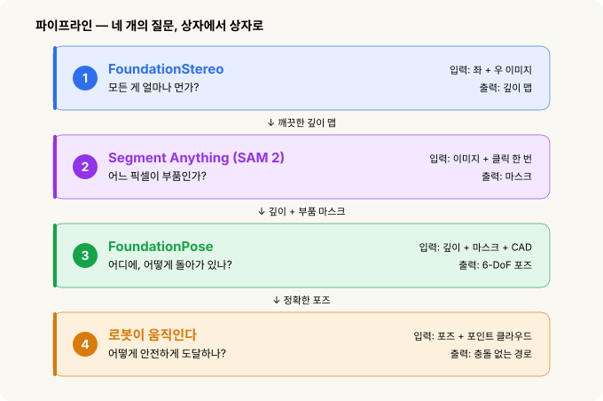
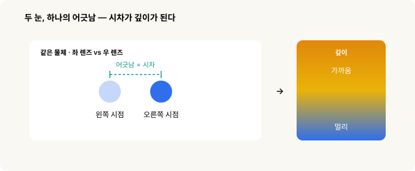
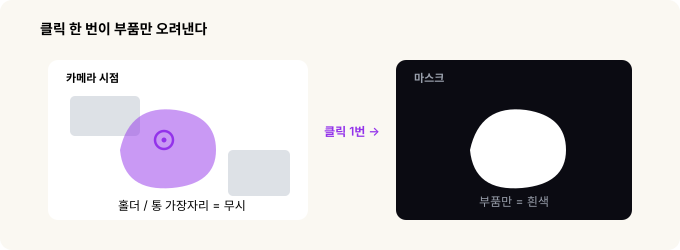
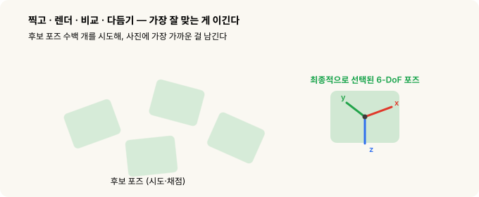
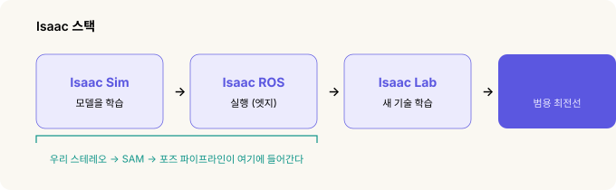

# 스테레오 비전(Stereo Vision)에서 목표물 잡기(grasping)까지 — 로봇은 목표한 사물을 어떻게 발견하는가

> **로봇 비전(robot vision) · 2부작 중 1부.** 이 글은 로봇이 어떻게 *보는지*를 다룹니다. 그렇게 본 걸 *어디를 잡을지*로 바꾸는 이야기는 2부 [좌표계와 변환](frames-transforms.md)에서 이어집니다.

처음 보는 부품을 로봇이 스스로 집게 만드는 일은 오랫동안 부품마다 몇 주씩 걸리는 수작업이었습니다. 저도 처음엔 전부 손으로 했어요. 대상 부품 사진을 직접 찍고, 라벨링 도구에서 한 장씩 네모를 그린 다음, 몇 주 동안 결과와 씨름했죠. 크롬 표면(비전에서는 실제 크롬이 아니어도 깊이를 재기 어려운 반질반질한 표면을 통틀어 이렇게 부릅니다) 위에서는 깊이 맵(depth map)에 구멍이 뚫린 채 '측정 불가'가 나왔고, 한 조명에서 멀쩡하던 모델이 조명만 바뀌면 엉뚱한 답을 냈습니다. 잘못 찍힌 깊이 값 하나 때문에 그리퍼(gripper)가 부품을 그대로 들이받은 적도 있고요.

그러다 [*Picking the Impossible Parts*](https://www.youtube.com/watch?v=Zl_KhE1_9SM)(불가능한 부품 집기)라는 웨비나를 보고 생각이 바뀌었습니다. 제 방식이 허술해서 생긴 문제가 아니었어요. 다들 같은 문제를 겪고 있었고, 해법도 이미 나와 있었습니다. **애초에 이런 학습 데이터는 현실에서 구할 수가 없는 것**이었고, 그러니 접근법 자체를 바꾸는 수밖에 없었던 겁니다. 이 글은 그때 누군가 옆에서 짚어줬으면 했던 바로 그 이야기입니다.

한 발 물러서서 보면 지금은 AI가 한 단계 더 넘어가는 길목입니다. 1세대 AI가 글과 그림을 만들어내는 **생성형(generative) AI**(챗GPT 같은)였다면, 2세대는 스스로 판단하고 도구를 쓰는 **에이전트형(agentic) AI**(클로드 같은)였죠. 이제는 AI가 로봇 속으로 들어가 현실 세계에서 직접 보고 움직이는 3세대, **피지컬 AI(physical AI)**의 차례입니다. 이 글은 그 3세대가 현장에서 실제로 어떻게 동작하는지 보여줍니다.

이 파이프라인 전체가 답하려는 질문은 하나입니다.

> **부품은 3D 공간의 어느 좌표에 있고, 얼마나 돌아가 있나?**

이 답을 충분히 정밀하게 구하면 로봇은 부품을 스스로 잡아 올릴 수 있습니다. 지금부터 미리 학습된 AI 모델 세 개를 차례로 이어 거기까지 가는 과정과, 그 모든 걸 가능하게 한 열쇠인 시뮬레이션을 풀어보겠습니다.

---

## 30초 요약

- 로봇이 부품을 잡는 일은 결국 한 질문으로 압축됩니다. **지금 어느 좌표에 있고, 어떤 자세(포즈, pose)로 돌아가 있나.** 이 두 가지를 숫자 여섯 개로 나타낸 것을 6-DoF(6 Degree of Freedom)라고 불러요.
- 예전엔 **부품 하나당 전용 모델**을 따로 학습시켜야 했어요. 하나에 몇 주씩, 손으로 라벨링한 사진이 산더미로 필요했죠.
- 요즘은 학습이 아니라 *프롬프트(prompt)*로 부리는 **파운데이션 모델(foundation model) 세 개**를 이어 붙입니다. **FoundationStereo**(얼마나 먼가?), **Segment Anything / SAM 2**(어느 픽셀인가?), **FoundationPose**(어디에, 어떻게 돌아가 있나?). 그다음 경로 계획기(path planner)가 팔을 움직이고요.
- 이 모델들은 **한 번도 본 적 없는** 부품에서도 통합니다(제로샷, zero-shot). 조명이며 잡동사니를 마구 뒤섞은 **어마어마한 시뮬레이션 데이터**로 배웠거든요.
- 열쇠가 바로 그 시뮬레이션이에요. 시뮬레이터 안에서는 컴퓨터가 픽셀마다 정답을 이미 알고 있으니 **라벨이 공짜**고, 데이터를 모으겠다고 진짜 로봇을 움직일 일도 없습니다.
- 게다가 이 전부가 **로컬에서, 인터넷 없이**, 셀에 붙은 작은 컴퓨터 안에서 동작합니다. 클라우드가 필요 없어요.

---

## 먼저, 제일 골치 아픈 부분 — 왜 최근까지 안 됐나

현장 프로젝트에서 부딪힌 장벽들을 파고들면 뿌리는 하나입니다. **현실에서는 라벨링된 학습 데이터를 쉽게 구할 수 없다.** 적어도 현장이 요구하는 규모와 안전 수준으로는요. 장벽은 네 개인데, 놀랍게도 아이디어 하나로 넷을 한꺼번에 넘을 수 있습니다.

### 1. 웹에는 이런 데이터가 없다

챗봇은 인터넷 전체를 읽고 배웠죠. 그런데 **"로봇이 통에서 부품 잡는 장면 모음" 같은 데이터는 인터넷 어디에도 없습니다.** 아무도 올리지 않은 걸 내려받을 수는 없으니까요.

*→ 시뮬레이션이 해결:* 장면을 우리가 직접 찍어냅니다.

### 2. 손 라벨링은 비현실적이고, 위험하다

사진이 있어도 문제예요. 정답을 **1밀리미터, 1도보다 더 정밀하게** 라벨링해야 하거든요. 픽셀 하나하나의 깊이, 부품의 정확한 방향까지 전부요. 사진을 클릭해 가며 그 수준을 맞출 수 있는 사람은 없습니다. 게다가 실제 데이터를 모으려면 **사람과 부품 옆에서 진짜 로봇 팔을 움직여야** 해요. 물리적으로 위험한 데다, 느리고 돈까지 드는 시행착오죠.

*→ 시뮬레이션이 해결:* 렌더러는 픽셀마다 정답을 이미 알고 있으니 라벨이 공짜로 딸려 나오고, 진짜 팔은 손가락 하나 까딱할 필요가 없습니다.

### 3. 현장 조명은 나쁘고, 계속 바뀐다

현장 조명은 어둡고, 얼룩덜룩하고, 그때그때 달라요. 금속에 튕기는 반사광, 어두운 구석, 교대며 밤낮마다 바뀌는 밝기, 열린 문으로 들이치는 햇빛까지. 한 가지 조명에서 배운 모델은 딱 그 조명에만 **과하게 맞춰져서(overfit)**, 빛이 바뀌는 순간 성능이 뚝 떨어집니다.

*→ 도메인 랜덤화(domain randomization)가 해결:* 학습할 때 조명을 극단적으로 바꿔 가며 보여줘서, 모델이 조명에 아예 신경 쓰지 않게 만듭니다. 불을 켜든 끄든, 햇빛이 들든 말든요.

### 4. 셀은 대개 외부망과 끊겨 있다

현장은 보안과 안정성 때문에 인터넷이 제한적이거나 아예 없는 곳이 많습니다. 클라우드 AI는 처음부터 선택지가 아니에요. 전부 **로컬 컴퓨터에서, 오프라인으로** 동작해야 합니다.

*→ 로컬 실행이 해결:* 모델이 셀에 붙은 컴퓨터에서 실행될 만큼 작고 가볍게 최적화돼 있습니다. 클라우드가 필요 없어요.

결국 네 장벽 모두 한 수로 풀립니다. 라벨이 공짜고 무엇이든 마음대로 뒤섞을 수 있는 **시뮬레이션에서 데이터를 만들고, 모델은 로컬에서 실행한다.**

---

## 파이프라인 한눈에 보기 — 질문 넷, 상자 넷

각 상자는 바로 위 상자가 내놓은 결과를 받아 씁니다. 깊이는 마스크(mask) 단계로, 깊이와 마스크는 함께 포즈(pose) 단계로 넘어가요. 하나라도 어긋나면 로봇은 짐작으로 움직이는 셈입니다.

---

## 1단계 · FoundationStereo — 모든 게 얼마나 먼가

**할 일:** 좌·우 사진 한 쌍을 *깊이 맵*으로 바꾸기. 각 픽셀 값이 카메라에서 몇 미터 떨어져 있는지를 나타내는 그림이죠.

평평한 사진 한 장에는 깊이 정보가 없어요. 하지만 살짝 다른 위치에서 찍은 **두 장**에는 있습니다. 한쪽 눈씩 번갈아 감아 보면 가까운 손가락은 *휙* 크게 움직이는데 먼 벽은 거의 그대로잖아요? 바로 그 원리예요. 그 움직인 정도를 **시차(disparity)**라고 부르고, 이게 깊이의 원재료입니다.

제가 몇 주를 통째로 날린 함정이 여기 있습니다. 고전적인 스테레오(stereo) 정합은 두 사진을 맞추려면 **눈에 보이는 무늬**가 있어야 해요. 그런데 크롬 표면은 어딜 봐도 똑같이 생겨서 붙잡을 단서가 없습니다. 그래서 **하필 부품이 있는 자리에만 구멍**이 뚫려요. 깊이가 가장 절실한 바로 그 자리에서만 깊이가 안 나오는 셈이죠.

**FoundationStereo**는 다릅니다. 학습된 모델이라 두 사진을 맞추는 데 그치지 않고, 음영이나 원근, 표면이 휘는 결처럼 사진 한 장에서 읽어낼 수 있는 단서까지 함께 봐요. 그래서 **텅 비고 번들거리는 표면 위에서도 형상을 깨끗하게 채워 넣습니다.** 적외선 프로젝터도, 특수 장비도 필요 없고요. 고전 방식이 검은 구멍으로 남겨둔 크롬 표면에서도 이제 또렷한 깊이가 나오고, 로봇이 드디어 그 3D 형태를 "보게" 됩니다.

조금 더 기술적으로

고전 스테레오는 <strong>코스트 볼륨(cost volume)</strong>이란 걸 만듭니다. 왼쪽 이미지의 각 점이 오른쪽 이미지의 각 점과 얼마나 잘 맞는지 매긴 점수표예요. 무늬가 없는 표면에서는 어느 짝이나 점수가 똑같이 나와서 결과가 엉망이 됩니다. 대부분이 쓰는 정합 알고리즘이 <strong>SGM(Semi-Global Matching)</strong>인데, 문제는 카메라가 아니라 이 <em>알고리즘</em>에 있어요. RealSense든 OAK-D든, 온칩 스테레오라면 모두 같은 구멍이 생깁니다. 알고리즘의 한계는 좋은 카메라로 메울 수 없죠.

옛날 우회책은 가짜 무늬를 장면에 뿌리는 <strong>적외선 프로젝터</strong>였습니다. 실험실에선 통하지만, 그 패턴이 현장 조명 아래 번들거리는 표면에 산란돼 다시 구멍이 생겨요. FoundationStereo는 사진 한 장에서 얻는 깊이 단서를 함께 활용해 빈 표면에도 그럴듯한 형상을 만들어내므로, 프로젝터가 아예 필요 없습니다. (관련 논문은 CVPR 2025 최우수 논문 후보에 올랐어요.)

---

## 2단계 · Segment Anything(SAM 2) — 어느 픽셀이 부품인가

**할 일:** *부품만* 콕 집어 외곽선을 따고, 홀더·통·나머지 전부와 떼어놓기.

다음 단계에는 **어떤 물체**를 다룰지 알려줘야 합니다. 그 지시를 담는 게 마스크(mask)예요. "부품은 *이* 픽셀들이야, 나머지는 신경 꺼"라고 짚어주는 거죠.

**SAM**(Segment Anything)에는 두 가지 장점이 있습니다. 우선 **프롬프트(prompt)로 지시**할 수 있어요. 부품 위 한 점을 콕 찍거나 네모를 씌우는 식으로요. 그리고 **제로샷(zero-shot)**이라 학습한 적 없는 물체에서도 통합니다. 부품 위를 한 번 클릭하면 그 부품의 또렷한 외곽선이 나오고, 홀더와 지그는 알아서 빠집니다.

실무에서 알아둘 것

SAM 2(메타 제작)는 Apache-2.0 라이선스에 덩치도 작아요. 네 가지 크기로 39~224MB라, 8GB짜리 엣지 컴퓨터에서도 무리 없이 동작합니다. 제로샷인 데다 클릭이나 네모만 받으면 되니, 부품마다 따로 학습시키던 검출기를 통째로 대체하고, "부품당 사진 수천 장 라벨링" 비용도 없애줍니다.

SAM 자체엔 텍스트 입력이 없습니다. "부품"이라는 <em>단어</em>로 지시하고 싶으면, 텍스트를 네모로 바꿔주는 그라운딩 모델(GroundingDINO나 Florence-2)을 앞에 붙인 다음 SAM이 그 네모를 마스크로 바꾸게 하면 돼요. 이 조합을 <strong>Grounded-SAM</strong>이라고 부릅니다.

---

## 3단계 · FoundationPose — 정확히 어디에, 어떻게 돌아가 있나

**할 일:** 완전한 **6-DoF 포즈(pose)** 구하기. 위치(x, y, z)*와* 방향(roll, pitch, yaw), 숫자 여섯 개 전부요.

위치만 알면 로봇은 어디로 손을 뻗을지는 알아도 그리퍼를 어떻게 기울일지는 모릅니다. 같은 부품이라도 누워 있을 때와 옆으로 서 있을 때는 잡는 법이 다르니까요. **"6-DoF(자유도 여섯)"**는 강체가 공간에 어떻게 놓였는지를 빈틈없이 정해주는 숫자 여섯 개일 뿐입니다.

FoundationPose에는 부품의 **CAD 모델**, 그러니까 정확한 3D 도면을 줍니다. 그러면 무식해 보이지만 영리한 방법을 써요. 가능한 포즈를 **수백 개 찍어보고**, 각각이 카메라에 어떻게 비칠지 **렌더링(rendering)**한 다음, 실제 사진(색이랑 깊이 둘 다)과 **대조**해서 제일 가까운 걸 남기고 다시 **다듬습니다.** 그렇게 "부품은 (x, y, z)에 있고 *이렇게* 돌아가 있어"라는 답이 나와요. 로봇이 자세 맞추는 데 딱 필요한 정보죠.

CAD 파일에서 형태를 그때그때 읽어오기 때문에 이것도 **제로샷**입니다. 완전히 새로운 부품이어도 CAD 파일만 있으면 되고, 재학습은 필요 없어요. 새 품번을 추가할 때 학습을 다시 실행할 필요 없이 파일 하나만 넣으면 됩니다.

안에서 실제로 벌어지는 일

FoundationPose는 <strong>렌더-앤-컴페어(render-and-compare)</strong> 방식입니다. CAD 모델을 후보 포즈 수백 개에 놓고 각각 렌더링한 뒤, <strong>정제 네트워크(refine network)</strong>가 후보 하나하나를 실제 색·깊이에 더 잘 맞게 밀어주고, "둘 중 어느 쪽이 더 잘 맞아?"에 답하도록 학습된 <strong>점수 네트워크(score network)</strong>가 순위를 매겨 승자를 고릅니다.

은근히 쓸모 있는 두 번째 용도도 있어요. 로봇이 부품을 집고 나면 그리퍼 안에서 부품이 살짝 틀어지거든요. 이때 <em>손에 쥔 채로</em> 한 장 더 찍어 FoundationPose를 다시 실행하면, 지금 부품을 정확히 어떻게 쥐고 있는지 알게 됩니다. 덕분에 그냥 잡는 걸 넘어 (삽입 검사 같은 데) 정밀하게 <em>내려놓는</em> 것까지 가능해져요.

---

## 4단계 · 로봇이 움직인다 — 어떻게 안전하게 도달하나

3단계에서 나온 포즈는 아직 **카메라의** 시점이에요. 실제로 움직이려면 로봇은 다음 순서를 밟습니다.

1. 그 포즈를 자기 **베이스 좌표계**로 **변환**합니다. 이때 필요한 게 딱 한 번만 해두는 핸드-아이 캘리브레이션(hand-eye calibration) 설정이에요. (이게 [2부](frames-transforms.md)의 주제입니다.)
2. CAD 모델에 대고 미리 가르쳐 둔 **잡는 방식**을 고릅니다.
3. **충돌 없는 경로를 계획**합니다. 1단계에서 얻은 깊이를 "피해야 할 것들의 지도"로 쓰면서요.
4. **움직여서** 잡습니다.

눈여겨볼 점이 있습니다. **1단계의 깨끗한 깊이**는 부품을 찾는 데만 쓰이지 않고 *안전*에도 결정적입니다. 경로 계획기가 얼마나 안전한지는 결국 받은 장애물 지도에 달렸는데, 그 지도가 바로 1단계에서 나온 포인트 클라우드(point cloud)거든요.

움직임 뒤에 숨은 숫자

흔히 쓰는 계획기 <strong>RRT*</strong>는 로봇 전체를 공 수백 개로 근사한 뒤, 1단계 포인트 클라우드로 만든 충돌 지도를 요리조리 피해 경로를 냅니다. NVIDIA의 GPU 계획기 <strong>cuMotion</strong>은 같은 일을 GPU에서 하고요. 인식(perception) 전체가 대략 <strong>2~6초</strong> 걸리지만, <em>팔이 앞 부품을 내려놓는 동안</em> 함께 동작하므로 실제 사이클 타임을 좌우하는 건 비전이 아니라 로봇의 움직임입니다. 그리고 이 전부가 컨트롤러에서 로컬로 동작해요.

---

## 그 다음 단계는 어디로 — NVIDIA Isaac을 향해

위 모델 셋은 NVIDIA의 **Isaac** 로봇 플랫폼에 속해 있어요. 각자 다른 질문에 답하는 네 개의 층으로 보면 머릿속에 그리기 쉽습니다.

- **Isaac Sim — 모델을 *학습*시킨다.** 사진처럼 사실적이고 물리도 정확한 시뮬레이터예요. 조명·배경·잡동사니를 마구 바꿔가며 장면을 수백만 장 렌더링하는데, 픽셀마다 정확한 깊이와 포즈를 이미 알고 있으니 라벨이 공짜죠. FoundationStereo와 FoundationPose가 바로 여기서 학습됐고, 그래서 제로샷에 조명에도 끄떡없는 겁니다.
- **Isaac ROS — 모델을 *실행*한다.** GPU 가속 ROS 2 패키지 모음으로, 방금 본 파이프라인을 셀에 붙은 작은 엣지 컴퓨터에서 실행합니다.
- **Isaac Lab — 새 기술을 *가르친다*.** 로봇이 시뮬레이션에서 *동작*을 배우는 오픈 프레임워크예요(강화학습·모방학습). 인식을 넘어선 단계죠. "부품을 봐"가 아니라 "그걸 어떻게 다룰지 익혀".
- **Isaac GR00T — 최전선.** 범용 로봇을 위한 비전-언어-행동(vision-language-action) 파운데이션 모델입니다. "학습 말고 프롬프트" 발상을 로봇의 행동 전체로까지 밀어붙인 거죠.

이 글의 스테레오 → SAM → 포즈 파이프라인은 그중 Isaac Sim(학습)과 Isaac ROS(실행)에 걸쳐 있습니다.

왜 하필 <em>시뮬레이션</em>이 열쇠였나

현장의 네 장벽이 시뮬레이터 한 곳에서 모두 풀리는 건, 렌더러가 픽셀마다 정답을 이미 알기 때문입니다. 규모를 보면, FoundationPose는 약 <strong>67만 8천 장면</strong>, FoundationStereo는 약 <strong>100만 쌍의 합성 스테레오</strong>로 학습됐고, 그 모든 이미지가 도메인 랜덤화(조명·표면 마감·잡동사니를 매 장면 다르게)로 렌더링됐어요. 그 한 수로 제로샷 일반화<em>와</em> 현장이 요구하는 조명 강건성을 <em>동시에</em> 얻습니다.

---

## 제한된 하드웨어와 자원으로 현실적으로 밟아갈 수 있는 길

처음부터 최전선에 뛰어들 필요는 없어요. 기고, 걷고, 그다음에 뜁니다.

- **시작: 오프라인, 저장해둔 프레임으로.** 찍어둔 부품 이미지를 놓고, 작은 엣지 컴퓨터에서 SAM 2와 FoundationStereo를 실행해 봅니다. 구멍투성이였던 자리에서 깊이가 깨끗하게 나오는지부터 확인하는 거죠. 아직 ROS는 필요 없어요.
- **다음: Isaac ROS로 실시간.** 모델을 엣지 컴퓨터 위 실시간 GPU 그래프로 감싸서, 노트북이 아니라 셀에서 파이프라인이 동작하게 합니다.
- **나중 — Isaac Lab으로 학습된 제어.** 시뮬레이션에서 조작 정책을 학습해 배포합니다. 더 큰 하드웨어가 필요한 단계예요.

---

## 전체 이야기, 단계마다 한 줄

| 단계 | 모델 | 질문 | 입력 → 출력 |
|---|---|---|---|
| 1 | **FoundationStereo** | 모든 게 얼마나 먼가? | 좌 + 우 이미지 → 깊이 |
| 2 | **SAM 2** | 어느 픽셀이 부품인가? | 이미지 + 클릭 한 번 → 마스크 |
| 3 | **FoundationPose** | 어디에, 어떻게 돌아가 있나? | 깊이 + 마스크 + CAD → 6-DoF 포즈 |
| 4 | **RRT\* / cuMotion** | 어떻게 안전하게 도달하나? | 포즈 + 포인트 클라우드 → 경로 |

**딱 하나만 기억한다면:** 파운데이션 모델은 '학습'을 '프롬프트'로 바꿔놨습니다. 클릭 한 번, CAD 파일 하나면 처음 보는 부품에서도 통하죠. 조명과 잡동사니를 마구 뒤섞은 거대한 *시뮬레이션* 데이터로 배웠으니까요. 그 발상의 전환 하나가 "불가능한 부품"을 평범한 하루 일과로 바꿔놨습니다.

다음 이야기: 부품의 좌표와 포즈는 *카메라*의 시점으로 나오는데, 정작 로봇은 자기 시점에서만 움직입니다. [2부 — 좌표계와 변환](frames-transforms.md)에서 그 둘을 잇고 번역하는 방법을 다룹니다.

---

*관련: [Physical AI를 고르는 법 — Track 0·A·B](choosing-physical-ai.md) · [좌표계와 변환 — 로봇은 어디를 잡을지 어떻게 아는가](frames-transforms.md) · [Physical AI에 투자한다면](cobot-investing.md) · [카메라는 몇 대, 어디에](camera-placement.md)*

### 출처와 표기

Vention 웨비나 [*Picking the Impossible Parts*](https://www.youtube.com/watch?v=Zl_KhE1_9SM)를 바탕으로 했습니다. 모델 동작·학습 데이터 규모·패키지 이름은 NVIDIA와 Meta의 공개 문서 및 각 모델 논문(FoundationStereo, FoundationPose, Segment Anything)을 따랐습니다. 수치는 근사이며 집필 시점 출처 기준입니다.

NVIDIA Isaac(Isaac Sim, Isaac ROS, Isaac Lab, Isaac GR00T, Omniverse, Jetson, cuMotion), FoundationStereo, FoundationPose, Meta Segment Anything(SAM), Vention, Intel RealSense, Luxonis, Roboflow는 각 권리자의 상표이며, 여기서는 지칭 목적으로만 사용했습니다. 본문 그림은 모두 직접 제작했습니다.

### 용어 설명

- *파운데이션 모델(foundation model)* — 거대한 데이터로 미리 학습돼, 과제별 재학습 없이 두루 통하는 큰 모델. 여기선 FoundationStereo, SAM 2, FoundationPose.
- *제로샷(zero-shot)* — 학습 때 본 적 없는 물체·장면에서도 통하는 것. 학습시키는 대신 프롬프트(클릭, CAD 파일)로 부린다
- *크롬 표면* — 비전에서, 실제 크롬이 아니어도 반질반질해 깊이 재기가 어려운 표면을 통틀어 부르는 말
- *시차(disparity)* — 한 점이 좌·우 사진 사이에서 얼마나 어긋나는가. 많이 어긋날수록 가깝다
- *깊이 맵(depth map)* — 각 픽셀 값이 카메라로부터의 거리인 이미지
- *마스크(mask) · 분할(segmentation)* — 어느 픽셀이 고른 물체에 속하는지 오려낸 것
- *6-DoF 포즈(pose)* — 자유도 여섯: 위치(x, y, z) + 방향(roll, pitch, yaw)
- *그리퍼(gripper)* — 로봇 팔 끝에서 부품을 쥐는 집게
- *CAD 모델* — 부품의 정확한 3D 도면. 포즈 추정에서 "알려진 형태"로 쓰인다
- *도메인 랜덤화(domain randomization)* — 학습 이미지마다 조명·마감·잡동사니를 바꿔, 모델이 특정 외양에 기대지 않게 만드는 기법
- *포인트 클라우드(point cloud)* — 깊이로 복원한 3D 점 무리. 경로 계획의 장애물 지도로 쓰인다
- *경로 계획기(path planner)* — 로봇 팔이 장애물에 부딪히지 않고 지나갈 길을 자동으로 짜주는 소프트웨어. RRT*·cuMotion 등
- *ROS 2* — 로보틱스 공통 미들웨어. Isaac ROS는 그 GPU 가속 패키지 모음
