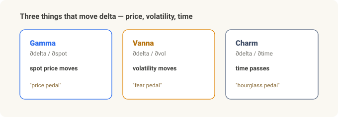

# Beyond Gamma — Vanna, Charm, and the Dealer's Real Hands

> **Options-structure series.** [Compute GEX Yourself](gex-calculator.md) covered **gamma**; [0DTE Gamma Patterns](gex-0dte-patterns.md) covered **intraday change.** This one goes **beyond gamma** — the dealer flows driven by volatility and time, **Vanna** and **Charm** — and *how far you can actually trust them*.

<!-- DRAFT: remove `draft` and deploy after review. -->

Recall the gamma story. A dealer (market maker) doesn't bet on direction — it offsets (hedges) the risk of the options customers hand over, using the underlying. But that hedge doesn't sit still. **Three things** keep moving the dealer's hands:

- **Gamma** — delta changes when **spot moves** (the previous two posts)
- **Vanna** — delta changes when **volatility moves**
- **Charm** — delta changes when **time passes**

Even with price frozen, a **falling volatility or simply a day going by** makes a dealer trade. This piece explains what vanna and charm are, when they matter, and — honestly — **how much of the finance-Twitter narrative is actually true.** (Spoiler: the math is solid, the positioning is mostly inferred, and the market-impact claims are often overstated.)

---

## In 30 seconds

- Three axes move dealer hedges: **gamma (price) · vanna (vol) · charm (time).**
- **Vanna** = delta changes when vol changes. **Charm** = delta changes as time passes. — *That much is textbook.*
- The **"vanna rally"** (vol down → dealers buy → up) is a **standard framework**, but it holds only under the (empirically supported) assumption that dealers are **net short vol** — and it is **not proven causal** (co-movement ≠ causation).
- **Expiration pinning** (price sticking to a strike) is **peer-reviewed** — but for *single stocks.* A directional index "drift up into OPEX" (OPEX = options expiration) is a much weaker claim.
- **The decisive rebuttal:** Cboe's own study finds dealer net gamma is **0.04–0.17% of daily S&P futures liquidity.** "Dealer hedging dominates the tape" is overstated. And **0DTE is now ~59% of SPX option volume (2025),** which has redistributed the classic monthly-OPEX effect.
- **One-line guardrail:** trust the Greeks (math); the positioning (who's long/short) is partly measured, mostly inferred; and the impact claims range from *peer-reviewed-modest* (pinning, intraday gamma) to *vendor-amplified* (vanna rallies as certainty, "window of weakness").

---

## Three flows — price, vol, time

Delta hedging means "keep this position's delta at zero." The problem: delta keeps moving for **three reasons.** In words, delta's motion is the sum of three parts — the part from price (gamma) + the part from vol (vanna) + the part from time (charm).

| Flow | What moves delta | Greek | When it dominates |
|:---|:---|:---|:---|
| Gamma hedging | **spot price** moves | Gamma (∂δ/∂S) | continuous·intraday; sharpest near ATM & expiry |
| Vanna hedging | **implied vol** moves | Vanna (∂δ/∂σ) | vol regime shifts — hours to days |
| Charm hedging | **time** passes | Charm (∂δ/∂t) | into expiry (OPEX Friday · EOD) |

Gamma was the prior posts; here it's the other two. *(This three-way split is itself textbook-correct.)*

---

## Vanna — volatility jolts delta

**Vanna** is *"how much delta changes when implied vol moves by 1."* Flip it and it's also *"how much vega (vol sensitivity) changes when spot moves by 1."* The name is **V**ega + delt**a**.

An analogy: if gamma is the "price pedal," vanna is the **"fear pedal."** The delta on a price pedal you never touched shifts on its own as the market's fear (volatility) rises or falls — so the dealer must re-hedge.

### What the "vanna rally" story actually is

Direction depends on **what position the dealer holds.** And here's a fact **shown with actual holdings data:** institutions (customers) are net buyers of index options, especially **OTM puts** → so **dealers are net short vol** (Gârleanu·Pedersen·Poteshman, 2009 — the first paper to *prove with holdings data* the "Wall Street is short index vol" conventional wisdom).

Under that position: when vol **falls,** put deltas shrink, so the dealer **buys back** the underlying it had sold as a hedge → upward pressure, in theory. This is the so-called **vanna rally.** On a vol spike, the reverse.

!!! warning "Where to be honest"
    **The positioning premise (dealers short vol) is supported, but no study proves that "vol down → buy → rally" is *causal*.** Vol compression and a grinding-higher index co-occur under plain risk-on dynamics — and under **vol-target flows**: when vol falls, systematic strategies (risk parity, vol-control funds) are allowed more risk, so they mechanically add equity exposure and buy for a completely different reason. That re-leveraging overlaps the dealer vanna flow in **both direction and timing**, so you **can't tell which one actually did the pushing — and by AUM the systematic channel may well be the larger of the two.** So **causation and co-movement aren't cleanly separated.** Vendors (SpotGamma etc.) that present it as a mechanical law are writing *marketing-grade,* not evidence-grade, copy. → **Worth knowing as a standard framework — but no mechanical certainty.**

---

## Charm — delta bleeds with time alone

**Charm** is *"how much delta changes as one day passes"* (∂Delta/∂time, "delta decay"). As expiry nears, OTM deltas decay toward 0 and ITM toward ±1 — with nothing happening at all, **the calendar turning is enough** to move delta.

An analogy: charm is the **"hourglass pedal."** Price and fear unchanged, yet the falling sand alone unwinds a little of the hedge. So it stands out **near expiry (especially Friday / monthly OPEX).**

Again, split evidence from story:

- ✅ **Pinning is real.** Optionable **single-stock** closing prices cluster at strikes on expiration days, partly due to MM delta-hedging (Ni·Pearson·Poteshman, 2005; ≥16.5 bp average effect, single stocks pin ~8.2% of expiration days vs <6% on adjacent days).
- 🟡 **But that's "single stocks pinning to nearby strikes,"** not a broad **index drift up** into OPEX — the latter is a much weaker heuristic.

---

## The OPEX thesis — fact, or story?

"Before monthly OPEX, vanna + charm hedging pushes prices up, and after OPEX a **window of weakness** arrives" — this feedback-loop framing was popularized by JPMorgan research (Marko Kolanovic). Let's split exactly what's empirical from what's a story.

- ✅ **Dealer gamma affects *intraday* dynamics** — supported (Barbon·Buraschi, *Gamma Fragility*, 2021): dealer gamma imbalance predicts intraday momentum (short gamma) vs. reversal (long gamma), **stronger when the underlying is less liquid.** **Note: this is gamma's vol-amplify/dampen channel, NOT a directional "drift up into OPEX."** (Don't cite this paper as proof of a bullish OPEX drift.)
- ✅ **Expiration pinning** — supported (NPP 2005, above).
- ⛔ **A systematic, tradable upward drift into OPEX and a post-OPEX "window of weakness"** — **no rigorous primary source found. Unverified.** Treat skeptically, or don't assert it.

And **crucially, 0DTE (2023–2025) has changed the classic effect:**

- 0DTE is now **~59% of SPX option volume (2025)** → hedging pressure has been **redistributed from once-a-month OPEX to every session's open and close.** What used to concentrate monthly now scatters daily.
- Above all, **Cboe's own study:** market-maker net gamma averages **$170M–$670M/day** — that's **0.04–0.17% of daily S&P futures liquidity (~$400B),** with extremes around 1.3–1.9%, and **no uptick in intraday gap moves.** → The **strongest single rebuttal** to the *"dealer hedging dominates the market"* narrative.

---

## Dealer positioning — how much is actually known?

Vanna, charm, and gamma flows all rest on **one assumption:** *"customers buy puts / sell calls → the dealer takes the other side → its hedging is predictable."* Separate what's **known** from what's **inferred.**

- **Known (measured):** customers are net long index options (especially OTM puts) → dealers net short vol. **The one link actually shown with holdings data** (GPP 2009).
- **Inferred (most of the rest):** nobody sees dealer inventory directly in real time. Public chains show strike, greeks, volume, OI — but **not who is long or short.** The dealer sign is **assumed.**

**Who measures it, and how:**

- **Cboe Open-Close** — closest to a *direct* measurement (buckets every trade by originator · buy/sell · open/close). The raw feed behind positioning estimates.
- **SqueezeMetrics (GEX/DIX)·SpotGamma·MenthorQ·Tier1Alpha** — each with its **own proprietary "dealer-sign" model.**

**Documented limitations (this is the crux):**

- **The sign is an assumption, not a Greek property** — flip one label and the whole regime inverts (long-gamma/range ↔ short-gamma/trend) while every magnitude still "looks right" (Chilingarian, *The Sign of Dealer Gamma*).
- **OI is a stale prior-night snapshot** — static intraday, so it drifts out of date within the session.
- **Not all customer buying is dealer-absorbed** — buy-writes, spreads, index replication muddy the sign.
- **Models disagree** — two vendors both "doing GEX" can differ on sign and levels.
- **Best-validated on the broad index (SPX), weakest on single names.** And **GEX describes structure (vol sensitivity), not the next direction.**

Every limitation from the [GEX post](gex-calculator.md) — OI is last night's close, direction unknown, BSM-theoretical gamma — applies to vanna and charm **the same way, one layer more,** since they lean one assumption deeper than gamma.

---

## Takeaway — look beyond gamma, but stay humble

Keep it in three layers and it won't blur:

| Layer | Content | Stance |
|:---|:---|:---|
| ✅ **Solid** (textbook / peer-reviewed) | Greek definitions & signs / the three flows (price·vol·time) / dealers net short vol (GPP) / expiration pinning (NPP) / dealer gamma's intraday amplify·dampen (B&B) / 0DTE ~59% | state plainly |
| 🟡 **Framework** (heuristic) | vanna rally / charm's OPEX drift / GEX flip & regime "map" | as "a common framework," **not a directional forecast** |
| ⛔ **Overstated — avoid** | dealer hedging dominates the market / a reliable post-OPEX "window of weakness" / any one vendor's GEX as ground truth / applying it confidently to single names / the monthly-OPEX effect unchanged in 2025 | avoid or **rebut** (Cboe's de-minimis data) |

**The one thing to remember:** the **math** of vanna and charm is **solid.** But the **positioning** stacked on top is partly measured and mostly inferred, and the **market-impact** claims span peer-reviewed-modest (pinning, intraday gamma) to vendor-inflated certainty. For a long-term investor, the value here isn't a trade signal — it's understanding, *structurally but without overconfidence,* that a sudden index lurch **might** owe something to dealer-hedging structure — while remembering that structure is smaller than the stories claim.

---

*Related: [Compute GEX Yourself](gex-calculator.md) · [0DTE Gamma Patterns](gex-0dte-patterns.md)*

### Sources & notes

- Gârleanu, Pedersen & Poteshman, *Demand-Based Option Pricing*, Review of Financial Studies (2009) — holdings-data evidence that dealers are net short index vol
- Ni, Pearson & Poteshman, *Stock Price Clustering on Option Expiration Dates*, Journal of Financial Economics (2005) — expiration pinning
- Barbon & Buraschi, *Gamma Fragility* (2021) — dealer gamma's intraday momentum/reversal effect
- Cboe, *Evaluating the Market Impact of SPX 0DTE Options* — market-maker net-gamma magnitude & 0DTE share
- Chilingarian, *The Sign of Dealer Gamma* — fragility of the dealer-sign assumption
- SqueezeMetrics (GEX/DIX whitepaper), SpotGamma·MenthorQ (methodology) — cited for *what the framework claims,* not as evidence it's true

Figures are approximations that vary over time. Cboe, SPX, and VIX are trademarks of Cboe Exchange, Inc., used here for identification only. **This article is educational and is not advice to make any trade or investment.**

### Glossary

- *Delta* — option price change per $1 move in spot
- *Gamma* — how delta changes when spot moves (∂Delta/∂spot)
- *Vanna* — how delta changes when volatility moves (∂Delta/∂σ = ∂Vega/∂spot)
- *Charm* — how delta changes as time passes (∂Delta/∂time, delta decay)
- *Vega* — option price change per 1-point move in implied vol
- *OPEX* — options expiration (esp. the monthly third-Friday expiry)
- *Pinning* — price sticking, at expiry, to a strike with heavy open interest
- *Dealer positioning* — the (mostly inferred) option position a market maker holds opposite customers, and its hedging tendency

---

*Previous: [0DTE Gamma Patterns — How GEX shifts intraday](gex-0dte-patterns.md) | Next: [Volatility Dashboard — Tracking Correlation + Skew](volatility-dashboard.md)*
