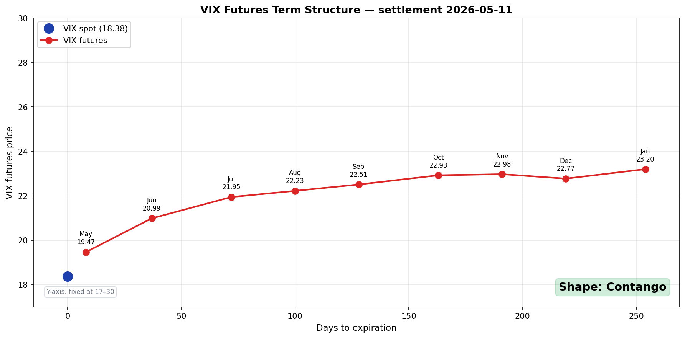

# VIX Futures Term Structure — 콘탱고와 백워데이션 읽는 법

> 매일 미국 장 마감 후 자동 갱신 · Cboe CFE 결제 데이터 기준 · [홈에서 라이브 차트 보기](../index.md)

---

## 오늘의 VIX 선물 곡선

<!-- VIX_TS_LIVE_START -->

<!-- VIX_TS_LIVE_END -->

위 차트는 매일 자동 갱신됩니다. Cboe Futures Exchange(CFE)가 매 영업일 장 마감 후 발표하는 **공식 결제가**(settlement price)를 사용합니다. 별도로 구독하거나 로그인할 필요 없이 누구나 무료로 접근 가능한 데이터입니다.

---

## VIX 현물과 VIX 선물의 차이

| | VIX 현물 (^VIX) | VIX 선물 (VX/K6, VX/M6, ...) |
|:--|:------|:--------|
| 무엇 | 현재 시점 기준 **30일 후 기대 변동성** | 특정 만기에 정산되는 **선도 변동성** |
| 누가 사용 | 시장 심리 지표 | 헷지·트레이딩에 직접 사용 |
| 거래 가능? | ❌ (지수만 존재) | ✅ (계약 단위 거래) |
| 만기 | 없음 (계산값) | 매월 (수요일 기준) |

**핵심**: VIX 현물은 단일 시점의 기대 변동성. VIX 선물은 *미래의 30일 기대 변동성*을 거래하는 시장의 가격. 따라서 만기마다 가격이 다르고, 그 가격들을 이으면 **곡선(term structure)**이 됩니다.

> 📝 **용어 노트**: 기술적으로 **VIX는 *순수한 지수***입니다 — S&P 500 옵션 가격에서 *계산*된 숫자이지 직접 거래되는 자산이 아니에요. 따라서 "VIX 현물"은 *VIX 지수의 현재 값*을 가리키는 트레이더 관용어 — *VIX 선물의 선도 값*과 대비할 때 쓰입니다. 코스피 200, S&P 500 같은 지수도 *선물 거래 맥락*에서는 똑같이 "현물"이라 부릅니다 (지수 자체는 직접 거래 불가능하지만요).

---

## 콘탱고 vs 백워데이션 — 곡선이 말하는 것

### 콘탱고 (Contango) — 정상 상태

```
가격
 │
 │              ●  먼 만기 (높음)
 │           ●
 │       ●
 │   ●
 │●  현물/Front (낮음)
 └──────────────── 만기
```

**가까운 만기 < 먼 만기** — 시장의 평상시 상태입니다.

해석: "지금 당장은 평온하지만, 미래에는 변동성이 더 높을 수 있다."

평소 VIX 선물은 **연 50% 이상의 시간을 콘탱고**에 머무릅니다. 변동성이 평균회귀(mean-reverting)하기 때문 — 단기 변동성이 낮을 때, 시장은 "이 평온함이 영원하지 않을 것"이라고 가격에 반영합니다.

콘탱고가 의미하는 것:

- **VIX 매도 ETF (XIV, SVXY, VIXY-숏)에 우호적**: 만기가 가까워질수록 가격이 떨어지는 구조라 매도 포지션이 자연스럽게 수익(롤 다운, *roll yield*)
- **변동성 자체가 자산이 될 수 있는 환경**: 변동성을 매도하고 프리미엄을 수확하는 전략의 작동 환경
- **2009~2018년의 9년**: 거의 내내 콘탱고 → SVXY 같은 ETF가 +10,000% 이상 상승

### 백워데이션 (Backwardation) — 스트레스 상태

```
가격
 │
 │●  현물/Front (높음)
 │   ●
 │       ●
 │           ●
 │              ●  먼 만기 (낮음)
 └──────────────── 만기
```

**가까운 만기 > 먼 만기** — 위기 상황의 신호입니다.

해석: "지금 당장 변동성이 매우 높고, 시간이 지나면 진정될 것이다."

백워데이션이 발생하는 빈도는 **연 20% 이하**. 발생할 때는 시장 전체가 패닉에 빠진 시점:

- **2008년 10월**: 글로벌 금융위기 — Front-month VIX 선물이 80 부근, 백워데이션 +13pt (역대 최대)
- **2018년 2월 5일**: "Volmageddon" — VIX 하루에 +115% 폭등, SVXY −90% (변동성 매도 ETF 붕괴), 단기 백워데이션
- **2020년 3월**: 코로나 패닉, VIX 82 도달
- **2022년 1~2월**: 우크라이나 침공 직전 단기 백워데이션
- **2025년 4월**: Trump 관세 발표 직후

백워데이션이 의미하는 것:

- **변동성 매도 전략은 즉시 청산 또는 급격한 손실** — 2018 Volmageddon에서 SVXY가 90% 하락한 메커니즘
- **변동성 매수가 합리적인 시점**: VXX, UVXY 같은 매수 ETF 단기 사용 가능
- **포트폴리오 헷지 활성화**: [Hedging the Wings](hedging-wings.md) 같은 옵션 헷지가 기능하는 환경

---

## 곡선 모양 빠르게 읽는 4가지 신호

| 신호 | 의미 | 색깔 |
|:----|:-----|:-----|
| **VIX 현물 < Front month** | 가장 흔한 상태 (콘탱고 시작) | 🟢 평상시 |
| **VIX 현물 > Front month** | **백워데이션** — 단기 스트레스 시작 | 🔴 경고 |
| **M2 − M1 > +1** | 깊은 콘탱고 (강한 평상시) | 🟢 안정 |
| **M2 − M1 < 0** | 백워데이션 (스트레스) | 🔴 위험 |
| **곡선 거의 평탄** | 변동성 기대치 일정 (전환기) | 🟡 주의 |

---

## 왜 vixcentral 대신 이 페이지인가

[vixcentral.com](https://vixcentral.com)이 한때 VIX 선물 term structure를 보는 사실상의 표준이었지만, 최근 몇 년간 **데이터 공급이 불안정**하고 광고가 늘어났습니다. 이 페이지는:

- **Cboe 공식 결제 데이터 직접 사용** — 중간 매개 없음, 항상 정확
- **GitHub Pages 호스팅** — 광고 없음, 추적 없음
- **재현 가능한 코드** — 스크립트 공개, 직접 돌려볼 수 있음
- **무료, 영구 무료**

데이터 출처: `https://www.cboe.com/us/futures/market_statistics/settlement/csv/`

매일 미국 장 마감 후(보통 16:30 ET) Cboe가 결제가를 발표합니다. 이 페이지의 차트는 그 직후 22:00 UTC(약 17:00 ET)에 GitHub Actions가 자동으로 갱신합니다.

---

## 실전 활용

### 1. 진입 타이밍 — 변동성 매도 vs 매수

| 상황 | 권장 |
|:----|:-----|
| 콘탱고, M2-M1 > +1.5 | 변동성 매도 전략 작동 환경 (다만 이 글의 결론은 *시장 환경 인식*에 한정 — 변동성 매도는 백워데이션 전환 위험 항상 존재) |
| 콘탱고 → 곡선 평탄화 진행 중 | 매도 포지션 축소, 헷지 추가 검토 |
| 백워데이션 발생 | 매도 포지션은 손절 수준에서 청산. [Hedging the Wings](hedging-wings.md) 같은 보호 포지션 활성화 시점 |

### 2. 다른 신호와 조합

VIX term structure 단독으로 매매 결정을 내리지 마세요. [변동성 대시보드](volatility-dashboard.md)의 다른 신호와 함께 봐야 합니다:

- **Term Structure 역전(COR1M > COR1Y)**: 단기 공포 급등 — VIX TS 백워데이션과 거의 동시에 발생
- **COR90D > 50**: 동조화 진행 — 분산 효과 약화
- **SKEW > 150**: 기관의 꼬리 위험 인식 증가

세 신호가 동시 악화 + VIX 백워데이션 = **명백한 위기 신호**.

### 3. 역사적 백워데이션 진입의 평균 회복 기간

| 사건 | 백워데이션 지속 기간 |
|:----|:--------------------|
| 2008 GFC | ~3개월 |
| 2011 미국 신용등급 강등 | ~2주 |
| 2015 중국 위안화 절하 | ~1주 |
| 2018 Volmageddon | 4일 |
| 2020 코로나 | ~6주 |
| 2025 Trump 관세 | ~2주 |

대부분 **수일에서 수주 내 콘탱고로 복귀**합니다. 이 회복 시점이 변동성 매도 재진입의 후보 시점이지만, "복귀했다"고 판단할 신뢰할 만한 단일 지표는 없습니다 — M2-M1이 +1.0 이상으로 되돌아오는 것을 권장 기준으로 사용할 수 있습니다.

---

## 마무리

VIX futures term structure는 **시장 변동성 심리의 단면도**입니다. 매일 한 장의 그림으로 다음을 읽을 수 있습니다:

- 시장이 *지금* 얼마나 패닉인가
- *미래의 변동성*에 대한 시장의 베팅
- 변동성 매도 전략의 작동 환경
- 헷지 포지션을 강화해야 할 시점

장기 투자자에게 이 차트의 가치는 단기 매매 신호가 아니라 **맥락**입니다. 갑작스러운 변동성 폭등이 *구조적인지 일시적인지*를 판단하는 도구입니다.

---

*관련: [변동성 대시보드 — Correlation + Skew 추적](volatility-dashboard.md) | [Hedging the Wings — 저비용 테일 리스크 헷지](hedging-wings.md) | [변동성 Skew](skew.md)*
