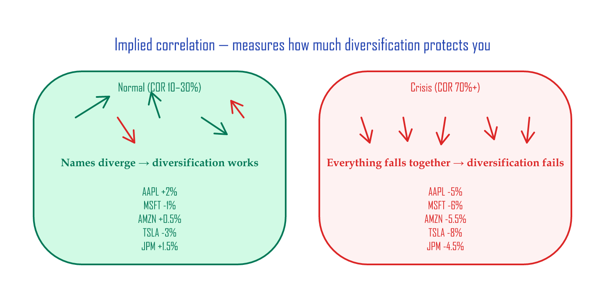
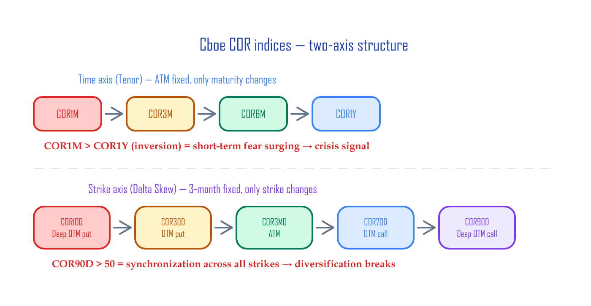
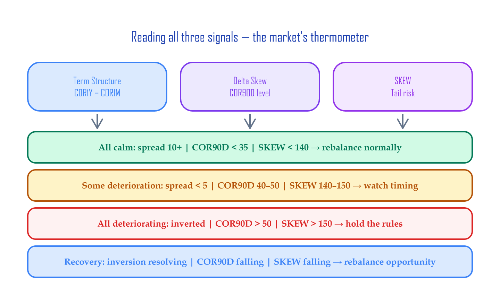

# Volatility Dashboard — Tracking Correlation + Skew

> **Copy the Google Sheet:** [CBOE Correlation Indices](https://docs.google.com/spreadsheets/d/1lsmru9wPyVSi_9gswrVSBYpXUj3ZhJD3FyMRop2orpY/copy) (template for daily logging)

If you track Cboe's published implied correlation (COR) indices and the SKEW index every day, you can read **shifts in market participants' psychology before the news catches up**. This article walks through building a volatility dashboard in Google Sheets, and gives you a one-minute daily routine for reading three signals.

> 📚 **Where this article fits**: this is the *tracking & interpretation tool*. The *taxonomy and conceptual background* of the indices is in [Market-Sentiment Volatility Indices](implied-correlation.md). They're a pair.

---

## 30-second preview: the three things to check daily

| Signal | What it reads | Calm (e.g. Oct 27) | Stressed (e.g. Oct 16) |
|:-------|:--------------|:-------------------|:-----------------------|
| **Term-structure spread** | COR1Y − COR1M | 11.1 (wide) | 2.9 (narrow) |
| **Strike-axis convergence (Delta Skew)** | COR90D level | 36.5 | **54.6** |
| **SKEW index** | Tail-risk pricing for extreme drops | 148.5 | 147.1 |

Don't worry if the terms are unfamiliar — they're explained right below. **All three signals deteriorating at the same time** means market stress is building structurally.

---

## Core concepts: 3-minute primer

### What implied correlation is

In a normal market, the 500 stocks in the S&P 500 each move on their own — some up, some down. That's why diversification works. But in a crisis, **every stock starts moving in the same direction at the same time**. That's the moment diversification stops protecting you.

**Implied correlation** quantifies that "synchronization level" on a 0–100% scale. It's computed from the relationship between the S&P 500 index option's implied volatility (IV — the market's forward volatility expectation, baked into option prices) and the IVs of the top 50 single-name options.

| State | COR level | What it means |
|:------|:----------|:--------------|
| Normal | ~10–30% | Names move independently (diversification works) |
| Stressed | 50%+ | Everything moves the same direction (diversification weakens) |
| Crisis | 70%+ | Across-the-board co-crash |



### The Cboe COR index family

Cboe publishes implied correlation along two axes (see [Market-Sentiment Volatility Indices](./implied-correlation.md) for the full background):

**Time axis (Tenor) — ATM fixed, only maturity changes:**

COR1M → COR3M → COR6M → COR9M → COR1Y

Normally, longer-dated uncertainty is higher. If the short end (COR1M) overtakes the long end (COR1Y), the message is "there's a fire **right now**."

**Strike axis (Delta Skew) — 3-month maturity fixed, only strike changes:**

COR10D (puts far below ATM) → COR30D → COR3MD (ATM) → COR70D → COR90D (calls far above ATM)

When COR90D rises sharply, synchronization is spreading even into the deep-OTM region.



### The SKEW index

SKEW measures **the tail-risk premium** the S&P 500 options market is paying for extreme downside protection. When fire-insurance premiums suddenly rise, it means insurers are pricing in higher fire risk. When SKEW rises, institutions are paying more for "crash insurance."

| SKEW level | What it means |
|:-----------|:--------------|
| 120–135 | Normal regime |
| 140–150 | Caution — institutions are loading up on puts |
| 150+ | High tail-risk pricing |

!!! note "SKEW's historical shift"
    Pre-2020, SKEW averaged ~115 and 140+ readings were rare. Post-2020 the regime shifted up structurally, and 130–145 is closer to the new "normal." The thresholds above reflect the current (post-2020) regime.

!!! note "The SKEW paradox"
    SKEW can actually be **higher during the recovery** than right before the crash. That's because during the crash, institutions already own their puts. After the recovery, they buy fresh puts to hedge against "the next crash." A *low* SKEW reading can therefore be a market-bottom signal.

---

## Step 1: Google Sheets structure

When you [copy the sheet](https://docs.google.com/spreadsheets/d/1lsmru9wPyVSi_9gswrVSBYpXUj3ZhJD3FyMRop2orpY/copy), there are two tabs:

| Tab | Contents | Data |
|:----|:---------|:-----|
| **Tenor Indices (Term structure)** | COR1M, COR3M, COR6M, COR9M, COR1Y + S&P 500 | Daily log |
| **Delta Skew Indices** | COR10D, COR30D, COR3MD, COR70D, COR90D + S&P 500 + SKEW | Daily log |

---

## Step 2: Updating the data

You can pull each index's daily close from the Cboe website for free:

| Index | Cboe dashboard |
|:------|:---------------|
| COR1M | [cboe.com/us/indices/dashboard/cor1m](https://www.cboe.com/us/indices/dashboard/cor1m/) |
| COR3M | [cboe.com/us/indices/dashboard/cor3m](https://www.cboe.com/us/indices/dashboard/cor3m/) |
| COR6M | [cboe.com/us/indices/dashboard/cor6m](https://www.cboe.com/us/indices/dashboard/cor6m/) |
| COR1Y | [cboe.com/us/indices/dashboard/cor1y](https://www.cboe.com/us/indices/dashboard/cor1y/) |
| SKEW | [cboe.com/us/indices/dashboard/skew](https://www.cboe.com/us/indices/dashboard/skew/) |

Read the daily close from each dashboard and add a row to the sheet. You can also use TradingView for live charts (`CBOE:COR3M`, etc.).

---

## The dashboard chart

Combining all three signals into one chart lets you read structural stress at a glance.


Top: COR1M–COR1Y term structure (when the spacing tightens, that's caution; the red region marks inversion). Middle: COR10D–COR90D delta skew (COR90D crossing the dashed red 50 line is stress). Bottom: SKEW index (140+ is caution, 150+ is high).

---

## Step 3: Reading the signals

### Signal 1: Term-structure spread

Watch the **gap between COR1M and COR1Y**.

```
spread = COR1Y - COR1M
```

| Spread | State | Meaning |
|:-------|:------|:--------|
| **Wide (10+)** | Normal | Short end calm, only long-dated uncertainty |
| **Narrowing (≤5)** | Caution | Short-end correlation rising fast → fear is starting |
| **Inverted (negative)** | Danger | COR1M > COR1Y → short-term co-crash mode |

Term-structure inversion was a crisis signal in both the 2008 GFC and the 2020 COVID drawdown.

**Example — stressed (2025-10-16):**

```
COR1M = 19.48,  COR1Y = 22.38
spread = 2.9  ← caution zone
```

**Example — calm (2025-10-27):**

```
COR1M = 7.40,  COR1Y = 18.52
spread = 11.12  ← normal
```

### Signal 2: Delta Skew

Watch the **absolute level of COR90D** and the **gap between COR90D and COR10D**.

| Metric | Normal | Stressed |
|:-------|:-------|:---------|
| **COR90D level** | ≤ 35 | **≥ 50** |
| **COR90D − COR10D gap** | 25+ (well dispersed) | Narrowing (converging) |

When COR90D (deep-OTM call region) rises above 50, the entire market is synchronizing in one direction. When the gap narrows, correlations across all strikes converge toward 1.0 — you spread your eggs across many baskets, but every basket is sitting on the same shelf, and the shelf is tipping. Diversification stops working.

**Example — stressed (2025-10-16):**

```
COR90D = 54.60 ← above 50, stressed
COR10D = 10.57
```

### Signal 3: SKEW

SKEW is logged on the Delta Skew tab.

**Example trajectory:**

| Date | SKEW | S&P 500 | Reading |
|:-----|-----:|--------:|:--------|
| Oct 6 | 142.5 | 6,740 | Normal |
| Oct 10 | 138.9 | 6,553 | Down — put cost actually fell |
| Oct 22 | 152.9 | 6,699 | Institutions buying puts |

Data source: Cboe Global Indices

---

## Step 4: Reading the three together

| Term Structure | COR90D | SKEW | Market state | Response |
|:---------------|:-------|:-----|:-------------|:---------|
| Wide (10+) | ≤35 | Low | **Calm** | Rebalance normally |
| Narrowing | 40–50 | Rising | **Caution** | Mind the rebalancing timing |
| Inverted | **≥50** | High | **Stressed** | Volatility incoming, hold the rules |
| Recovering after inversion | Falling | Falling | **Recovery** | Rebalancing opportunity |

The takeaway: **all three signals deteriorating at once is structural stress**. Just one of them moving could be noise.



---

## Day-to-day routine

| When | What | Time |
|:-----|:-----|:-----|
| After the close | Pull COR + SKEW closes from the Cboe dashboards | 30 sec |
| | Add a row to the sheet | 30 sec |
| | Read the three signals | — |

The checklist:

- [ ] Term-structure spread: wide / narrowing / inverted
- [ ] COR90D level: ≤35 / 40–50 / ≥50
- [ ] SKEW: normal / caution / high
- [ ] Are all three deteriorating at once?

---

## Python version

If you'd rather chart this in Python instead of the sheet, log the data manually into CSV (or export from TradingView).

<details><summary>Python: dashboard chart code</summary>

```python
import pandas as pd
import matplotlib.pyplot as plt
import matplotlib.dates as mdates

# Load CSVs (download from sheet via File > Download > CSV)
# Expected: DATE, COR1M, COR3M, COR6M, COR9M, COR1Y, S&P500
tenor = pd.read_csv('tenor_indices.csv', skiprows=2, parse_dates=['DATE'])
# Expected: DATE, COR90D, COR70D, COR3M, COR30D, COR10D, S&P500, SKEW
skew = pd.read_csv('delta_skew_indices.csv', skiprows=2, parse_dates=['DATE'])

tenor = tenor.dropna(subset=['DATE'])
skew = skew.dropna(subset=['DATE'])

fig, axes = plt.subplots(3, 1, figsize=(14, 12), sharex=True)

# 1. Term Structure
for col, color in [('COR1M','#F44336'), ('COR3M','#FF9800'),
                    ('COR6M','#FFC107'), ('COR9M','#4CAF50'), ('COR1Y','#2196F3')]:
    axes[0].plot(tenor['DATE'], tenor[col], label=col, linewidth=1.5, color=color)
axes[0].set_ylabel('Implied Correlation (%)')
axes[0].set_title('Term Structure — COR1M to COR1Y')
axes[0].legend(loc='upper left', fontsize=8)
axes[0].grid(alpha=0.3)

# 2. Delta Skew
for col, color in [('COR10D','#F44336'), ('COR30D','#FF9800'),
                    ('COR3M','#FFC107'), ('COR70D','#4CAF50'), ('COR90D','#2196F3')]:
    axes[1].plot(skew['DATE'], skew[col], label=col, linewidth=1.5, color=color)
axes[1].set_ylabel('Implied Correlation (%)')
axes[1].set_title('Delta Skew — COR10D to COR90D')
axes[1].legend(loc='upper left', fontsize=8)
axes[1].grid(alpha=0.3)

# 3. SKEW
axes[2].plot(skew['DATE'], skew['SKEW'], color='#9C27B0', linewidth=2, label='SKEW')
axes[2].axhline(140, color='orange', ls='--', alpha=0.5, label='Caution (140)')
axes[2].axhline(150, color='red', ls='--', alpha=0.5, label='High (150)')
axes[2].set_ylabel('SKEW Index')
axes[2].set_title('SKEW — Tail-risk indicator')
axes[2].legend(loc='upper left', fontsize=8)
axes[2].grid(alpha=0.3)

axes[2].xaxis.set_major_formatter(mdates.DateFormatter('%Y-%m'))
plt.tight_layout()
plt.savefig('volatility_dashboard.png', dpi=150, bbox_inches='tight')
plt.show()
```

</details>

<details><summary>Python: spread auto-calculation + alerts</summary>

```python
# Term-structure spread
tenor['spread'] = tenor['COR1Y'] - tenor['COR1M']

# Latest reading
latest = tenor.iloc[-1]
latest_skew = skew.iloc[-1]

print(f"=== {latest['DATE'].strftime('%Y-%m-%d')} signals ===")

spread = latest['spread']
print(f"Term-structure spread: {spread:.1f}", end="")
print("  ← inverted!" if spread < 0 else "  ← caution" if spread < 5 else "  ← normal")

cor90d = latest_skew['COR90D']
print(f"COR90D: {cor90d:.1f}", end="")
print("  ← stressed" if cor90d > 50 else "  ← caution" if cor90d > 40 else "  ← normal")

skew_val = latest_skew['SKEW']
print(f"SKEW: {skew_val:.1f}", end="")
print("  ← high" if skew_val > 150 else "  ← caution" if skew_val > 140 else "  ← normal")
```

</details>

---

## Limitations

1. **End-of-day data** — COR indices are computed at the close. They don't reflect intraday changes.

2. **Constituent changes** — the top 50 S&P 500 names rotate periodically based on market cap. Historical and current data may have different constituents.

3. **SKEW's instability** — in extreme market conditions, SKEW computation can be unstable. Cboe has been reviewing methodology improvements since 2025.

4. **Correlation ≠ causation** — a COR spike doesn't always foreshadow a crash. Short-term events (earnings season, Fed announcements) can cause temporary jumps.

---

## Wrap-up

This dashboard is the **market's thermometer**:

1. **Term-structure spread** — is short-term fear overtaking the long term?
2. **COR90D** — overall market synchronization
3. **SKEW** — how much institutions are paying for tail risk

For a long-term investor, the value of this dashboard is **context, not timing**:

- All three calm → "go ahead and rebalance"
- All three deteriorating → "don't rush, hold the rules"
- Recovery signals → "rebalancing opportunity, even institutions are calming down"

It takes one minute a day. The point is to keep you from getting shaken by fear, and to help you stick to your rules.

---

## References

- [Market-Sentiment Volatility Indices — Implied Correlation and the IV Surface](./implied-correlation.md)
- [Volatility Skew — The S&P 500's Smirk](./skew.md)
- [Cboe Implied Correlation Index White Paper (PDF)](https://cdn.cboe.com/resources/indices/documents/Implied_Correlation-WhitePaper-v1.0.5.pdf)
- [Cboe SKEW Index White Paper (PDF)](https://cdn.cboe.com/resources/indices/documents/SKEWwhitepaperjan2011.pdf)
- [Cboe Implied Correlation Indices](https://www.cboe.com/us/indices/implied/)

*Cboe and VIX are registered trademarks of Cboe Exchange, Inc. SPX and S&P 500 are registered trademarks of S&P Global. This article has no affiliation with or endorsement from Cboe or S&P Global. Index data: Cboe Global Indices.*

---

*Previous: [0DTE Gamma Patterns — How GEX shifts intraday](gex-0dte-patterns.md)*
