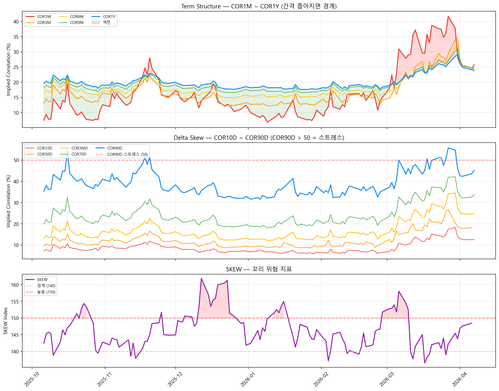

# 변동성 대시보드 — Correlation + Skew 추적

> **구글 시트 복사하기:** [CBOE Correlation Indices](https://docs.google.com/spreadsheets/d/1lsmru9wPyVSi_9gswrVSBYpXUj3ZhJD3FyMRop2orpY/copy) (데이터 기록용 템플릿)

Cboe가 공개하는 내재상관관계(COR) 지수들과 SKEW 지수를 매일 추적하면, **뉴스보다 빠르게 시장 참여자들의 심리 변화**를 읽을 수 있습니다. 이 글에서는 구글 시트로 변동성 대시보드를 만들고, 세 가지 신호를 매일 1분이면 확인하는 방법을 정리합니다.

---

## 30초 미리보기: 매일 확인하는 3가지

| 신호 | 무엇을 보는가 | 안정 (예: 10/27) | 스트레스 (예: 10/16) |
|:-----|:------------|:----------------|:-------------------|
| **Term Structure 스프레드** | COR1Y - COR1M | 11.1 (넓음) | 2.9 (좁음) |
| **Delta Skew** | COR90D 수준 | 36.5 | **54.6** |
| **SKEW 지수** | 꼬리 위험 | 148.5 | 147.1 |

세 신호가 **동시에** 악화되면 시장 스트레스가 구조적으로 높아지고 있다는 신호입니다.

---

## 핵심 개념: 3분 요약

### 내재상관관계(Implied Correlation)란

평소 S&P500의 500개 종목은 제각각 움직입니다 — 어떤 종목은 오르고, 어떤 종목은 내립니다. 이것이 분산 투자가 작동하는 이유입니다. 그런데 위기가 오면 **모든 종목이 동시에 같은 방향으로 움직이기 시작**합니다. 분산 투자의 보호막이 사라지는 순간입니다.

**내재상관관계**는 이 "동조화 수준"을 0~100%로 수치화한 것입니다. S&P500 지수 옵션의 IV와 상위 50개 종목의 개별 옵션 IV 사이의 관계로 계산합니다.

| 상태 | COR 수준 | 의미 |
|:----|:---------|:-----|
| 평상시 | ~10-30% | 종목별로 각자 움직임 (분산 투자가 작동) |
| 스트레스 | 50% 이상 | 모든 종목이 같은 방향 (분산 효과 약화) |
| 위기 | 70%+ | 전면 동반 폭락 |

### Cboe COR 지수 체계

Cboe는 내재상관관계를 두 축으로 나눠 제공합니다 (자세한 배경은 [시장 심리 변동성 지수](./implied-correlation.md) 참조):

**시간축 (Tenor) — ATM 고정, 만기만 변경:**

COR1M → COR3M → COR6M → COR9M → COR1Y

단기(COR1M)가 장기(COR1Y)를 추월하면 "지금 당장" 공포가 커지고 있다는 뜻입니다.

**행사가축 (Delta Skew) — 3개월 고정, 행사가만 변경:**

COR10D(깊은 OTM put) → COR30D → COR3MD(ATM) → COR70D → COR90D(깊은 OTM call)

COR90D가 급등하면 깊은 OTM 영역까지 동조화가 퍼지고 있다는 뜻입니다.

### SKEW 지수

S&P500 옵션 시장에서 **꼬리 위험(tail risk)**을 측정합니다. OTM 풋옵션의 상대적 비용을 반영하며, 높을수록 기관이 하방 보험에 더 많이 지불하고 있다는 뜻입니다.

| SKEW 수준 | 의미 |
|:---------|:-----|
| 120~135 | 평상시 |
| 140~150 | 경계 — 기관의 풋 매수 증가 |
| 150+ | 높은 꼬리 위험 인식 |

!!! note "SKEW의 역사적 변화"
    2020년 이전에는 SKEW 평균이 ~115였고 140 이상은 매우 드물었습니다. 2020년 이후 구조적으로 상향 이동하여 130~145가 새로운 "평상시"에 가까워졌습니다. 위 기준은 현재(post-2020) 시장 환경을 반영합니다.

!!! note "SKEW의 역설"
    SKEW는 폭락 **직전**보다 **회복기**에 더 높을 수 있습니다. 폭락 중에는 이미 풋을 보유한 상태이고, 회복 후 "다음 폭락"에 대비해 새로 풋을 사기 때문입니다. SKEW가 낮다는 것은 오히려 시장 바닥 근처일 수 있습니다.

---

## 1단계: 구글 시트 구조

[시트를 복사](https://docs.google.com/spreadsheets/d/1lsmru9wPyVSi_9gswrVSBYpXUj3ZhJD3FyMRop2orpY/copy)하면 2개 탭이 있습니다:

| 탭 | 내용 | 데이터 |
|:---|:-----|:------|
| **Tenor Indices (Term structure)** | COR1M, COR3M, COR6M, COR9M, COR1Y + S&P500 | 일별 기록 |
| **Delta Skew Indices** | COR10D, COR30D, COR3MD, COR70D, COR90D + S&P500 + SKEW | 일별 기록 |

---

## 2단계: 데이터 업데이트

Cboe 웹사이트에서 각 지수의 일별 종가를 무료로 확인할 수 있습니다:

| 지수 | Cboe 대시보드 |
|:----|:-------------|
| COR1M | [cboe.com/us/indices/dashboard/cor1m](https://www.cboe.com/us/indices/dashboard/cor1m/) |
| COR3M | [cboe.com/us/indices/dashboard/cor3m](https://www.cboe.com/us/indices/dashboard/cor3m/) |
| COR6M | [cboe.com/us/indices/dashboard/cor6m](https://www.cboe.com/us/indices/dashboard/cor6m/) |
| COR1Y | [cboe.com/us/indices/dashboard/cor1y](https://www.cboe.com/us/indices/dashboard/cor1y/) |
| SKEW | [cboe.com/us/indices/dashboard/skew](https://www.cboe.com/us/indices/dashboard/skew/) |

각 대시보드에서 종가를 확인하고 시트에 행을 추가합니다. TradingView에서 `CBOE:COR3M` 등으로 실시간 차트도 가능합니다.

---

## 대시보드 차트



상단: COR1M~COR1Y Term Structure (간격 좁아지면 경계, 빨간 영역 = 역전). 중단: COR10D~COR90D Delta Skew (COR90D가 빨간 점선 50 위로 가면 스트레스). 하단: SKEW 지수 (140 이상 경계, 150 이상 높음).

---

## 3단계: 신호 읽기

### 신호 1: Term Structure 스프레드

**COR1M과 COR1Y의 차이**를 봅니다.

```
스프레드 = COR1Y - COR1M
```

| 스프레드 | 상태 | 의미 |
|:--------|:-----|:-----|
| **넓음 (10+)** | 정상 | 단기 안정, 장기만 약간의 불확실성 |
| **좁아지는 중 (5 이하)** | 경계 | 단기 상관관계 급등 → 공포 시작 |
| **역전 (음수)** | 위험 | COR1M > COR1Y → 단기 동반 폭락 모드 |

Term Structure 역전은 2008년 금융위기와 2020년 코로나 폭락에서 관찰된 위기 신호입니다.

**예시 — 스트레스 (2025-10-16):**

```
COR1M = 19.48,  COR1Y = 22.38
스프레드 = 2.9  ← 경계 구간
```

**예시 — 안정 (2025-10-27):**

```
COR1M = 7.40,  COR1Y = 18.52
스프레드 = 11.12  ← 정상
```

### 신호 2: Delta Skew

**COR90D의 절대 수준**과 **COR90D와 COR10D의 차이**를 봅니다.

| 지표 | 정상 | 스트레스 |
|:----|:-----|:--------|
| **COR90D 수준** | 35 이하 | **50 이상** |
| **COR90D - COR10D 차이** | 25+ (넓게 분산) | 좁아지는 중 (수렴) |

COR90D(깊은 OTM call 영역)가 50 이상으로 치솟으면, 시장 전체가 한 방향으로 동조화되고 있다는 뜻입니다. 차이가 좁아지면 모든 행사가에서 상관관계가 1.0으로 수렴 — 분산 투자가 작동하지 않는 상태입니다.

**예시 — 스트레스 (2025-10-16):**

```
COR90D = 54.60 ← 50 이상, 스트레스
COR10D = 10.57
```

### 신호 3: SKEW 지수

SKEW는 Delta Skew 탭에 함께 기록됩니다.

**추이 예시:**

| 날짜 | SKEW | S&P500 | 해석 |
|:----|-----:|-------:|:-----|
| 10/6 | 142.5 | 6,740 | 평상시 |
| 10/10 | 138.9 | 6,553 | 하락 — 오히려 풋 비용 하락 |
| 10/22 | 152.9 | 6,699 | 기관 풋 매수 증가 |

데이터 출처: Cboe Global Indices

---

## 4단계: 종합 해석 — 세 신호 조합

| Term Structure | COR90D | SKEW | 시장 상태 | 대응 |
|:-------------|:---------|:-----|:---------|:----|
| 넓음 (10+) | 35 이하 | 낮음 | **안정** | 리밸런싱 정상 진행 |
| 좁아지는 중 | 40~50 | 상승 | **경계** | 리밸런싱 타이밍 주의 |
| 역전 | **50 이상** | 높음 | **스트레스** | 급변동 가능, 원칙 고수 |
| 역전 후 회복 | 하락 중 | 하락 | **회복** | 리밸런싱 기회 |

핵심: **세 신호가 동시에 악화되면 구조적 스트레스**입니다. 하나만 악화되면 노이즈일 수 있습니다.

---

## 매일 사용하는 법

| 시점 | 할 일 | 소요 시간 |
|:----|:------|:---------|
| 장 마감 후 | Cboe 대시보드에서 COR + SKEW 종가 확인 | 30초 |
| | 시트에 행 추가 | 30초 |
| | 3가지 신호 확인 | — |

체크리스트:

- [ ] Term Structure 스프레드: 넓음 / 좁아지는 중 / 역전
- [ ] COR90D 수준: 35 이하 / 40~50 / 50 이상
- [ ] SKEW: 정상 / 경계 / 높음
- [ ] 세 신호 동시 악화 여부

---

## Python 버전

시트 대신 Python으로 데이터를 시각화합니다. Cboe 대시보드에서 데이터를 수동으로 CSV에 기록하거나, TradingView에서 내보내기합니다.

### Term Structure + Delta Skew + SKEW 차트

```python
import pandas as pd
import matplotlib.pyplot as plt
import matplotlib.dates as mdates

# CSV 로드 (시트에서 File > Download > CSV로 내려받은 파일)
# 예상 형식: DATE, COR1M, COR3M, COR6M, COR9M, COR1Y, S&P500
tenor = pd.read_csv('tenor_indices.csv', skiprows=2, parse_dates=['DATE'])
# 예상 형식: DATE, COR90D, COR70D, COR3M, COR30D, COR10D, S&P500, SKEW
skew = pd.read_csv('delta_skew_indices.csv', skiprows=2, parse_dates=['DATE'])

tenor = tenor.dropna(subset=['DATE'])
skew = skew.dropna(subset=['DATE'])

fig, axes = plt.subplots(3, 1, figsize=(14, 12), sharex=True)

# 1. Term Structure
for col, color in [('COR1M','#F44336'), ('COR3M','#FF9800'),
                    ('COR6M','#FFC107'), ('COR9M','#4CAF50'), ('COR1Y','#2196F3')]:
    axes[0].plot(tenor['DATE'], tenor[col], label=col, linewidth=1.5, color=color)
axes[0].set_ylabel('Implied Correlation (%)')
axes[0].set_title('Term Structure — COR1M ~ COR1Y')
axes[0].legend(loc='upper left', fontsize=8)
axes[0].grid(alpha=0.3)

# 2. Delta Skew
for col, color in [('COR10D','#F44336'), ('COR30D','#FF9800'),
                    ('COR3M','#FFC107'), ('COR70D','#4CAF50'), ('COR90D','#2196F3')]:
    axes[1].plot(skew['DATE'], skew[col], label=col, linewidth=1.5, color=color)
axes[1].set_ylabel('Implied Correlation (%)')
axes[1].set_title('Delta Skew — COR10D ~ COR90D')
axes[1].legend(loc='upper left', fontsize=8)
axes[1].grid(alpha=0.3)

# 3. SKEW
axes[2].plot(skew['DATE'], skew['SKEW'], color='#9C27B0', linewidth=2, label='SKEW')
axes[2].axhline(140, color='orange', ls='--', alpha=0.5, label='경계 (140)')
axes[2].axhline(150, color='red', ls='--', alpha=0.5, label='높음 (150)')
axes[2].set_ylabel('SKEW Index')
axes[2].set_title('SKEW — 꼬리 위험 지표')
axes[2].legend(loc='upper left', fontsize=8)
axes[2].grid(alpha=0.3)

axes[2].xaxis.set_major_formatter(mdates.DateFormatter('%Y-%m'))
plt.tight_layout()
plt.savefig('volatility_dashboard.png', dpi=150, bbox_inches='tight')
plt.show()
```

### 스프레드 자동 계산 + 경고 신호

```python
# Term Structure 스프레드
tenor['spread'] = tenor['COR1Y'] - tenor['COR1M']

# 최근 상태 확인
latest = tenor.iloc[-1]
latest_skew = skew.iloc[-1]

print(f"=== {latest['DATE'].strftime('%Y-%m-%d')} 신호 ===")

spread = latest['spread']
print(f"Term Structure 스프레드: {spread:.1f}", end="")
print("  ← 역전!" if spread < 0 else "  ← 경계" if spread < 5 else "  ← 정상")

cor90d = latest_skew['COR90D']
print(f"COR90D: {cor90d:.1f}", end="")
print("  ← 스트레스" if cor90d > 50 else "  ← 경계" if cor90d > 40 else "  ← 정상")

skew_val = latest_skew['SKEW']
print(f"SKEW: {skew_val:.1f}", end="")
print("  ← 높음" if skew_val > 150 else "  ← 경계" if skew_val > 140 else "  ← 정상")
```

---

## 한계

1. **EOD(장 마감) 데이터** — COR 지수는 장 마감 기준입니다. 장중 변화는 반영되지 않습니다.

2. **구성 종목 변경** — S&P500 상위 50개 종목은 시가총액에 따라 정기적으로 교체됩니다. 과거 데이터와 현재 데이터의 구성 종목이 다를 수 있습니다.

3. **SKEW의 불안정성** — 극단적 시장 상황에서 SKEW 계산이 불안정해질 수 있습니다. Cboe는 2025년부터 SKEW 방법론 개선을 검토 중입니다.

4. **상관관계 ≠ 인과관계** — COR 급등이 반드시 폭락을 의미하지 않습니다. 단기 이벤트(실적 시즌, 연준 발표 등)로도 일시적 급등이 가능합니다.

---

## 마무리

이 대시보드는 **시장의 체온계**입니다:

1. **Term Structure 스프레드** — 단기 공포가 장기를 추월하는지
2. **COR90D** — 시장 전체의 동조화 수준
3. **SKEW** — 기관이 꼬리 위험에 얼마나 지불하는지

장기 투자자에게 이 대시보드의 가치는 **타이밍이 아닌 맥락**입니다:

- 세 신호가 모두 안정이면 → "리밸런싱해도 괜찮다"는 확인
- 세 신호가 동시에 악화되면 → "지금은 서두르지 말자, 원칙을 지키자"
- 회복 신호가 보이면 → "리밸런싱 기회, 기관도 진정되고 있다"

매일 1분이면 됩니다. 공포에 흔들리지 않고 원칙을 지키는 데 도움이 됩니다.

---

## 참고

- [시장 심리 변동성 지수 — Implied Correlation과 IV Surface](./implied-correlation.md)
- [변동성 Skew — S&P500 지수 옵션의 썩소](./skew.md)
- [Cboe Implied Correlation Index White Paper (PDF)](https://cdn.cboe.com/resources/indices/documents/Implied_Correlation-WhitePaper-v1.0.5.pdf)
- [Cboe SKEW Index White Paper (PDF)](https://cdn.cboe.com/resources/indices/documents/SKEWwhitepaperjan2011.pdf)
- [Cboe Implied Correlation Indices](https://www.cboe.com/us/indices/implied/)

*Cboe, VIX는 Cboe Exchange, Inc.의 등록 상표입니다. SPX, S&P 500은 S&P Global의 등록 상표입니다. 이 글은 Cboe 또는 S&P Global과 제휴 또는 보증 관계가 없습니다. 지수 데이터 출처: Cboe Global Indices.*
