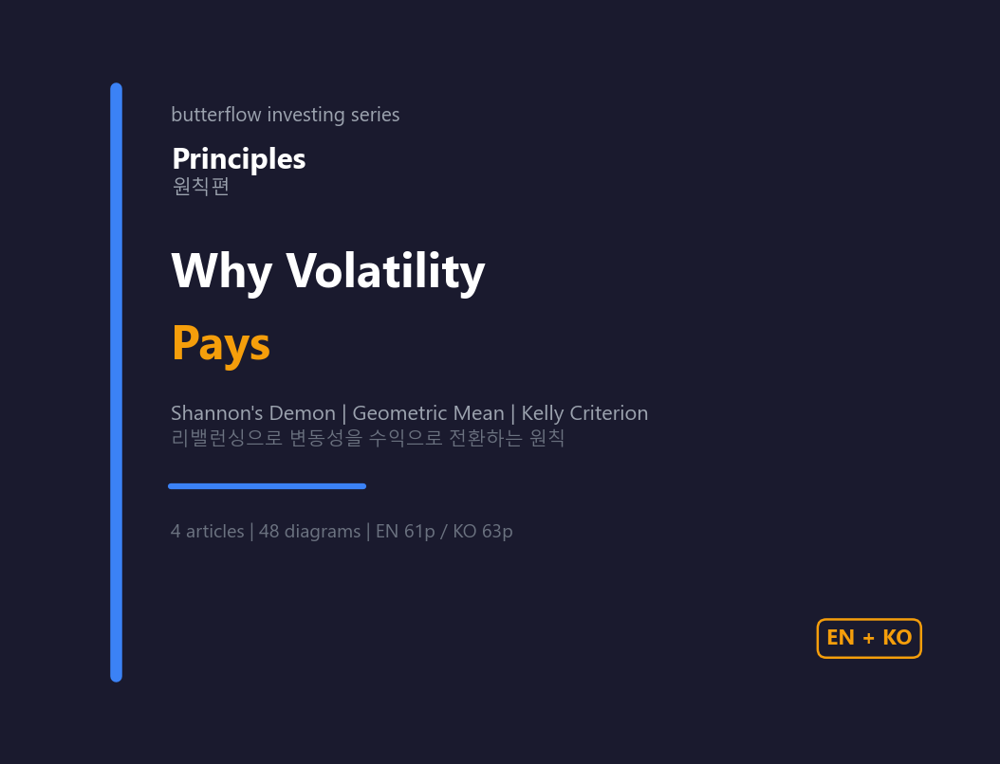
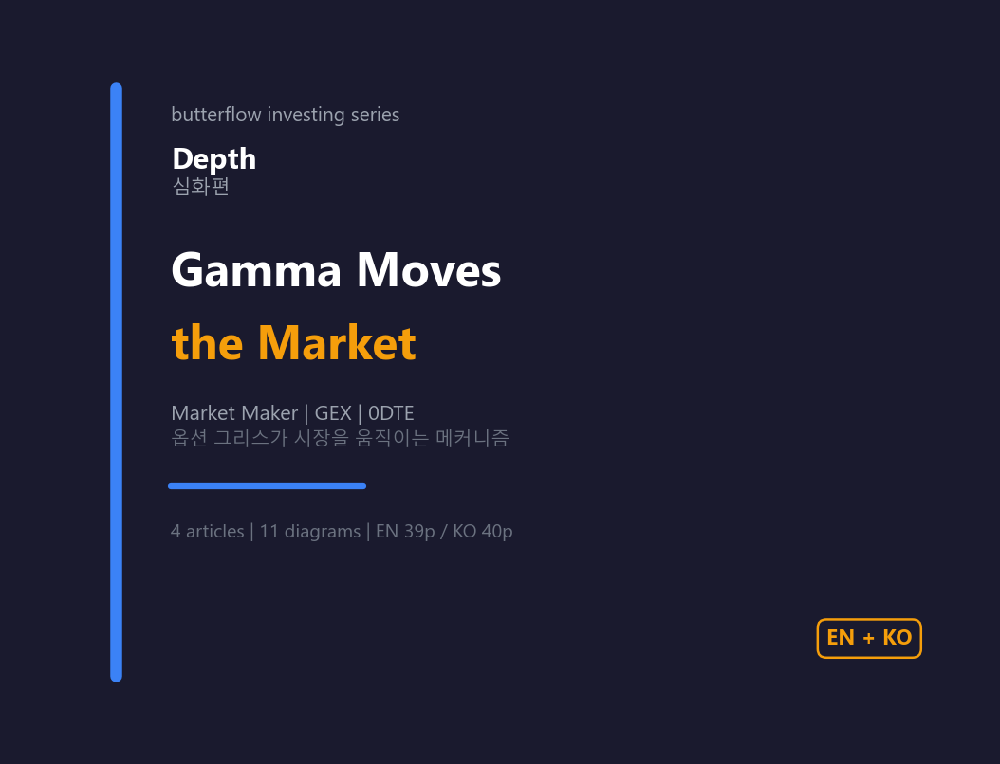
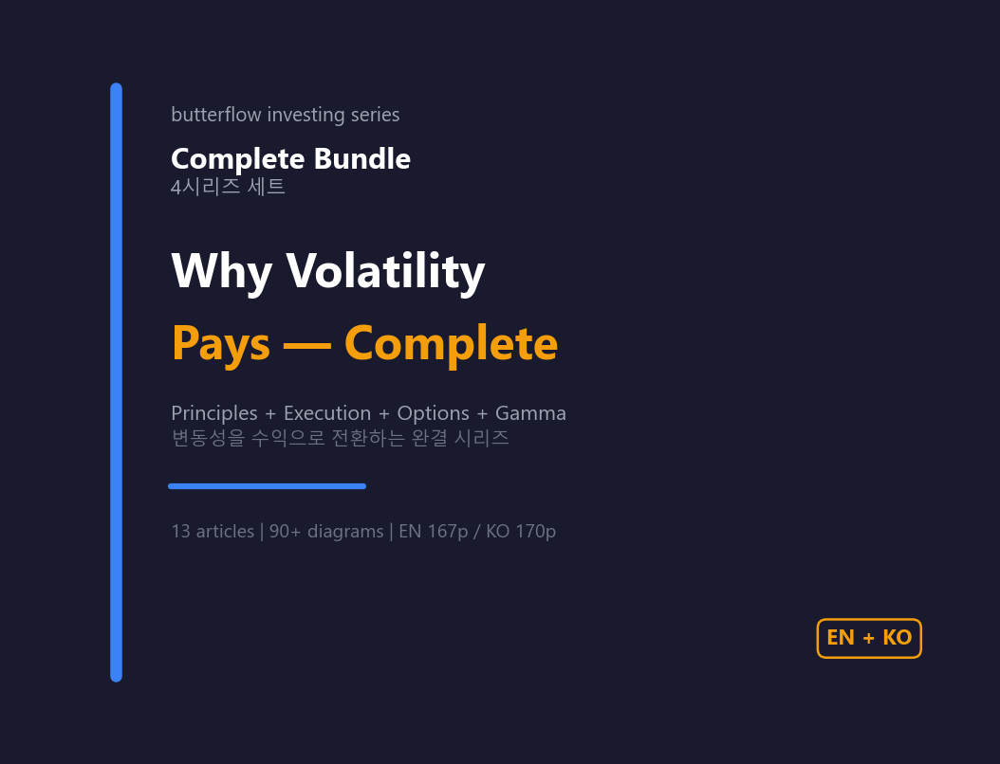

# Investment Series — Why Volatility Pays

The fact that prices move up and down (volatility) can itself be a source of return. **From first principles to options in practice — a 13-article curriculum.** Each series builds on the previous one — read them in order.

!!! tip "What this series promises"
    - **Formulas at arithmetic level only** — no Black–Scholes, no calculus
    - **90+ original diagrams** — "one picture is better than 100 words"
    - **Conversational English** in the spirit of *Psychology of Money*
    - **Real code** — TradingView Pine Scripts, Google Sheets, Python

## The four series

| Series | Articles | Pages | Core question |
|:-------|:---:|:---:|:---|
| **Principles** | 4 | 61p | Why does volatility pay? |
| **Execution** | 3 | 35p | How do you use VIX to size positions? |
| **Extension** | 2 | 32p | How do you take it one step further with options? |
| **Depth** | 4 | 39p | How does gamma actually move the market? |
| **Complete bundle** | 13 | **167p** | Principles → Execution → Extension → Depth |

---

## Principles — Why Volatility Pays (Part 1 free)

1. **[Shannon's Demon](s1-shannons-demon.md)** — How to make money in a random walk **(free)**
2. The St. Petersburg Paradox and the Geometric Mean
3. Kelly's Criterion
4. No Edge in the Game, Edge in the Market

[Buy on Gumroad — Principles](https://butt2rflow.gumroad.com/l/aejfrj){ .md-button .md-button--primary }

---

## Execution — Read VIX, Size Positions

1. **Volatility — Friend or Foe?** — HV vs IV, how to read VIX, the SVXY 2018 collapse
2. **Position Sizing — The Trailing-Signal Playbook** — Volatility targeting, inverse-vol weighting, SPY backtest 2006–2025
3. **Leading Signals and Practice** — IVTS three zones, VolVol golden/death cross, Vomma Zone, real-world execution

[Preview →](s2-preview.md)

[Buy on Gumroad — Execution](https://butt2rflow.gumroad.com/l/ozijat){ .md-button .md-button--primary }

---

## Extension — One Step Further With Options

1. **The Nature of Options — Insurance, Time, and Volatility** — Strike, expiration, moneyness, IV, theta, the time-value paradox
2. **Options in Practice — LEAP, Insurance, and Harvesting** — Three strategies for the long-term investor

[Preview →](s3-preview.md)

[Buy on Gumroad — Extension](https://butt2rflow.gumroad.com/l/ozuyjb){ .md-button .md-button--primary }

---

## Depth — Gamma Moves the Market

1. **Gamma — The Acceleration of Delta** — Gamma fundamentals and the gamma squeeze
2. **Dynamic Hedging by Market Makers** — Short gamma = arsonist, long gamma = firefighter
3. **GEX — The Invisible Hand That Moves the Market** — Gamma exposure, the flip point
4. **0DTE — The Age of the Gamma Bomb** — How same-day-expiry options reshaped market structure

[Preview →](s4-preview.md)

[Buy on Gumroad — Depth](https://butt2rflow.gumroad.com/l/cwwzss){ .md-button .md-button--primary }

---

## Complete Bundle — All four series

**167 pages · 90+ diagrams · 33% off vs. buying each series individually.**

The full curriculum from "why volatility pays" to "how gamma moves the market" — all 13 articles in one PDF, with cross-series links so concepts build naturally.

[**Buy the Complete Bundle on Gumroad**](https://butt2rflow.gumroad.com/l/dbkyt){ .md-button .md-button--primary }

