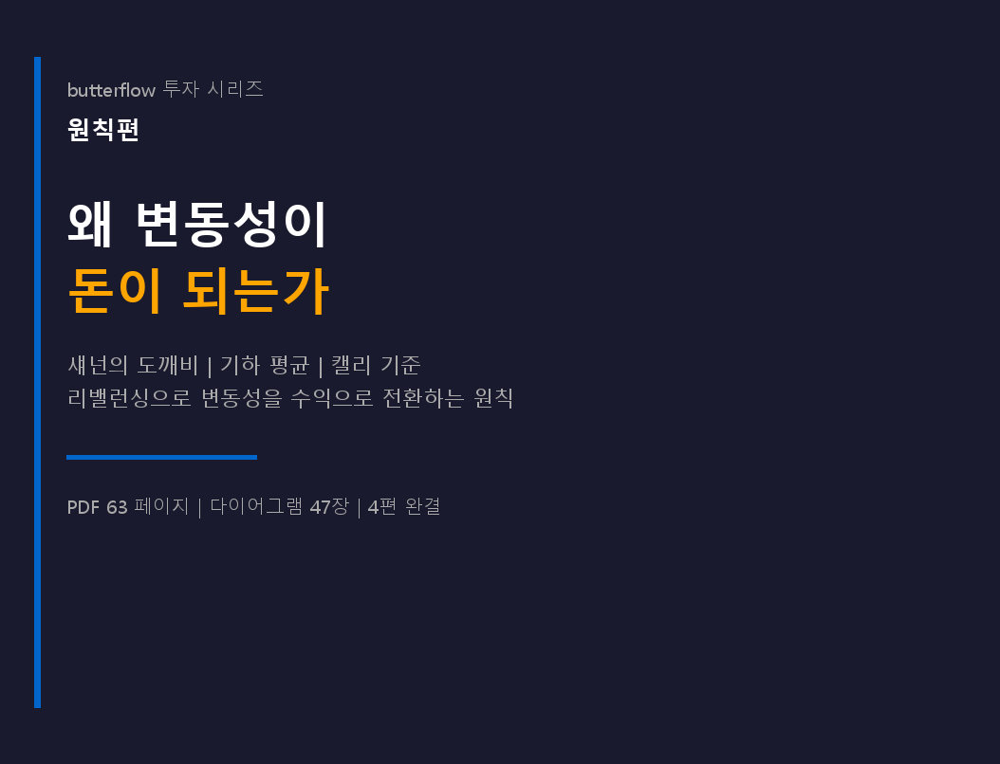
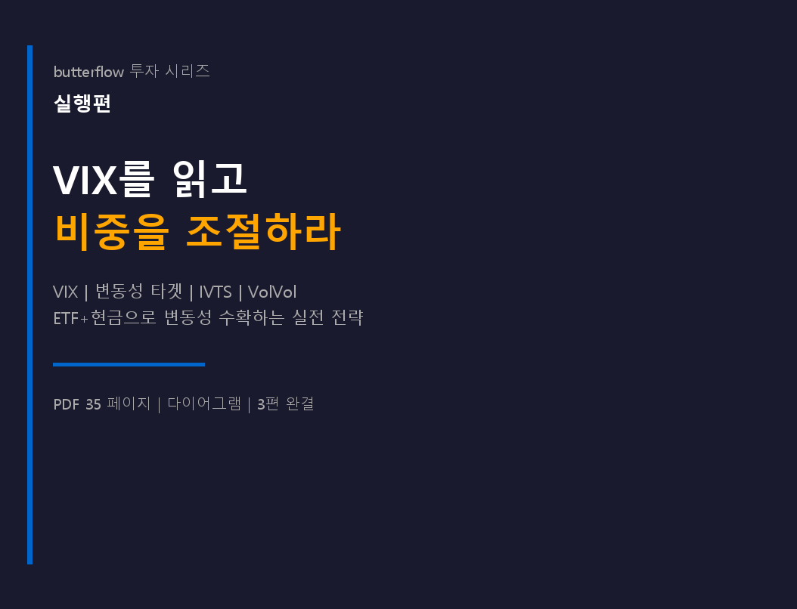
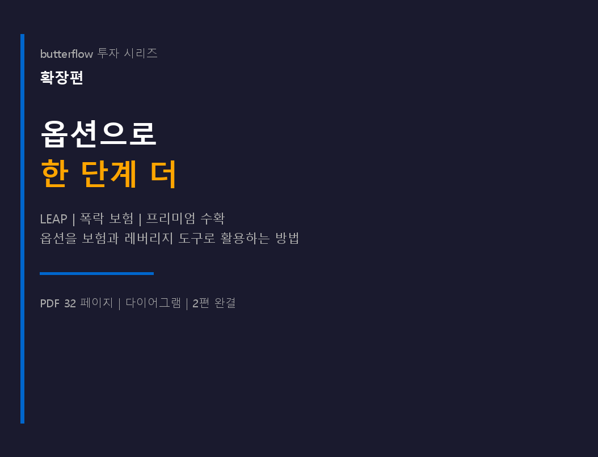
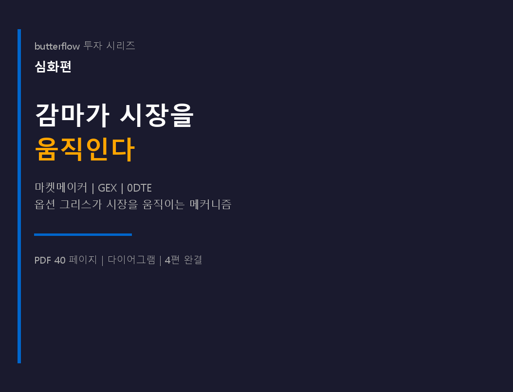
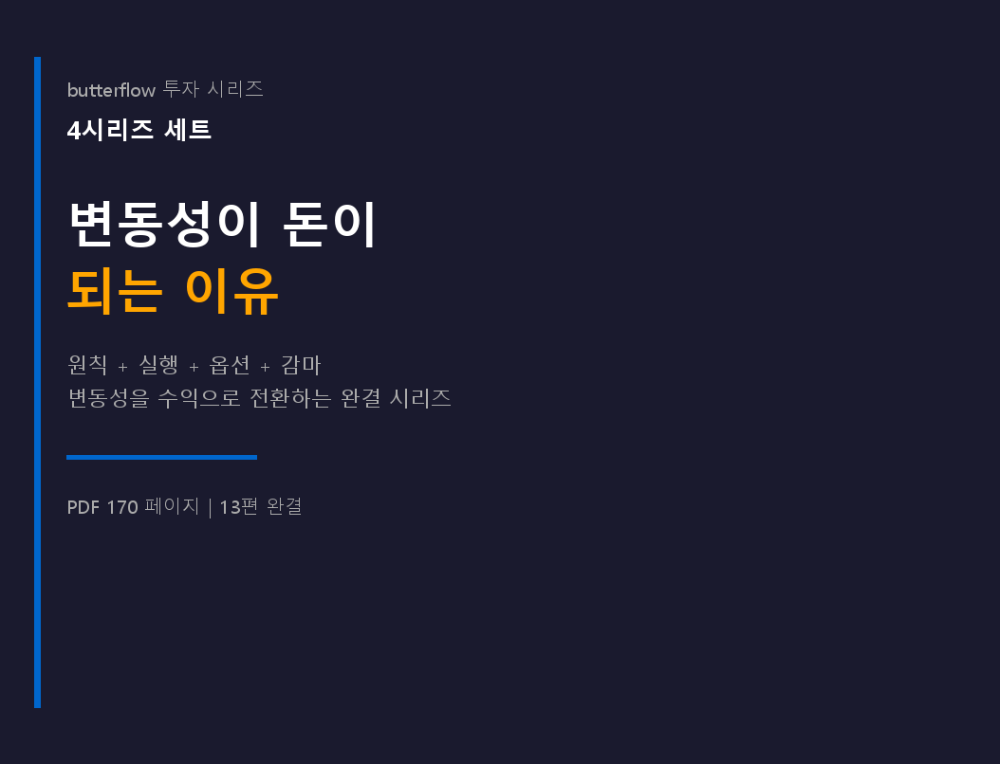

# 투자 시리즈 — 변동성이 돈이 되는 이유

주가가 오르내리는 것(변동성) 자체가 수익의 원천이 될 수 있습니다. **그 원칙부터 옵션 실전까지, 13편의 단계별 학습 시리즈.** 각 시리즈는 앞 시리즈를 전제로 합니다 — 순서대로 읽는 것을 추천합니다.

!!! tip "이 시리즈의 약속"
    - **수학 공식은 사칙연산 수준** — 블랙-숄즈, 적분, 미분 없음
    - **다이어그램 90장+** — "한 장의 그림이 100단어보다 낫다"
    - **원본 한국어** — 번역이 아닌, 한국 독자를 염두에 두고 쓴 글
    - **실전 코드** — TradingView Pine Script, Google Sheets, Python 예제 포함

## 시리즈 구성

| 시리즈 | 편수 | 페이지 | 핵심 질문 |
|:-------|:-----|:-------|:---------|
| **원칙편** | 4편 | 65p | 왜 변동성이 돈이 되는가? |
| **실행편** | 3편 | 37p | VIX로 어떻게 비중을 조절하는가? |
| **확장편** | 2편 | 35p | 옵션으로 어떻게 한 단계 더 나아가는가? |
| **심화편** | 4편 | 42p | 감마(옵션 가격의 가속 페달)가 시장을 어떻게 움직이는가? |
| **전 13편 번들** | 13편 | **179p** | 원칙 → 실행 → 확장 → 심화 완결 |

---

## 원칙편 — 왜 변동성이 돈이 되는가 (1편 무료)

1. **[섀넌의 도깨비 (Shannon's Demon)](s1-shannons-demon.md)** — 랜덤 워크에서 돈을 버는 방법 **(무료)**
2. 상트페테르부르크의 역설과 기하 평균
3. 캘리의 기준 (Kelly's Criterion)이 주는 교훈
4. 엣지 없는 게임, 엣지 있는 시장

[크몽 원칙편 (₩12,000)](https://kmong.com/gig/762026){ .md-button .md-button--primary }
[Gumroad (US$6.99)](https://butt2rflow.gumroad.com/l/aejfrj){ .md-button }

---

## 실행편 — VIX를 읽고 비중을 조절하라

1. **변동성, 적인가 친구인가?** — HV/IV, VIX, SVXY 붕괴
2. **비중 조절의 원리 — 후행 신호 전략** — 변동성 타겟팅, SPY 백테스트 (2006~2025)
3. **선행 신호와 실전** — IVTS 세 구역, VolVol, Vomma Zone, TradingView Pine Script

[미리보기 페이지 →](s2-preview.md) · [크몽 실행편 (₩10,000)](https://kmong.com/gig/762058){ .md-button .md-button--primary } [Gumroad (US$4.99)](https://butt2rflow.gumroad.com/l/ozijat){ .md-button }

---

## 확장편 — 옵션으로 한 단계 더

1. **옵션의 본질 — 보험, 시간, 변동성** — moneyness, 시간 감쇠
2. **옵션 실전 — LEAP, 보험, 수확** — Deep ITM 레버리지, Protective Put, Covered Call, TQQQ 숨겨진 비용

[미리보기 페이지 →](s3-preview.md) · [크몽 확장편 (₩10,000)](https://kmong.com/gig/762059){ .md-button .md-button--primary } [Gumroad (US$4.99)](https://butt2rflow.gumroad.com/l/ozuyjb){ .md-button }

---

## 심화편 — 감마가 시장을 움직인다

1. **감마 — 델타의 가속도** — 감마 스퀴즈
2. **마켓메이커의 동적 헷지** — 숏 감마 = 방화범, 롱 감마 = 소방관
3. **GEX (Gamma Exposure) — 보이지 않는 손** — 플립 포인트
4. **0DTE — 감마 폭탄의 시대** — 당일 만기 옵션이 바꾼 시장 구조

[미리보기 페이지 →](s4-preview.md) · [크몽 심화편 (₩10,000)](https://kmong.com/gig/762062){ .md-button .md-button--primary } [Gumroad (US$4.99)](https://butt2rflow.gumroad.com/l/cwwzss){ .md-button }

---

## 전 13편 번들 — 가장 저렴한 선택

**179페이지 · 다이어그램 90장+ · 개별 구매 대비 약 30% 할인.**

원칙편부터 심화편까지 순서대로 읽을 수 있도록 번호와 목차가 통합된 단일 PDF. 개별 구매보다 저렴합니다.

[**크몽 번들 (₩29,000)**](https://kmong.com/gig/762066){ .md-button .md-button--primary }
[**Gumroad Bundle (US$13.99)**](https://butt2rflow.gumroad.com/l/dbkyt){ .md-button }

