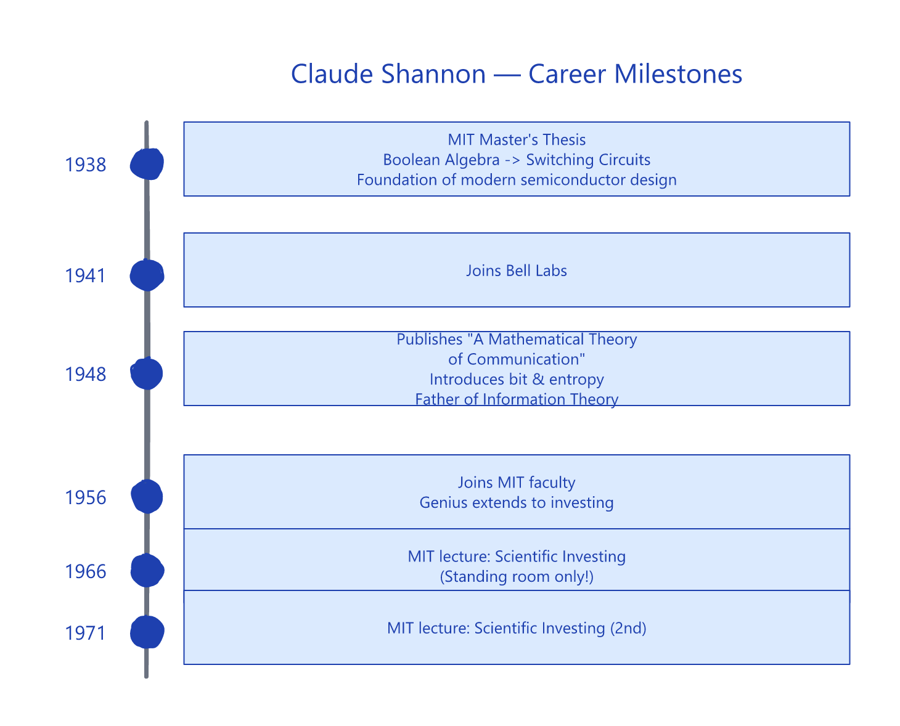
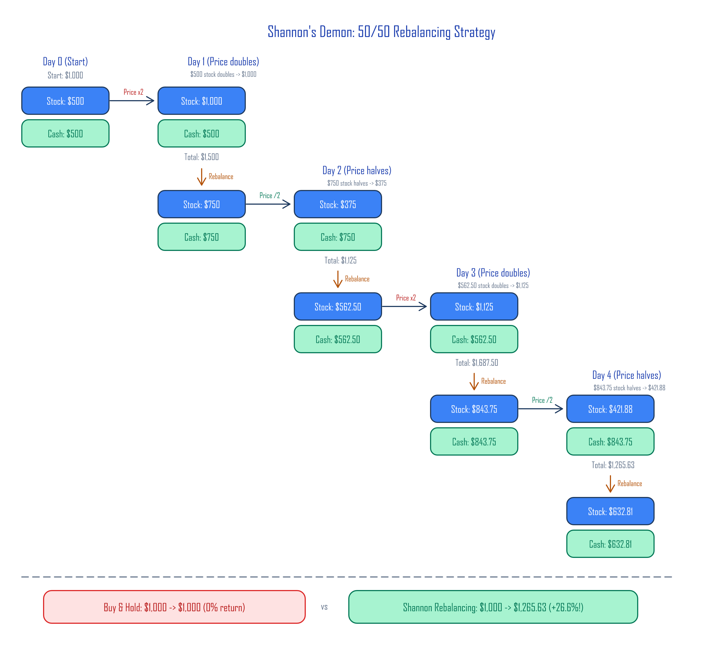
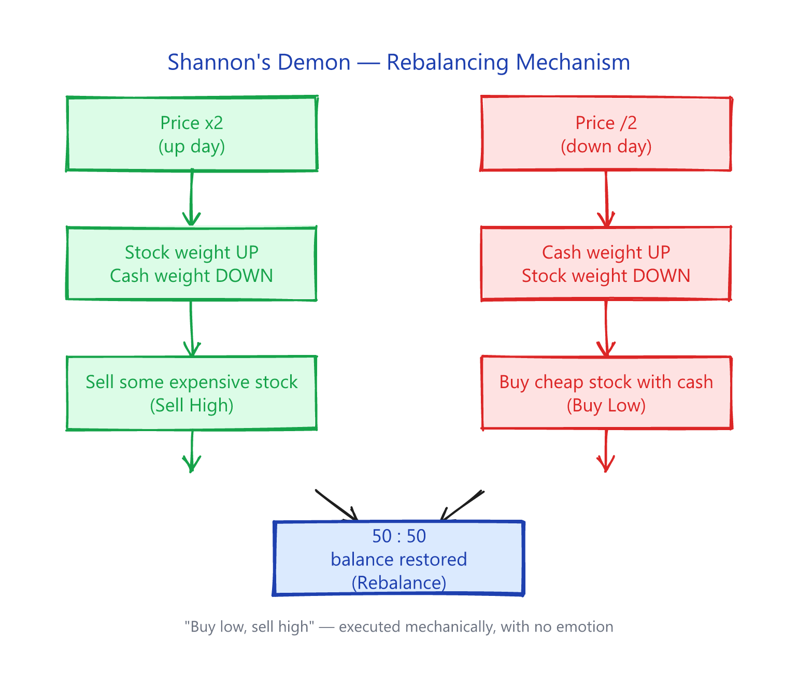
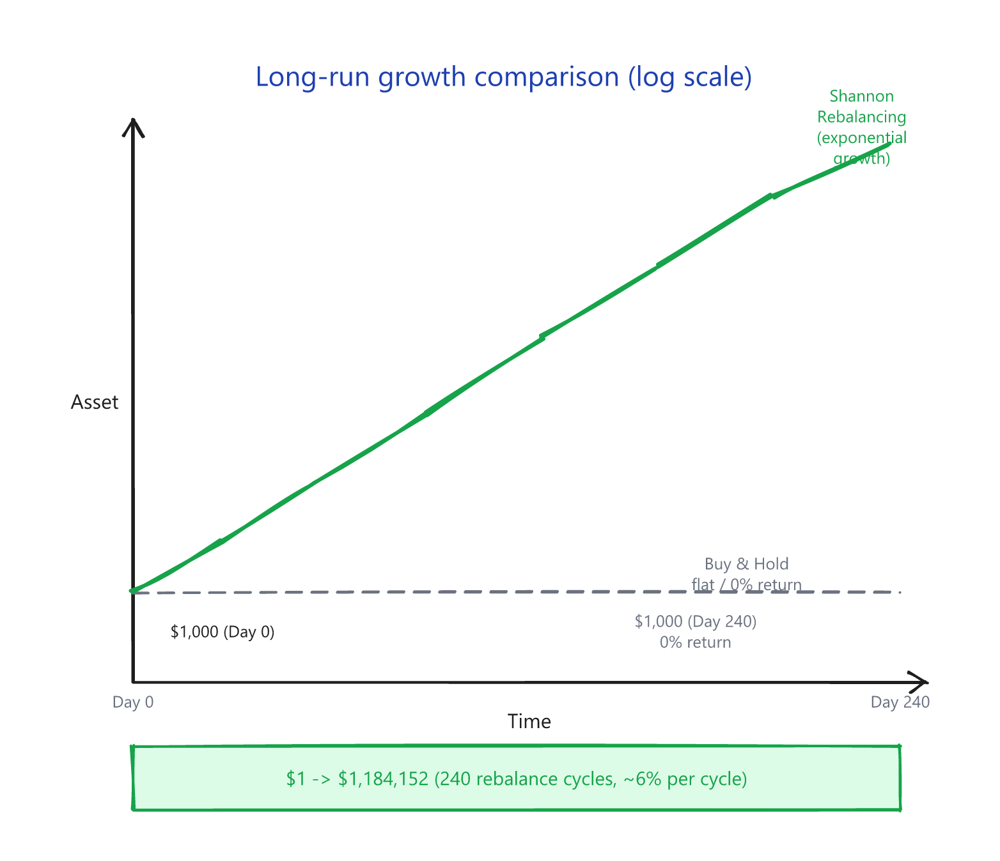
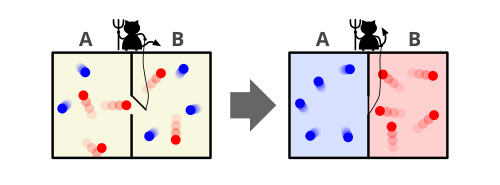
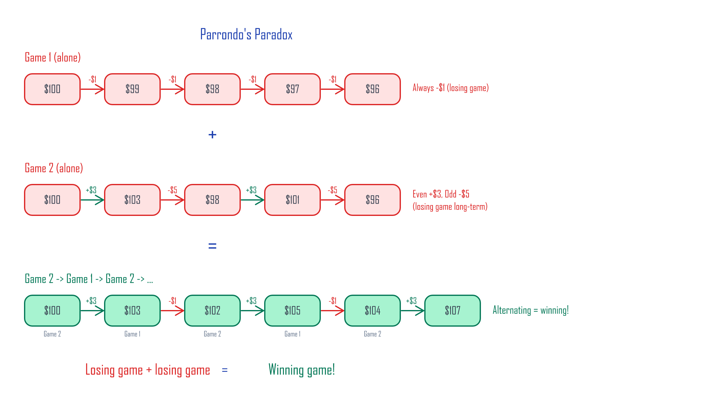
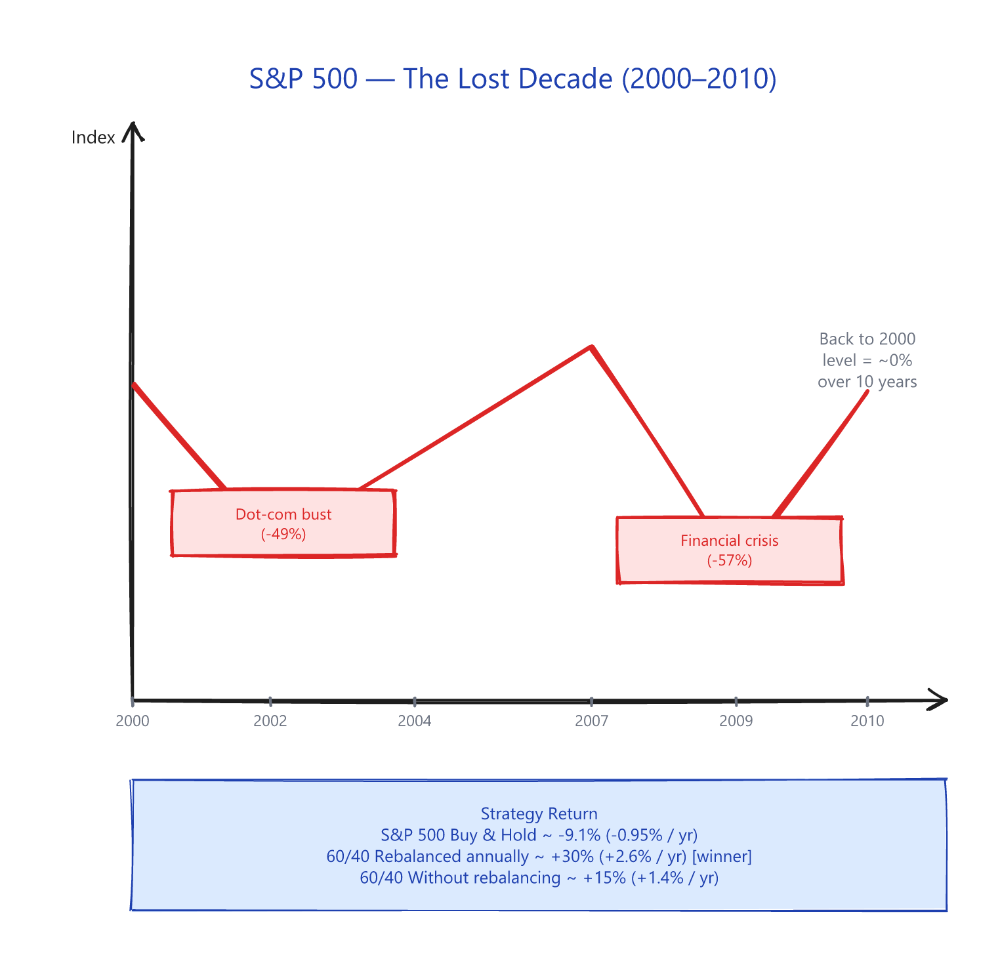
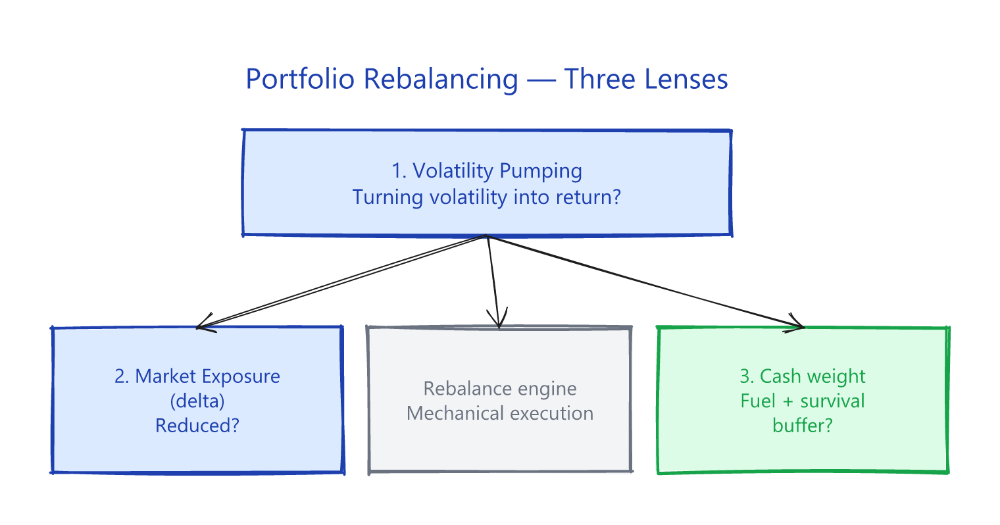

# 1. Shannon's Demon

> **Series**
>
> 1. **Shannon's Demon** ← you are here
> 2. The St. Petersburg Paradox and the Geometric Mean *(paid)*
> 3. Kelly's Criterion *(paid)*
> 4. No Edge in the Game, Edge in the Market *(paid)*

---

## Claude Shannon — the man who opened the information age

Most people have never heard of Claude Shannon. But the smartphone in your hand, the computer on your desk, the internet that delivered this article — every one of them rests on a foundation he built.

<small>Photo: Tekniska Museet (Sweden) · Wikimedia Commons, [CC BY 2.0](https://creativecommons.org/licenses/by/2.0/)</small>

In the 19th century, the English mathematician George Boole built a system of logic from just two values: true and false, 1 and 0. We now call this **Boolean algebra**, and it's the mathematical seed of every modern computer. In his 1937 MIT master's thesis, Shannon proved that this abstract system could be physically implemented as electrical switching circuits — laying the groundwork for modern semiconductor design.

Then in 1948, working at Bell Labs, Shannon published one of the great papers of the century: *A Mathematical Theory of Communication*. In it, he showed that any form of information could be encoded as **bits** and transmitted efficiently, and he introduced the concept of **entropy** to information theory. The paper detonated the field. Shannon became known as the **father of information theory**.

---

## Why this matters now

We live in an age where AI parses news in real time and algorithms trade in milliseconds. Information moves at nearly the speed of light. Which means the old game — get the news first, trade on it, profit — **is essentially closed to retail investors**.

So what's left for us?

Shannon, sixty years ago, gave a startlingly simple answer: **a strategy that doesn't need to predict the future**. Even if you have no idea whether stocks will go up or down, you can extract returns through pure mathematics. This is what's called a **structural edge** — and it's still available to you.

The three concepts in this series — rebalancing, the geometric mean, and Kelly's criterion — are all built on math, not information. AI can do whatever AI does, but volatility doesn't disappear, and the math of compounding doesn't change.

---

## Shannon's Demon

In 1956 Shannon returned to MIT to focus on research. He's also famous for applying his genius to investing. The Nobel laureate Paul Samuelson and his students were fierce defenders of the **Efficient Market Hypothesis** — the idea that all available information is already priced in, so no one can consistently beat the market. To them, Shannon's existence was a nightmare.

While at MIT, Shannon gave two now-legendary lectures on **Scientific Investing** — one in 1966 and another in 1971. Word of Shannon's investment success had already spread through the MIT community, and turnout overwhelmed the original venue. Both lectures had to be moved to the largest auditorium on campus.

### Shannon's thought experiment

Shannon framed his lecture like this:

Making money in the stock market is conceptually simple. In a bull market, buy low and sell high. In a bear market, **sell short** (borrow shares, sell them now, buy them back cheaper later, return them). All you have to do is *correctly predict* which way the price is going. The catch, of course, is that "correctly predicting" the market is impossible. So no easy path to riches.

But Shannon proposed something more interesting: **a way to make money in a random walk** — a price model where the next move is as unpredictable as a coin flip.

Here's the toy stock he asked his audience to imagine:

1. The price moves as a random walk.
2. On an "up" day (50% probability), it **doubles**.
3. On a "down" day (50% probability), it is **cut in half**.
4. After equal numbers of ups and downs, the final price equals the starting price — meaning the **geometric return of buy & hold is 0%**.

Shannon's strategy: put **50% in the stock and 50% in cash**, and **rebalance back to 50:50 every day**.

### Walking through the rebalancing math

Starting with $1,000:

| Step          | Stock     | Cash      | Total       | Rebalanced Stock | Rebalanced Cash |
|:------------- |----------:|----------:|------------:|-----------------:|----------------:|
| **Day 0**     |   $500.00 |   $500.00 |   $1,000.00 |          $500.00 |         $500.00 |
| **Day 1** ×2  | $1,000.00 |   $500.00 |   $1,500.00 |          $750.00 |         $750.00 |
| **Day 2** ×½  |   $375.00 |   $750.00 |   $1,125.00 |          $562.50 |         $562.50 |
| **Day 3** ×2  | $1,125.00 |   $562.50 |   $1,687.50 |          $843.75 |         $843.75 |
| **Day 4** ×½  |   $421.88 |   $843.75 |   $1,265.63 |          $632.81 |         $632.81 |

**The comparison:**

| Strategy                | Day 0      | Day 4        | Return     |
|:----------------------- |-----------:|-------------:|-----------:|
| Buy & Hold              | $1,000.00 |    $1,000.00 |     0.00%  |
| **Shannon Rebalancing** | $1,000.00 |    $1,265.63 |  **+26.6%** |

The stock went nowhere. Rebalancing alone produced **+26.6%**.

The mechanism behind this:

Over many cycles, the gap between rebalancing and buy & hold compounds. The chart below shows asset growth for both strategies in the same volatility environment — rebalancing in blue, buy & hold in red:

This 50:50 rebalancing portfolio is what people call **Shannon's Demon**.

### Why "Demon"?

<small>Illustration by Htkym (2007) · Wikimedia Commons, [CC BY 2.5](https://creativecommons.org/licenses/by/2.5/)</small>

The name comes from Scottish physicist James Clerk Maxwell, who in 1867 proposed a thought experiment to explore whether the Second Law of Thermodynamics could be violated — **Maxwell's Demon**. In Maxwell's version, an imaginary creature sorts fast and slow molecules into separate chambers. In Shannon's version, the imaginary creature rebalances 50:50 every time the random walk takes a step up or down.

### "So do you actually invest this way?"

The lecture ended and questions poured in. The first one was the obvious one: did Shannon himself trade this strategy? His answer:

> "Naw. The commissions would kill you."

If a stock really did double one day and halve the next, no transaction cost could swallow those returns. But **no such stock exists in the real world**.

### Volatility harvesting — how it actually works

In quantitative finance, the technique of converting volatility into return through systematic rebalancing is called **volatility pumping** — or, equivalently, the **rebalancing premium**.

Mathematically, a 50:50 rebalancing portfolio in Shannon's setup earns roughly **6%** per rebalance cycle. Over 240 cycles, (1.06)^240 ≈ **$1,184,152**. A single dollar grows to $1.18 million.

> ⚠️ **That 6% is a *theoretical* number.** It's what falls out of Shannon's ×2/×½ model (every period either doubles or halves) — real stock markets don't move like that. In actual markets the rebalancing premium runs roughly **0.1–2% per year**, depending on asset volatility (you can verify this in the "Lost Decade 60/40" example below: ~+1–2%/year). The point is the *mechanism*, not the number.

### Volatility size matters

The bigger the volatility, the bigger the rebalancing return. Below are stocks that all return 0% on a buy & hold basis (each day 50% up, 50% down, ending where they started), but with different volatility:

| Volatility model     | Up multiplier | Down multiplier | Per-cycle return | Return after 240 cycles |
|:-------------------- |--------------:|----------------:|-----------------:|------------------------:|
| Low volatility       |        ×1.1   |       ×(1/1.1)  |          ~0.1%   |                  ~27%   |
| Medium volatility    |        ×1.5   |       ×(1/1.5)  |          ~2.0%   |              ~11,500%   |
| **Shannon's model**  |        ×2.0   |       ×(1/2.0)  |          ~6.0%   |     **~118,415,200%**   |
| Extreme volatility   |        ×3.0   |       ×(1/3.0)  |         ~12.5%   |     astronomical        |

**Takeaway:** rebalancing burns volatility as fuel. No volatility, no return.

## Aside: Parrondo's Paradox — losing games that win

In 1996, Spanish physicist Juan Parrondo discovered something striking: **two losing games, played in alternation, can become a winning game**.

Parrondo's paradox isn't quite the same mechanism as rebalancing, but it shares the core intuition — **assets that are individually unattractive can become attractive when combined and rebalanced**.

University of Colorado professor Michael Stutzer applied this to actual market data. From his paper *The Paradox of Diversification* ([PDF](http://leeds-faculty.colorado.edu/stutzer/Papers/ParadoxOfDiversification.PDF)):

| Asset                   | Return    | Volatility | Role               |
|:----------------------- |----------:|-----------:|:------------------ |
| High-volatility stock   |    -43%   |       40%  | Volatility source  |
| Low-volatility bond     | -0.001%   |       ~0%  | Stable anchor      |
| **50:50 rebalanced**    | **+34%**  |       —    | **The combo wins** |

A 50:50 rebalanced portfolio of -43% and -0.001% assets, held for 30 years and rebalanced annually (10,000 simulated paths), produced a cumulative **+34%** return. Volatility, fed into rebalancing, turns into profit.

---

## Volatility harvesting in the real world

Converting volatility into return through rebalancing isn't just theory. It shows up across actual markets in many forms.

### The Lost Decade — when rebalancing shined

The years 2000 through 2010 are called **the Lost Decade** in U.S. equities. Two crashes — the dot-com bust (2000–2002) and the global financial crisis (2008–2009) — left the S&P 500 with essentially **zero return** over the entire decade.

But during this same Lost Decade, **a simple 60% stock / 40% bond portfolio rebalanced annually returned about +2.5% to +3.5% per year**.

| Strategy                          | 2000–2010 cumulative | Annualized |
|:--------------------------------- |---------------------:|-----------:|
| S&P 500 buy & hold                |              ~ -9.1% |     -0.95% |
| **60/40 rebalanced annually**     |          **~ +30%**  |  **+2.6%** |
| 60/40 without rebalancing         |              ~ +15%  |     +1.4%  |

The key result: **the rebalanced portfolio outperformed the unrebalanced one**. When stocks crashed in 2002 and 2009, the investor sold bonds to buy cheap stocks. When stocks recovered, they sold some stock and rotated back into bonds. **That's exactly what Shannon's Demon does, mechanically and without emotion.**

> Vanguard's research note *Best practices for portfolio rebalancing* (2015) found that the rebalancing premium grows when correlations between assets are low and volatility is high — exactly the prediction of the volatility-harvesting math.

### The principle of partial market exposure

Shannon's 50:50 portfolio is only **half exposed** to the market direction. It earns the rest of its return from volatility. Think of it as **market exposure**:

| Position                      | Market Exposure | Meaning                              |
|:----------------------------- |:---------------:|:------------------------------------ |
| 100% stocks                   |     100%        | Fully tied to the market             |
| **Shannon's 50:50 portfolio** |   **50%**       | **Half from volatility, half market**|
| 100% cash                     |       0%        | No market exposure at all            |

The exposure you give up isn't lost — **it's filled in by volatility**. That's the essence of volatility harvesting, and it's the same principle behind many market-neutral strategies.

---

## Closing — "Buy low, sell high" = Volatility Pumping

"Buy low, sell high." It's the most obvious winning formula in investing — and the one that crashes hardest into human nature. When the market collapses, fear sells. When the market melts up, greed buys.

Shannon's Demon offers a clean answer: **execute "buy low, sell high" mechanically, with no emotion in the loop**. But the strategy works only under one absolute precondition:

> **You must hold cash, or a cash-equivalent low-volatility asset like bonds.**
>
> Without cash, you can't buy when the market crashes. Without stock, you can't sell when it rallies.
> Cash is the **fuel** for rebalancing — and it's also the condition for **surviving** the market in the first place.

More precisely, that *cash fuel* comes in two flavours — a **defensive** reserve that keeps you alive through the cascade, and a **tactical** reserve that monetises your time edge at the eye of the crisis. Splitting cash into these two buckets is what completes the "volatility as fuel" thesis (see the [Cash Allocation article](../posts/cash-allocation.md) Section 4 deep-dive).

So what's the mathematical foundation underneath rebalancing? Why should we think in terms of the **geometric mean**, not the arithmetic mean (the expected value)?

> The next article looks for the answer in a 300-year-old story about a family of mathematicians — beginning with **the St. Petersburg Paradox**.

!!! tip "Preview — vol drag and cash allocation"
    The core arithmetic-vs-geometric-mean intuition from Parts 2–3, and the *quantitative* answer to "how much cash, exactly?", are available now in the free article [**Vol-Based Cash Allocation — Kelly meets risk signals**](../posts/cash-allocation.md), Section 1 (vol drag).

---

## The remaining 3 articles in Principles

If Part 1 resonated, the next three articles complete the math foundation and the practical edge:

- **Part 2 — The St. Petersburg Paradox** — Why the geometric mean matters more than the arithmetic mean
- **Part 3 — Kelly's Criterion** — What the optimal bet size is, and why you should bet half of it
- **Part 4 — No Edge in the Game, Edge in the Market** — What structural edges remain for the retail investor

The full Principles series is **61 pages · 48+ diagrams**.

[Buy on Gumroad — Principles](https://butt2rflow.gumroad.com/l/aejfrj){ .md-button .md-button--primary }

The complete 13-article bundle (167 pages, all 4 series) is the cheaper option:

[Buy the Complete Bundle on Gumroad](https://butt2rflow.gumroad.com/l/dbkyt){ .md-button .md-button--primary }
