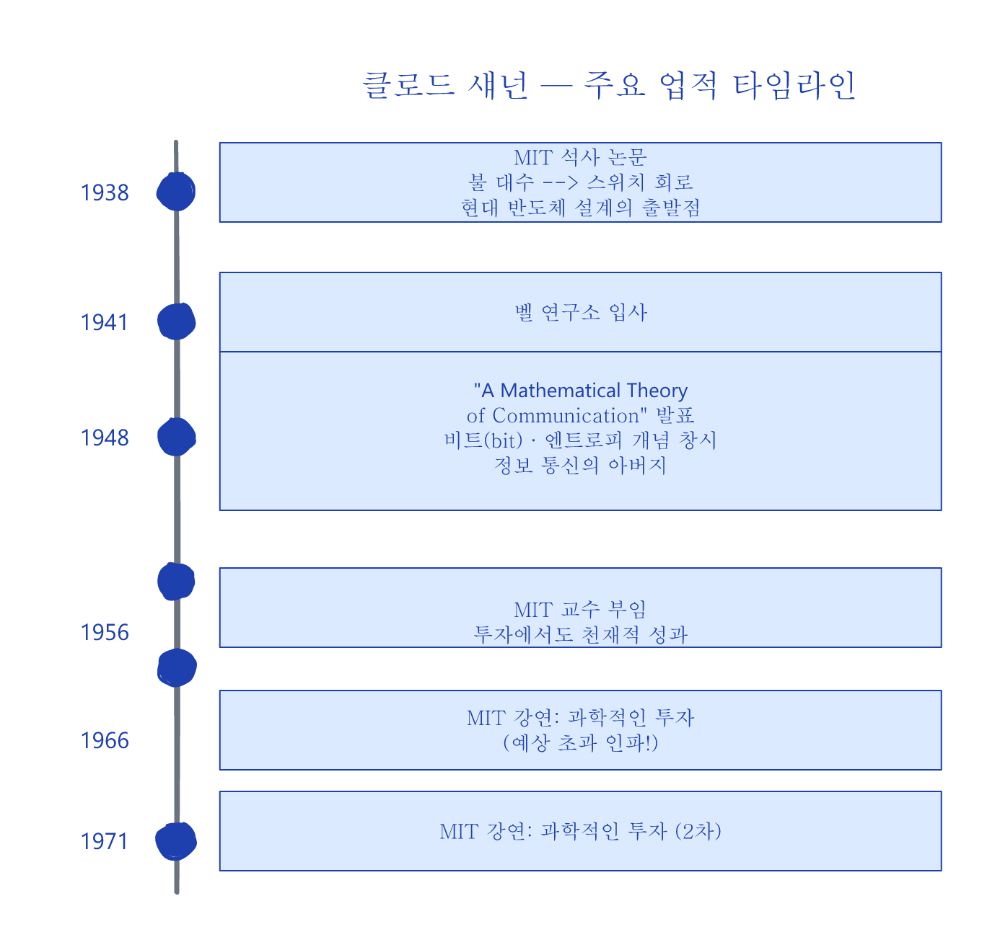
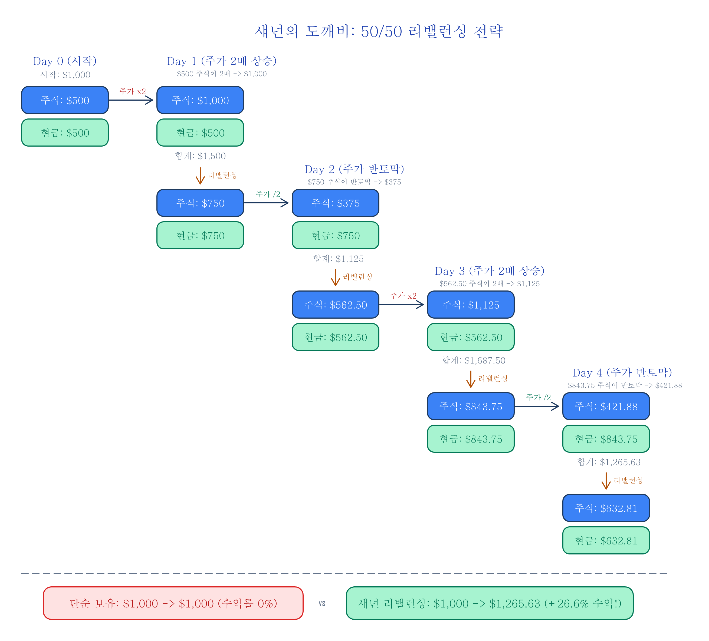
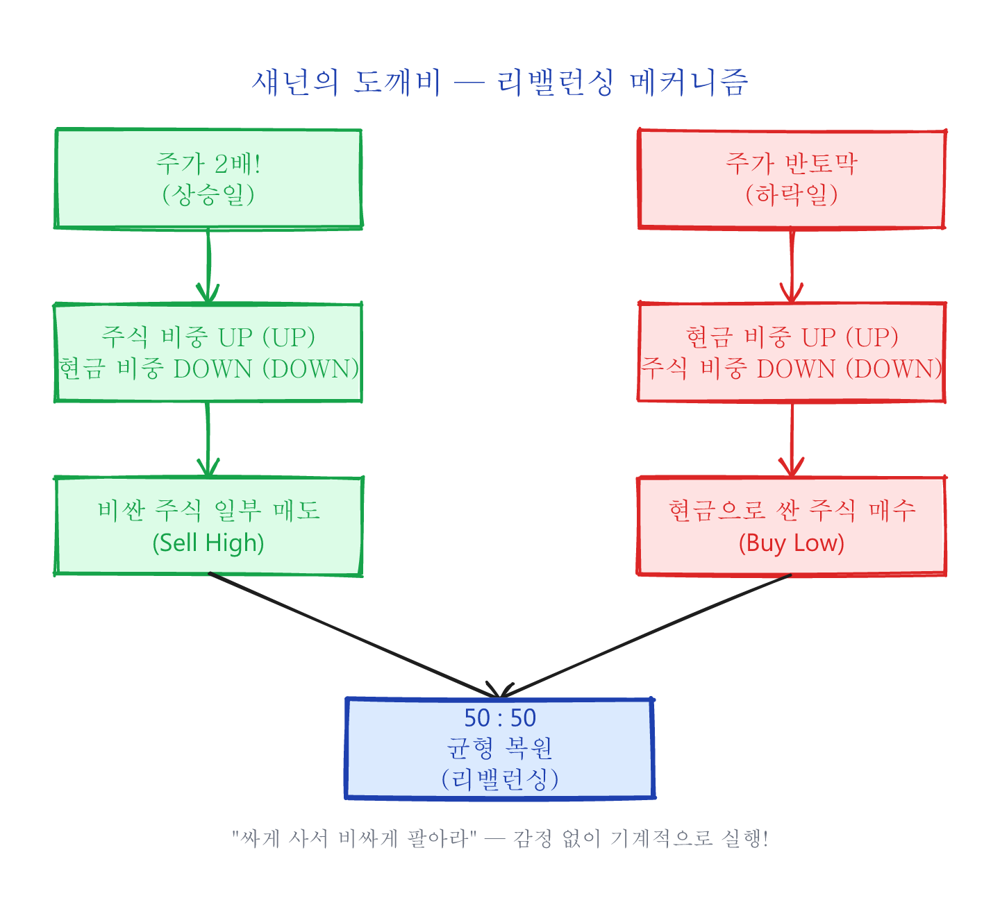
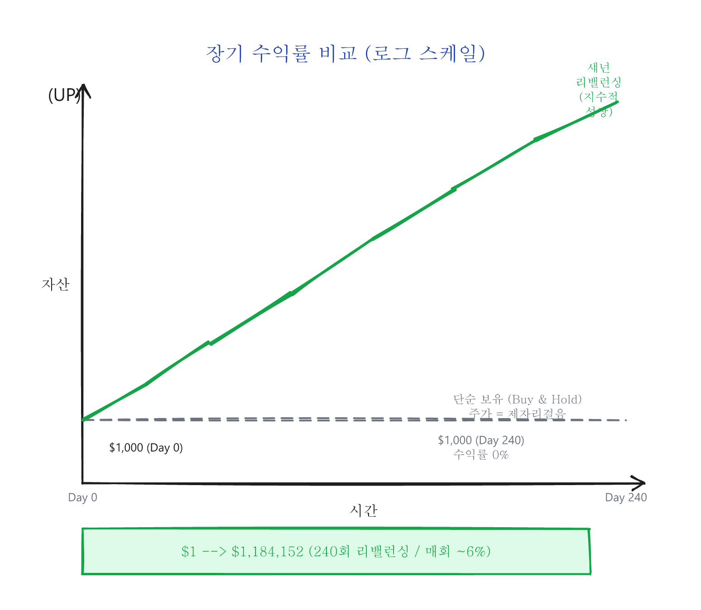
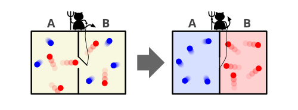
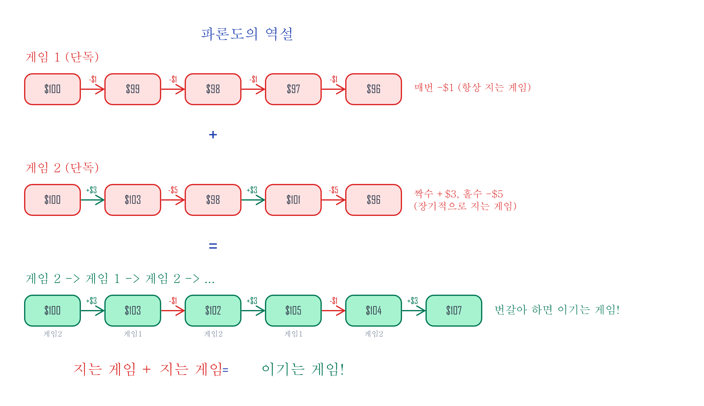
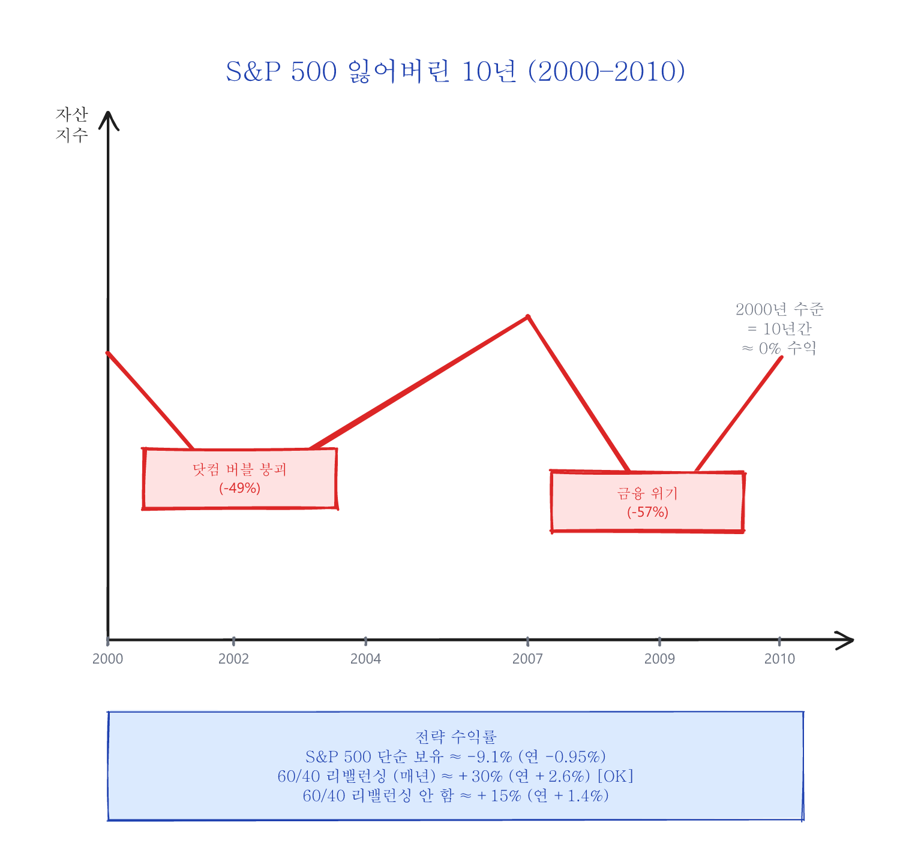
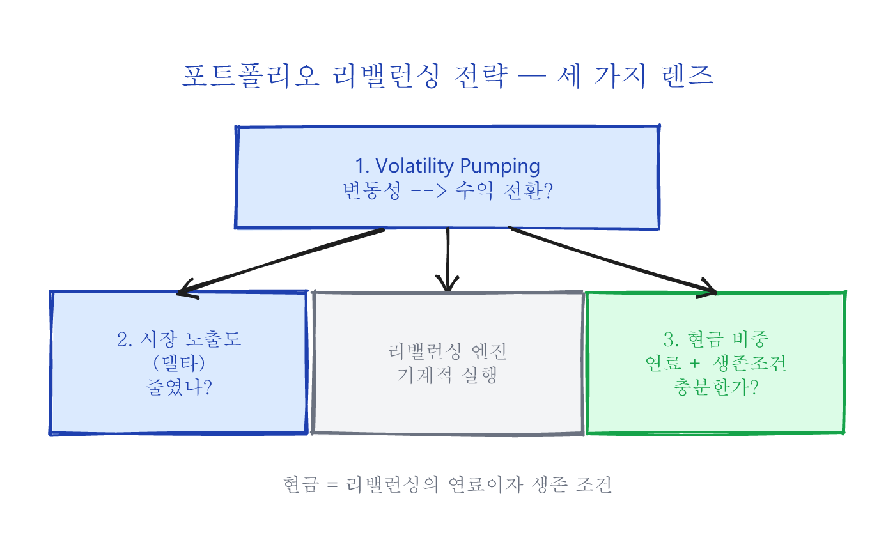

# 1. 섀넌의 도깨비 (Shannon's Demon)

> **시리즈 목차**
>
> 1. **섀넌의 도깨비 (Shannon's Demon)** ← 현재 글
> 2. 상트페테르부르크의 역설과 기하 평균
> 3. 캘리의 기준 (Kelly's Criterion)이 주는 교훈
> 4. 엣지 없는 게임, 엣지 있는 시장

---

## 클로드 섀넌 — 정보 시대를 연 천재

클로드 섀넌(Claude Shannon)이라는 이름은 대부분의 사람들에게 낯설 것입니다. 하지만 지금 이 글을 읽고 있는 스마트폰, 컴퓨터, 인터넷 — 이 모든 것의 이론적 토대를 만든 사람이 바로 이 사람입니다.

<small>Image: Bell Labs / Wikimedia Commons, Public Domain</small>

19세기 영국의 수학자 조지 불(George Boole)은 참/거짓, 0과 1만으로 논리를 표현하는 체계를 만들었습니다 — 이것이 오늘날 **불 대수(Boolean algebra)**라 불리는 것으로, 현대 컴퓨터의 수학적 기원입니다. 섀넌은 1937년 MIT 석사 논문에서 이 추상적인 수학 체계를 전기 스위치 회로(Switching circuit)로 구현할 수 있다는 것을 증명하여, 현대 반도체 회로 설계 기술의 출발점을 만들었습니다.

1948년, 섀넌은 벨 연구소에서 세기의 걸작 "A Mathematical Theory of Communication"을 발표합니다. 이 논문에서 모든 형태의 정보를 **"비트"**로 변환하여 효율적으로 통신할 수 있다는 것을 밝혔으며, **엔트로피(Entropy)**라는 개념을 창시했습니다. 이를 기점으로 정보 통신 분야는 획기적인 발전을 이루게 되었고, 섀넌은 **정보 통신의 아버지**라 불리게 되었습니다.

---

## 왜 지금 이 이야기가 중요한가?

AI가 뉴스를 분석하고, 알고리즘이 밀리초 단위로 매매하는 시대입니다. 정보의 전달 속도가 빛에 가까워진 지금, **남들보다 먼저 정보를 알아서 돈을 버는 전략 — 이른바 정보 우위(Information Edge) — 은 개인 투자자에게 사실상 불가능**해졌습니다.

그렇다면 개인 투자자에게 남은 것은 무엇일까요?

정보 이론의 아버지인 섀넌이 60년 전에 보여준 답은 놀랍도록 단순합니다: **미래를 예측할 필요가 없는 전략**. 주가가 오를지 내릴지 전혀 몰라도, 수학적 원리만으로 수익을 만들어낼 수 있는 구조적 전략(Structural Edge)이 존재합니다.

이 시리즈에서 다루는 세 가지 개념 — 리밸런싱, 기하 평균, 캘리의 기준 — 은 모두 **정보가 아닌 수학에 기반한 전략**입니다. AI가 아무리 발전해도 변동성은 사라지지 않고, 복리의 수학도 바뀌지 않습니다.

---

## 섀넌의 도깨비 (Shannon's Demon)

1956년 섀넌은 MIT로 돌아가서 연구에 집중하게 됩니다. 섀넌은 그의 천재성을 투자에서도 발휘한 것으로 유명합니다. 노벨 경제학상 수상자인 폴 새뮤얼슨(Paul Samuelson)과 그의 제자들은 효율적 시장 가설(Efficient Market Hypothesis)에 근거하여 그 누구도 시장을 이길 수 없다고 주장하였는데, 그들에게 섀넌의 존재는 악몽과도 같았다고 합니다.

섀넌은 MIT에 재직하면서 1966년과 1971년 두 차례에 걸쳐서 **과학적인 투자(Scientific Investing)**에 관한 강연을 했다고 합니다. MIT 커뮤니티에는 이미 섀넌의 투자 성공 스토리가 널리 알려져 있었기에 예상을 넘는 인파가 몰렸고, 강연 장소는 MIT의 가장 큰 강의실로 옮겨져야 했습니다.

### 섀넌의 사고 실험

섀넌의 강연 주제는 다음과 같았습니다:

주식 시장에서 돈을 버는 방법은 매우 간단합니다. 주가가 올라가는 상승장에서는 낮은 가격에 사서 높은 가격에 팔고(Buy low and sell high), 주가가 내려가는 하락장에서는 공매도(Sell short)를 하면 됩니다. 여기서 우리는 주식 가격이 올라가는지 내려가는지 "정확하게 예측"만 하면 되지만, "정확하게 예측"하는 것이 불가능하기 때문에 돈을 버는 간단한 방법 따위는 존재하지 않습니다.

하지만 섀넌은 강연에서 이렇게 **"정확하게 예측"하는 것이 불가능한 랜덤 워크(Random walk)에서 돈을 버는 방법**을 제시합니다.

다음과 같은 가상의 주가 변동 모델을 사용합니다:

1. 주가는 랜덤 워크로 움직인다.
2. 상승하는 날(확률 50%)에는 전일 대비 **2배**가 된다.
3. 하락하는 날(확률 50%)에는 전일 대비 **1/2**이 된다.
4. 최종일의 주가는 시작일의 주가와 동일하다 — 즉 장기 보유 수익률은 **0%**이다.

섀넌의 전략: 초기 투자금의 **50%를 주식에, 50%를 현금에** 배분하고, **매일 50:50 비율을 유지하도록 리밸런싱**합니다.

### 리밸런싱 단계별 계산 예시

초기 투자금 $1,000으로 시작합니다:

| 구분          | 주식      | 현금      | 합계        | 리밸런싱 후 주식 | 리밸런싱 후 현금 |
|:------------- |----------:|----------:|------------:|-----------------:|----------------:|
| **Day 0**     |   $500.00 |   $500.00 |   $1,000.00 |          $500.00 |         $500.00 |
| **Day 1** ×2  | $1,000.00 |   $500.00 |   $1,500.00 |          $750.00 |         $750.00 |
| **Day 2** ×½  |   $375.00 |   $750.00 |   $1,125.00 |          $562.50 |         $562.50 |
| **Day 3** ×2  | $1,125.00 |   $562.50 |   $1,687.50 |          $843.75 |         $843.75 |
| **Day 4** ×½  |   $421.88 |   $843.75 |   $1,265.63 |          $632.81 |         $632.81 |

**비교:**

| 전략                | Day 0      | Day 4        | 수익률     |
|:------------------- |-----------:|-------------:|-----------:|
| 단순 보유 (Buy&Hold) | $1,000.00 |    $1,000.00 |     0.00%  |
| **섀넌 리밸런싱**    | $1,000.00 |    $1,265.63 |  **+26.6%** |

주가는 제자리걸음인데 리밸런싱만으로 **26.6% 수익**이 발생했습니다!

핵심 원리를 그림으로 보면:

이 리밸런싱 효과는 장기적으로 어떤 차이를 만들까요? 아래 그래프는 동일한 변동성 환경에서 리밸런싱(파란선)과 단순 보유(빨간선)의 자산 성장 경로를 비교한 것입니다:

이 50:50 리밸런싱 포트폴리오를 **섀넌의 도깨비(Shannon's Demon)**라고 부릅니다.

### 왜 "도깨비"인가?

<small>Image: Wikimedia Commons, CC BY-SA</small>

이 이름은 스코틀랜드의 물리학자 제임스 클러크 맥스웰이 1867년 열역학 제2법칙을 위반하는 것이 가능한가에 관한 사고 실험인 **맥스웰의 도깨비(Maxwell's Demon)**에서 유래했습니다. 맥스웰의 도깨비에서 가상의 도깨비가 속도가 빠른 분자와 느린 분자를 서로 다른 방에 분리하는 것처럼, 섀넌의 도깨비에서는 주가가 랜덤 워크를 통해서 상승·하락을 반복할 때마다 가상의 도깨비가 50:50으로 리밸런싱합니다.

### "그래서 당신은 이 방법으로 투자하나요?"

강연이 끝나고 수많은 질문이 쏟아졌습니다. 가장 먼저 나온 질문은 당연히 섀넌 본인이 실제로 이 방법을 쓰느냐였습니다. 섀넌의 답변:

> "아니요, 거래 수수료가 너무 커요."
>
> — "Naw," said Shannon. "The commissions would kill you."

하루 만에 2배가 되고 다시 하루 만에 반토막이 나는 극단적 변동성의 주식이 실제로 존재한다면, 거래 수수료가 아무리 비싸도 문제가 되지 않았을 것입니다. 하지만 **현실에 그런 주식은 존재하지 않습니다.**

### 변동성 수확 — 어떻게 작동하는가?

금융 공학에서 이처럼 **변동성**을 **리밸런싱**을 통해 수익으로 전환하는 투자 기법을 **변동성 수확(Volatility Pumping)**이라고 합니다. 리밸런싱 프리미엄(Rebalancing Premium)이라고도 부릅니다.

수학적으로 계산하면, 50:50 리밸런싱 포트폴리오의 수익률은 리밸런싱 기간마다 약 **6%**로 계산됩니다. 240회 반복하면 (1.06)^240 ≈ **$1,184,152** — 즉 $1이 $118만이 됩니다.

### 추가 예시: 변동성 크기에 따른 수익률 차이

변동성이 클수록 리밸런싱의 수익률이 높아진다는 것을 확인해봅니다. 각각 50% 확률로 상승/하락하며, 최종일에 원점으로 돌아오는 주식들을 비교합니다:

| 변동성 모델     | 상승일 배수 | 하락일 배수 | 1회 리밸런싱 수익 | 240회 후 수익     |
|:--------------- |------------:|------------:|------------------:|------------------:|
| 낮은 변동성     |       ×1.1  |    ×(1/1.1) |            ~0.1%  |            ~27%   |
| 중간 변동성     |       ×1.5  |    ×(1/1.5) |            ~2.0%  |        ~11,500%   |
| **섀넌 모델**   |       ×2.0  |    ×(1/2.0) |            ~6.0%  | **~118,415,200%** |
| 극단적 변동성   |       ×3.0  |    ×(1/3.0) |           ~12.5%  |    천문학적 수치  |

**핵심:** 리밸런싱은 변동성을 연료로 사용합니다. 변동성이 없으면 수익도 없습니다.

## 참고: 파론도의 역설 — 지는 게임의 조합

1996년 스페인의 물리학자 후안 파론도(Juan Parrondo)는 흥미로운 현상을 발견합니다: **각각은 지는 게임이라도 적절히 조합하면 이기는 게임이 될 수 있다.**

파론도의 역설은 리밸런싱과 정확히 같은 메커니즘은 아니지만, 핵심 직관을 공유합니다 — **개별적으로는 불리한 자산들이 결합과 재조정을 통해 유리해질 수 있다는 것입니다.**

콜로라도 대학의 Michael Stutzer 교수는 이 현상을 실제 시장에 적용하여 시뮬레이션한 결과를 발표했습니다 ("The Paradox of Diversification", [원문 PDF](http://leeds-faculty.colorado.edu/stutzer/Papers/ParadoxOfDiversification.PDF)):

| 종목             | 수익률   | 변동성 | 역할          |
|:---------------- |---------:|-------:|:------------- |
| 고변동성 주식    |    -43%  |    40% | 등락폭 공급원 |
| 저변동성 채권    | -0.001%  |   ~0%  | 안정 자산     |
| **50:50 리밸런싱** | **+34%** |    —   | **합치면 이긴다!** |

-43%와 -0.001%를 50:50 비율로 매년 리밸런싱하여 30년 투자한 결과(10,000 샘플 경로), **누적 +34%의 수익률**을 보여줍니다. 등락폭이 리밸런싱의 연료로 작동한다는 것을 보여주는 실증 사례입니다.

---

## 실전에서의 변동성 수확

변동성을 리밸런싱으로 수익 전환하는 기법은 실제 금융 시장에서도 다양한 형태로 활용되고 있습니다.

### 잃어버린 10년 — 리밸런싱이 빛난 시기

2000년에서 2010년까지 미국 주식 시장은 "잃어버린 10년(The Lost Decade)"이라 불립니다. 닷컴 버블 붕괴(2000-2002)와 글로벌 금융 위기(2008-2009), 두 번의 대폭락을 겪으며 S&P 500은 10년간 수익률이 사실상 **0%에 가까웠습니다.**

그런데 이 "잃어버린 10년" 동안, **주식 60% + 채권 40%의 단순한 포트폴리오를 매년 리밸런싱한 투자자는 연평균 약 +2.5~3.5%의 수익률**을 기록했습니다.

| 전략                            | 2000-2010 누적 수익률 | 연평균 수익률 |
|:------------------------------- |----------------------:|--------------:|
| S&P 500 단순 보유               |              약 -9.1% |        -0.95% |
| **60/40 리밸런싱 (매년)**       |          **약 +30%**  |    **+2.6%**  |
| 60/40 리밸런싱 안 함            |              약 +15%  |        +1.4%  |

핵심은 **리밸런싱을 한 포트폴리오가 안 한 포트폴리오보다 높은 수익**을 보였다는 것입니다. 주식이 폭락한 2002년과 2009년에 채권을 팔아 싸진 주식을 사들이고, 주식이 회복하면 일부를 팔아 채권으로 옮기는 — 바로 **섀넌의 도깨비가 기계적으로 하는 일**을 한 셈입니다.

> Vanguard의 연구 보고서 "Best practices for portfolio rebalancing" (2015)에 따르면, 리밸런싱의 프리미엄은 자산 간 상관관계가 낮고 변동성이 클수록 커지며, 이는 변동성 수확의 수학적 예측과 정확히 일치합니다.

### 시장 중립의 핵심 원리

섀넌의 50:50 포트폴리오는 시장 방향에 대해 **절반만 노출**된 상태에서 변동성을 수익으로 전환합니다. 이것을 **시장 노출도**라고 합니다:

| 포지션                      | 시장 노출도 | 의미                       |
|:--------------------------- |:-----------:|:-------------------------- |
| 주식 100%                   |    100%     | 시장과 완전히 동행         |
| **섀넌의 50:50 포트폴리오** |  **50%**    | **절반은 변동성에서 수익** |
| 현금 100%                   |      0%     | 시장과 완전히 무관         |

시장 노출을 줄인 만큼, 그 빈 자리를 **변동성이 채워주는 것** — 이것이 변동성 수확의 본질이며, 다양한 시장 중립 전략과 같은 원리를 공유합니다.

---

## 마치면서 — 싸게 사서 비싸게 팔아라 (Buy low and sell high) = Volatility Pumping

"싸게 사서 비싸게 팔아라" — 너무나 당연한 승리 공식이지만, 실제 투자에서는 사람의 본성과 정면으로 충돌합니다. 주가가 폭락하면 공포에 팔고, 폭등하면 탐욕에 사게 되기 때문입니다.

섀넌의 도깨비는 이 문제에 대한 명쾌한 답을 줍니다: **리밸런싱이라는 기계적 규칙으로 "Buy low, sell high"를 감정 없이 실행하는 것입니다.** 그리고 이 전략이 작동하기 위한 절대적 전제 조건이 있습니다:

> **현금, 또는 현금에 상응하는 저변동성 자산(채권)의 비중 확보.**
>
> 현금이 없으면 폭락 시 살 수 없고, 주식이 없으면 폭등 시 팔 수 없습니다.
> 현금 비중은 리밸런싱의 **연료**이자, 시장에서 **살아남기 위한 조건**입니다.

그렇다면 리밸런싱의 수학적 기반은 무엇일까요? 왜 산술 평균(기대값)이 아닌 **기하 평균**으로 생각해야 하는 걸까요?

> 다음 글에서는 이 질문의 답을 찾기 위해 300년 전 한 수학자 가문의 이야기 — **상트페테르부르크의 역설**에서 시작합니다.

[원칙편 전체 구매 (US\$6.99)](https://butt2rflow.gumroad.com/l/aejfrj){ .md-button }
[전체 세트 구매 (US\$13.99)](https://butt2rflow.gumroad.com/l/dbkyt){ .md-button .md-button--primary }
