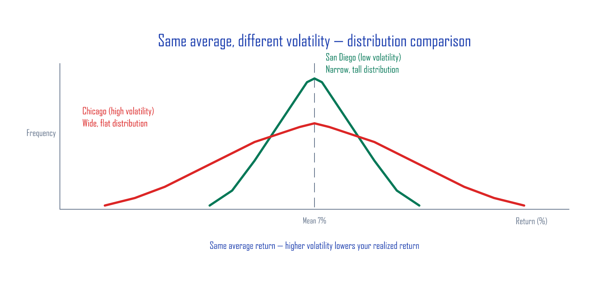

# Execution — Read VIX, Size Positions

The practical playbook for harvesting volatility **with stocks/ETFs and cash only** — no options, no futures.

## Contents (3 articles)

1. **Volatility — Friend or Foe?** — Historical volatility (HV) vs implied volatility (IV), how to read VIX, the lesson of SVXY's 2018 collapse
2. **Position Sizing — The Trailing-Signal Playbook** — Volatility targeting, inverse-volatility weighting, full SPY backtest 2006–2025
3. **Leading Signals and Practice** — IVTS three zones, VolVol golden/death cross, Vomma Zone, TradingView Pine Script, real-world execution guide

---

## Preview — VIX is not "the fear index," it's an *insurance premium*

Most investors learn VIX as "the fear index — when it's high, the market is panicking." That's not wrong, but it's backwards. The *real* identity of VIX is:

> **VIX = the implied volatility of S&P 500 options = the *insurance premium* the market is willing to pay for the next 30 days of volatility**

Like umbrella prices that rise before a storm, the more uncertain the market feels, the more buyers pile into put options (downside insurance), and that bids VIX up. Same fact, viewed differently — **when VIX is unusually high, the *insurance premium* is unusually expensive, which is exactly when *selling* volatility starts paying real money**.

This perspective shift is the entire foundation of the series. "Don't shake in fear — collect the premium" in one sentence.

---

## Case preview — SPY volatility-targeting backtest (2006–2025)

The simplest trailing-signal strategy (the heart of Article 2):

> "When VIX is above its long-run average (20), shrink position size; when below, increase it" — verified across 19 years of data.

| Metric | SPY buy & hold | With volatility targeting |
|:---|:---:|:---:|
| **CAGR** | ~9.7% | ~9.4% |
| **Annualized volatility** | ~17% | ~12% |
| **Sharpe ratio** | 0.56 | **0.79** |
| **Max drawdown (MDD)** | −55.2% | **−35.7%** |

CAGR is slightly lower, but **risk drops by 30%+ and Sharpe improves by 40%**. In drawdowns like 2008 and 2020, this rule preserved investor sanity — that's the *real* conclusion of the series.

---

## Who this is for

- Investors who know VIX is the "fear index" but have no idea what to do with it
- Anyone who wants a mechanical rule for navigating crashes — not panic, not blind buying
- ETF + cash investors looking for a simple rebalancing playbook
- **People who hate formulas** — the only math here is division

---

## Buy

**Execution series · 3 articles · 35 pages · 19+ diagrams**

Backtest charts, IVTS zone map, full Pine Script source.

[Buy on Gumroad — Execution](https://butt2rflow.gumroad.com/l/ozijat){ .md-button .md-button--primary }

The complete 13-article bundle (Principles + Execution + Extension + Depth — **~33% off vs buying individually**):

[Buy the Complete Bundle on Gumroad](https://butt2rflow.gumroad.com/l/dbkyt){ .md-button .md-button--primary }

---

*Educational material only. This is not investment advice. All investments carry the risk of capital loss.*
