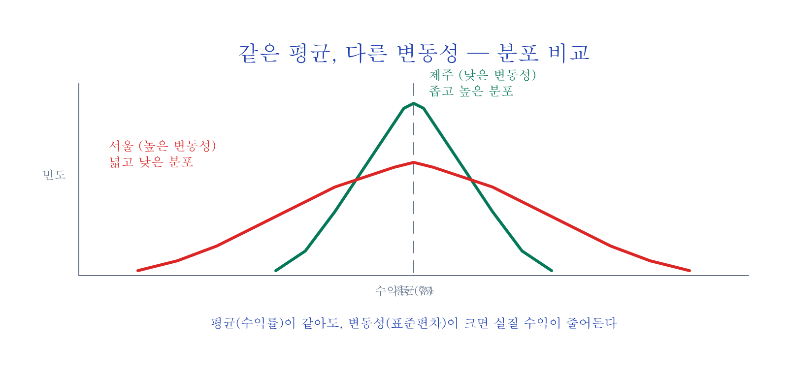

# 실행편 — VIX를 읽고 비중을 조절하라

옵션이나 선물 없이, **ETF와 현금만으로** 변동성을 수확하는 실전 전략.

## 목차 (3편)

1. **변동성, 적인가 친구인가?** — 과거 변동성(HV)과 시장이 예상하는 미래 변동성(IV) 구분, VIX(시장 공포 지수) 읽는 법, SVXY(변동성을 역으로 추종하는 ETF) 붕괴 사건
2. **비중 조절의 원리 — 후행 신호 전략** — 자동 비중 조절(변동성 타겟팅), 흔들릴수록 줄이기(역변동성 가중), SPY 백테스트(과거 데이터로 전략 검증) (2006~2025)
3. **선행 신호와 실전** — IVTS(단기와 장기 변동성의 비율) 세 구역, VolVol(변동성의 변동성), Vomma Zone(변동성이 급변하는 구간), TradingView Pine Script(차트 분석용 코드), 실전 가이드

---

## 미리보기 — VIX는 "공포지수"가 아니라 "보험료"입니다

대부분의 투자자가 "VIX가 올랐다 = 공포 = 시장 폭락"으로만 알고 있습니다. 그런데 VIX의 *진짜* 정체는 다릅니다.

> **VIX = S&P 500 옵션의 *내재변동성* = 향후 30일 변동성에 대해 시장이 매기는 *보험료***

폭풍이 오기 전에 우산 값이 오르는 것처럼, 시장이 불안할수록 푸트 옵션(하방 보험)에 더 많은 돈이 몰리고 그게 VIX를 끌어올립니다. 같은 사실을 다르게 보면 — **VIX가 비정상적으로 높을 때 = 보험료가 비정상적으로 비쌀 때 = 변동성을 *팔아서* 보험료를 수확할 기회**.

이 시리즈의 출발점이 바로 이 시각의 전환입니다. "공포에 떨지 말고 보험료를 수확하라"는 한 문장으로 요약 가능.

---

## 사례 미리보기 — SPY 변동성 타겟팅 백테스트 (2006~2025)

가장 단순한 후행 신호 전략 (3편 중 2편 핵심):

> "VIX가 평소(20)보다 높으면 비중을 줄이고, 평소보다 낮으면 비중을 늘리는" 규칙을 19년 데이터로 검증.

| 지표 | SPY 단순 보유 | 변동성 타겟팅 적용 |
|:---|:---:|:---:|
| **CAGR (연평균 수익률)** | ~9.7% | ~9.4% |
| **변동성 (연환산)** | ~17% | ~12% |
| **샤프 지수** | 0.56 | **0.79** |
| **최대 낙폭 (MDD)** | −55.2% | **−35.7%** |

수익률은 살짝 낮지만, **위험은 30% 이상 줄어들고 샤프 지수는 40% 향상**. 2008/2020 같은 폭락에서도 정신건강을 지킬 수 있는 규칙이 됩니다 — 이 시리즈가 풀어내는 *진짜* 결론입니다.

---

## 이런 분께 추천합니다

- VIX가 공포지수라는 건 아는데, 실제 투자에 어떻게 쓰는지 모르는 분
- 폭락장에서 기계적으로 대응할 수 있는 규칙을 만들고 싶은 분
- 증권사에서 바로 실행할 수 있는 전략을 찾는 분
- **수학 공식이 싫은 분** — 이 시리즈의 공식은 나눗셈이 전부입니다

---

## 구매

**실행편 3편 · 37페이지 · 다이어그램 19장+**

백테스트 차트, IVTS 구역 맵, Pine Script 전체 코드 포함.

[크몽 실행편 구매](https://kmong.com/gig/762058){ .md-button .md-button--primary }
[Gumroad (Overseas)](https://butt2rflow.gumroad.com/l/ozijat){ .md-button }

원칙편 + 실행편 + 확장편 + 심화편을 한 번에 (**개별 구매 대비 ~33% 할인**):

[크몽 번들 구매](https://kmong.com/gig/762066){ .md-button .md-button--primary }
[Gumroad Bundle (Overseas)](https://butt2rflow.gumroad.com/l/dbkyt){ .md-button }
