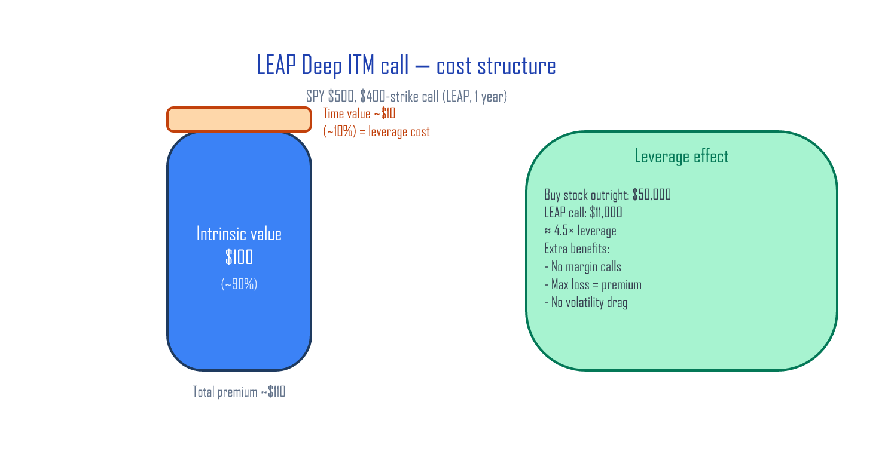

# Extension — One Step Further With Options

Options aren't gambling tools — they were built as insurance. Once you see them that way, three concrete strategies open up: **LEAP for cheap leverage, protective puts for crash insurance, covered calls for premium income.**

## Contents (2 articles)

1. **The Nature of Options — Insurance, Time, and Volatility** — Strikes, expirations, moneyness, IV, theta, the time-value paradox
2. **Options in Practice — LEAP, Insurance, and Harvesting** — Three strategies for the long-term investor: LEAP Deep ITM (cheap leverage), Protective Put (crash insurance), Covered Call (premium harvesting)

---

## Preview — Options = car insurance

If you treat options as *gambling*, they'll stay confusing forever. Treat them as *car insurance* and the whole framework opens up:

| Car insurance | Put option |
|:---|:---|
| Annual premium = the cash you pay each year | Option premium = what you pay to buy the put |
| Coverage limit = max payout if you crash | Strike price = the price you can sell at, no matter how low it drops |
| Policy term = annual renewal | Expiration = the date the right disappears |
| No accident → premium is *gone* | Stock didn't drop → option is *gone* |

This single table covers all four core option concepts (premium / strike / expiration / time value). The series builds from here.

> Nobody calls car insurance "gambling." Options are the same — *how you use them* decides whether they're insurance or a casino bet.

---

## Case preview — TQQQ's *real* cost (one of Article 2's centerpieces)

TQQQ's stated expense ratio is 0.88%. The *true* cost has three layers:

- **Expense ratio**: 0.88% / yr
- **Swap-contract interest**: ~9–13% / yr (in the 2023–2026 high-rate era)
- **Vol drag (negative compounding)**: regime-dependent

→ **TQQQ's effective annual cost: 10–15%**. What if you buy the same 3× exposure with *options* instead?

| Tool | Leverage | Annual cost |
|:---|:---:|:---:|
| TQQQ (swap-based) | 3× | ~10–13% |
| **LEAP Deep ITM call** (1-year, ~50% strike) | ~1.9× | **<1%** |

A 10× cost gap. That's why LEAPs deserve serious attention. The free article [Cost of Leverage in Derivatives](../posts/derivatives-leverage-cost.md) gives you the outline; this series walks through *which strikes / expirations / IV environments minimize the cost* with concrete examples.

---

## Who this is for

- Investors who've heard "options are dangerous" but want to know how they actually work for long-term holders
- TQQQ users looking for cheaper, safer leverage — with the math behind why
- Anyone curious how covered-call ETFs (JEPI, QYLD) really generate yield
- **People who hate formulas** — options explained through insurance analogies, no Black–Scholes

---

## Buy

**Extension series · 2 articles · 32 pages · 14+ diagrams**

Three strategies, time-evolving P&L curves, TQQQ cost analysis.

[Buy on Gumroad — Extension](https://butt2rflow.gumroad.com/l/ozuyjb){ .md-button .md-button--primary }

The complete 13-article bundle (Principles + Execution + Extension + Depth — **~33% off vs buying individually**):

[Buy the Complete Bundle on Gumroad](https://butt2rflow.gumroad.com/l/dbkyt){ .md-button .md-button--primary }

---

*Educational material only. This is not investment advice. All investments carry the risk of capital loss.*
