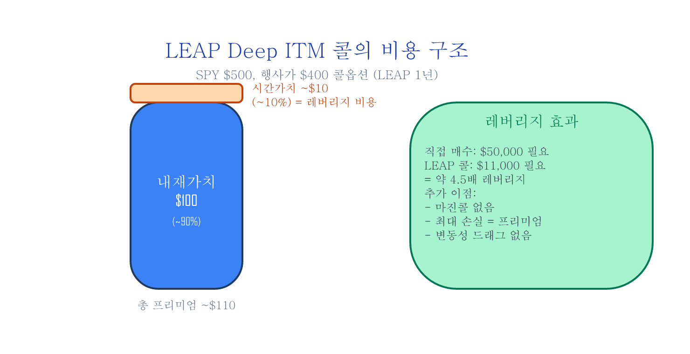

# 확장편 — 옵션으로 한 단계 더

옵션이라고 하면 위험한 도박을 떠올리시나요? 사실 옵션은 보험처럼 위험을 줄이는 도구이기도 합니다. 옵션을 보험과 레버리지 도구로 활용하는 방법.

## 목차 (2편)

1. **옵션의 본질 — 보험, 시간, 그리고 변동성** — 보험 비유로 옵션 완전 이해, moneyness(옵션의 이익/손실 상태), 시간 감쇠(만기일이 다가올수록 옵션 가치가 줄어드는 현상)
2. **옵션 실전 — LEAP, 보험, 그리고 수확** — 장기 옵션으로 적은 돈에 큰 효과 내기(LEAP Deep ITM 레버리지), 하락 보험(Protective Put), 주식 보유 + 콜 매도(Covered Call) + TQQQ(나스닥 3배 레버리지 ETF) 숨겨진 비용 분석

---

## 미리보기 — 옵션 = 자동차 보험

옵션을 *도박*으로 보면 평생 어려워요. **자동차 보험으로 보면** 한 번에 풀립니다:

| 자동차 보험 | 풋옵션 (Put) |
|:---|:---|
| 보험료 = 매년 자동차 보험에 내는 돈 | 옵션 프리미엄 = 풋옵션 사는 데 드는 돈 |
| 보장 한도 = 사고 나면 돌려주는 최대 금액 | 행사가(Strike) = 주가가 떨어져도 이 가격으로 팔 수 있는 권리 |
| 보험 만기 = 1년 후 갱신 | 옵션 만기 = 정해진 날짜에 권리 소멸 |
| 사고 안 나면 보험료 *날림* | 주가 안 떨어지면 옵션 *날림* |

이 한 표로 옵션의 핵심 4요소(프리미엄/행사가/만기/시간가치)를 다 풀 수 있어요. 시리즈는 이 비유 위에서 시작합니다.

> 자동차 보험을 *도박*이라고 부르는 사람은 없잖아요. 옵션도 마찬가지 — *어떻게 쓰느냐*에 따라 보험이 되기도, 도박이 되기도 합니다.

---

## 사례 미리보기 — TQQQ의 *진짜* 비용 (2편 핵심 중 하나)

TQQQ 운용보수는 0.88%로 표기됩니다. 그런데 *실제* 비용은:

- **운용보수**: 0.88% / 년
- **스왑 계약 이자**: ~9~13% / 년 (2023~2026 고금리 시대)
- **vol drag (음의 복리효과)**: 시장 환경에 따라

→ **TQQQ의 실효 비용은 연 10~15% 수준**. 같은 3배 노출을 *옵션*으로 사면?

| 도구 | 레버리지 | 연 비용 |
|:---|:---:|:---:|
| TQQQ (스왑) | 3× | ~10–13% |
| **LEAP Deep ITM 콜** (1년 만기, 행사가 50% 수준) | ~1.9× | **~1% 미만** |

10배 비용 차이. 이 한 가지가 *왜* LEAP을 진지하게 봐야 하는지의 답입니다 — 무료 글 [파생상품의 레버리지 사용료](../posts/derivatives-leverage-cost.md)에서 윤곽을 봤다면, 이 시리즈는 *어떤 행사가/만기/IV에서 비용이 최소화되는지* 구체 가이드를 제공합니다.

---

## 이런 분께 추천합니다

- 옵션이 위험하다고만 들었는데, 장기 투자에 어떻게 쓰는지 알고 싶은 분
- TQQQ 대신 더 저렴하고 안전한 레버리지 방법을 찾는 분
- 커버드콜 ETF(JEPI, QYLD)가 뭔지 원리부터 이해하고 싶은 분
- **수학 공식이 싫은 분** — 블랙-숄즈 공식 없이 보험 비유로 옵션을 설명합니다

---

## 구매

**확장편 2편 · 35페이지 · 다이어그램 14장+**

moneyness 시각화, LEAP vs TQQQ 비용 비교, Covered Call/Protective Put 손익 곡선.

[크몽 확장편 구매](https://kmong.com/gig/762059){ .md-button .md-button--primary }
[Gumroad (Overseas)](https://butt2rflow.gumroad.com/l/ozuyjb){ .md-button }

원칙편 + 실행편 + 확장편 + 심화편을 한 번에 (**개별 구매 대비 ~33% 할인**):

[크몽 번들 구매](https://kmong.com/gig/762066){ .md-button .md-button--primary }
[Gumroad Bundle (Overseas)](https://butt2rflow.gumroad.com/l/dbkyt){ .md-button }

---

*교육 목적의 콘텐츠입니다. 투자 권유가 아니며, 모든 투자에는 원금 손실의 위험이 있습니다.*
