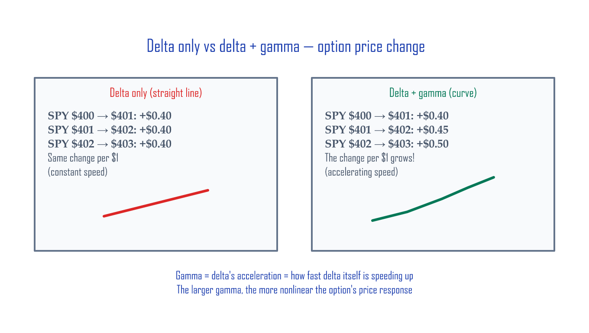

# Depth — Gamma Moves the Market

You've seen it: the S&P drops 1% in the final 10 minutes of trading with no news. **That's gamma.** This series walks through the invisible mechanism — market makers' dynamic hedging, the GEX flip point, and the 0DTE gamma-bomb era that started in 2022.

## Contents (4 articles)

1. **Gamma — The Acceleration of Delta** — Gamma fundamentals and the gamma squeeze (GameStop 2021)
2. **Dynamic Hedging by Market Makers** — Short gamma = arsonist, long gamma = firefighter
3. **GEX — The Invisible Hand That Moves the Market** — Gamma exposure calculation, the flip point, magnet/accelerator effects
4. **0DTE — The Age of the Gamma Bomb** — How same-day-expiry options reshaped market structure (43% of SPX volume in 2023, 62% by 2025)

---

## Preview — is the market maker an *arsonist* or a *firefighter*?

The S&P 500 spiking +1% or dropping −1% in the last 30 minutes — with no news, no event — has gotten increasingly common. Why? Because of **automatic hedging by options market makers (MMs)**.

> MMs don't bet on direction → every trade gets hedged with the *opposite* side → that hedging itself becomes the *force that moves the market*.

The key is *which gamma position* the MMs are in:

| MM gamma | Hedging direction | Market impact |
|:---|:---|:---|
| **Long gamma** (call OI dominant) | Stock ↑ → MM sells / Stock ↓ → MM buys | **Firefighter** — *dampens* volatility |
| **Short gamma** (put OI dominant) | Stock ↑ → MM buys / Stock ↓ → MM sells | **Arsonist** — *amplifies* volatility |

This single distinction is the foundation of the entire series. Gamma → dynamic hedging → GEX → 0DTE are four zoom-ins on the same mechanism.



---

## Case preview — the one-line GEX formula (the heart of Article 3)

The famous GEX (Gamma Exposure) formula in one line:

```
GEX = Gamma × OI × 100 × Strike
```

On top of this, you only need the *flip point* (the price where MM behavior reverses). Above it, the market sits calm; below it, *volatility tends to explode*.

**Real example at SPX = $4,000** (June 2023 data):

- Total GEX = **−$22.4B** (negative = MMs are net short gamma = arsonist mode)
- Meaning: a 1% index move forces MMs to trade **$22.4B notional in the *same direction*** → the move *amplifies further*
- 0DTE share of GEX: ~70% of the total (gamma explodes as expiration approaches)

The series shows you *how to calculate this every day yourself* and then translates it into *behavioral guidance* — what to do when the flip point is here vs there. The free article [Calculating GEX Yourself](../posts/gex-calculator.md) gives the *tool*; the series gives the *interpretation* and *real-world application*.

---

## Who this is for

- Options users who understand the basics but want to know how market makers actually move the tape
- Readers who've seen "GEX" or "gamma squeeze" in financial news and want the underlying logic
- Anyone curious why 0DTE options are reshaping market structure
- **People who hate formulas** — across all 4 articles, there are exactly 2 multiplications. The rest is analogies and diagrams.

---

## Buy

**Depth series · 4 articles · 39 pages · 11+ diagrams**

Gamma squeezes, market-maker behavior, GEX profiles, the 0DTE era.

[Buy on Gumroad — Depth](https://butt2rflow.gumroad.com/l/cwwzss){ .md-button .md-button--primary }

The complete 13-article bundle (Principles + Execution + Extension + Depth — **~33% off vs buying individually**):

[Buy the Complete Bundle on Gumroad](https://butt2rflow.gumroad.com/l/dbkyt){ .md-button .md-button--primary }

---

*Educational material only. This is not investment advice. All investments carry the risk of capital loss.*
