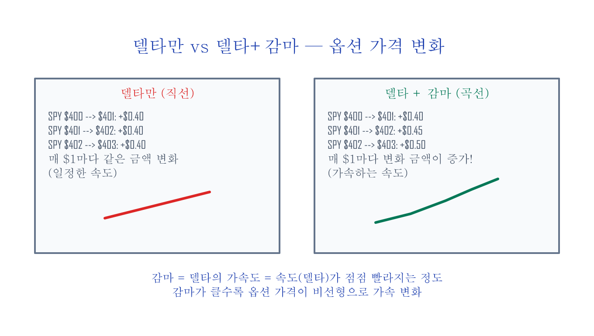

# 심화편 — 감마가 시장을 움직인다

옵션 시장의 큰손들이 주가를 흔드는 원리 — 그 열쇠는 감마(Gamma)라는 숫자에 있습니다. 옵션 가격이 변하는 속도를 나타내는 지표들(옵션 그리스, Greeks)의 핵심인 감마가, 시장에서 항상 거래 상대방이 되어주는 마켓메이커(Market Maker)를 통해 시장 전체를 움직이는 메커니즘. 확장편의 옵션 기초를 먼저 읽는 것을 추천합니다.

## 목차 (4편)

1. **감마 — 옵션 가격이 빨라지는 속도(델타의 가속도)** — 감마의 기초와 감마 스퀴즈(옵션 거래로 인해 주가가 한 방향으로 급격히 쏠리는 현상)
2. **마켓메이커의 동적 헷지(시장이 움직일 때마다 포지션 조정)** — 숏 감마 = 방화범, 롱 감마 = 소방관
3. **GEX(Gamma Exposure — 시장 전체에 걸려 있는 감마의 총량) — 시장을 움직이는 보이지 않는 손** — 감마 노출 계산과 플립 포인트(마켓메이커의 행동이 뒤바뀌는 가격 지점)
4. **0DTE(Zero Days to Expiration — 당일 만기 옵션) — 감마 폭탄의 시대** — 당일 만기 옵션이 바꾼 시장 구조

---

## 미리보기 — 마켓메이커는 *방화범*인가 *소방관*인가

S&P 500이 정상적인 날 끝 30분에 +1% 솟구치거나 −1% 떨어지는 일이 점점 더 잦아졌습니다. 뉴스도 이슈도 없는데 왜? 답은 **옵션 마켓메이커(MM)의 자동 헷지 행동**.

> MM은 방향성에 베팅하지 않는다 → 매 거래마다 *반대 방향*으로 헷지한다 → 그 헷지 자체가 *시장을 더 움직이는 동력*이 된다.

핵심은 *MM이 어떤 감마 포지션*에 있느냐:

| MM 감마 | 헷지 방향 | 시장 영향 |
|:---|:---|:---|
| **롱 감마** (콜 OI 우세) | 주가 ↑ → MM 매도 / 주가 ↓ → MM 매수 | **소방관** — 변동성 *억제* |
| **숏 감마** (풋 OI 우세) | 주가 ↑ → MM 매수 / 주가 ↓ → MM 매도 | **방화범** — 변동성 *증폭* |

이 한 가지 구분이 시리즈 전체의 작동 원리입니다. 감마 → 동적 헷지 → GEX → 0DTE는 같은 메커니즘의 4단계 줌인.



---

## 사례 미리보기 — GEX 한 줄 공식 (3편 핵심)

자주 듣는 GEX(Gamma Exposure) 한 줄 공식:

```
GEX = Gamma × OI × 100 × Strike
```

이 공식 위에서 *플립 포인트*(MM 행동이 뒤바뀌는 가격) 한 점만 알면, 그 위에선 시장이 잠잠하고 그 아래에선 *변동성이 폭발*할 가능성이 큽니다.

**SPX = $4,000 시점 실제 사례** (2023년 6월 데이터 기반):

- Total GEX = **−$22.4B** (음수 = MM이 전체적으로 숏 감마 = 방화범 모드)
- 의미: 지수가 1% 움직이면 MM이 **$22.4B 규모 매매**를 *순방향*으로 해야 함 → 움직임이 *더 증폭*
- 0DTE 옵션의 GEX 비중: 전체의 ~70% (만기가 가까울수록 감마는 폭증)

이 시리즈는 이 데이터를 *어떻게 매일 직접 계산하는지* + *플립 포인트가 의미하는 행동 가이드*까지 풀어냅니다 — 무료 글 [GEX 직접 계산하기](../posts/gex-calculator.md)는 *도구*까지만이고, 시리즈는 그 도구의 *해석법*과 *실전 활용*까지.

---

## 이런 분께 추천합니다

- 옵션 기초는 아는데, 마켓메이커가 시장에 미치는 영향을 이해하고 싶은 분
- GEX, 감마 스퀴즈 같은 용어를 뉴스에서 봤는데 원리가 궁금한 분
- 0DTE 옵션이 왜 시장 구조를 바꾸고 있는지 알고 싶은 분
- **수학 공식이 싫은 분** — 4편 전체에서 공식은 곱셈 2개뿐, 나머지는 비유와 그림으로 설명합니다

---

## 구매

**심화편 4편 · 42페이지 · 다이어그램 11장+**

감마 스퀴즈 메커니즘, GEX 프로파일, 플립 포인트, 0DTE 시장 구조 변화.

[크몽 심화편 구매](https://kmong.com/gig/762062){ .md-button .md-button--primary }
[Gumroad (Overseas)](https://butt2rflow.gumroad.com/l/cwwzss){ .md-button }

원칙편 + 실행편 + 확장편 + 심화편을 한 번에 (**개별 구매 대비 ~33% 할인**):

[크몽 번들 구매](https://kmong.com/gig/762066){ .md-button .md-button--primary }
[Gumroad Bundle (Overseas)](https://butt2rflow.gumroad.com/l/dbkyt){ .md-button }
